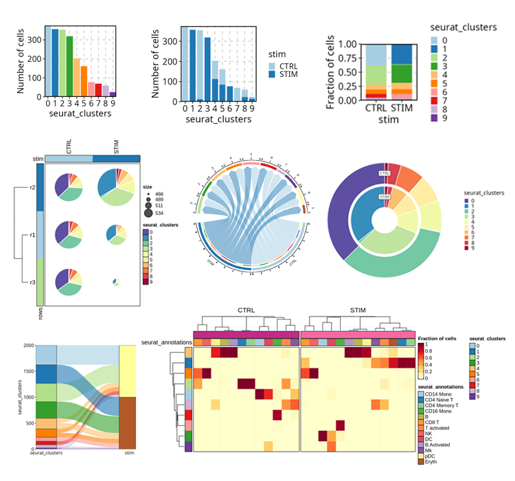
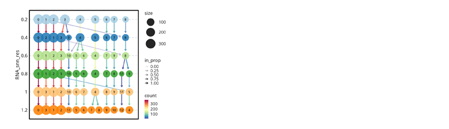
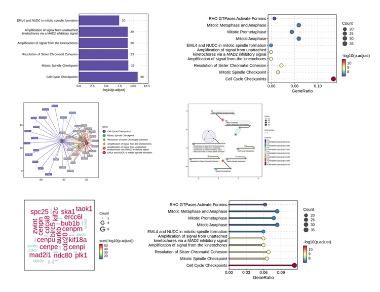
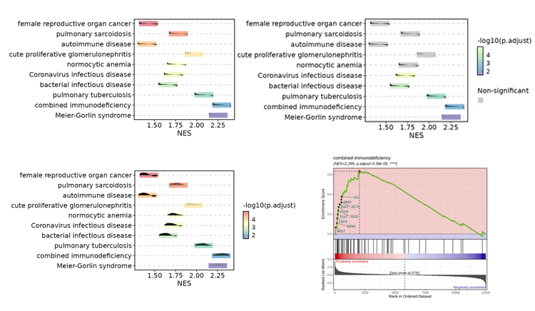
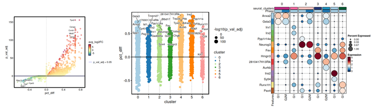
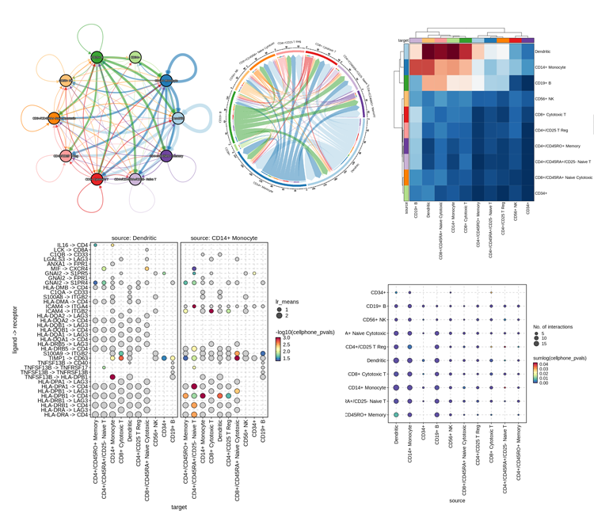
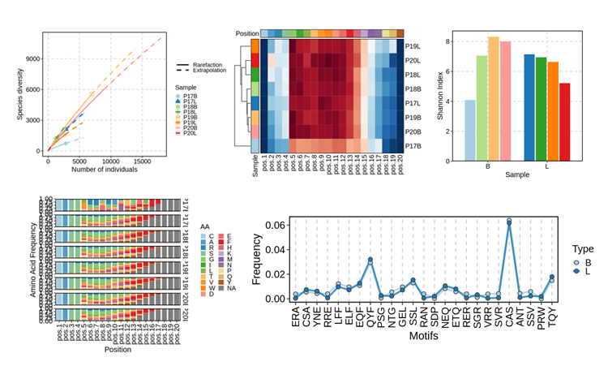
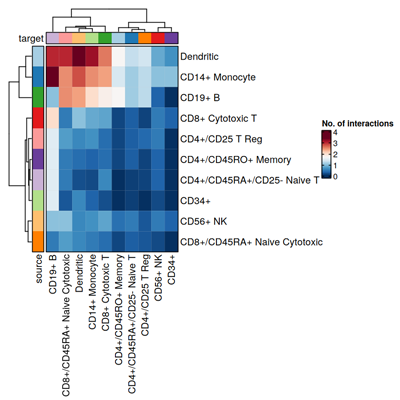

# scplotter <a href="https://pwwang.github.io/scplotter/"></a>

`scplotter` is an R package that is built upon [`plotthis`][1]. It provides a set of functions to visualize single-cell sequencing data in an easy and efficient way.

## Installation

```r
remotes::install_github("pwwang/scplotter")
# or
devtools::install_github("pwwang/scplotter")
# or using conda
$ conda install pwwang::r-scplotter
```

## Credits

`scplotter` draws significant inspiration from the [`SCP`][2] package, which separates visualization from analysis and implements it in the [`plotthis`][1] package. Building on `plotthis`, `scplotter` offers advanced functions for visualizing single-cell sequencing data. Special thanks to the [`scRepertoire`][21] package for its APIs that facilitate the analysis of single-cell TCR/BCR sequencing data.

## Gallery

### scRNA-seq

[`CellDimPlot`][3]


[`CellStatPlot`][4]



[`ClustreePlot`][5]



[`FeatureStatPlot`][6]


[`EnrichmentPlot`][7]



[`GSEASummaryPlot`][8] | [`GSEAPlot`][8]



[`VolcanoPlot`][9]



[`CCCPlot`][10] (Cell-Cell Communication Plot)



### scTCR-seq/scBCR-seq

[`ClonalVolumePlot`][11] | [`ClonalAbundancePlot`][12] | [`ClonalResidencyPlot`][13] | [`ClonalDynamicsPlot`][22] | [`ClonalCompositionPlot`][14] | [`ClonalOverlapPlot`][15] | [`ClonalGeneUsagePlot`][16]


[`ClonalRarefactionPlot`][17] | [`ClonalGeneUsagePlot`][18] | [`ClonalDiversityPlot`][19] | [`ClonalPositionalPlot`][20]



## Visualization with LLMs

```r
provider <- tidyprompt::llm_provider_openai(api_key = Sys.getenv("OPENAI_API_KEY"))
chat <- SCPlotterChat$new(provider = provider)
chat$ask("Generate a cell-cell communication plot for the cellphonedb_res data.")
# Tool identified:  CCCPlot
# Data object identified:  cellphonedb_res
# Running tool:  CCCPlot
```


```r
chat$ask("Do a heatmap instead")
# Tool identified:  CCCPlot
# Data object identified:  cellphonedb_res
# Running tool:  CCCPlot
```




[1]: https://github.com/pwwang/plotthis
[2]: https://zhanghao-njmu.github.io/SCP/index.html
[3]: https://pwwang.github.io/scplotter/reference/CellDimPlot.html
[4]: https://pwwang.github.io/scplotter/reference/CellStatPlot.html
[5]: https://pwwang.github.io/scplotter/reference/ClustreePlot.html
[6]: https://pwwang.github.io/scplotter/reference/FeatureStatPlot.html
[7]: https://pwwang.github.io/scplotter/reference/EnrichmentPlot.html
[8]: https://pwwang.github.io/plotthis/reference/gsea.html
[9]: https://pwwang.github.io/plotthis/reference/VolcanoPlot.html
[10]: https://pwwang.github.io/scplotter/reference/CCCPlot.html
[11]: https://pwwang.github.io/scplotter/reference/ClonalVolumePlot.html
[12]: https://pwwang.github.io/scplotter/reference/ClonalAbundancePlot.html
[13]: https://pwwang.github.io/scplotter/reference/ClonalResidencyPlot.html
[14]: https://pwwang.github.io/scplotter/reference/ClonalCompositionPlot.html
[15]: https://pwwang.github.io/scplotter/reference/ClonalOverlapPlot.html
[16]: https://pwwang.github.io/scplotter/reference/ClonalGeneUsagePlot.html
[17]: https://pwwang.github.io/scplotter/reference/ClonalRarefactionPlot.html
[18]: https://pwwang.github.io/scplotter/reference/ClonalGeneUsagePlot.html
[19]: https://pwwang.github.io/scplotter/reference/ClonalDiversityPlot.html
[20]: https://pwwang.github.io/scplotter/reference/ClonalPositionalPlot.html
[21]: https://github.com/ncborcherding/scRepertoire
[22]: https://pwwang.github.io/scplotter/reference/ClonalDynamicsPlot.html
