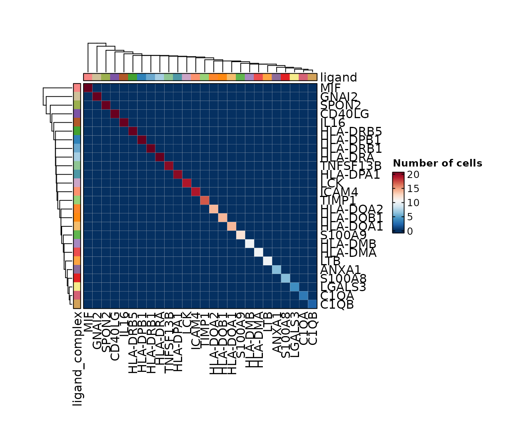
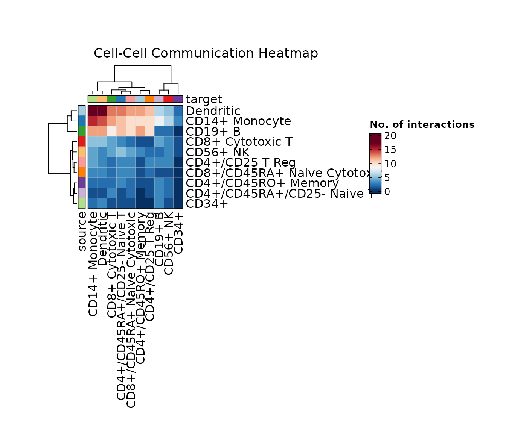
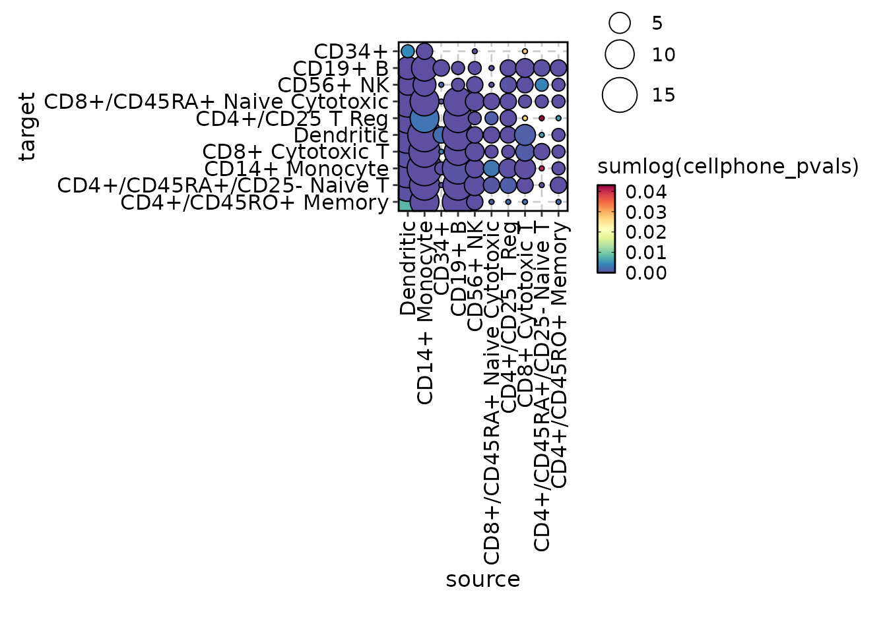

# Visualizing data with LLMs

``` r
library(scplotter)
api_key_set <- !identical(Sys.getenv("OPENAI_API_KEY"), "")
```

## Introduction

This vignette demonstrates how to use the `scplotter` package to
visualize data with AI. The package provides a variety of functions for
visualizing single-cell sequencing data, including scRNA-seq and
scTCR-seq/scBCR-seq data.

## Setup LLM provider

`scplotter` uses `tidyprompt` to provide a unified interface for
different LLM providers. You can set up your preferred LLM provider
using one of the
[wrappers](https://tjarkvandemerwe.github.io/tidyprompt/reference/index.html#llm-providers-chat-history)
provided by `tidyprompt`.

``` r
# Set up LLM provider
provider <- tidyprompt::llm_provider_openai(
    parameters = list(model = "deepseek-v4-flash", stream =
      getOption("tidyprompt.stream", TRUE)),
    verbose = getOption("tidyprompt.verbose", TRUE),
    url = "https://api.deepseek.com/chat/completions",
    api_key = Sys.getenv("OPENAI_API_KEY")
)

chat <- SCPlotterChat$new(provider = provider)
```

## Setup the data for visualization

By default, `chat` will detects the data used for visualization from the
`.GlobalEnv` and data exported from the `Seurat`, `SeuratObject`, and
`scRepertoire` packages.

You can also ask to list the available data:

``` r
chat$ask("List the available data that can be used for visualization.")
#> 
#> Tool identified:  ListData 
#> Available data objects:
#> -  scplotter::cellphonedb_res :  A toy example of CellPhoneDB output from LIANA 
#> -  scplotter::ifnb_sub :  A subsetted version of 'ifnb' datasets 
#> -  scplotter::pancreas_sub :  A subsetted version of mouse 'pancreas' datasets 
#> -  Seurat::cc.genes :  Cell cycle genes 
#> -  Seurat::cc.genes.updated.2019 :  Cell cycle genes: 2019 update 
#> -  SeuratObject::pbmc_small :  A small example version of the PBMC dataset 
#> -  scRepertoire::contig_list :  A list of 8 single-cell T cell receptor sequences runs. 
#> -  scRepertoire::mini_contig_list :  Processed subset of 'contig_list' 
#> -  scRepertoire::scRep_example :  A Seurat object of 500 single T cells,
# or you can do it explicitly
# chat$list_data()
```

To set up the data manually, you can use the `set_data()` method.

``` r
chat$set_data(scplotter::cellphonedb_res)
# To let the LLM to detect the data from the prompt again:
chat$set_data(NULL)
```

To use your own data, you can either set the data manually or use the
`set_data()` method or you can load the data in the global environment
and mention it in your prompt.

## List the available tools

You can list the available functions by using the `list_tools()` method.

``` r
chat$list_tools()
#> Available tools:
#> -  gt :  Programmatic clone selection for TCR/BCR repertoire analysis     
#>    Clone selectors provide a programmatic, expression-based system for filtering
#>    and selecting T cell and B cell clones from immune repertoire data. They are
#>    the foundation of clone-level analysis in    scplotter   , enabling flexible
#>    clone selection without manual specification of clone IDs.
#>    
#>    Clone selectors operate on data frames containing clone abundance information
#>    (clone IDs paired with group-level counts or fractions). They evaluate
#>    selection criteria — such as abundance thresholds, group comparisons, or
#>    shared presence across conditions — and return either the selected clone IDs,
#>    a logical indicator vector, or a filtered data frame. The system is
#>    context-aware: it automatically detects whether it is being called from
#>    within a    dplyr    pipeline, a    scplotter    function, or standalone
#>    code, and adjusts its default behavior accordingly.
#>    
#>    The following selector functions are available:
#>    
#>        top()    — select the    n    largest clones by abundance
#>        sel()    — select clones matching a custom logical expression
#>        uniq()    — select clones unique to a specified group
#>        shared()    — select clones present in all specified groups
#>        gt()   ,    ge()   ,    lt()   ,    le()   ,    eq()   ,    ne()    — comparison-based selection
#>        and()   ,    or()    — combine multiple selector results
#>    
#> -  CellDimPlot :  Cell Dimension Reduction Plot     
#>    Visualizes single-cell data in reduced dimension space (e.g., UMAP, t-SNE,
#>    PCA). This is the primary function for exploring cell clustering, cell
#>    identity, and spatial relationships in transcriptomics datasets. It creates
#>    scatter plots where each point represents a cell, positioned by its
#>    coordinates in the reduced dimension space and colored by metadata variables
#>    such as cell type, sample condition, or cluster assignment.
#>    
#>    CellDimPlot    serves as a unified interface across multiple single-cell data
#>    containers:
#>    
#>        Seurat objects    — Extracts embeddings from    Reductions()    and
#>    metadata from    @meta.data   . The default reduction is auto-detected
#>    via    default_dimreduc()   .
#>        Giotto objects    — Extracts spatial dimension reductions and cell
#>    metadata using    spat_unit    and    feat_type    to identify the correct
#>    spatial unit and feature type.
#>        h5ad files    (.h5ad or opened    H5File   ) — Reads from    obsm    for
#>    embeddings and    obs    for metadata. Reduction names are automatically
#>    prefixed with    "X_"    when needed (e.g.,    "umap"    →    "X_umap"   ).
#>    
#>    
#>    Beyond basic cluster visualization,    CellDimPlot    supports a rich set of
#>    visual overlays and analytical enhancements:
#>    
#>        Cluster highlighting    — Emphasize cells matching a logical
#>    expression while dimming others (   highlight   ).
#>        Group labels    — Add text labels at group centroids (   label   ,
#>    label_insitu   ).
#>        Group marks    — Draw boundary shapes around groups: ellipse,
#>    rectangle, or circle (   add_mark   ,    mark_type   ).
#>        Density contours    — Overlay 2D density estimates (   add_density   ).
#>        Neighbor graphs    — Draw edges between neighboring cells from
#>    k-NN or shared-nearest-neighbor graphs (   graph   ).
#>        Lineage trajectories    — Overlay pseudotime lineage curves
#>    (   lineages   ).
#>        Velocity arrows    — Overlay RNA velocity vectors on the embedding
#>    (   velocity   ). For dedicated velocity visualization with grid or
#>    stream plots, see    CellVelocityPlot   .
#>        Statistical charts    — Embed small bar, ring, or line charts at
#>    group positions showing composition of a second variable (   stat_by   ,
#>    stat_plot_type   ).
#>        Hexagonal binning    — Replace scatter points with binned hexagons
#>    for large datasets (   hex   ).
#>        3D visualization    — Plot three dimensions by specifying
#>    dims = 1:3   .
#>        Rasterization    — Render points as a raster image for performance
#>    with large cell counts (   raster   ).
#>    
#> -  ClonalVolumePlot :  Clonal Volume Plot     
#>    Visualizes the number (or fraction) of unique T-cell or B-cell clones across
#>    samples and metadata groups. Clonal volume — the count of distinct clonotypes
#>    detected in a sample — is a fundamental measure of immune repertoire diversity.
#>    Higher clonal volume indicates a more diverse repertoire, while lower volume
#>    may reflect clonal expansion in response to antigen stimulation.
#>    
#>    ClonalVolumePlot    computes clonal counts via
#>    scRepertoire::clonalQuant()    and
#>    visualizes them as bar, box, or violin plots. It accepts both
#>    scRepertoire    combined TCR/BCR data and Seurat objects with clonal
#>    information integrated via    scRepertoire::combineExpression()   .
#> -  ClonalRarefactionPlot :  Clonal Rarefaction Plot     
#>    Visualizes clonal rarefaction curves — estimates of clone richness as a
#>    function of sampling depth. Rarefaction addresses a fundamental challenge
#>    in immune repertoire analysis: the number of clones observed depends on
#>    how many cells are sequenced. By repeatedly subsampling (bootstrapping)
#>    the data at varying depths, rarefaction curves reveal whether the
#>    repertoire has been sampled to saturation or whether additional
#>    sequencing would uncover many more clones.
#>    
#>    ClonalRarefactionPlot    extracts clone count data from the repertoire,
#>    optionally groups it by metadata columns, and generates rarefaction
#>    curves via    plotthis::RarefactionPlot()   .
#>    When    split_by    is specified, separate plots are generated for each split
#>    group and combined into a multi-panel layout.
#> -  ClonalStatPlot :  Visualize clone abundance, frequency, and dynamics across groups     
#>    ClonalStatPlot provides a unified interface for visualizing the abundance, frequency,
#>    and dynamics of T cell and B cell clones across experimental groups. It is the most
#>    versatile clone visualization function in scplotter, offering multiple plot types
#>    for different analytical purposes.
#>    
#>    The function operates on the output of    scRepertoire::combineTCR()   ,
#>    scRepertoire::combineBCR()   , or
#>    scRepertoire::combineExpression()   . Clones are
#>    identified by their CDR3 amino acid sequence, nucleotide sequence, V(D)J gene usage,
#>    or a combination thereof (via    clone_call   ). The function then computes clone-level
#>    statistics (size, fraction, or count of clones) within each group and renders them
#>    using one of ten supported plot types.
#>    
#>    A defining feature of ClonalStatPlot is its flexible clone selection system. Clones
#>    can be specified directly by their IDs, or selected programmatically using expression
#>    selectors such as    top()   ,    sel()   ,    shared()   ,    uniq()   , and
#>    comparison operators (   gt()   ,    lt()   ,    eq()   , etc.). These selectors
#>    evaluate within the context of each faceting/splitting group, enabling per-group
#>    selection of the most expanded clones, clones shared between conditions, or clones
#>    meeting custom abundance thresholds. See the    Clone selection    section below
#>    and    CloneSelectors    for full details.
#>    
#>    Clones can also be aggregated into named groups (by passing a named list to
#>    clones   ), where each group is defined by its own selection expression. In
#>    this mode, the visualization unit becomes the clone group rather than individual
#>    clones, enabling comparisons such as "hyper-expanded clones in condition A" vs.
#>    "hyper-expanded clones in condition B."
#> -  ClonalCompositionPlot :  Clonal Composition Plot     
#>    Visualizes the composition of the immune repertoire by categorizing clones
#>    into abundance groups (Rare, Small, Medium, Large, Hyperexpanded) and
#>    plotting their relative proportions across samples or metadata groups.
#>    This reveals the overall structure of the repertoire — whether it is
#>    dominated by a few large clones (clonal expansion) or composed of many
#>    small clones (high diversity).
#>    
#>    ClonalCompositionPlot    supports three analysis methods:
#>    
#>        Homeostasis    (   "homeostasis"   ,    "homeo"   ,    "rel"   ) —
#>    Clones are binned by their frequency (fraction of the total
#>    repertoire) into categories such as Rare, Small, Medium, Large,
#>    and Hyperexpanded. Uses
#>    scRepertoire::clonalHomeostasis()   .
#>        Top clones    (   "top"   ) — Clones are ranked and binned by
#>    their rank index (e.g., top 10, top 100, etc.). Uses
#>    scRepertoire::clonalProportion()   .
#>        Rare clones    (   "rare"   ) — Clones are binned by their
#>    absolute size (clone count). Uses clone size thresholds directly.
#>    
#> -  EnrichmentPlot :  Visualize gene set enrichment and over-representation analysis results     
#>    Gene set enrichment analysis identifies biological pathways, gene ontologies,
#>    or functional categories that are statistically over-represented among a list
#>    of genes of interest (e.g., differentially expressed genes from a single-cell
#>    RNA-seq experiment). Rather than interpreting individual genes in isolation,
#>    enrichment analysis places gene-level results into a broader biological context,
#>    revealing which processes, functions, or diseases are perturbed.
#>    
#>    EnrichmentPlot    generates publication-quality visualizations for enrichment
#>    results across eight distinct plot types, each suited to a different analytical
#>    perspective:
#>    
#>        bar    — Horizontal bar chart of the top enriched terms, ordered by
#>    significance. Best for a quick overview or when showing a small number of terms.
#>        dot    — Dot plot where x-axis shows a continuous metric (default:
#>    GeneRatio   ), dot size reflects gene count, and dot color reflects
#>    significance. Ideal for comparing terms along two dimensions simultaneously.
#>        lollipop    — Lollipop chart combining dot and bar aesthetics.
#>    Similar to the dot plot but with stems emphasizing the ranking.
#>        comparison    — Side-by-side dot plot comparing enrichment across
#>    groups (e.g., cell types, conditions). Requires    group_by   .
#>        network    — Network visualization where nodes are enriched terms
#>    and edges represent overlapping gene sets. Reveals functional modules and
#>    redundant terms.
#>        enrichmap    — Enrichment map similar to the network plot but
#>    optimized for large term sets (default    top_term = 100   ). Nodes are
#>    terms and edges represent gene overlap.
#>        wordcloud    — Word cloud where term size reflects significance.
#>    Can display either enrichment terms (   word_type = "term"   ) or
#>    individual gene symbols (   word_type = "feature"   ).
#>        heatmap    — Heatmap of enrichment significance across groups
#>    (   group_by    is mapped to columns). Useful for comparing enrichment
#>    patterns across multiple conditions or cell types.
#>    
#>    
#>    The function auto-detects the input data format (   clusterProfiler    or
#>    enrichR   ) and delegates visualization to the appropriate    plotthis   
#>    plotting function.
#> -  eq :  Programmatic clone selection for TCR/BCR repertoire analysis     
#>    Clone selectors provide a programmatic, expression-based system for filtering
#>    and selecting T cell and B cell clones from immune repertoire data. They are
#>    the foundation of clone-level analysis in    scplotter   , enabling flexible
#>    clone selection without manual specification of clone IDs.
#>    
#>    Clone selectors operate on data frames containing clone abundance information
#>    (clone IDs paired with group-level counts or fractions). They evaluate
#>    selection criteria — such as abundance thresholds, group comparisons, or
#>    shared presence across conditions — and return either the selected clone IDs,
#>    a logical indicator vector, or a filtered data frame. The system is
#>    context-aware: it automatically detects whether it is being called from
#>    within a    dplyr    pipeline, a    scplotter    function, or standalone
#>    code, and adjusts its default behavior accordingly.
#>    
#>    The following selector functions are available:
#>    
#>        top()    — select the    n    largest clones by abundance
#>        sel()    — select clones matching a custom logical expression
#>        uniq()    — select clones unique to a specified group
#>        shared()    — select clones present in all specified groups
#>        gt()   ,    ge()   ,    lt()   ,    le()   ,    eq()   ,    ne()    — comparison-based selection
#>        and()   ,    or()    — combine multiple selector results
#>    
#> -  CellVelocityPlot :  Cell Velocity Plot     
#>    Visualizes RNA velocity on a reduced-dimension embedding. RNA velocity
#>    infers the future transcriptional state of individual cells by modeling the
#>    ratio of unspliced (nascent) to spliced (mature) mRNA transcripts. On a
#>    dimension reduction plot, velocity is displayed as arrows (or grid/stream
#>    fields) showing the predicted direction and magnitude of transcriptional
#>    change for each cell — effectively revealing the "flow" of cells through
#>    differentiation, development, or other state transitions.
#>    
#>    CellVelocityPlot    serves as a unified interface across multiple single-cell
#>    data containers:
#>    
#>        Seurat objects    — Extracts embeddings from both the main
#>    reduction (   reduction   ) and the velocity reduction
#>    (   v_reduction   ) via    Embeddings()   ; metadata for grouping via
#>    @meta.data   .
#>        Giotto objects    — Extracts dimension reductions via
#>    getDimReduction()    using    spat_unit    and    feat_type    to identify
#>    the correct spatial unit and feature type.
#>        h5ad files    (.h5ad or opened    H5File   ) — Reads from    obsm    for
#>    both the main and velocity embeddings;    obs    for metadata. Reduction
#>    names are automatically prefixed with    "X_"    when needed.
#>    
#> -  SpatFeaturePlot :  Visualize feature expression on spatial coordinates     
#>    Plot continuous feature values — gene expression, dimension reduction
#>    components, metadata columns, or any numeric variable — directly on
#>    spatial tissue coordinates.    SpatFeaturePlot()    is the spatial
#>    analogue of a feature plot over a UMAP/t-SNE embedding: it paints each
#>    spot, cell, or molecule with the expression level of one or more features,
#>    revealing the spatial organization of gene activity.
#>    
#>    Multiple features are automatically faceted, making it easy to compare
#>    spatial expression patterns across a gene panel in a single plot. For
#>    categorical grouping (e.g., cluster identity on spatial coordinates), use
#>    SpatDimPlot    instead.
#> -  shared :  Programmatic clone selection for TCR/BCR repertoire analysis     
#>    Clone selectors provide a programmatic, expression-based system for filtering
#>    and selecting T cell and B cell clones from immune repertoire data. They are
#>    the foundation of clone-level analysis in    scplotter   , enabling flexible
#>    clone selection without manual specification of clone IDs.
#>    
#>    Clone selectors operate on data frames containing clone abundance information
#>    (clone IDs paired with group-level counts or fractions). They evaluate
#>    selection criteria — such as abundance thresholds, group comparisons, or
#>    shared presence across conditions — and return either the selected clone IDs,
#>    a logical indicator vector, or a filtered data frame. The system is
#>    context-aware: it automatically detects whether it is being called from
#>    within a    dplyr    pipeline, a    scplotter    function, or standalone
#>    code, and adjusts its default behavior accordingly.
#>    
#>    The following selector functions are available:
#>    
#>        top()    — select the    n    largest clones by abundance
#>        sel()    — select clones matching a custom logical expression
#>        uniq()    — select clones unique to a specified group
#>        shared()    — select clones present in all specified groups
#>        gt()   ,    ge()   ,    lt()   ,    le()   ,    eq()   ,    ne()    — comparison-based selection
#>        and()   ,    or()    — combine multiple selector results
#>    
#> -  CellStatPlot :  Cell statistics plot     
#>    Visualizes cell-level statistics — counts, fractions, and composition —
#>    across cell identities and metadata groupings. This is the primary function
#>    for exploring the distribution of cell types, clusters, and categorical
#>    metadata in single-cell transcriptomics datasets. It answers questions such
#>    as: "What proportion of each cell type is in each condition?", "How do
#>    cluster abundances change across samples?", and "What is the clonal
#>    composition within each cell type?"
#>    
#>    CellStatPlot    serves as a unified interface across 15+ visualization
#>    types, all driven by a common data aggregation and fraction-calculation
#>    pipeline. It supports four single-cell data containers:
#>    
#>        Seurat objects    — Extracts    @meta.data   ; uses    Idents()    as
#>    the default identity when    ident = NULL   .
#>        Giotto objects    — Extracts cell metadata via
#>    getCellMetadata()    using    spat_unit    and    feat_type   .
#>        h5ad files    (.h5ad or opened    H5File   ) — Reads from    obs   
#>    via    h5group_to_dataframe()   .
#>        Data frames    — Internal method; all other methods ultimately
#>    delegate here after metadata extraction.
#>    
#> -  ne :  Programmatic clone selection for TCR/BCR repertoire analysis     
#>    Clone selectors provide a programmatic, expression-based system for filtering
#>    and selecting T cell and B cell clones from immune repertoire data. They are
#>    the foundation of clone-level analysis in    scplotter   , enabling flexible
#>    clone selection without manual specification of clone IDs.
#>    
#>    Clone selectors operate on data frames containing clone abundance information
#>    (clone IDs paired with group-level counts or fractions). They evaluate
#>    selection criteria — such as abundance thresholds, group comparisons, or
#>    shared presence across conditions — and return either the selected clone IDs,
#>    a logical indicator vector, or a filtered data frame. The system is
#>    context-aware: it automatically detects whether it is being called from
#>    within a    dplyr    pipeline, a    scplotter    function, or standalone
#>    code, and adjusts its default behavior accordingly.
#>    
#>    The following selector functions are available:
#>    
#>        top()    — select the    n    largest clones by abundance
#>        sel()    — select clones matching a custom logical expression
#>        uniq()    — select clones unique to a specified group
#>        shared()    — select clones present in all specified groups
#>        gt()   ,    ge()   ,    lt()   ,    le()   ,    eq()   ,    ne()    — comparison-based selection
#>        and()   ,    or()    — combine multiple selector results
#>    
#> -  SpatDimPlot :  Visualize categorical groups on spatial coordinates     
#>    Plot categorical metadata — cluster identities, tissue regions, sample
#>    labels, or any discrete grouping variable — directly on spatial tissue
#>    coordinates.    SpatDimPlot()    is the spatial analogue of a UMAP/t-SNE
#>    plot colored by cluster: each spot, cell, or molecule is colored by its
#>    group membership, making it easy to assess the spatial organization of
#>    cell types, anatomical regions, or experimental conditions.
#>    
#>    For continuous features (gene expression, dimension reduction scores),
#>    use    SpatFeaturePlot    instead.
#> -  GSEASummaryPlot :  Objects exported from other packages     
#>    These objects are imported from other packages. Follow the links
#>    below to see their documentation.
#>    
#>    
#>         plotthis   GSEAPlot()   ,    GSEASummaryPlot()   
#> -  CCCPlot :  Visualize Cell-Cell Communication (CCC) Interactions     
#>    Cell-cell communication (CCC) is the process by which cells send and receive
#>    molecular signals — typically through ligand-receptor (LR) interactions — to
#>    coordinate tissue function. CCC analysis infers these interactions from
#>    single-cell transcriptomics data by identifying which ligand-receptor pairs
#>    are expressed between which cell types, often scoring each interaction by
#>    its magnitude (e.g., expression level, interaction score) and specificity
#>    (e.g., a p-value quantifying how cell-type-specific the interaction is).
#>    
#>    CCCPlot    provides a unified interface to visualize CCC inference results
#>    (from tools like CellPhoneDB, LIANA, CellChat, NicheNet, etc.) across many
#>    plot types. It supports two fundamental modes:
#>    
#>    Aggregation mode    (   method = "aggregation"   , the default): Ligand-receptor
#>    pairs are aggregated per source-target cell type pair. This shows    which
#>    cell types communicate    and how strongly. Supported plot types:    "network"   ,
#>    "chord"   /   "circos"   ,    "heatmap"   ,    "sankey"   /   "alluvial"   ,    "dot"   .
#>    
#>    Interaction mode    (   method = "interaction"   ): Individual ligand-receptor
#>    pairs are plotted. This shows    which specific LR pairs    mediate the
#>    communication. Supported plot types:    "dot"   ,    "network"   ,    "heatmap"   ,
#>    "box"   ,    "violin"   ,    "ridge"   .
#>    
#>    The    "linkedheatmap"    plot type is a special case: it does not use the
#>    method    parameter. It displays a side-by-side heatmap where the left side
#>    shows ligand expression across source cell types and the right side shows
#>    receptor expression across target cell types, with links between them
#>    representing the LR pairs. This plot type requires    ligand_means    and
#>    receptor_means    columns.
#>    
#>    Under the hood,    CCCPlot    preprocesses the data (aggregating or
#>    reformatting as needed) and delegates rendering to the corresponding
#>    plotthis    package function. All styling and layout arguments accepted by
#>    those functions can be passed through    ...   .
#> -  ClonalResidencyPlot :  Clonal Residency Plot     
#>    Visualizes the sharing (residency) of T-cell or B-cell clones across
#>    different samples or metadata groups. Clonal residency analysis reveals
#>    how clonotypes are distributed — whether a clone is private to one
#>    condition or shared across multiple conditions — which is critical for
#>    understanding immune responses, tracking antigen-specific clones, and
#>    identifying public vs. private repertoires.
#>    
#>    ClonalResidencyPlot    supports three visualization modes:
#>    
#>        Scatter plot    — Compares clone sizes between two groups on
#>    log-transformed axes. Points are colored by clonal category:
#>    singletons (unique to one group), expanded clones, and dual
#>    clones (shared between groups). Correlation statistics are
#>    displayed in the subtitle.
#>        Venn diagram    — Shows the overlap of clone sets between up
#>    to 4 groups. When    with_class = TRUE   , labels include singlet
#>    counts.
#>        UpSet plot    — Shows intersection sizes for any number of
#>    groups. When    with_class = TRUE   , clone classes (singlet,
#>    expanded) are displayed as separate intersections.
#>    
#> -  ClustreePlot :  Visualize cluster stability across clustering resolutions     
#>    A clustree plot visualizes how cells move between clusters when clustering is
#>    performed at different resolutions. Each resolution level is a column of nodes,
#>    and edges show the flow of cells between clusters at adjacent resolutions.
#>    This is an essential diagnostic for single-cell analysis, helping researchers
#>    choose an appropriate clustering resolution by revealing which clusters are
#>    stable (persistent across resolutions) and which are transient (appear only at
#>    specific resolutions).
#>    
#>    This function is a wrapper around    plotthis::ClustreePlot()   
#>    that automatically extracts the metadata from Seurat objects. For data frames,
#>    the data is passed directly to    plotthis   .
#> -  ClonalKmerPlot :  Visualize CDR3 k-mer (motif) frequency     
#>    Short amino acid motifs within CDR3 sequences — termed    k-mers    — can reveal
#>    shared binding specificities, common structural elements, and repertoire-level
#>    sequence features that are not apparent from full-length sequence analysis
#>    alone. Specific k-mers may be enriched in responses to particular antigens,
#>    represent public TCR/BCR motifs shared across individuals, or reflect
#>    convergent recombination events.
#> -  ClonalPositionalPlot :  Visualize positional properties of CDR3 sequences     
#>    The complementarity-determining region 3 (CDR3) is the most variable region of
#>    T cell and B cell receptors, and is the primary determinant of antigen
#>    specificity. Analyzing how amino acid composition, diversity, and
#>    physicochemical properties vary across CDR3 positions provides insight into
#>    repertoire structure, selection pressures, and the biophysical constraints
#>    that shape antigen recognition.
#> -  uniq :  Programmatic clone selection for TCR/BCR repertoire analysis     
#>    Clone selectors provide a programmatic, expression-based system for filtering
#>    and selecting T cell and B cell clones from immune repertoire data. They are
#>    the foundation of clone-level analysis in    scplotter   , enabling flexible
#>    clone selection without manual specification of clone IDs.
#>    
#>    Clone selectors operate on data frames containing clone abundance information
#>    (clone IDs paired with group-level counts or fractions). They evaluate
#>    selection criteria — such as abundance thresholds, group comparisons, or
#>    shared presence across conditions — and return either the selected clone IDs,
#>    a logical indicator vector, or a filtered data frame. The system is
#>    context-aware: it automatically detects whether it is being called from
#>    within a    dplyr    pipeline, a    scplotter    function, or standalone
#>    code, and adjusts its default behavior accordingly.
#>    
#>    The following selector functions are available:
#>    
#>        top()    — select the    n    largest clones by abundance
#>        sel()    — select clones matching a custom logical expression
#>        uniq()    — select clones unique to a specified group
#>        shared()    — select clones present in all specified groups
#>        gt()   ,    ge()   ,    lt()   ,    le()   ,    eq()   ,    ne()    — comparison-based selection
#>        and()   ,    or()    — combine multiple selector results
#>    
#> -  top :  Programmatic clone selection for TCR/BCR repertoire analysis     
#>    Clone selectors provide a programmatic, expression-based system for filtering
#>    and selecting T cell and B cell clones from immune repertoire data. They are
#>    the foundation of clone-level analysis in    scplotter   , enabling flexible
#>    clone selection without manual specification of clone IDs.
#>    
#>    Clone selectors operate on data frames containing clone abundance information
#>    (clone IDs paired with group-level counts or fractions). They evaluate
#>    selection criteria — such as abundance thresholds, group comparisons, or
#>    shared presence across conditions — and return either the selected clone IDs,
#>    a logical indicator vector, or a filtered data frame. The system is
#>    context-aware: it automatically detects whether it is being called from
#>    within a    dplyr    pipeline, a    scplotter    function, or standalone
#>    code, and adjusts its default behavior accordingly.
#>    
#>    The following selector functions are available:
#>    
#>        top()    — select the    n    largest clones by abundance
#>        sel()    — select clones matching a custom logical expression
#>        uniq()    — select clones unique to a specified group
#>        shared()    — select clones present in all specified groups
#>        gt()   ,    ge()   ,    lt()   ,    le()   ,    eq()   ,    ne()    — comparison-based selection
#>        and()   ,    or()    — combine multiple selector results
#>    
#> -  le :  Programmatic clone selection for TCR/BCR repertoire analysis     
#>    Clone selectors provide a programmatic, expression-based system for filtering
#>    and selecting T cell and B cell clones from immune repertoire data. They are
#>    the foundation of clone-level analysis in    scplotter   , enabling flexible
#>    clone selection without manual specification of clone IDs.
#>    
#>    Clone selectors operate on data frames containing clone abundance information
#>    (clone IDs paired with group-level counts or fractions). They evaluate
#>    selection criteria — such as abundance thresholds, group comparisons, or
#>    shared presence across conditions — and return either the selected clone IDs,
#>    a logical indicator vector, or a filtered data frame. The system is
#>    context-aware: it automatically detects whether it is being called from
#>    within a    dplyr    pipeline, a    scplotter    function, or standalone
#>    code, and adjusts its default behavior accordingly.
#>    
#>    The following selector functions are available:
#>    
#>        top()    — select the    n    largest clones by abundance
#>        sel()    — select clones matching a custom logical expression
#>        uniq()    — select clones unique to a specified group
#>        shared()    — select clones present in all specified groups
#>        gt()   ,    ge()   ,    lt()   ,    le()   ,    eq()   ,    ne()    — comparison-based selection
#>        and()   ,    or()    — combine multiple selector results
#>    
#> -  MarkersPlot :  Visualize differential expression markers     
#>    Visualize differential expression (DE) results — typically the output of
#>    Seurat::FindMarkers()    or
#>    Seurat::FindAllMarkers()    — across a
#>    variety of plot types.    MarkersPlot()    bridges the gap between DE
#>    testing and visualization by providing a unified interface for both
#>    summary-level DE visualizations    (volcano, jitter, heatmap, and dot
#>    plots of fold changes and significance) and    expression-level
#>    visualizations    (violin, box, bar, ridge, heatmap, and dot plots of actual
#>    expression values from a Seurat object).
#>    
#>    The function handles two broad categories of plots:
#>    
#>        DE summary plots    (no    object    required): visualize the
#>    DE statistics themselves — log2 fold change, percentage difference,
#>    p-values, and adjusted p-values — across groups or comparisons.
#>    
#>        "volcano"    /    "volcano_log2fc"    — Volcano plot with
#>    log2 fold change on the x-axis and    -log_{10}(p)    on the y-axis.
#>    Genes passing the    cutoff    are highlighted and top genes are
#>    labeled. Ideal for overview of effect size vs. significance.
#>        "volcano_pct"    — Volcano plot with percentage-point
#>    difference (   pct.1 - pct.2   ) on the x-axis. Useful when the
#>    biological question is about detection rate rather than expression
#>    magnitude.
#>        "jitter"    /    "jitter_log2fc"    — Jitter plot of log2
#>    fold changes across groups (defined by    subset_by   ). Dot size
#>    encodes    -log_{10}(p)   . Reveals distribution of effect sizes
#>    per cluster or condition.
#>        "jitter_pct"    — Jitter plot of percentage-point
#>    differences across groups.
#>        "heatmap_log2fc"    — Heatmap of log2 fold changes (genes
#>    × groups). Cells can be marked for significance via    cutoff   
#>    and    sig_mark   .
#>        "heatmap_pct"    — Heatmap of percentage-point differences
#>    (genes × groups). Same significance-marking support.
#>        "dot_log2fc"    — Dot plot of log2 fold changes (genes ×
#>    groups). Dot size encodes    -log_{10}(p)   .
#>        "dot_pct"    — Dot plot of percentage-point differences
#>    (genes × groups). Dot size encodes    -log_{10}(p)   .
#>    
#>        Expression plots    (   object    required): visualize the
#>    actual expression values of the selected marker genes in the context of
#>    the original Seurat object. These are useful for validating DE results
#>    by inspecting the underlying expression distributions.
#>    
#>        "heatmap"    — Expression heatmap of selected marker genes.
#>        "violin"    — Violin plots of expression per gene.
#>        "box"    — Box plots of expression per gene.
#>        "bar"    — Bar plots of mean expression per gene.
#>        "ridge"    — Ridge plots of expression distribution per gene.
#>        "dot"    — Dot plot of expression (fraction expressing ×
#>    mean expression) per gene.
#>    
#>    
#> -  ClonalOverlapPlot :  Clonal Overlap Plot     
#>    Visualizes the overlap (sharing) of T-cell or B-cell clonotypes between
#>    samples or metadata groups as a heatmap. Each cell in the heatmap
#>    quantifies the degree of clonal sharing between two groups, using one of
#>    several similarity or overlap metrics. This is a key analysis for
#>    identifying public clones shared across individuals, tracking
#>    antigen-specific clones across time points or tissues, and comparing
#>    repertoire similarity between conditions.
#>    
#>    ClonalOverlapPlot    computes pairwise overlap via
#>    scRepertoire::clonalOverlap()   
#>    and visualizes the resulting matrix as a labeled heatmap using
#>    plotthis::Heatmap()   .
#> -  ge :  Programmatic clone selection for TCR/BCR repertoire analysis     
#>    Clone selectors provide a programmatic, expression-based system for filtering
#>    and selecting T cell and B cell clones from immune repertoire data. They are
#>    the foundation of clone-level analysis in    scplotter   , enabling flexible
#>    clone selection without manual specification of clone IDs.
#>    
#>    Clone selectors operate on data frames containing clone abundance information
#>    (clone IDs paired with group-level counts or fractions). They evaluate
#>    selection criteria — such as abundance thresholds, group comparisons, or
#>    shared presence across conditions — and return either the selected clone IDs,
#>    a logical indicator vector, or a filtered data frame. The system is
#>    context-aware: it automatically detects whether it is being called from
#>    within a    dplyr    pipeline, a    scplotter    function, or standalone
#>    code, and adjusts its default behavior accordingly.
#>    
#>    The following selector functions are available:
#>    
#>        top()    — select the    n    largest clones by abundance
#>        sel()    — select clones matching a custom logical expression
#>        uniq()    — select clones unique to a specified group
#>        shared()    — select clones present in all specified groups
#>        gt()   ,    ge()   ,    lt()   ,    le()   ,    eq()   ,    ne()    — comparison-based selection
#>        and()   ,    or()    — combine multiple selector results
#>    
#> -  ClonalLengthPlot :  Clonal CDR3 Length Plot     
#>    Visualizes the distribution of CDR3 sequence lengths across the immune
#>    repertoire. CDR3 length is a key feature of T-cell and B-cell receptor
#>    diversity — different clones have different CDR3 lengths, and shifts in
#>    length distribution can indicate clonal selection, antigen-specific
#>    expansion, or repertoire bias.
#>    
#>    ClonalLengthPlot    computes CDR3 length data via
#>    scRepertoire::clonalLength()    and
#>    visualizes the distribution as bar, box, violin, or density plots. Length
#>    is measured in amino acids (when    clone_call = "aa"   ) or nucleotides
#>    (when    clone_call = "nt"   ).
#> -  and :  Programmatic clone selection for TCR/BCR repertoire analysis     
#>    Clone selectors provide a programmatic, expression-based system for filtering
#>    and selecting T cell and B cell clones from immune repertoire data. They are
#>    the foundation of clone-level analysis in    scplotter   , enabling flexible
#>    clone selection without manual specification of clone IDs.
#>    
#>    Clone selectors operate on data frames containing clone abundance information
#>    (clone IDs paired with group-level counts or fractions). They evaluate
#>    selection criteria — such as abundance thresholds, group comparisons, or
#>    shared presence across conditions — and return either the selected clone IDs,
#>    a logical indicator vector, or a filtered data frame. The system is
#>    context-aware: it automatically detects whether it is being called from
#>    within a    dplyr    pipeline, a    scplotter    function, or standalone
#>    code, and adjusts its default behavior accordingly.
#>    
#>    The following selector functions are available:
#>    
#>        top()    — select the    n    largest clones by abundance
#>        sel()    — select clones matching a custom logical expression
#>        uniq()    — select clones unique to a specified group
#>        shared()    — select clones present in all specified groups
#>        gt()   ,    ge()   ,    lt()   ,    le()   ,    eq()   ,    ne()    — comparison-based selection
#>        and()   ,    or()    — combine multiple selector results
#>    
#> -  ClonalAbundancePlot :  Clonal Abundance Plot     
#>    Visualizes the distribution of clonal abundances — how many clones are
#>    present at each abundance level (frequency) in the repertoire. Clonal
#>    abundance distributions typically follow a power-law pattern: a small
#>    number of highly expanded clones and a large number of rare clones.
#>    This function helps characterize repertoire structure by showing whether
#>    the immune response is dominated by a few large clones (clonal expansion)
#>    or evenly distributed across many clones (high diversity).
#>    
#>    ClonalAbundancePlot    computes clonal abundance data via
#>    scRepertoire::clonalAbundance()   
#>    and visualizes it as trend lines, histograms, or density curves.
#> -  sel :  Programmatic clone selection for TCR/BCR repertoire analysis     
#>    Clone selectors provide a programmatic, expression-based system for filtering
#>    and selecting T cell and B cell clones from immune repertoire data. They are
#>    the foundation of clone-level analysis in    scplotter   , enabling flexible
#>    clone selection without manual specification of clone IDs.
#>    
#>    Clone selectors operate on data frames containing clone abundance information
#>    (clone IDs paired with group-level counts or fractions). They evaluate
#>    selection criteria — such as abundance thresholds, group comparisons, or
#>    shared presence across conditions — and return either the selected clone IDs,
#>    a logical indicator vector, or a filtered data frame. The system is
#>    context-aware: it automatically detects whether it is being called from
#>    within a    dplyr    pipeline, a    scplotter    function, or standalone
#>    code, and adjusts its default behavior accordingly.
#>    
#>    The following selector functions are available:
#>    
#>        top()    — select the    n    largest clones by abundance
#>        sel()    — select clones matching a custom logical expression
#>        uniq()    — select clones unique to a specified group
#>        shared()    — select clones present in all specified groups
#>        gt()   ,    ge()   ,    lt()   ,    le()   ,    eq()   ,    ne()    — comparison-based selection
#>        and()   ,    or()    — combine multiple selector results
#>    
#> -  ClonalDiversityPlot :  Clonal Diversity Plot     
#>    Visualizes clonal diversity metrics across samples or metadata groups.
#>    Clonal diversity quantifies the richness and evenness of the immune
#>    repertoire — how many distinct clonotypes are present and how evenly
#>    cells are distributed among them. High diversity indicates a broad,
#>    well-distributed repertoire; low diversity may indicate clonal expansion
#>    (oligoclonality) in response to antigen stimulation or disease.
#>    
#>    ClonalDiversityPlot    computes diversity scores using a custom
#>    implementation that wraps several    scRepertoire    methods and adds
#>    three    scplotter   -specific metrics (Gini coefficient, D50, DXX).
#>    Results are visualized as bar, box, or violin plots.
#> -  FeatureStatPlot :  Visualize feature expression and statistics across cell groups     
#>    A central question in single-cell analysis is how features — genes, gene
#>    signatures, module scores, or other molecular measurements — vary across cell
#>    types, conditions, or experimental groups.    FeatureStatPlot    answers this
#>    question by providing eight complementary visualization types, each suited to
#>    a different analytical perspective:
#>    
#>        violin    — Violin plot showing the full distribution of feature
#>    values per identity group. Best for comparing expression distributions
#>    and detecting bimodality or outliers.
#>        box    — Box plot summarizing feature values with quartiles and
#>    outliers. A compact alternative to the violin plot.
#>        bar    — Bar chart of aggregated feature values (default: mean)
#>    per group. Useful for summary-level comparisons with error bars.
#>        ridge    — Ridge (joy) plot showing density curves per group.
#>    Effective when comparing many groups or when distribution shape matters.
#>        dim    — Dimensionality reduction plot (UMAP, t-SNE, PCA) with
#>    cells colored by feature expression. Reveals spatial patterns of gene
#>    expression in the reduced space.
#>        cor    — Correlation plot between two features (scatter with
#>    fitted line and annotations) or among multiple features (pairs plot).
#>    Reveals co-expression relationships.
#>        heatmap    — Heatmap of feature expression across identity
#>    groups. Supports rich annotations (row/column metadata, bar charts,
#>    pie charts, violin plots) and flexible clustering. The go-to choice
#>    for visualizing many features across many groups.
#>        dot    — Dot plot (a shortcut for heatmap with
#>    cell_type = "dot"   ) where dot size reflects the fraction of
#>    expressing cells and dot color reflects mean expression. A compact,
#>    publication-ready format for marker gene visualization.
#>    
#>    
#>    The function is an S3 generic with methods for    Seurat    objects,
#>    Giotto    objects, AnnData (.h5ad) file paths, and    H5File    objects
#>    (via    hdf5r   ). Each method extracts the relevant expression matrix and
#>    metadata, then delegates to the internal    .feature_stat_plot()    which
#>    dispatches to the appropriate    plotthis    plotting function.
#> -  ClonalGeneUsagePlot :  Visualize TCR/BCR gene segment usage     
#>    Adaptive immune receptors (TCRs and BCRs) are assembled through V(D)J recombination,
#>    where variable (V), diversity (D), and joining (J) gene segments are randomly selected
#>    and rearranged. The frequency with which different gene segments are used — termed
#>    gene usage    — provides insight into immune repertoire composition, T/B cell
#>    development, and antigen-driven selection. Skewed gene usage can indicate clonal
#>    expansion, immune aging, or disease-associated repertoire bias.
#> -  lt :  Programmatic clone selection for TCR/BCR repertoire analysis     
#>    Clone selectors provide a programmatic, expression-based system for filtering
#>    and selecting T cell and B cell clones from immune repertoire data. They are
#>    the foundation of clone-level analysis in    scplotter   , enabling flexible
#>    clone selection without manual specification of clone IDs.
#>    
#>    Clone selectors operate on data frames containing clone abundance information
#>    (clone IDs paired with group-level counts or fractions). They evaluate
#>    selection criteria — such as abundance thresholds, group comparisons, or
#>    shared presence across conditions — and return either the selected clone IDs,
#>    a logical indicator vector, or a filtered data frame. The system is
#>    context-aware: it automatically detects whether it is being called from
#>    within a    dplyr    pipeline, a    scplotter    function, or standalone
#>    code, and adjusts its default behavior accordingly.
#>    
#>    The following selector functions are available:
#>    
#>        top()    — select the    n    largest clones by abundance
#>        sel()    — select clones matching a custom logical expression
#>        uniq()    — select clones unique to a specified group
#>        shared()    — select clones present in all specified groups
#>        gt()   ,    ge()   ,    lt()   ,    le()   ,    eq()   ,    ne()    — comparison-based selection
#>        and()   ,    or()    — combine multiple selector results
#>    
#> -  GSEAPlot :  Objects exported from other packages     
#>    These objects are imported from other packages. Follow the links
#>    below to see their documentation.
#>    
#>    
#>         plotthis   GSEAPlot()   ,    GSEASummaryPlot()   
#> -  or :  Programmatic clone selection for TCR/BCR repertoire analysis     
#>    Clone selectors provide a programmatic, expression-based system for filtering
#>    and selecting T cell and B cell clones from immune repertoire data. They are
#>    the foundation of clone-level analysis in    scplotter   , enabling flexible
#>    clone selection without manual specification of clone IDs.
#>    
#>    Clone selectors operate on data frames containing clone abundance information
#>    (clone IDs paired with group-level counts or fractions). They evaluate
#>    selection criteria — such as abundance thresholds, group comparisons, or
#>    shared presence across conditions — and return either the selected clone IDs,
#>    a logical indicator vector, or a filtered data frame. The system is
#>    context-aware: it automatically detects whether it is being called from
#>    within a    dplyr    pipeline, a    scplotter    function, or standalone
#>    code, and adjusts its default behavior accordingly.
#>    
#>    The following selector functions are available:
#>    
#>        top()    — select the    n    largest clones by abundance
#>        sel()    — select clones matching a custom logical expression
#>        uniq()    — select clones unique to a specified group
#>        shared()    — select clones present in all specified groups
#>        gt()   ,    ge()   ,    lt()   ,    le()   ,    eq()   ,    ne()    — comparison-based selection
#>        and()   ,    or()    — combine multiple selector results
#>    
#> -  ListTools :  List all available tools
#>    List all available tools that can be used to handle the chat request.
#> -  ListData :  List all available data objects
#>    List all available data objects that can be used to handle the chat request.
# or you can ask the LLM to list the available functions
# chat$ask("List the available functions for visualizing data.")
```

The tool used for the visualization is determined by the LLM
automatically from your prompt.

## Visualize the data

You can visualize the data by using the `ask()` method. The LLM will
automatically detect the data and the function to be used for
visualization.

``` r
chat$ask("Generate a cell-cell communication plot for the cellphonedb_res data.")
#> 
#> Tool identified:  CCCPlot 
#> 
#> Data object identified:  scplotter::cellphonedb_res
#> Warning in wrap$modify_fn(prompt_text, llm_provider): The 'skimr' package is
#> required to skim dataframes. Skim summary of dataframes currently not shown in
#> prompt
#> Code ran:
#> CCCPlot(data = cellphonedb_res)
```


``` r
# Previous conversation is memorized
chat$ask("Do a heatmap instead")
#> 
#> Tool identified:  CCCPlot 
#> 
#> Data object identified:  scplotter::cellphonedb_res
#> Warning in wrap$modify_fn(prompt_text, llm_provider): The 'skimr' package is
#> required to skim dataframes. Skim summary of dataframes currently not shown in
#> prompt
#> Code ran:
#> CCCPlot(data = cellphonedb_res, plot_type = "heatmap")
```



``` r
chat$ask("Add a proper title to the plot")
#> 
#> Tool identified:  CCCPlot 
#> 
#> Data object identified:  scplotter::cellphonedb_res
#> Warning in wrap$modify_fn(prompt_text, llm_provider): The 'skimr' package is
#> required to skim dataframes. Skim summary of dataframes currently not shown in
#> prompt
#> Code ran:
#> CCCPlot(data = cellphonedb_res, plot_type = "heatmap", title = "Cell-Cell Communication Heatmap")
```



``` r
# To fetch the previous conversation
# Note that the response from the LLM is simplified in the history
chat$get_history()
#> [1] "User: Generate a cell-cell communication plot for the cellphonedb_res data."                                                                                               
#> [2] "Assistant: tool - CCCPlot; data - scplotter::cellphonedb_res; code - CCCPlot(data = cellphonedb_res)"                                                                      
#> [3] "User: Do a heatmap instead"                                                                                                                                                
#> [4] "Assistant: tool - CCCPlot; data - scplotter::cellphonedb_res; code - CCCPlot(data = cellphonedb_res, plot_type = \"heatmap\")"                                             
#> [5] "User: Add a proper title to the plot"                                                                                                                                      
#> [6] "Assistant: tool - CCCPlot; data - scplotter::cellphonedb_res; code - CCCPlot(data = cellphonedb_res, plot_type = \"heatmap\", title = \"Cell-Cell Communication Heatmap\")"

# To clear the history
chat$clear_history()
```

## Debug and improve the prompt

You can set `verbose` to `TRUE` for all conversations when constructing
the `chat` object. This will print the prompt and the response from the
LLM.

``` r
chat <- SCPlotterChat$new(
    provider = provider,
    verbose = TRUE
)
chat$ask("Generate a cell-cell communication plot for the cellphonedb_res data.")
#> --- Sending request to LLM provider (deepseek-v4-flash): ---
#> Objective: Select the most appropriate tool to handle the user's request while preserving conversational context. If the user refines or changes how the previous result should be visualized (e.g., asks for a different plot type), continue with the last plotting tool used unless they explicitly name a different tool.
#> 
#> Decision Process:
#> - If the user explicitly names a tool, output that tool.
#> - Else, if the request appears to refine the previous output (e.g., "do X instead", "make it a heatmap/dot/bar/etc", "change to ...", "add ... to", "same plot but ..."), select the last tool mentioned in the chat history.
#> - Else, analyze the current user request; if there is a clear, unambiguous match to a single tool, select that tool.
#> - Else, use the last mentioned tool from the chat history.
#> - If no tool is found, respond with "None".
#> 
#> Response Format: Provide only the name of the selected tool, or "None" if no tool applies.
#> 
#> User Request:
#> Generate a cell-cell communication plot for the cellphonedb_res data.
#> 
#> Available Tools:
#> - gt: Programmatic clone selection for TCR/BCR repertoire analysis  
#>    Clone selectors provide a programmatic, expression-based system for filtering
#>    and selecting T cell and B cell clones from immune repertoire data. They are
#>    the foundation of clone-level analysis in    scplotter   , enabling flexible
#>    clone selection without manual specification of clone IDs.
#>    
#>    Clone selectors operate on data frames containing clone abundance information
#>    (clone IDs paired with group-level counts or fractions). They evaluate
#>    selection criteria — such as abundance thresholds, group comparisons, or
#>    shared presence across conditions — and return either the selected clone IDs,
#>    a logical indicator vector, or a filtered data frame. The system is
#>    context-aware: it automatically detects whether it is being called from
#>    within a    dplyr    pipeline, a    scplotter    function, or standalone
#>    code, and adjusts its default behavior accordingly.
#>    
#>    The following selector functions are available:
#>    
#>        top()    — select the    n    largest clones by abundance
#>        sel()    — select clones matching a custom logical expression
#>        uniq()    — select clones unique to a specified group
#>        shared()    — select clones present in all specified groups
#>        gt()   ,    ge()   ,    lt()   ,    le()   ,    eq()   ,    ne()    — comparison-based selection
#>        and()   ,    or()    — combine multiple selector results
#>    
#> 
#> - CellDimPlot: Cell Dimension Reduction Plot  
#>    Visualizes single-cell data in reduced dimension space (e.g., UMAP, t-SNE,
#>    PCA). This is the primary function for exploring cell clustering, cell
#>    identity, and spatial relationships in transcriptomics datasets. It creates
#>    scatter plots where each point represents a cell, positioned by its
#>    coordinates in the reduced dimension space and colored by metadata variables
#>    such as cell type, sample condition, or cluster assignment.
#>    
#>    CellDimPlot    serves as a unified interface across multiple single-cell data
#>    containers:
#>    
#>        Seurat objects    — Extracts embeddings from    Reductions()    and
#>    metadata from    @meta.data   . The default reduction is auto-detected
#>    via    default_dimreduc()   .
#>        Giotto objects    — Extracts spatial dimension reductions and cell
#>    metadata using    spat_unit    and    feat_type    to identify the correct
#>    spatial unit and feature type.
#>        h5ad files    (.h5ad or opened    H5File   ) — Reads from    obsm    for
#>    embeddings and    obs    for metadata. Reduction names are automatically
#>    prefixed with    "X_"    when needed (e.g.,    "umap"    →    "X_umap"   ).
#>    
#>    
#>    Beyond basic cluster visualization,    CellDimPlot    supports a rich set of
#>    visual overlays and analytical enhancements:
#>    
#>        Cluster highlighting    — Emphasize cells matching a logical
#>    expression while dimming others (   highlight   ).
#>        Group labels    — Add text labels at group centroids (   label   ,
#>    label_insitu   ).
#>        Group marks    — Draw boundary shapes around groups: ellipse,
#>    rectangle, or circle (   add_mark   ,    mark_type   ).
#>        Density contours    — Overlay 2D density estimates (   add_density   ).
#>        Neighbor graphs    — Draw edges between neighboring cells from
#>    k-NN or shared-nearest-neighbor graphs (   graph   ).
#>        Lineage trajectories    — Overlay pseudotime lineage curves
#>    (   lineages   ).
#>        Velocity arrows    — Overlay RNA velocity vectors on the embedding
#>    (   velocity   ). For dedicated velocity visualization with grid or
#>    stream plots, see    CellVelocityPlot   .
#>        Statistical charts    — Embed small bar, ring, or line charts at
#>    group positions showing composition of a second variable (   stat_by   ,
#>    stat_plot_type   ).
#>        Hexagonal binning    — Replace scatter points with binned hexagons
#>    for large datasets (   hex   ).
#>        3D visualization    — Plot three dimensions by specifying
#>    dims = 1:3   .
#>        Rasterization    — Render points as a raster image for performance
#>    with large cell counts (   raster   ).
#>    
#> 
#> - ClonalVolumePlot: Clonal Volume Plot  
#>    Visualizes the number (or fraction) of unique T-cell or B-cell clones across
#>    samples and metadata groups. Clonal volume — the count of distinct clonotypes
#>    detected in a sample — is a fundamental measure of immune repertoire diversity.
#>    Higher clonal volume indicates a more diverse repertoire, while lower volume
#>    may reflect clonal expansion in response to antigen stimulation.
#>    
#>    ClonalVolumePlot    computes clonal counts via
#>    scRepertoire::clonalQuant()    and
#>    visualizes them as bar, box, or violin plots. It accepts both
#>    scRepertoire    combined TCR/BCR data and Seurat objects with clonal
#>    information integrated via    scRepertoire::combineExpression()   .
#> 
#> - ClonalRarefactionPlot: Clonal Rarefaction Plot  
#>    Visualizes clonal rarefaction curves — estimates of clone richness as a
#>    function of sampling depth. Rarefaction addresses a fundamental challenge
#>    in immune repertoire analysis: the number of clones observed depends on
#>    how many cells are sequenced. By repeatedly subsampling (bootstrapping)
#>    the data at varying depths, rarefaction curves reveal whether the
#>    repertoire has been sampled to saturation or whether additional
#>    sequencing would uncover many more clones.
#>    
#>    ClonalRarefactionPlot    extracts clone count data from the repertoire,
#>    optionally groups it by metadata columns, and generates rarefaction
#>    curves via    plotthis::RarefactionPlot()   .
#>    When    split_by    is specified, separate plots are generated for each split
#>    group and combined into a multi-panel layout.
#> 
#> - ClonalStatPlot: Visualize clone abundance, frequency, and dynamics across groups  
#>    ClonalStatPlot provides a unified interface for visualizing the abundance, frequency,
#>    and dynamics of T cell and B cell clones across experimental groups. It is the most
#>    versatile clone visualization function in scplotter, offering multiple plot types
#>    for different analytical purposes.
#>    
#>    The function operates on the output of    scRepertoire::combineTCR()   ,
#>    scRepertoire::combineBCR()   , or
#>    scRepertoire::combineExpression()   . Clones are
#>    identified by their CDR3 amino acid sequence, nucleotide sequence, V(D)J gene usage,
#>    or a combination thereof (via    clone_call   ). The function then computes clone-level
#>    statistics (size, fraction, or count of clones) within each group and renders them
#>    using one of ten supported plot types.
#>    
#>    A defining feature of ClonalStatPlot is its flexible clone selection system. Clones
#>    can be specified directly by their IDs, or selected programmatically using expression
#>    selectors such as    top()   ,    sel()   ,    shared()   ,    uniq()   , and
#>    comparison operators (   gt()   ,    lt()   ,    eq()   , etc.). These selectors
#>    evaluate within the context of each faceting/splitting group, enabling per-group
#>    selection of the most expanded clones, clones shared between conditions, or clones
#>    meeting custom abundance thresholds. See the    Clone selection    section below
#>    and    CloneSelectors    for full details.
#>    
#>    Clones can also be aggregated into named groups (by passing a named list to
#>    clones   ), where each group is defined by its own selection expression. In
#>    this mode, the visualization unit becomes the clone group rather than individual
#>    clones, enabling comparisons such as "hyper-expanded clones in condition A" vs.
#>    "hyper-expanded clones in condition B."
#> 
#> - ClonalCompositionPlot: Clonal Composition Plot  
#>    Visualizes the composition of the immune repertoire by categorizing clones
#>    into abundance groups (Rare, Small, Medium, Large, Hyperexpanded) and
#>    plotting their relative proportions across samples or metadata groups.
#>    This reveals the overall structure of the repertoire — whether it is
#>    dominated by a few large clones (clonal expansion) or composed of many
#>    small clones (high diversity).
#>    
#>    ClonalCompositionPlot    supports three analysis methods:
#>    
#>        Homeostasis    (   "homeostasis"   ,    "homeo"   ,    "rel"   ) —
#>    Clones are binned by their frequency (fraction of the total
#>    repertoire) into categories such as Rare, Small, Medium, Large,
#>    and Hyperexpanded. Uses
#>    scRepertoire::clonalHomeostasis()   .
#>        Top clones    (   "top"   ) — Clones are ranked and binned by
#>    their rank index (e.g., top 10, top 100, etc.). Uses
#>    scRepertoire::clonalProportion()   .
#>        Rare clones    (   "rare"   ) — Clones are binned by their
#>    absolute size (clone count). Uses clone size thresholds directly.
#>    
#> 
#> - EnrichmentPlot: Visualize gene set enrichment and over-representation analysis results  
#>    Gene set enrichment analysis identifies biological pathways, gene ontologies,
#>    or functional categories that are statistically over-represented among a list
#>    of genes of interest (e.g., differentially expressed genes from a single-cell
#>    RNA-seq experiment). Rather than interpreting individual genes in isolation,
#>    enrichment analysis places gene-level results into a broader biological context,
#>    revealing which processes, functions, or diseases are perturbed.
#>    
#>    EnrichmentPlot    generates publication-quality visualizations for enrichment
#>    results across eight distinct plot types, each suited to a different analytical
#>    perspective:
#>    
#>        bar    — Horizontal bar chart of the top enriched terms, ordered by
#>    significance. Best for a quick overview or when showing a small number of terms.
#>        dot    — Dot plot where x-axis shows a continuous metric (default:
#>    GeneRatio   ), dot size reflects gene count, and dot color reflects
#>    significance. Ideal for comparing terms along two dimensions simultaneously.
#>        lollipop    — Lollipop chart combining dot and bar aesthetics.
#>    Similar to the dot plot but with stems emphasizing the ranking.
#>        comparison    — Side-by-side dot plot comparing enrichment across
#>    groups (e.g., cell types, conditions). Requires    group_by   .
#>        network    — Network visualization where nodes are enriched terms
#>    and edges represent overlapping gene sets. Reveals functional modules and
#>    redundant terms.
#>        enrichmap    — Enrichment map similar to the network plot but
#>    optimized for large term sets (default    top_term = 100   ). Nodes are
#>    terms and edges represent gene overlap.
#>        wordcloud    — Word cloud where term size reflects significance.
#>    Can display either enrichment terms (   word_type = "term"   ) or
#>    individual gene symbols (   word_type = "feature"   ).
#>        heatmap    — Heatmap of enrichment significance across groups
#>    (   group_by    is mapped to columns). Useful for comparing enrichment
#>    patterns across multiple conditions or cell types.
#>    
#>    
#>    The function auto-detects the input data format (   clusterProfiler    or
#>    enrichR   ) and delegates visualization to the appropriate    plotthis   
#>    plotting function.
#> 
#> - eq: Programmatic clone selection for TCR/BCR repertoire analysis  
#>    Clone selectors provide a programmatic, expression-based system for filtering
#>    and selecting T cell and B cell clones from immune repertoire data. They are
#>    the foundation of clone-level analysis in    scplotter   , enabling flexible
#>    clone selection without manual specification of clone IDs.
#>    
#>    Clone selectors operate on data frames containing clone abundance information
#>    (clone IDs paired with group-level counts or fractions). They evaluate
#>    selection criteria — such as abundance thresholds, group comparisons, or
#>    shared presence across conditions — and return either the selected clone IDs,
#>    a logical indicator vector, or a filtered data frame. The system is
#>    context-aware: it automatically detects whether it is being called from
#>    within a    dplyr    pipeline, a    scplotter    function, or standalone
#>    code, and adjusts its default behavior accordingly.
#>    
#>    The following selector functions are available:
#>    
#>        top()    — select the    n    largest clones by abundance
#>        sel()    — select clones matching a custom logical expression
#>        uniq()    — select clones unique to a specified group
#>        shared()    — select clones present in all specified groups
#>        gt()   ,    ge()   ,    lt()   ,    le()   ,    eq()   ,    ne()    — comparison-based selection
#>        and()   ,    or()    — combine multiple selector results
#>    
#> 
#> - CellVelocityPlot: Cell Velocity Plot  
#>    Visualizes RNA velocity on a reduced-dimension embedding. RNA velocity
#>    infers the future transcriptional state of individual cells by modeling the
#>    ratio of unspliced (nascent) to spliced (mature) mRNA transcripts. On a
#>    dimension reduction plot, velocity is displayed as arrows (or grid/stream
#>    fields) showing the predicted direction and magnitude of transcriptional
#>    change for each cell — effectively revealing the "flow" of cells through
#>    differentiation, development, or other state transitions.
#>    
#>    CellVelocityPlot    serves as a unified interface across multiple single-cell
#>    data containers:
#>    
#>        Seurat objects    — Extracts embeddings from both the main
#>    reduction (   reduction   ) and the velocity reduction
#>    (   v_reduction   ) via    Embeddings()   ; metadata for grouping via
#>    @meta.data   .
#>        Giotto objects    — Extracts dimension reductions via
#>    getDimReduction()    using    spat_unit    and    feat_type    to identify
#>    the correct spatial unit and feature type.
#>        h5ad files    (.h5ad or opened    H5File   ) — Reads from    obsm    for
#>    both the main and velocity embeddings;    obs    for metadata. Reduction
#>    names are automatically prefixed with    "X_"    when needed.
#>    
#> 
#> - SpatFeaturePlot: Visualize feature expression on spatial coordinates  
#>    Plot continuous feature values — gene expression, dimension reduction
#>    components, metadata columns, or any numeric variable — directly on
#>    spatial tissue coordinates.    SpatFeaturePlot()    is the spatial
#>    analogue of a feature plot over a UMAP/t-SNE embedding: it paints each
#>    spot, cell, or molecule with the expression level of one or more features,
#>    revealing the spatial organization of gene activity.
#>    
#>    Multiple features are automatically faceted, making it easy to compare
#>    spatial expression patterns across a gene panel in a single plot. For
#>    categorical grouping (e.g., cluster identity on spatial coordinates), use
#>    SpatDimPlot    instead.
#> 
#> - shared: Programmatic clone selection for TCR/BCR repertoire analysis  
#>    Clone selectors provide a programmatic, expression-based system for filtering
#>    and selecting T cell and B cell clones from immune repertoire data. They are
#>    the foundation of clone-level analysis in    scplotter   , enabling flexible
#>    clone selection without manual specification of clone IDs.
#>    
#>    Clone selectors operate on data frames containing clone abundance information
#>    (clone IDs paired with group-level counts or fractions). They evaluate
#>    selection criteria — such as abundance thresholds, group comparisons, or
#>    shared presence across conditions — and return either the selected clone IDs,
#>    a logical indicator vector, or a filtered data frame. The system is
#>    context-aware: it automatically detects whether it is being called from
#>    within a    dplyr    pipeline, a    scplotter    function, or standalone
#>    code, and adjusts its default behavior accordingly.
#>    
#>    The following selector functions are available:
#>    
#>        top()    — select the    n    largest clones by abundance
#>        sel()    — select clones matching a custom logical expression
#>        uniq()    — select clones unique to a specified group
#>        shared()    — select clones present in all specified groups
#>        gt()   ,    ge()   ,    lt()   ,    le()   ,    eq()   ,    ne()    — comparison-based selection
#>        and()   ,    or()    — combine multiple selector results
#>    
#> 
#> - CellStatPlot: Cell statistics plot  
#>    Visualizes cell-level statistics — counts, fractions, and composition —
#>    across cell identities and metadata groupings. This is the primary function
#>    for exploring the distribution of cell types, clusters, and categorical
#>    metadata in single-cell transcriptomics datasets. It answers questions such
#>    as: "What proportion of each cell type is in each condition?", "How do
#>    cluster abundances change across samples?", and "What is the clonal
#>    composition within each cell type?"
#>    
#>    CellStatPlot    serves as a unified interface across 15+ visualization
#>    types, all driven by a common data aggregation and fraction-calculation
#>    pipeline. It supports four single-cell data containers:
#>    
#>        Seurat objects    — Extracts    @meta.data   ; uses    Idents()    as
#>    the default identity when    ident = NULL   .
#>        Giotto objects    — Extracts cell metadata via
#>    getCellMetadata()    using    spat_unit    and    feat_type   .
#>        h5ad files    (.h5ad or opened    H5File   ) — Reads from    obs   
#>    via    h5group_to_dataframe()   .
#>        Data frames    — Internal method; all other methods ultimately
#>    delegate here after metadata extraction.
#>    
#> 
#> - ne: Programmatic clone selection for TCR/BCR repertoire analysis  
#>    Clone selectors provide a programmatic, expression-based system for filtering
#>    and selecting T cell and B cell clones from immune repertoire data. They are
#>    the foundation of clone-level analysis in    scplotter   , enabling flexible
#>    clone selection without manual specification of clone IDs.
#>    
#>    Clone selectors operate on data frames containing clone abundance information
#>    (clone IDs paired with group-level counts or fractions). They evaluate
#>    selection criteria — such as abundance thresholds, group comparisons, or
#>    shared presence across conditions — and return either the selected clone IDs,
#>    a logical indicator vector, or a filtered data frame. The system is
#>    context-aware: it automatically detects whether it is being called from
#>    within a    dplyr    pipeline, a    scplotter    function, or standalone
#>    code, and adjusts its default behavior accordingly.
#>    
#>    The following selector functions are available:
#>    
#>        top()    — select the    n    largest clones by abundance
#>        sel()    — select clones matching a custom logical expression
#>        uniq()    — select clones unique to a specified group
#>        shared()    — select clones present in all specified groups
#>        gt()   ,    ge()   ,    lt()   ,    le()   ,    eq()   ,    ne()    — comparison-based selection
#>        and()   ,    or()    — combine multiple selector results
#>    
#> 
#> - SpatDimPlot: Visualize categorical groups on spatial coordinates  
#>    Plot categorical metadata — cluster identities, tissue regions, sample
#>    labels, or any discrete grouping variable — directly on spatial tissue
#>    coordinates.    SpatDimPlot()    is the spatial analogue of a UMAP/t-SNE
#>    plot colored by cluster: each spot, cell, or molecule is colored by its
#>    group membership, making it easy to assess the spatial organization of
#>    cell types, anatomical regions, or experimental conditions.
#>    
#>    For continuous features (gene expression, dimension reduction scores),
#>    use    SpatFeaturePlot    instead.
#> 
#> - GSEASummaryPlot: Objects exported from other packages  
#>    These objects are imported from other packages. Follow the links
#>    below to see their documentation.
#>    
#>    
#>         plotthis   GSEAPlot()   ,    GSEASummaryPlot()   
#> 
#> - CCCPlot: Visualize Cell-Cell Communication (CCC) Interactions  
#>    Cell-cell communication (CCC) is the process by which cells send and receive
#>    molecular signals — typically through ligand-receptor (LR) interactions — to
#>    coordinate tissue function. CCC analysis infers these interactions from
#>    single-cell transcriptomics data by identifying which ligand-receptor pairs
#>    are expressed between which cell types, often scoring each interaction by
#>    its magnitude (e.g., expression level, interaction score) and specificity
#>    (e.g., a p-value quantifying how cell-type-specific the interaction is).
#>    
#>    CCCPlot    provides a unified interface to visualize CCC inference results
#>    (from tools like CellPhoneDB, LIANA, CellChat, NicheNet, etc.) across many
#>    plot types. It supports two fundamental modes:
#>    
#>    Aggregation mode    (   method = "aggregation"   , the default): Ligand-receptor
#>    pairs are aggregated per source-target cell type pair. This shows    which
#>    cell types communicate    and how strongly. Supported plot types:    "network"   ,
#>    "chord"   /   "circos"   ,    "heatmap"   ,    "sankey"   /   "alluvial"   ,    "dot"   .
#>    
#>    Interaction mode    (   method = "interaction"   ): Individual ligand-receptor
#>    pairs are plotted. This shows    which specific LR pairs    mediate the
#>    communication. Supported plot types:    "dot"   ,    "network"   ,    "heatmap"   ,
#>    "box"   ,    "violin"   ,    "ridge"   .
#>    
#>    The    "linkedheatmap"    plot type is a special case: it does not use the
#>    method    parameter. It displays a side-by-side heatmap where the left side
#>    shows ligand expression across source cell types and the right side shows
#>    receptor expression across target cell types, with links between them
#>    representing the LR pairs. This plot type requires    ligand_means    and
#>    receptor_means    columns.
#>    
#>    Under the hood,    CCCPlot    preprocesses the data (aggregating or
#>    reformatting as needed) and delegates rendering to the corresponding
#>    plotthis    package function. All styling and layout arguments accepted by
#>    those functions can be passed through    ...   .
#> 
#> - ClonalResidencyPlot: Clonal Residency Plot  
#>    Visualizes the sharing (residency) of T-cell or B-cell clones across
#>    different samples or metadata groups. Clonal residency analysis reveals
#>    how clonotypes are distributed — whether a clone is private to one
#>    condition or shared across multiple conditions — which is critical for
#>    understanding immune responses, tracking antigen-specific clones, and
#>    identifying public vs. private repertoires.
#>    
#>    ClonalResidencyPlot    supports three visualization modes:
#>    
#>        Scatter plot    — Compares clone sizes between two groups on
#>    log-transformed axes. Points are colored by clonal category:
#>    singletons (unique to one group), expanded clones, and dual
#>    clones (shared between groups). Correlation statistics are
#>    displayed in the subtitle.
#>        Venn diagram    — Shows the overlap of clone sets between up
#>    to 4 groups. When    with_class = TRUE   , labels include singlet
#>    counts.
#>        UpSet plot    — Shows intersection sizes for any number of
#>    groups. When    with_class = TRUE   , clone classes (singlet,
#>    expanded) are displayed as separate intersections.
#>    
#> 
#> - ClustreePlot: Visualize cluster stability across clustering resolutions  
#>    A clustree plot visualizes how cells move between clusters when clustering is
#>    performed at different resolutions. Each resolution level is a column of nodes,
#>    and edges show the flow of cells between clusters at adjacent resolutions.
#>    This is an essential diagnostic for single-cell analysis, helping researchers
#>    choose an appropriate clustering resolution by revealing which clusters are
#>    stable (persistent across resolutions) and which are transient (appear only at
#>    specific resolutions).
#>    
#>    This function is a wrapper around    plotthis::ClustreePlot()   
#>    that automatically extracts the metadata from Seurat objects. For data frames,
#>    the data is passed directly to    plotthis   .
#> 
#> - ClonalKmerPlot: Visualize CDR3 k-mer (motif) frequency  
#>    Short amino acid motifs within CDR3 sequences — termed    k-mers    — can reveal
#>    shared binding specificities, common structural elements, and repertoire-level
#>    sequence features that are not apparent from full-length sequence analysis
#>    alone. Specific k-mers may be enriched in responses to particular antigens,
#>    represent public TCR/BCR motifs shared across individuals, or reflect
#>    convergent recombination events.
#> 
#> - ClonalPositionalPlot: Visualize positional properties of CDR3 sequences  
#>    The complementarity-determining region 3 (CDR3) is the most variable region of
#>    T cell and B cell receptors, and is the primary determinant of antigen
#>    specificity. Analyzing how amino acid composition, diversity, and
#>    physicochemical properties vary across CDR3 positions provides insight into
#>    repertoire structure, selection pressures, and the biophysical constraints
#>    that shape antigen recognition.
#> 
#> - uniq: Programmatic clone selection for TCR/BCR repertoire analysis  
#>    Clone selectors provide a programmatic, expression-based system for filtering
#>    and selecting T cell and B cell clones from immune repertoire data. They are
#>    the foundation of clone-level analysis in    scplotter   , enabling flexible
#>    clone selection without manual specification of clone IDs.
#>    
#>    Clone selectors operate on data frames containing clone abundance information
#>    (clone IDs paired with group-level counts or fractions). They evaluate
#>    selection criteria — such as abundance thresholds, group comparisons, or
#>    shared presence across conditions — and return either the selected clone IDs,
#>    a logical indicator vector, or a filtered data frame. The system is
#>    context-aware: it automatically detects whether it is being called from
#>    within a    dplyr    pipeline, a    scplotter    function, or standalone
#>    code, and adjusts its default behavior accordingly.
#>    
#>    The following selector functions are available:
#>    
#>        top()    — select the    n    largest clones by abundance
#>        sel()    — select clones matching a custom logical expression
#>        uniq()    — select clones unique to a specified group
#>        shared()    — select clones present in all specified groups
#>        gt()   ,    ge()   ,    lt()   ,    le()   ,    eq()   ,    ne()    — comparison-based selection
#>        and()   ,    or()    — combine multiple selector results
#>    
#> 
#> - top: Programmatic clone selection for TCR/BCR repertoire analysis  
#>    Clone selectors provide a programmatic, expression-based system for filtering
#>    and selecting T cell and B cell clones from immune repertoire data. They are
#>    the foundation of clone-level analysis in    scplotter   , enabling flexible
#>    clone selection without manual specification of clone IDs.
#>    
#>    Clone selectors operate on data frames containing clone abundance information
#>    (clone IDs paired with group-level counts or fractions). They evaluate
#>    selection criteria — such as abundance thresholds, group comparisons, or
#>    shared presence across conditions — and return either the selected clone IDs,
#>    a logical indicator vector, or a filtered data frame. The system is
#>    context-aware: it automatically detects whether it is being called from
#>    within a    dplyr    pipeline, a    scplotter    function, or standalone
#>    code, and adjusts its default behavior accordingly.
#>    
#>    The following selector functions are available:
#>    
#>        top()    — select the    n    largest clones by abundance
#>        sel()    — select clones matching a custom logical expression
#>        uniq()    — select clones unique to a specified group
#>        shared()    — select clones present in all specified groups
#>        gt()   ,    ge()   ,    lt()   ,    le()   ,    eq()   ,    ne()    — comparison-based selection
#>        and()   ,    or()    — combine multiple selector results
#>    
#> 
#> - le: Programmatic clone selection for TCR/BCR repertoire analysis  
#>    Clone selectors provide a programmatic, expression-based system for filtering
#>    and selecting T cell and B cell clones from immune repertoire data. They are
#>    the foundation of clone-level analysis in    scplotter   , enabling flexible
#>    clone selection without manual specification of clone IDs.
#>    
#>    Clone selectors operate on data frames containing clone abundance information
#>    (clone IDs paired with group-level counts or fractions). They evaluate
#>    selection criteria — such as abundance thresholds, group comparisons, or
#>    shared presence across conditions — and return either the selected clone IDs,
#>    a logical indicator vector, or a filtered data frame. The system is
#>    context-aware: it automatically detects whether it is being called from
#>    within a    dplyr    pipeline, a    scplotter    function, or standalone
#>    code, and adjusts its default behavior accordingly.
#>    
#>    The following selector functions are available:
#>    
#>        top()    — select the    n    largest clones by abundance
#>        sel()    — select clones matching a custom logical expression
#>        uniq()    — select clones unique to a specified group
#>        shared()    — select clones present in all specified groups
#>        gt()   ,    ge()   ,    lt()   ,    le()   ,    eq()   ,    ne()    — comparison-based selection
#>        and()   ,    or()    — combine multiple selector results
#>    
#> 
#> - MarkersPlot: Visualize differential expression markers  
#>    Visualize differential expression (DE) results — typically the output of
#>    Seurat::FindMarkers()    or
#>    Seurat::FindAllMarkers()    — across a
#>    variety of plot types.    MarkersPlot()    bridges the gap between DE
#>    testing and visualization by providing a unified interface for both
#>    summary-level DE visualizations    (volcano, jitter, heatmap, and dot
#>    plots of fold changes and significance) and    expression-level
#>    visualizations    (violin, box, bar, ridge, heatmap, and dot plots of actual
#>    expression values from a Seurat object).
#>    
#>    The function handles two broad categories of plots:
#>    
#>        DE summary plots    (no    object    required): visualize the
#>    DE statistics themselves — log2 fold change, percentage difference,
#>    p-values, and adjusted p-values — across groups or comparisons.
#>    
#>        "volcano"    /    "volcano_log2fc"    — Volcano plot with
#>    log2 fold change on the x-axis and    -log_{10}(p)    on the y-axis.
#>    Genes passing the    cutoff    are highlighted and top genes are
#>    labeled. Ideal for overview of effect size vs. significance.
#>        "volcano_pct"    — Volcano plot with percentage-point
#>    difference (   pct.1 - pct.2   ) on the x-axis. Useful when the
#>    biological question is about detection rate rather than expression
#>    magnitude.
#>        "jitter"    /    "jitter_log2fc"    — Jitter plot of log2
#>    fold changes across groups (defined by    subset_by   ). Dot size
#>    encodes    -log_{10}(p)   . Reveals distribution of effect sizes
#>    per cluster or condition.
#>        "jitter_pct"    — Jitter plot of percentage-point
#>    differences across groups.
#>        "heatmap_log2fc"    — Heatmap of log2 fold changes (genes
#>    × groups). Cells can be marked for significance via    cutoff   
#>    and    sig_mark   .
#>        "heatmap_pct"    — Heatmap of percentage-point differences
#>    (genes × groups). Same significance-marking support.
#>        "dot_log2fc"    — Dot plot of log2 fold changes (genes ×
#>    groups). Dot size encodes    -log_{10}(p)   .
#>        "dot_pct"    — Dot plot of percentage-point differences
#>    (genes × groups). Dot size encodes    -log_{10}(p)   .
#>    
#>        Expression plots    (   object    required): visualize the
#>    actual expression values of the selected marker genes in the context of
#>    the original Seurat object. These are useful for validating DE results
#>    by inspecting the underlying expression distributions.
#>    
#>        "heatmap"    — Expression heatmap of selected marker genes.
#>        "violin"    — Violin plots of expression per gene.
#>        "box"    — Box plots of expression per gene.
#>        "bar"    — Bar plots of mean expression per gene.
#>        "ridge"    — Ridge plots of expression distribution per gene.
#>        "dot"    — Dot plot of expression (fraction expressing ×
#>    mean expression) per gene.
#>    
#>    
#> 
#> - ClonalOverlapPlot: Clonal Overlap Plot  
#>    Visualizes the overlap (sharing) of T-cell or B-cell clonotypes between
#>    samples or metadata groups as a heatmap. Each cell in the heatmap
#>    quantifies the degree of clonal sharing between two groups, using one of
#>    several similarity or overlap metrics. This is a key analysis for
#>    identifying public clones shared across individuals, tracking
#>    antigen-specific clones across time points or tissues, and comparing
#>    repertoire similarity between conditions.
#>    
#>    ClonalOverlapPlot    computes pairwise overlap via
#>    scRepertoire::clonalOverlap()   
#>    and visualizes the resulting matrix as a labeled heatmap using
#>    plotthis::Heatmap()   .
#> 
#> - ge: Programmatic clone selection for TCR/BCR repertoire analysis  
#>    Clone selectors provide a programmatic, expression-based system for filtering
#>    and selecting T cell and B cell clones from immune repertoire data. They are
#>    the foundation of clone-level analysis in    scplotter   , enabling flexible
#>    clone selection without manual specification of clone IDs.
#>    
#>    Clone selectors operate on data frames containing clone abundance information
#>    (clone IDs paired with group-level counts or fractions). They evaluate
#>    selection criteria — such as abundance thresholds, group comparisons, or
#>    shared presence across conditions — and return either the selected clone IDs,
#>    a logical indicator vector, or a filtered data frame. The system is
#>    context-aware: it automatically detects whether it is being called from
#>    within a    dplyr    pipeline, a    scplotter    function, or standalone
#>    code, and adjusts its default behavior accordingly.
#>    
#>    The following selector functions are available:
#>    
#>        top()    — select the    n    largest clones by abundance
#>        sel()    — select clones matching a custom logical expression
#>        uniq()    — select clones unique to a specified group
#>        shared()    — select clones present in all specified groups
#>        gt()   ,    ge()   ,    lt()   ,    le()   ,    eq()   ,    ne()    — comparison-based selection
#>        and()   ,    or()    — combine multiple selector results
#>    
#> 
#> - ClonalLengthPlot: Clonal CDR3 Length Plot  
#>    Visualizes the distribution of CDR3 sequence lengths across the immune
#>    repertoire. CDR3 length is a key feature of T-cell and B-cell receptor
#>    diversity — different clones have different CDR3 lengths, and shifts in
#>    length distribution can indicate clonal selection, antigen-specific
#>    expansion, or repertoire bias.
#>    
#>    ClonalLengthPlot    computes CDR3 length data via
#>    scRepertoire::clonalLength()    and
#>    visualizes the distribution as bar, box, violin, or density plots. Length
#>    is measured in amino acids (when    clone_call = "aa"   ) or nucleotides
#>    (when    clone_call = "nt"   ).
#> 
#> - and: Programmatic clone selection for TCR/BCR repertoire analysis  
#>    Clone selectors provide a programmatic, expression-based system for filtering
#>    and selecting T cell and B cell clones from immune repertoire data. They are
#>    the foundation of clone-level analysis in    scplotter   , enabling flexible
#>    clone selection without manual specification of clone IDs.
#>    
#>    Clone selectors operate on data frames containing clone abundance information
#>    (clone IDs paired with group-level counts or fractions). They evaluate
#>    selection criteria — such as abundance thresholds, group comparisons, or
#>    shared presence across conditions — and return either the selected clone IDs,
#>    a logical indicator vector, or a filtered data frame. The system is
#>    context-aware: it automatically detects whether it is being called from
#>    within a    dplyr    pipeline, a    scplotter    function, or standalone
#>    code, and adjusts its default behavior accordingly.
#>    
#>    The following selector functions are available:
#>    
#>        top()    — select the    n    largest clones by abundance
#>        sel()    — select clones matching a custom logical expression
#>        uniq()    — select clones unique to a specified group
#>        shared()    — select clones present in all specified groups
#>        gt()   ,    ge()   ,    lt()   ,    le()   ,    eq()   ,    ne()    — comparison-based selection
#>        and()   ,    or()    — combine multiple selector results
#>    
#> 
#> - ClonalAbundancePlot: Clonal Abundance Plot  
#>    Visualizes the distribution of clonal abundances — how many clones are
#>    present at each abundance level (frequency) in the repertoire. Clonal
#>    abundance distributions typically follow a power-law pattern: a small
#>    number of highly expanded clones and a large number of rare clones.
#>    This function helps characterize repertoire structure by showing whether
#>    the immune response is dominated by a few large clones (clonal expansion)
#>    or evenly distributed across many clones (high diversity).
#>    
#>    ClonalAbundancePlot    computes clonal abundance data via
#>    scRepertoire::clonalAbundance()   
#>    and visualizes it as trend lines, histograms, or density curves.
#> 
#> - sel: Programmatic clone selection for TCR/BCR repertoire analysis  
#>    Clone selectors provide a programmatic, expression-based system for filtering
#>    and selecting T cell and B cell clones from immune repertoire data. They are
#>    the foundation of clone-level analysis in    scplotter   , enabling flexible
#>    clone selection without manual specification of clone IDs.
#>    
#>    Clone selectors operate on data frames containing clone abundance information
#>    (clone IDs paired with group-level counts or fractions). They evaluate
#>    selection criteria — such as abundance thresholds, group comparisons, or
#>    shared presence across conditions — and return either the selected clone IDs,
#>    a logical indicator vector, or a filtered data frame. The system is
#>    context-aware: it automatically detects whether it is being called from
#>    within a    dplyr    pipeline, a    scplotter    function, or standalone
#>    code, and adjusts its default behavior accordingly.
#>    
#>    The following selector functions are available:
#>    
#>        top()    — select the    n    largest clones by abundance
#>        sel()    — select clones matching a custom logical expression
#>        uniq()    — select clones unique to a specified group
#>        shared()    — select clones present in all specified groups
#>        gt()   ,    ge()   ,    lt()   ,    le()   ,    eq()   ,    ne()    — comparison-based selection
#>        and()   ,    or()    — combine multiple selector results
#>    
#> 
#> - ClonalDiversityPlot: Clonal Diversity Plot  
#>    Visualizes clonal diversity metrics across samples or metadata groups.
#>    Clonal diversity quantifies the richness and evenness of the immune
#>    repertoire — how many distinct clonotypes are present and how evenly
#>    cells are distributed among them. High diversity indicates a broad,
#>    well-distributed repertoire; low diversity may indicate clonal expansion
#>    (oligoclonality) in response to antigen stimulation or disease.
#>    
#>    ClonalDiversityPlot    computes diversity scores using a custom
#>    implementation that wraps several    scRepertoire    methods and adds
#>    three    scplotter   -specific metrics (Gini coefficient, D50, DXX).
#>    Results are visualized as bar, box, or violin plots.
#> 
#> - FeatureStatPlot: Visualize feature expression and statistics across cell groups  
#>    A central question in single-cell analysis is how features — genes, gene
#>    signatures, module scores, or other molecular measurements — vary across cell
#>    types, conditions, or experimental groups.    FeatureStatPlot    answers this
#>    question by providing eight complementary visualization types, each suited to
#>    a different analytical perspective:
#>    
#>        violin    — Violin plot showing the full distribution of feature
#>    values per identity group. Best for comparing expression distributions
#>    and detecting bimodality or outliers.
#>        box    — Box plot summarizing feature values with quartiles and
#>    outliers. A compact alternative to the violin plot.
#>        bar    — Bar chart of aggregated feature values (default: mean)
#>    per group. Useful for summary-level comparisons with error bars.
#>        ridge    — Ridge (joy) plot showing density curves per group.
#>    Effective when comparing many groups or when distribution shape matters.
#>        dim    — Dimensionality reduction plot (UMAP, t-SNE, PCA) with
#>    cells colored by feature expression. Reveals spatial patterns of gene
#>    expression in the reduced space.
#>        cor    — Correlation plot between two features (scatter with
#>    fitted line and annotations) or among multiple features (pairs plot).
#>    Reveals co-expression relationships.
#>        heatmap    — Heatmap of feature expression across identity
#>    groups. Supports rich annotations (row/column metadata, bar charts,
#>    pie charts, violin plots) and flexible clustering. The go-to choice
#>    for visualizing many features across many groups.
#>        dot    — Dot plot (a shortcut for heatmap with
#>    cell_type = "dot"   ) where dot size reflects the fraction of
#>    expressing cells and dot color reflects mean expression. A compact,
#>    publication-ready format for marker gene visualization.
#>    
#>    
#>    The function is an S3 generic with methods for    Seurat    objects,
#>    Giotto    objects, AnnData (.h5ad) file paths, and    H5File    objects
#>    (via    hdf5r   ). Each method extracts the relevant expression matrix and
#>    metadata, then delegates to the internal    .feature_stat_plot()    which
#>    dispatches to the appropriate    plotthis    plotting function.
#> 
#> - ClonalGeneUsagePlot: Visualize TCR/BCR gene segment usage  
#>    Adaptive immune receptors (TCRs and BCRs) are assembled through V(D)J recombination,
#>    where variable (V), diversity (D), and joining (J) gene segments are randomly selected
#>    and rearranged. The frequency with which different gene segments are used — termed
#>    gene usage    — provides insight into immune repertoire composition, T/B cell
#>    development, and antigen-driven selection. Skewed gene usage can indicate clonal
#>    expansion, immune aging, or disease-associated repertoire bias.
#> 
#> - lt: Programmatic clone selection for TCR/BCR repertoire analysis  
#>    Clone selectors provide a programmatic, expression-based system for filtering
#>    and selecting T cell and B cell clones from immune repertoire data. They are
#>    the foundation of clone-level analysis in    scplotter   , enabling flexible
#>    clone selection without manual specification of clone IDs.
#>    
#>    Clone selectors operate on data frames containing clone abundance information
#>    (clone IDs paired with group-level counts or fractions). They evaluate
#>    selection criteria — such as abundance thresholds, group comparisons, or
#>    shared presence across conditions — and return either the selected clone IDs,
#>    a logical indicator vector, or a filtered data frame. The system is
#>    context-aware: it automatically detects whether it is being called from
#>    within a    dplyr    pipeline, a    scplotter    function, or standalone
#>    code, and adjusts its default behavior accordingly.
#>    
#>    The following selector functions are available:
#>    
#>        top()    — select the    n    largest clones by abundance
#>        sel()    — select clones matching a custom logical expression
#>        uniq()    — select clones unique to a specified group
#>        shared()    — select clones present in all specified groups
#>        gt()   ,    ge()   ,    lt()   ,    le()   ,    eq()   ,    ne()    — comparison-based selection
#>        and()   ,    or()    — combine multiple selector results
#>    
#> 
#> - GSEAPlot: Objects exported from other packages  
#>    These objects are imported from other packages. Follow the links
#>    below to see their documentation.
#>    
#>    
#>         plotthis   GSEAPlot()   ,    GSEASummaryPlot()   
#> 
#> - or: Programmatic clone selection for TCR/BCR repertoire analysis  
#>    Clone selectors provide a programmatic, expression-based system for filtering
#>    and selecting T cell and B cell clones from immune repertoire data. They are
#>    the foundation of clone-level analysis in    scplotter   , enabling flexible
#>    clone selection without manual specification of clone IDs.
#>    
#>    Clone selectors operate on data frames containing clone abundance information
#>    (clone IDs paired with group-level counts or fractions). They evaluate
#>    selection criteria — such as abundance thresholds, group comparisons, or
#>    shared presence across conditions — and return either the selected clone IDs,
#>    a logical indicator vector, or a filtered data frame. The system is
#>    context-aware: it automatically detects whether it is being called from
#>    within a    dplyr    pipeline, a    scplotter    function, or standalone
#>    code, and adjusts its default behavior accordingly.
#>    
#>    The following selector functions are available:
#>    
#>        top()    — select the    n    largest clones by abundance
#>        sel()    — select clones matching a custom logical expression
#>        uniq()    — select clones unique to a specified group
#>        shared()    — select clones present in all specified groups
#>        gt()   ,    ge()   ,    lt()   ,    le()   ,    eq()   ,    ne()    — comparison-based selection
#>        and()   ,    or()    — combine multiple selector results
#>    
#> 
#> - ListTools: List all available tools
#> List all available tools that can be used to handle the chat request.
#> 
#> - ListData: List all available data objects
#> List all available data objects that can be used to handle the chat request.
#> --- Receiving response from LLM provider: ---
#> CCCPlot
#> Tool identified:  CCCPlot
#> --- Sending request to LLM provider (deepseek-v4-flash): ---
#> Objective: Identify the data object to be used.
#> 
#> Decision Process:
#> - If the user explicitly names a data object, output that data object name. If the name does not match exactly the available ones, use the one that is mostly related.
#> - Else, if the request appears to refine the previous output (e.g., "do X instead", "make it a heatmap/dot/bar/etc", "change to ...", "add ... to", "same plot but ..."), select the last dataset name mentioned in the chat history.
#> - Else, analyze the current user request; if there is a clear, unambiguous match to a dataset, select that data object.
#> - Else, use the last mentioned data object from the chat history.
#> - If no data object is found, respond with "None".
#> 
#> Response Format: Provide only the name of the selected data object, or "None" if no tool applies. The response should be unquoted.
#> 
#> User Request:
#> Generate a cell-cell communication plot for the cellphonedb_res data.
#> 
#> Available Data Objects:
#> - scplotter::cellphonedb_res: A toy example of CellPhoneDB output from LIANA
#> - scplotter::ifnb_sub: A subsetted version of 'ifnb' datasets
#> - scplotter::pancreas_sub: A subsetted version of mouse 'pancreas' datasets
#> - Seurat::cc.genes: Cell cycle genes
#> - Seurat::cc.genes.updated.2019: Cell cycle genes: 2019 update
#> - SeuratObject::pbmc_small: A small example version of the PBMC dataset
#> - scRepertoire::contig_list: A list of 8 single-cell T cell receptor sequences runs.
#> - scRepertoire::mini_contig_list: Processed subset of 'contig_list'
#> - scRepertoire::scRep_example: A Seurat object of 500 single T cells,
#> --- Receiving response from LLM provider: ---
#> scplotter::cellphonedb_res
#> Data object identified:  scplotter::cellphonedb_res
#> Warning in wrap$modify_fn(prompt_text, llm_provider): The 'skimr' package is
#> required to skim dataframes. Skim summary of dataframes currently not shown in
#> prompt
#> --- Sending request to LLM provider (deepseek-v4-flash): ---
```

    #> Objective: Generate the R code to run the specified tool using the specified data object based on the user's request and the provided tool information.
    #> 
    #> Decision Process:
    #> - Analyze the user's request to understand what needs to be done with the specified tool and data object.
    #> - When use the data object name, do not quote it.
    #> - Refer to the provided tool information to understand the tool's usage, arguments, and examples.
    #> - Consider any specific parameters or options mentioned in the user's request that need to be included in the tool call.
    #> - If the user's request is ambiguous or lacks necessary details, refer to the chat history for additional context that may help clarify the intended use of the tool and data object.
    #> - Construct the R code that correctly calls the tool with the specified data object, ensuring that all necessary arguments are included and correctly formatted.
    #> 
    #> Response Format: Provide only the valid R code wrapped between "```r" and "```" to run the tool.
    #> 
    #> Tool to be used: CCCPlot
    #> Data object to be used: cellphonedb_res
    #> 
    #> User Request:
    #> Generate a cell-cell communication plot for the cellphonedb_res data.
    #> 
    #> Tool Information:
    #> - title
    #>   Visualize Cell-Cell Communication (CCC) Interactions
    #> - description
    #>   
    #>    Cell-cell communication (CCC) is the process by which cells send and receive
    #>    molecular signals — typically through ligand-receptor (LR) interactions — to
    #>    coordinate tissue function. CCC analysis infers these interactions from
    #>    single-cell transcriptomics data by identifying which ligand-receptor pairs
    #>    are expressed between which cell types, often scoring each interaction by
    #>    its magnitude (e.g., expression level, interaction score) and specificity
    #>    (e.g., a p-value quantifying how cell-type-specific the interaction is).
    #>    
    #>    CCCPlot  provides a unified interface to visualize CCC inference results
    #>    (from tools like CellPhoneDB, LIANA, CellChat, NicheNet, etc.) across many
    #>    plot types. It supports two fundamental modes:
    #>    
    #>    Aggregation mode  ( method = "aggregation" , the default): Ligand-receptor
    #>    pairs are aggregated per source-target cell type pair. This shows  which
    #>    cell types communicate  and how strongly. Supported plot types:  "network" ,
    #>    "chord" / "circos" ,  "heatmap" ,  "sankey" / "alluvial" ,  "dot" .
    #>    
    #>    Interaction mode  ( method = "interaction" ): Individual ligand-receptor
    #>    pairs are plotted. This shows  which specific LR pairs  mediate the
    #>    communication. Supported plot types:  "dot" ,  "network" ,  "heatmap" ,
    #>    "box" ,  "violin" ,  "ridge" .
    #>    
    #>    The  "linkedheatmap"  plot type is a special case: it does not use the
    #>    method  parameter. It displays a side-by-side heatmap where the left side
    #>    shows ligand expression across source cell types and the right side shows
    #>    receptor expression across target cell types, with links between them
    #>    representing the LR pairs. This plot type requires  ligand_means  and
    #>    receptor_means  columns.
    #>    
    #>    Under the hood,  CCCPlot  preprocesses the data (aggregating or
    #>    reformatting as needed) and delegates rendering to the corresponding
    #>    plotthis  package function. All styling and layout arguments accepted by
    #>    those functions can be passed through  ... .
    #>   
    #> - usage
    #>   
    #>   CCCPlot(
    #>     data,
    #>     plot_type = c("dot", "network", "chord", "circos", "heatmap", "sankey", "alluvial",
    #>       "box", "violin", "ridge", "linkedheatmap"),
    #>     method = c("aggregation", "interaction"),
    #>     magnitude = waiver(),
    #>     specificity = waiver(),
    #>     ligand_expr = "ligand_means",
    #>     receptor_expr = "receptor_means",
    #>     magnitude_agg = length,
    #>     magnitude_name = "No. of interactions",
    #>     meta_specificity = "sumlog",
    #>     split_by = NULL,
    #>     x_text_angle = 90,
    #>     link_curvature = 0.2,
    #>     link_alpha = 0.6,
    #>     facet_by = NULL,
    #>     show_row_names = TRUE,
    #>     show_column_names = TRUE,
    #>     values_fill = 0,
    #>     right_row_dend_side = "right",
    #>     columns_split_by = NULL,
    #>     rows_split_by = NULL,
    #>     ...
    #>   )
    #>   
    #> - arguments
    #>   - data: A data frame containing cell-cell communication inference
    #>   results. Must include the columns source, target, ligand, and
    #>   receptor (as character or factor). Typically also includes one or more
    #>   numeric columns for interaction magnitude and specificity. See the
    #>   Data format section above for details.
    #>   - plot_type: The type of visualization. Default is "dot".
    #>   Possible values:
    #>   
    #>    "network": Source and target cell types as nodes, interactions as
    #>   edges. Edge thickness encodes magnitude. Accepts link_curvature and
    #>   link_alpha styling. When method = "interaction", nodes are ligands
    #>   and receptors instead, colored by source-target pair.
    #>    "chord", "circos" (aliases): Chord diagram linking source and target
    #>   cell types. Only available with method = "aggregation".
    #>    "heatmap": Source cell types on rows, target cell types on columns,
    #>   magnitude encoded as fill color. When method = "interaction", rows are
    #>   individual LR pairs and columns are split by source.
    #>    "sankey", "alluvial" (aliases): Flow diagram from source to target
    #>   cell types. Only available with method = "aggregation".
    #>    "dot": Source vs target grid with dot size encoding magnitude and
    #>   (optionally) dot color encoding specificity. Available in both methods.
    #>    "box": Box plots of interaction strengths. Each panel is a source cell
    #>   type, x-axis is target cell type. Only available with
    #>   method = "interaction".
    #>    "violin": Violin plots of interaction strengths. Layout is the same as
    #>   "box". Only available with method = "interaction".
    #>    "ridge": Ridge (joy) plots of interaction strengths. Rows are target
    #>   cell types, faceted by source. Only available with
    #>   method = "interaction".
    #>    "linkedheatmap": Side-by-side heatmaps showing ligand expression
    #>   (left, by source cell types) and receptor expression (right, by target
    #>   cell types) with LR pair links between them. Requires ligand_expr and
    #>   receptor_expr columns. Does not use the method parameter.
    #>   
    #>   - method: How to represent the data. Default is "aggregation".
    #>   
    #>    "aggregation": Aggregate all LR pairs for each source-target cell type
    #>   combination. Plots show cell-type-level communication.
    #>    "interaction": Plot individual LR pairs. Plots show LR-pair-level
    #>   detail. A magnitude column is required.
    #>   
    #>   - magnitude: The name of the column to use as the communication
    #>   magnitude (e.g., "lrscore", "sca_weight"). When not specified
    #>   (default), the second-to-last column of data is used. The chosen column
    #>   must be numeric. For LIANA outputs, common magnitude columns include
    #>   "lrscore", "sca_weight", or "cellphonedb_pvalue" (after
    #>   transformation). See
    #>   https://liana-py.readthedocs.io/en/latest/notebooks/basic_usage.html#Tileplot
    #>   for available LIANA methods.
    #>   - specificity: The name of the column to use as the communication
    #>   specificity (e.g., a p-value such as "pvalue" or
    #>   "cellphonedb_pvalue"). When not specified (default), the last column of
    #>   data is used. The chosen column must be numeric. Set to NULL if your
    #>   method does not produce a specificity score.
    #>   - ligand_expr: The name of the column containing the mean (or otherwise
    #>   summarized) expression of the ligand. Default is "ligand_means". Only
    #>   used when plot_type = "linkedheatmap".
    #>   - receptor_expr: The name of the column containing the mean (or
    #>   otherwise summarized) expression of the receptor. Default is
    #>   "receptor_means". Only used when plot_type = "linkedheatmap".
    #>   - magnitude_agg: A function used to aggregate the magnitude values
    #>   across multiple LR pairs within each source-target group. Applied only in
    #>   method = "aggregation". Default is length(), which counts the number
    #>   of LR interactions. Common alternatives: mean(), sum(), median().
    #>   - magnitude_name: A label for the aggregated magnitude that appears in
    #>   plot legends and axis titles. Default is "No. of interactions". Adjust
    #>   this to match magnitude_agg (e.g., use "Mean score" when
    #>   magnitude_agg = mean).
    #>   - meta_specificity: The meta-analysis method used to combine multiple
    #>   specificity p-values within each source-target group into a single
    #>   group-level p-value. Applied only in method = "aggregation" when a
    #>   specificity column is available. Default is "sumlog" (Fisher's method).
    #>   Must be one of the methods provided by the metap package:
    #>   
    #>    "invchisq": Inverse chi-squared method
    #>    "invt": Inverse t method
    #>    "logitp": Logit method
    #>    "meanp": Mean p method
    #>    "meanz": Mean z method
    #>    "sumlog": Sum of logs (Fisher's) method (default)
    #>    "sump": Sum of p (Edgington's) method
    #>    "two2one": Convert two-sided p-values to one-sided
    #>    "votep": Vote counting method
    #>    "wilkinsonp": Wilkinson's method
    #>   
    #>   - split_by: An optional character vector of column names used to
    #>   produce separate sub-plots (one per unique combination of values). When
    #>   NULL (default), a single plot is produced. For example, split by
    #>   a condition column to compare communication patterns across experimental
    #>   groups side-by-side.
    #>   - x_text_angle: The angle (in degrees) for the x-axis tick labels.
    #>   Used when plot_type is "dot" (both methods), "box", or "violin".
    #>   Default is 90 (vertical labels).
    #>   - link_curvature: The curvature of the edges in the network plot.
    #>   0 gives straight lines; positive values curve edges outward. Default is
    #>   0.2. Only used when plot_type = "network".
    #>   - link_alpha: The transparency (alpha) of the edges in the network
    #>   plot. Values range from 0 (fully transparent) to 1 (fully opaque).
    #>   Default is 0.6. Only used when plot_type = "network".
    #>   - facet_by: Deprecated. Not supported — must be NULL (the default).
    #>   Use split_by to produce separate plots instead.
    #>   - show_row_names: Whether to display row names in heatmap plots.
    #>   Default is TRUE. Used when plot_type is "heatmap" or
    #>   "linkedheatmap".
    #>   - show_column_names: Whether to display column names in heatmap plots.
    #>   Default is TRUE. Used when plot_type is "heatmap" or
    #>   "linkedheatmap".
    #>   - values_fill: The fill value for missing (NA) cells in the heatmap
    #>   matrix (e.g., when a source-target pair has no LR interactions). Default
    #>   is 0. Used when plot_type is "heatmap" or "linkedheatmap".
    #>   - right_row_dend_side: The side on which to place the row dendrogram
    #>   in the right-hand heatmap of the linked heatmap plot. Must be "left" or
    #>   "right". Default is "right". Only used when
    #>   plot_type = "linkedheatmap".
    #>   - columns_split_by: An optional character vector of column names used to
    #>   split the columns of the heatmap into separate blocks. Only used when
    #>   plot_type is "heatmap" or "linkedheatmap".
    #>   When method = "interaction", source is automatically used as a column split.
    #>   - rows_split_by: An optional character vector of column names used to
    #>   split the rows of the heatmap into separate blocks. Only used when
    #>   plot_type is "heatmap" or "linkedheatmap".
    #>   - ...: Additional arguments forwarded to the underlying plotthis
    #>   plotting function. The target function depends on plot_type:
    #>   
    #>    "network" → plotthis::Network()
    #>    
    #>       [...] can be:
    #>       - links: A data frame containing the edge list. Must contain the
    #>       from and to columns specifying source and target node
    #>       identifiers. Additional columns can be referenced by other parameters
    #>       (e.g., link_weight_by, link_type_by,
    #>       link_color_by).
    #>       - nodes: An optional data frame of node metadata. When provided,
    #>       columns such as node_size_by, node_color_by,
    #>       node_shape_by, and node_fill_by can reference its
    #>       columns. When NULL, the node set is inferred from the unique
    #>       values in the from and to columns. If a single character
    #>       string starting with "@", the nodes data frame is extracted
    #>       from the corresponding attribute of links (e.g.
    #>       "@nodes" extracts attr(links, "nodes")).
    #>       - split_by_sep: The separator for multiple split_by columns. See split_by
    #>       - split_nodes: A logical value. When TRUE and
    #>       split_by is provided, the nodes data frame is split by
    #>       the same split_by column in addition to the links. Both data
    #>       frames must have a column with the same name as split_by.
    #>       Default FALSE.
    #>       - from: A character string specifying the column name in
    #>       links for the source node identifiers. Defaults to
    #>       "from", or the first column of links if that column
    #>       name does not exist. Multiple columns can be provided; they are
    #>       concatenated with from_sep.
    #>       - from_sep: A character string to join multiple from
    #>       columns. Default "_". Ignored when from is a single
    #>       column.
    #>       - to: A character string specifying the column name in
    #>       links for the target node identifiers. Defaults to
    #>       "to", or the second column of links if that column
    #>       name does not exist. Multiple columns can be provided; they are
    #>       concatenated with to_sep.
    #>       - to_sep: A character string to join multiple to columns.
    #>       Default "_". Ignored when to is a single column.
    #>       - node_by: A character string specifying the column name in
    #>       nodes for the node identifiers. These must match the values
    #>       in the from / to columns of links. Defaults to
    #>       "name", or the first column of nodes if that column
    #>       name does not exist. Multiple columns can be provided; they are
    #>       concatenated with node_by_sep.
    #>       - node_by_sep: A character string to join multiple
    #>       node_by columns. Default "_". Ignored when
    #>       node_by is a single column.
    #>       - link_weight_by: A numeric value or a character string. If
    #>       numeric, all edges receive that constant line width. If a column
    #>       name, the edge line width is mapped to that column. Default
    #>       2.
    #>       - link_weight_name: A character string for the link weight legend
    #>       title. When NULL (default), the column name from
    #>       link_weight_by is used. Only relevant when
    #>       link_weight_by is a column name.
    #>       - link_type_by: A character string or a column name specifying
    #>       the edge linetype. Can be "solid", "dashed",
    #>       "dotted", etc. If a column name from links is
    #>       supplied, the linetype is mapped to that column (with a version
    #>       check for ggplot2 4.0.0, where mapping is unsupported and a
    #>       warning is issued). Default "solid".
    #>       - link_type_name: A character string for the link linetype legend
    #>       title. When NULL (default), the column name from
    #>       link_type_by is used. Only relevant when
    #>       link_type_by is a column name.
    #>       - node_size_by: A numeric value or a character string. If
    #>       numeric, all nodes receive that constant point size. If a column
    #>       name, the size is mapped to that column. Default 15.
    #>       - node_size_name: A character string for the node size legend
    #>       title. When NULL (default), the column name from
    #>       node_size_by is used. Only relevant when
    #>       node_size_by is a column name.
    #>       - node_color_by: A character string specifying the node colour.
    #>       If a colour name or hex code (e.g. "black"), all nodes
    #>       receive that constant colour. If a column name from nodes is
    #>       supplied, the colour is mapped to that column. Default
    #>       "black".
    #>       - node_color_name: A character string for the node colour legend
    #>       title. When NULL (default), the column name from
    #>       node_color_by is used. Only relevant when
    #>       node_color_by is a column name.
    #>       - node_shape_by: A numeric value or a character string. If
    #>       numeric, all nodes receive that constant shape (see
    #>       shape). If a column name, the shape is
    #>       mapped to that column (cast to factor). Default 21 (filled
    #>       circle with border).
    #>       - node_shape_name: A character string for the node shape legend
    #>       title. When NULL (default), the column name from
    #>       node_shape_by is used. Only relevant when
    #>       node_shape_by is a column name.
    #>       - node_fill_by: A character string specifying the node fill
    #>       colour. If a colour name or hex code (e.g. "grey20"), all
    #>       nodes receive that constant fill. If a column name from
    #>       nodes is supplied, the fill is mapped to that column.
    #>       Default "grey20".
    #>       - node_fill_name: A character string for the node fill legend
    #>       title. When NULL (default), the column name from
    #>       node_fill_by is used. Only relevant when
    #>       node_fill_by is a column name.
    #>       - node_alpha: A numeric value specifying the fill transparency
    #>       of the nodes. Only applies when node_shape_by is one of the
    #>       filled shapes (21--25). Default 0.95.
    #>       - node_stroke: A numeric value specifying the border stroke
    #>       width of the node points. Default 1.5.
    #>       - cluster_scale: A character string specifying which node
    #>       aesthetic is overridden by cluster membership. One of
    #>       "fill", "color", or "shape". The value is
    #>       matched via match.arg; default is "fill".
    #>       - node_size_range: A numeric vector of length 2 giving the
    #>       minimum and maximum node size (in ggplot2 point units) when
    #>       node_size_by is a column name. Default c(5, 20).
    #>       - link_weight_range: A numeric vector of length 2 giving the
    #>       minimum and maximum edge line width (in mm) when
    #>       link_weight_by is a column name. Default
    #>       c(0.5, 5).
    #>       - link_arrow_offset: A numeric value (in points) specifying the
    #>       offset distance for the arrow end cap from the target node.
    #>       Prevents arrow heads from overlapping the node points. Only
    #>       relevant when directed = TRUE. Default 20.
    #>       - link_color_by: A character string controlling how edge colour
    #>       is determined. Options:
    #>       
    #>        "from" (default) -- colour follows the source node's
    #>       fill or colour aesthetic.
    #>        "to" -- colour follows the target node's fill or
    #>       colour.
    #>        A column name from links -- colour is mapped
    #>       directly to that column.
    #>       
    #>       - link_color_name: A character string for the edge colour legend
    #>       title. Only used when link_color_by is a column name (not
    #>       "from" or "to"). When NULL (default), the
    #>       column name is used.
    #>       - palette: A character string specifying the palette to use.
    #>       A named list or vector can be used to specify the palettes for different split_by values.
    #>       - palcolor: A character string specifying the color to use in the palette.
    #>       A named list can be used to specify the colors for different split_by values.
    #>       If some values are missing, the values from the palette will be used (palcolor will be NULL for those values).
    #>       - palreverse: A logical value indicating whether to reverse the palette. Default is FALSE.
    #>       - link_palette: A character string specifying the palette for
    #>       edge colours when they are mapped. When link_color_by is
    #>       "from" or "to", defaults to the node
    #>       palette. Otherwise defaults to "Set1".
    #>       - link_palcolor: A character vector specifying custom colours
    #>       for the edge palette. When link_color_by is "from"
    #>       or "to", defaults to the node palcolor. Otherwise
    #>       defaults to NULL.
    #>       - directed: A logical value. When TRUE, edges are drawn
    #>       with arrow heads and an end-cap offset. Default TRUE.
    #>       - layout: A character string or an igraph_layout_spec
    #>       object specifying the node placement algorithm. Built-in shortcuts:
    #>       "circle" (circular layout), "tree" (hierarchical
    #>       tree), "grid" (grid layout). Any other string is prefixed
    #>       with "layout_with_" and called as an igraph function (e.g.
    #>       "fr" for Fruchterman--Reingold, "kk" for
    #>       Kamada--Kawai). Default "circle".
    #>       - cluster: A character string specifying the community detection
    #>       algorithm. One of "none", "fast_greedy",
    #>       "walktrap", "edge_betweenness", "infomap", or
    #>       a custom clustering function from igraph. When not "none",
    #>       cluster membership overrides the aesthetic selected by
    #>       cluster_scale. Default "none".
    #>       - add_mark: A logical value. When TRUE (and
    #>       cluster != "none"), an enclosure mark is drawn around each
    #>       cluster's nodes. Default FALSE.
    #>       - mark_expand: A unit object specifying the
    #>       extra space around points within a cluster mark. Default
    #>       unit(10, "mm").
    #>       - mark_type: A character string specifying the mark geometry.
    #>       One of "hull", "ellipse", "rect", or
    #>       "circle", corresponding to ggforce's geom_mark_hull,
    #>       geom_mark_ellipse, geom_mark_rect, and
    #>       geom_mark_circle. The value is matched via
    #>       match.arg; default is "hull".
    #>       - mark_alpha: A numeric value for the fill transparency of
    #>       cluster marks. Default 0.1.
    #>       - mark_linetype: A numeric or character value specifying the
    #>       border line type of the cluster marks. Default 1 (solid).
    #>       - add_label: A logical value. When TRUE (default), node
    #>       identifiers are drawn as repulsive text labels via
    #>       geom_text_repel.
    #>       - label_size: A numeric value for the font size of node labels.
    #>       Scaled by the theme base size. Default 3.
    #>       - label_fg: A character string specifying the text colour of
    #>       node labels. Default "white".
    #>       - label_bg: A character string specifying the background colour
    #>       of node labels. Default "black".
    #>       - label_bg_r: A numeric value specifying the background box
    #>       radius (as a fraction of label height). Passed to
    #>       geom_text_repel's bg.r argument.
    #>       Default 0.1.
    #>       - arrow: A arrow object for the link
    #>       arrow heads. Only used when directed = TRUE. Default is
    #>       arrow(type = "closed", length = unit(0.1, "inches")).
    #>       - title: A character string specifying the title of the plot.
    #>       A function can be used to generate the title based on the default title.
    #>       This is useful when split_by is used and the title needs to be dynamic.
    #>       - subtitle: A character string specifying the subtitle of the plot.
    #>       - xlab: A character string specifying the x-axis label.
    #>       - ylab: A character string specifying the y-axis label.
    #>       - aspect.ratio: A numeric value specifying the aspect ratio of the plot.
    #>       - theme: A character string or a theme class (i.e. ggplot2::theme_classic) specifying the theme to use.
    #>       Default is "theme_this".
    #>       - theme_args: A list of arguments to pass to the theme function.
    #>       - legend.position: A character string specifying the position of the legend.
    #>       if waiver(), for single groups, the legend will be "none", otherwise "right".
    #>       - legend.direction: A character string specifying the direction of the legend.
    #>       - seed: The random seed to use. Default is 8525.
    #>       - combine: Whether to combine the plots into one when facet is FALSE. Default is TRUE.
    #>       - nrow: A numeric value specifying the number of rows in the facet.
    #>       - ncol: A numeric value specifying the number of columns in the facet.
    #>       - byrow: A logical value indicating whether to fill the plots by row.
    #>       - axes: A string specifying how axes should be treated. Passed to patchwork::wrap_plots().
    #>       Only relevant when split_by is used and combine is TRUE.
    #>       Options are:
    #>       
    #>        'keep' will retain all axes in individual plots.
    #>        'collect' will remove duplicated axes when placed in the same run of rows or columns of the layout.
    #>        'collect_x' and 'collect_y' will remove duplicated x-axes in the columns or duplicated y-axes in the rows respectively.
    #>       
    #>       - axis_titles: A string specifying how axis titltes should be treated. Passed to patchwork::wrap_plots().
    #>       Only relevant when split_by is used and combine is TRUE.
    #>       Options are:
    #>       
    #>        'keep' will retain all axis titles in individual plots.
    #>        'collect' will remove duplicated titles in one direction and merge titles in the opposite direction.
    #>        'collect_x' and 'collect_y' control this for x-axis titles and y-axis titles respectively.
    #>       
    #>       - guides: A string specifying how guides should be treated in the layout. Passed to patchwork::wrap_plots().
    #>       Only relevant when split_by is used and combine is TRUE.
    #>       Options are:
    #>       
    #>        'collect' will collect guides below to the given nesting level, removing duplicates.
    #>        'keep' will stop collection at this level and let guides be placed alongside their plot.
    #>        'auto' will allow guides to be collected if a upper level tries, but place them alongside the plot if not.
    #>       
    #>       - design: Specification of the location of areas in the layout, passed to patchwork::wrap_plots().
    #>       Only relevant when split_by is used and combine is TRUE. When specified, nrow, ncol, and byrow are ignored.
    #>       See patchwork::wrap_plots() for more details.
    #>   "chord" / "circos" → plotthis::ChordPlot()
    #>    
    #>       [...] can be:
    #>       - y: A character string specifying the column name of the data frame to plot for the y-axis.
    #>       - from: A character string (or vector) specifying the column name(s)
    #>       for the source nodes.  Character/factor columns are expected.  Multiple
    #>       columns are concatenated with from_sep.
    #>       - from_sep: A character string to join multiple from columns.
    #>       Default "_".
    #>       - to: A character string (or vector) specifying the column name(s)
    #>       for the target nodes.  Character/factor columns are expected.  Multiple
    #>       columns are concatenated with to_sep.
    #>       - to_sep: A character string to join multiple to columns.
    #>       Default "_".
    #>       - split_by_sep: A character string to separate concatenated
    #>       split_by columns.  Default "_".
    #>       - flip: Logical; if TRUE, swap the source and target nodes,
    #>       reversing the link direction.
    #>       - links_color: A character string controlling which node's colour
    #>       each link ribbon takes: "from" (default) or "to".
    #>       - theme: A character string or a theme class (i.e. ggplot2::theme_classic) specifying the theme to use.
    #>       Default is "theme_this".
    #>       - theme_args: A list of arguments to pass to the theme function.
    #>       - palette: A character string specifying the palette to use.
    #>       A named list or vector can be used to specify the palettes for different split_by values.
    #>       - palcolor: A character string specifying the color to use in the palette.
    #>       A named list can be used to specify the colors for different split_by values.
    #>       If some values are missing, the values from the palette will be used (palcolor will be NULL for those values).
    #>       - palreverse: A logical value indicating whether to reverse the palette. Default is FALSE.
    #>       - alpha: A numeric value specifying the transparency of the plot.
    #>       - labels_rot: Logical; if TRUE, rotate sector labels by 90
    #>       degrees (clockwise).  Default FALSE uses niceFacing for
    #>       automatic orientation.
    #>       - title: A character string specifying the title of the plot.
    #>       A function can be used to generate the title based on the default title.
    #>       This is useful when split_by is used and the title needs to be dynamic.
    #>       - subtitle: A character string specifying the subtitle of the plot.
    #>       - seed: A numeric seed for reproducibility.
    #>       - keep_na: A logical value or a character to replace the NA values in the data.
    #>       It can also take a named list to specify different behavior for different columns.
    #>       If TRUE or NA, NA values will be replaced with NA.
    #>       If FALSE, NA values will be removed from the data before plotting.
    #>       If a character string is provided, NA values will be replaced with the provided string.
    #>       If a named vector/list is provided, the names should be the column names to apply the behavior to,
    #>       and the values should be one of TRUE, FALSE, or a character string.
    #>       Without a named vector/list, the behavior applies to categorical/character columns used on the plot,
    #>       for example, the x, group_by, fill_by, etc.
    #>       - keep_empty: One of FALSE, TRUE and "level". It can also take a named list to specify
    #>       different behavior for different columns. Without a named list, the behavior applies to the
    #>       categorical/character columns used on the plot, for example, the x, group_by, fill_by, etc.
    #>       
    #>       FALSE (default): Drop empty factor levels from the data before plotting.
    #>       TRUE: Keep empty factor levels and show them as a separate category in the plot.
    #>       "level": Keep empty factor levels, but do not show them in the plot.
    #>       But they will be assigned colors from the palette to maintain consistency across multiple plots.
    #>       Alias: levels
    #>       
    #>       - combine: Logical; when TRUE (default), returns a combined
    #>       patchwork object.  When FALSE, returns a named list of
    #>       individual wrapped elements.
    #>       - ncol, nrow: Integer number of columns / rows for the combined layout.
    #>       - byrow: Logical; fill the combined layout by row (default TRUE).
    #>       - axes, axis_titles: Character strings for axis handling in the
    #>       combined layout.
    #>       - guides: Character string for legend collection across panels.
    #>       - design: A custom layout design for the combined plot.
    #>   "heatmap" → plotthis::Heatmap()
    #>    
    #>       [...] can be:
    #>       - values_by: A character of column name in data that contains the values to be plotted.
    #>       This is required when in_form is "long". For other formats, the values are pivoted into a column named by values_by.
    #>       - name: A character string to name the heatmap (will be used to rename values_by).
    #>       - in_form: The format of the data. Can be one of "matrix", "long", "wide-rows", "wide-columns", or "auto".
    #>       Defaults to "auto".
    #>       - split_by_sep: A character string to concat multiple columns in split_by.
    #>       - rows_by: A vector of column names in data that contains the row information.
    #>       This is used to create the rows of the heatmap.
    #>       When in_form is "long" or "wide-columns", this is requied, and multiple columns can be specified,
    #>       which will be concatenated by rows_by_sep into a single column.
    #>       - rows_by_sep: A character string to concat multiple columns in rows_by.
    #>       - rows_split_by_sep: A character string to concat multiple columns in rows_split_by.
    #>       - columns_by: A vector of column names in data that contains the column information.
    #>       This is used to create the columns of the heatmap.
    #>       When in_form is "long" or "wide-rows", this is required, and multiple columns can be specified,
    #>       which will be concatenated by columns_by_sep into a single column.
    #>       - columns_by_sep: A character string to concat multiple columns in columns_by.
    #>       - columns_split_by_sep: A character string to concat multiple columns in columns_split_by.
    #>       - rows_data: A data frame containing additional data for rows, which can be used to add annotations to the heatmap.
    #>       It will be joined to the main data by rows_by and split_by if split_by exists in rows_data.
    #>       This is useful for adding additional information to the rows of the heatmap.
    #>       - columns_data: A data frame containing additional data for columns, which can be used to add annotations to the heatmap.
    #>       It will be joined to the main data by columns_by and split_by if split_by exists in columns_data.
    #>       This is useful for adding additional information to the columns of the heatmap.
    #>       - keep_na: A logical value or a character to replace the NA values in the data.
    #>       It can also take a named list to specify different behavior for different columns.
    #>       If TRUE or NA, NA values will be replaced with NA.
    #>       If FALSE, NA values will be removed from the data before plotting.
    #>       If a character string is provided, NA values will be replaced with the provided string.
    #>       If a named vector/list is provided, the names should be the column names to apply the behavior to,
    #>       and the values should be one of TRUE, FALSE, or a character string.
    #>       Without a named vector/list, the behavior applies to categorical/character columns used on the plot,
    #>       for example, the x, group_by, fill_by, etc.
    #>       - keep_empty: One of FALSE, TRUE and "level". It can also take a named list to specify
    #>       different behavior for different columns. Without a named list, the behavior applies to the
    #>       categorical/character columns used on the plot, for example, the x, group_by, fill_by, etc.
    #>       
    #>       FALSE (default): Drop empty factor levels from the data before plotting.
    #>       TRUE: Keep empty factor levels and show them as a separate category in the plot.
    #>       "level": Keep empty factor levels, but do not show them in the plot.
    #>       But they will be assigned colors from the palette to maintain consistency across multiple plots.
    #>       Alias: levels
    #>       
    #>       - rows_orderby: A expression (in character) to specify how to order rows. It will be evaluated in the context of the data frame used for rows (after grouping by rows_split_by and rows_by). The expression should return a vector of the same length as the number of rows in the data frame. The default is NULL, which means no specific ordering.
    #>       Can't be used with cluster_rows = TRUE.
    #>       This is applied before renaming rows_by to rows_name.
    #>       - columns_orderby: A expression (in character) to specify how to order columns. It will be evaluated in the context of the data frame used for columns (after grouping by columns
    #>       split_by and columns_by). The expression should return a vector of the same length as the number of rows in the data frame. The default is NULL, which means no specific ordering.
    #>       Can't be used with cluster_columns = TRUE.
    #>       This is applied before renaming columns_by to columns_name.
    #>       - columns_name: A character string to rename the column created by columns_by, which will be reflected in the name of the annotation or legend.
    #>       - columns_split_name: A character string to rename the column created by columns_split_by, which will be reflected in the name of the annotation or legend.
    #>       - rows_name: A character string to rename the column created by rows_by, which will be reflected in the name of the annotation or legend.
    #>       - rows_split_name: A character string to rename the column created by rows_split_by, which will be reflected in the name of the annotation or legend.
    #>       - palette: A character string naming a palette (see
    #>       show_palettes) or a character vector of colours for the
    #>       main heatmap colour scale.  Default "RdBu".
    #>       - palcolor: A custom colour vector overriding palette.
    #>       - palreverse: A logical value indicating whether to reverse the palette. Default is FALSE.
    #>       - pie_size_name: Legend title for the pie size.
    #>       - pie_size: A numeric value or function returning the pie radius.
    #>       When a function, it receives the count of groups in the pie.
    #>       - pie_values: A function or string (convertible via
    #>       match.arg) to compute the value represented by
    #>       each pie slice.  Default "length" counts observations per
    #>       group.
    #>       - pie_name: A character string to rename the column created by pie_group_by, which will be reflected in the name of the annotation or legend.
    #>       - pie_group_by: A character of column name in data that contains the group information for pie charts.
    #>       This is used to create pie charts in the heatmap when cell_type is "pie".
    #>       - pie_group_by_sep: A character string to concat multiple columns in pie_group_by.
    #>       - pie_palette, pie_palcolor: Palette and custom colours for pie slice
    #>       fill colours.
    #>       - bars_sample: Number of observations sampled per cell when
    #>       cell_type = "bars".  Default 100.
    #>       - label: A function to compute text labels when
    #>       cell_type = "label" (or "label+mark").  Receives the
    #>       aggregated value for a cell and optionally row/column indices and
    #>       names.  See below for the full dispatch contract.
    #>       - label_size: Default point size for label text (used as fallback
    #>       when the label function does not return a size field).
    #>       - label_color: Default colour for label text (fallback).
    #>       - label_name: Legend title for the label colour scale.  The legend
    #>       is shown automatically when the label function returns a
    #>       legend field for at least one cell.
    #>       - mark: A function to compute mark symbols when
    #>       cell_type = "mark" (or "label+mark").  Same dispatch
    #>       contract as label.
    #>       - mark_color: Default mark colour (fallback).
    #>       - mark_size: Default mark stroke width (lwd) in pt (fallback).
    #>       - mark_name: Legend title for the mark colour scale.
    #>       - violin_fill: A character vector of colours to use as fill for
    #>       violin plots when cell_type = "violin".  If NULL, the
    #>       annotation colour is used.
    #>       - boxplot_fill: A character vector of colours to use as fill for
    #>       boxplots when cell_type = "boxplot".  If NULL, the
    #>       annotation colour is used.
    #>       - dot_size: Dot size when cell_type = "dot".  Can be a
    #>       numeric value or a function.
    #>       - dot_size_name: Legend title for the dot size.
    #>       - legend_items: A named numeric vector specifying custom legend
    #>       entries for the main colour scale.  Names become the displayed labels.
    #>       - legend_discrete: Logical; if TRUE, treat the main colour
    #>       scale as discrete.
    #>       - legend.position: A character string specifying the position of the legend.
    #>       if waiver(), for single groups, the legend will be "none", otherwise "right".
    #>       - legend.direction: A character string specifying the direction of the legend.
    #>       - lower_quantile, upper_quantile, lower_cutoff, upper_cutoff: Quantile or explicit cutoffs for clipping the colour scale.  Applied
    #>       to aggregated values for tile / label cell types; applied
    #>       to raw values for bars / violin / boxplot types.
    #>       - add_bg: Logical; if TRUE, add a background fill behind
    #>       non-tile cell types.  Not used for cell_type = "tile" or
    #>       "bars".
    #>       - bg_alpha: Numeric in [0, 1] for background transparency.
    #>       - add_reticle: Logical; if TRUE, draw a reticle (crosshair
    #>       pattern) over the heatmap.
    #>       - reticle_color: Colour for the reticle lines.
    #>       - cluster_columns: Logical; cluster the columns.  If TRUE and
    #>       columns_split_by is provided, clustering is applied within each
    #>       split group.
    #>       - cluster_rows: Logical; cluster the rows.  If TRUE and
    #>       rows_split_by is provided, clustering is applied within each
    #>       split group.
    #>       - border: A logical value indicating whether to draw borders around
    #>       the heatmap.  If TRUE, slice borders are also drawn.  Default
    #>       TRUE.
    #>       - title: The global (column) title of the heatmap.
    #>       - column_title: Character string/vector used as the column group
    #>       annotation title.
    #>       - row_title: Character string/vector used as the row group
    #>       annotation title.
    #>       - na_col: Colour for NA cells.  Default "grey85".
    #>       - row_names_side: Side for row names.  Default "right".
    #>       - column_names_side: Side for column names.  Default "bottom".
    #>       - column_annotation: A character vector of column names, or a named
    #>       list, specifying column annotations.  See the Annotations
    #>       section for the full specification.
    #>       - column_annotation_side: A character string or named list
    #>       specifying which side each column annotation is placed on.  Accepts
    #>       "top" (default) or "bottom".  With a named list, use
    #>       keys .col, .col.split, and .default for
    #>       per-annotation control.
    #>       - column_annotation_palette, column_annotation_palcolor: Palette and
    #>       custom colours for column annotations.  Can be a named list keyed by
    #>       annotation name.
    #>       - column_annotation_type: Annotation type: "auto" (default),
    #>       "simple", "pie", "ring", "bar",
    #>       "violin", "boxplot", "density", "label",
    #>       "points", "lines".  Can be a named list for
    #>       per-annotation control.  Aliases: .col.split, .col.
    #>       - column_annotation_params: A named list of additional parameters
    #>       passed to each column annotation function.  Use aliases
    #>       .col/.cols for columns_by and
    #>       .col.split/.cols.split for columns_split_by.
    #>       Setting a key to FALSE disables that annotation;
    #>       $<key>$show_legend controls its legend visibility.
    #>       See HeatmapAnnotation for details.
    #>       - column_annotation_agg: A function or named list of functions to
    #>       aggregate values for each column annotation.  Defaults vary by
    #>       annotation type.
    #>       - row_annotation, row_annotation_side, row_annotation_palette, row_annotation_palcolor, row_annotation_type, row_annotation_params, row_annotation_agg: Row annotation equivalents of the column_annotation_*
    #>       parameters.  Sides default to "left".  Aliases: .row
    #>       /.rows for rows_by, .rows.split/.row.split
    #>       for rows_split_by.
    #>       - flip: Logical; if TRUE, swap rows and columns
    #>       transparently.  The caller does not need to swap row- and
    #>       column-related arguments manually.
    #>       - alpha: Alpha transparency for heatmap cells in [0, 1].
    #>       - seed: The random seed to use. Default is 8525.
    #>       - padding: Padding around the heatmap in CSS order (top, right,
    #>       bottom, left).  Supports 1–4 values.  Default 15 (mm).  Note that
    #>       this is different from ComplexHeatmap::draw()'s padding
    #>       argument which uses bottom-left-top-right order.
    #>       - base_size: A positive numeric scalar used as a scaling factor for
    #>       the overall heatmap size.  Default 1 (no scaling).  Values > 1 enlarge
    #>       all cell dimensions proportionally.
    #>       - aspect.ratio: Height-to-width ratio of a single heatmap cell.
    #>       When NULL (default), sensible per-cell_type defaults are
    #>       used: 1 for tile/label/dot, 0.5 for bars,
    #>       and 2 for violin/boxplot/pie.  The ratio is
    #>       constrained by the overall plot dimensions.
    #>       - draw_opts: A named list of additional arguments passed to
    #>       draw,HeatmapList-method.  Internally
    #>       managed arguments take precedence.
    #>       - layer_fun_callback: A function to add custom graphical layers on
    #>       top of each heatmap cell.  Receives j, i, x,
    #>       y, w, h, fill, sr, sc.
    #>       See Heatmap for details.
    #>       - cell_type: The type of cell to render.  One of "tile"
    #>       (default), "bars", "label", "mark",
    #>       "label+mark" (or "mark+label"), "dot",
    #>       "violin", "boxplot", "pie".  See the
    #>       Cell types section for details.
    #>       - cell_agg: A function to aggregate values within each cell when
    #>       cell_type = "tile" or "label".  Default is
    #>       mean.
    #>       - combine: Whether to combine the plots into one when facet is FALSE. Default is TRUE.
    #>       - nrow: A numeric value specifying the number of rows in the facet.
    #>       - ncol: A numeric value specifying the number of columns in the facet.
    #>       - byrow: A logical value indicating whether to fill the plots by row.
    #>       - axes: A string specifying how axes should be treated. Passed to patchwork::wrap_plots().
    #>       Only relevant when split_by is used and combine is TRUE.
    #>       Options are:
    #>       
    #>        'keep' will retain all axes in individual plots.
    #>        'collect' will remove duplicated axes when placed in the same run of rows or columns of the layout.
    #>        'collect_x' and 'collect_y' will remove duplicated x-axes in the columns or duplicated y-axes in the rows respectively.
    #>       
    #>       - axis_titles: A string specifying how axis titltes should be treated. Passed to patchwork::wrap_plots().
    #>       Only relevant when split_by is used and combine is TRUE.
    #>       Options are:
    #>       
    #>        'keep' will retain all axis titles in individual plots.
    #>        'collect' will remove duplicated titles in one direction and merge titles in the opposite direction.
    #>        'collect_x' and 'collect_y' control this for x-axis titles and y-axis titles respectively.
    #>       
    #>       - guides: A string specifying how guides should be treated in the layout. Passed to patchwork::wrap_plots().
    #>       Only relevant when split_by is used and combine is TRUE.
    #>       Options are:
    #>       
    #>        'collect' will collect guides below to the given nesting level, removing duplicates.
    #>        'keep' will stop collection at this level and let guides be placed alongside their plot.
    #>        'auto' will allow guides to be collected if a upper level tries, but place them alongside the plot if not.
    #>       
    #>       - design: Specification of the location of areas in the layout, passed to patchwork::wrap_plots().
    #>       Only relevant when split_by is used and combine is TRUE. When specified, nrow, ncol, and byrow are ignored.
    #>       See patchwork::wrap_plots() for more details.
    #>   "sankey" / "alluvial" → plotthis::SankeyPlot()
    #>    
    #>       [...] can be:
    #>       - in_form: A character string specifying the input data format.
    #>       One of "auto" (default), "long", "lodes",
    #>       "wide", "alluvia", or "counts".
    #>       "long" is an alias for "lodes"; "wide" is an alias for
    #>       "alluvia".  See the data parameter of SankeyPlot
    #>       for format descriptions.
    #>       - x: A character string specifying the column name of the data frame to plot for the x-axis.
    #>       - x_sep: A character string to join multiple x columns when
    #>       in_form is "lodes" or auto-determined as lodes.
    #>       Default "_".
    #>       - y: A character string specifying the column name of the data frame to plot for the y-axis.
    #>       - stratum: A character string specifying the column that defines the
    #>       node categories at each x-axis position.  Each unique value becomes a
    #>       stratum (node block) at each x position.  When NULL, defaults to
    #>       links_fill_by.  Multiple columns are concatenated with
    #>       stratum_sep.  Ignored in "alluvia" format.
    #>       - stratum_sep: A character string to join multiple stratum
    #>       columns.  Default "_".
    #>       - alluvium: A character string specifying the column that identifies
    #>       individual flows (alluvia) across x-axis positions.  Each unique value
    #>       represents a single observational unit tracked across positions.  When
    #>       NULL in "counts" format, an auto-generated identifier is
    #>       created.  Multiple columns are concatenated with alluvium_sep.
    #>       Ignored in "alluvia" format.
    #>       - alluvium_sep: A character string to join multiple alluvium
    #>       columns.  Default "_".
    #>       - split_by_sep: The separator for multiple split_by columns. See split_by
    #>       - keep_empty: One of FALSE, TRUE and "level". It can also take a named list to specify
    #>       different behavior for different columns. Without a named list, the behavior applies to the
    #>       categorical/character columns used on the plot, for example, the x, group_by, fill_by, etc.
    #>       
    #>       FALSE (default): Drop empty factor levels from the data before plotting.
    #>       TRUE: Keep empty factor levels and show them as a separate category in the plot.
    #>       "level": Keep empty factor levels, but do not show them in the plot.
    #>       But they will be assigned colors from the palette to maintain consistency across multiple plots.
    #>       Alias: levels
    #>       
    #>       - flow: A logical value.  When FALSE (default),
    #>       geom_alluvium() is used for the links.  When
    #>       TRUE, geom_flow() is used instead, which
    #>       draws the flows with a directional gradient between x positions.
    #>       - expand: The values to expand the x and y axes. It is like CSS padding.
    #>       When a single value is provided, it is used for both axes on both sides.
    #>       When two values are provided, the first value is used for the top/bottom side and the second value is used for the left/right side.
    #>       When three values are provided, the first value is used for the top side, the second value is used for the left/right side, and the third value is used for the bottom side.
    #>       When four values are provided, the values are used for the top, right, bottom, and left sides, respectively.
    #>       You can also use a named vector to specify the values for each side.
    #>       When the axis is discrete, the values will be applied as 'add' to the 'expansion' function.
    #>       When the axis is continuous, the values will be applied as 'mult' to the 'expansion' function.
    #>       See also https://ggplot2.tidyverse.org/reference/expansion.html
    #>       - nodes_legend: Controls how the node legend is displayed.  One of:
    #>       
    #>       "auto" (default)Automatically determined:
    #>       if nodes_label = TRUE, or if stratum is identical to
    #>       links_fill_by with matching colours, the legend is hidden.
    #>       Otherwise, overlapping stratum values across x positions are checked:
    #>       any overlap produces a merged legend; no overlap produces separate
    #>       legends per x position.
    #>       "merge"A single merged legend for all nodes.
    #>       "separate"One legend per x-axis position, generated via
    #>       separate scale_fill_manual() layers.
    #>       "none"No node legend is shown.
    #>       
    #>       - nodes_color: A character string specifying the border colour of the
    #>       node (stratum) rectangles.  Use the special value ".fill" to match
    #>       the border colour to the node fill colour.  Default "grey30".
    #>       - links_fill_by: A character string specifying the column that
    #>       determines the fill colour of the links (alluvia / flows).  When
    #>       NULL in "lodes" format, defaults to alluvium.  In
    #>       "counts" format with the "." prefix, this parameter is
    #>       required.  Multiple columns are concatenated with
    #>       links_fill_by_sep.
    #>       - links_fill_by_sep: A character string to join multiple
    #>       links_fill_by columns.  Default "_".
    #>       - links_name: A character string for the legend title of the link fill
    #>       scale.  When NULL (default), the links_fill_by column name
    #>       is used.
    #>       - links_color: A character string specifying the border colour of the
    #>       links (alluvia / flows).  Use the special value ".fill" to match
    #>       the link border colour to the link fill colour.  Default "gray80".
    #>       - nodes_palette: A character string specifying the colour palette for
    #>       the node (stratum) fill.  Passed to palette_this().
    #>       Default "Paired".
    #>       - nodes_palcolor: A character vector of custom colours for the node
    #>       fill, used as palcolor in palette_this().  When
    #>       NULL (default), the palette colours are used directly.
    #>       - nodes_alpha: A numeric value in [0, 1] controlling the
    #>       transparency of the node (stratum) fill.  Default 1.
    #>       - nodes_label: A logical value.  When TRUE, stratum labels are
    #>       drawn inside each node using geom_label() with
    #>       StatStratum.  Default FALSE.
    #>       - nodes_label_miny: A numeric value specifying the minimum y
    #>       (frequency) threshold for displaying node labels.  Nodes with y-values
    #>       below this threshold are not labelled.  Default 0.
    #>       - nodes_width: A numeric value (typically 0–1) specifying the width of
    #>       the node (stratum) rectangles as a fraction of the x-axis spacing.
    #>       Default 0.25.
    #>       - links_palette: A character string specifying the colour palette for
    #>       the link fill.  Passed to palette_this().
    #>       Default "Paired".
    #>       - links_palcolor: A character vector of custom colours for the link
    #>       fill, used as palcolor in palette_this().  When
    #>       NULL (default), the palette colours are used directly.
    #>       - palreverse: A logical value indicating whether to reverse the palette. Default is FALSE.
    #>       - links_alpha: A numeric value in [0, 1] controlling the
    #>       transparency of the link fill.  Default 0.6.
    #>       - legend.box: A character string specifying the arrangement of legend
    #>       boxes, either "vertical" (default) or "horizontal".
    #>       - aspect.ratio: A numeric value specifying the aspect ratio of the plot.
    #>       - legend.position: A character string specifying the position of the legend.
    #>       if waiver(), for single groups, the legend will be "none", otherwise "right".
    #>       - legend.direction: A character string specifying the direction of the legend.
    #>       - flip: A logical value.  When TRUE,
    #>       coord_flip() is applied to swap the x and y axes.
    #>       Default FALSE.
    #>       - theme: A character string or a theme class (i.e. ggplot2::theme_classic) specifying the theme to use.
    #>       Default is "theme_this".
    #>       - theme_args: A list of arguments to pass to the theme function.
    #>       - title: A character string specifying the title of the plot.
    #>       A function can be used to generate the title based on the default title.
    #>       This is useful when split_by is used and the title needs to be dynamic.
    #>       - subtitle: A character string specifying the subtitle of the plot.
    #>       - xlab: A character string specifying the x-axis label.
    #>       - ylab: A character string specifying the y-axis label.
    #>       - facet_scales: Whether to scale the axes of facets. Default is "fixed"
    #>       Other options are "free", "free_x", "free_y". See ggplot2::facet_wrap
    #>       - facet_ncol: A numeric value specifying the number of columns in the facet.
    #>       When facet_by is a single column and facet_wrap is used.
    #>       - facet_nrow: A numeric value specifying the number of rows in the facet.
    #>       When facet_by is a single column and facet_wrap is used.
    #>       - facet_byrow: A logical value indicating whether to fill the plots by row. Default is TRUE.
    #>       - seed: The random seed to use. Default is 8525.
    #>       - combine: Whether to combine the plots into one when facet is FALSE. Default is TRUE.
    #>       - nrow: A numeric value specifying the number of rows in the facet.
    #>       - ncol: A numeric value specifying the number of columns in the facet.
    #>       - byrow: A logical value indicating whether to fill the plots by row.
    #>       - axes: A string specifying how axes should be treated. Passed to patchwork::wrap_plots().
    #>       Only relevant when split_by is used and combine is TRUE.
    #>       Options are:
    #>       
    #>        'keep' will retain all axes in individual plots.
    #>        'collect' will remove duplicated axes when placed in the same run of rows or columns of the layout.
    #>        'collect_x' and 'collect_y' will remove duplicated x-axes in the columns or duplicated y-axes in the rows respectively.
    #>       
    #>       - axis_titles: A string specifying how axis titltes should be treated. Passed to patchwork::wrap_plots().
    #>       Only relevant when split_by is used and combine is TRUE.
    #>       Options are:
    #>       
    #>        'keep' will retain all axis titles in individual plots.
    #>        'collect' will remove duplicated titles in one direction and merge titles in the opposite direction.
    #>        'collect_x' and 'collect_y' control this for x-axis titles and y-axis titles respectively.
    #>       
    #>       - guides: A string specifying how guides should be treated in the layout. Passed to patchwork::wrap_plots().
    #>       Only relevant when split_by is used and combine is TRUE.
    #>       Options are:
    #>       
    #>        'collect' will collect guides below to the given nesting level, removing duplicates.
    #>        'keep' will stop collection at this level and let guides be placed alongside their plot.
    #>        'auto' will allow guides to be collected if a upper level tries, but place them alongside the plot if not.
    #>       
    #>       - design: Specification of the location of areas in the layout, passed to patchwork::wrap_plots().
    #>       Only relevant when split_by is used and combine is TRUE. When specified, nrow, ncol, and byrow are ignored.
    #>       See patchwork::wrap_plots() for more details.
    #>   "dot" → plotthis::DotPlot()
    #>    
    #>       [...] can be:
    #>       - x: A character string naming the column for the x-axis. Must be a
    #>       numeric column (bars extend from 0 to the data value).
    #>       - y: A character string naming the column for the y-axis. Must be a
    #>       factor or character column (each level gets a lollipop bar).
    #>       - x_sep: A character string used to join multiple x column values
    #>       into a single factor level. Only used when x is non-numeric and multiple
    #>       columns are provided. Default: "_".
    #>       - y_sep: A character string used to join multiple y column values
    #>       into a single factor level. Only used when y is non-numeric and multiple
    #>       columns are provided. Default: "_".
    #>       - flip: A logical value. If TRUE, the x and y axes are swapped via
    #>       coord_flip(). Dimension calculation accounts for the flip.
    #>       Default: FALSE.
    #>       - split_by_sep: A character string used to concatenate multiple
    #>       split_by column values. Default: "_".
    #>       - size_name: A character string for the size legend title. When
    #>       NULL (the default), the size_by column name is used.
    #>       - fill_name: A character string for the fill colour-bar legend title.
    #>       When NULL (the default), the fill_by column name is used.
    #>       - fill_cutoff_name: A character string for the fill cutoff legend title
    #>       (shown when fill_cutoff is active). Defaults to
    #>       "<fill_by> <fill_cutoff>", e.g. "mpg < 18".
    #>       - add_bg: A logical value. If TRUE, alternating background
    #>       stripes are drawn behind the points via bg_layer(). The
    #>       striped axis is determined by bg_direction. Requires the striped
    #>       axis to be non-numeric. Default: FALSE.
    #>       - bg_palette: A character string specifying the palette for the
    #>       background stripe colours. Passed to bg_layer().
    #>       Default: "stripe".
    #>       - bg_palcolor: A character vector of colours for the background stripes.
    #>       Passed to bg_layer(). When NULL (default), colours
    #>       are derived from bg_palette.
    #>       - bg_alpha: A numeric value in [0, 1] for the transparency of
    #>       the background stripes. Default: 0.2.
    #>       - bg_direction: A character string specifying which axis receives the
    #>       alternating background stripes. "vertical" (default) stripes by x
    #>       levels; "horizontal" stripes by y levels. Abbreviations "v"
    #>       and "h" are also accepted.
    #>       - size_by: A character string naming a numeric column whose values
    #>       control dot size. When NULL (the default), the per-combination
    #>       observation count is computed automatically (via dplyr::summarise(n =
    #>         n())) and used as the size variable. If fill_by is also present,
    #>       the first value of fill_by per combination is retained with a
    #>       warning. A single numeric value is also accepted and sets a constant dot
    #>       size (used by ScatterPlot).
    #>       - fill_by: A character string naming a numeric column whose values
    #>       control the fill colour of the dots (and lollipop inner bars). A
    #>       continuous gradient from palette is applied via
    #>       scale_fill_gradientn(). When NULL (the default), all dots
    #>       are filled with a single constant colour from the middle of the palette.
    #>       - fill_cutoff: A string expression specifying which values of
    #>       fill_by to grey out. Format: an operator followed by a number,
    #>       e.g. "< 18", "<= 18", "> 18", or ">= 18".
    #>       Values matching the condition are set to NA and rendered in grey
    #>       ("grey80"), while the rest are coloured by the fill gradient. The
    #>       operator determines which side of the threshold is greyed out,
    #>       independent of palreverse. A numeric value is also accepted as
    #>       shorthand for "<" (e.g. 18 is equivalent to
    #>       "< 18"). Requires fill_by to be set.
    #>       - palreverse: A logical value indicating whether to reverse the palette. Default is FALSE.
    #>       - size_min: A numeric value for the smallest dot size in the
    #>       scale_size(range = c(size_min, size_max)) range.
    #>       Default: 1.
    #>       - size_max: A numeric value for the largest dot size in the
    #>       scale_size(range = c(size_min, size_max)) range.
    #>       Default: 10.
    #>       - theme: A character string or a theme class (i.e. ggplot2::theme_classic) specifying the theme to use.
    #>       Default is "theme_this".
    #>       - theme_args: A list of arguments to pass to the theme function.
    #>       - palette: A character string specifying the palette to use.
    #>       A named list or vector can be used to specify the palettes for different split_by values.
    #>       - palcolor: A character string specifying the color to use in the palette.
    #>       A named list can be used to specify the colors for different split_by values.
    #>       If some values are missing, the values from the palette will be used (palcolor will be NULL for those values).
    #>       - alpha: A numeric value specifying the transparency of the plot.
    #>       - border_color: Controls the dot border colour and lollipop outer-shadow
    #>       appearance:
    #>       
    #>        TRUE — dot borders and lollipop inner bars follow the
    #>       fill_by gradient via scale_color_gradientn(); lollipop
    #>       outer shadow is black.
    #>        "black" (default) — constant black borders on dots and
    #>       black outer shadow on lollipop bars.
    #>        A colour string (e.g. "red", "#FF0000") — constant
    #>       colour for both dot borders and lollipop outer shadows.
    #>        FALSE — no dot borders and no lollipop outer shadow (the
    #>       inner coloured bars remain visible in lollipop mode).
    #>       
    #>       - border_size: A numeric value for the stroke width of dot borders and
    #>       the base linewidth of lollipop bars. In lollipop mode, the outer shadow
    #>       uses border_size * 4 and the inner bar uses border_size * 2.
    #>       Default: 0.5.
    #>       - border_alpha: A numeric value in [0, 1] controlling the
    #>       transparency of dot borders and lollipop bar segments.
    #>       Default: 1.
    #>       - lower_quantile, upper_quantile: Lower and upper quantiles for the continuous color/fill scale.
    #>       The actual cutoffs are determined by these quantiles when lower_cutoff and
    #>       upper_cutoff are NULL. Defaults: lower_quantile = 0, upper_quantile = 0.99.
    #>       - lower_cutoff, upper_cutoff: Explicit lower and upper cutoffs for the continuous color/fill scale.
    #>       When NULL (the default), the cutoffs are determined by lower_quantile and
    #>       upper_quantile via quantile. Values outside the
    #>       [lower_cutoff, upper_cutoff] range are clamped (winsorized) to the nearest cutoff value.
    #>       - facet_scales: Whether to scale the axes of facets. Default is "fixed"
    #>       Other options are "free", "free_x", "free_y". See ggplot2::facet_wrap
    #>       - facet_ncol: A numeric value specifying the number of columns in the facet.
    #>       When facet_by is a single column and facet_wrap is used.
    #>       - facet_nrow: A numeric value specifying the number of rows in the facet.
    #>       When facet_by is a single column and facet_wrap is used.
    #>       - facet_byrow: A logical value indicating whether to fill the plots by row. Default is TRUE.
    #>       - seed: The random seed for reproducibility. Passed to
    #>       validate_common_args(). Default: 8525.
    #>       - aspect.ratio: A numeric value specifying the aspect ratio of the plot.
    #>       - legend.position: A character string specifying the position of the legend.
    #>       if waiver(), for single groups, the legend will be "none", otherwise "right".
    #>       - legend.direction: A character string specifying the direction of the legend.
    #>       - title: A character string specifying the title of the plot.
    #>       A function can be used to generate the title based on the default title.
    #>       This is useful when split_by is used and the title needs to be dynamic.
    #>       - subtitle: A character string specifying the subtitle of the plot.
    #>       - xlab: A character string specifying the x-axis label.
    #>       - ylab: A character string specifying the y-axis label.
    #>       - keep_na: A logical value or a character to replace the NA values in the data.
    #>       It can also take a named list to specify different behavior for different columns.
    #>       If TRUE or NA, NA values will be replaced with NA.
    #>       If FALSE, NA values will be removed from the data before plotting.
    #>       If a character string is provided, NA values will be replaced with the provided string.
    #>       If a named vector/list is provided, the names should be the column names to apply the behavior to,
    #>       and the values should be one of TRUE, FALSE, or a character string.
    #>       Without a named vector/list, the behavior applies to categorical/character columns used on the plot,
    #>       for example, the x, group_by, fill_by, etc.
    #>       - keep_empty: One of FALSE, TRUE and "level". It can also take a named list to specify
    #>       different behavior for different columns. Without a named list, the behavior applies to the
    #>       categorical/character columns used on the plot, for example, the x, group_by, fill_by, etc.
    #>       
    #>       FALSE (default): Drop empty factor levels from the data before plotting.
    #>       TRUE: Keep empty factor levels and show them as a separate category in the plot.
    #>       "level": Keep empty factor levels, but do not show them in the plot.
    #>       But they will be assigned colors from the palette to maintain consistency across multiple plots.
    #>       Alias: levels
    #>       
    #>       - combine: A logical value. If TRUE (the default), the list of
    #>       per-split plots is combined into a single patchwork object. If
    #>       FALSE, returns the raw list.
    #>       - nrow, ncol, byrow: Integers controlling the layout of combined plots via
    #>       patchwork::wrap_plots(). byrow = TRUE (default) fills the
    #>       layout row-wise.
    #>       - axes, axis_titles: Strings controlling how axes and axis titles are
    #>       handled across combined plots. Passed to combine_plots().
    #>       See ?patchwork::wrap_plots for options ("keep",
    #>       "collect", "collect_x", "collect_y").
    #>       - guides: A string controlling guide collection across combined plots.
    #>       Passed to combine_plots().
    #>       - design: A custom layout specification for combined plots. Passed to
    #>       combine_plots(). When specified, nrow, ncol,
    #>       and byrow are ignored.
    #>   "box" → plotthis::BoxPlot()
    #>    
    #>       [...] can be:
    #>       - x: A character string specifying the column name of the data frame to plot for the x-axis.
    #>       - x_sep: A character string to join multiple x columns.
    #>       Default "_".
    #>       - y: A character string specifying the column name of the data frame to plot for the y-axis.
    #>       - base: A character string: "box" (default) or "bar".
    #>       Bar plots show group means with optional error bars.
    #>       - in_form: A character string: "long" (default) or
    #>       "wide".  In wide form, x columns are pivoted to long
    #>       format.
    #>       - split_by_sep: Separator for concatenated split_by columns.
    #>       - symnum_args: A list of arguments passed to
    #>       symnum for symbolic p-value coding.
    #>       - sort_x: An R expression string (e.g., "mean(y)") to order
    #>       x-axis categories.  Default NULL keeps the original order.
    #>       When keep_empty_x is TRUE, empty levels are placed last.
    #>       - flip: Logical; if TRUE, swap the x and y axes.
    #>       - keep_empty: One of FALSE, TRUE and "level". It can also take a named list to specify
    #>       different behavior for different columns. Without a named list, the behavior applies to the
    #>       categorical/character columns used on the plot, for example, the x, group_by, fill_by, etc.
    #>       
    #>       FALSE (default): Drop empty factor levels from the data before plotting.
    #>       TRUE: Keep empty factor levels and show them as a separate category in the plot.
    #>       "level": Keep empty factor levels, but do not show them in the plot.
    #>       But they will be assigned colors from the palette to maintain consistency across multiple plots.
    #>       Alias: levels
    #>       
    #>       - keep_na: A logical value or a character to replace the NA values in the data.
    #>       It can also take a named list to specify different behavior for different columns.
    #>       If TRUE or NA, NA values will be replaced with NA.
    #>       If FALSE, NA values will be removed from the data before plotting.
    #>       If a character string is provided, NA values will be replaced with the provided string.
    #>       If a named vector/list is provided, the names should be the column names to apply the behavior to,
    #>       and the values should be one of TRUE, FALSE, or a character string.
    #>       Without a named vector/list, the behavior applies to categorical/character columns used on the plot,
    #>       for example, the x, group_by, fill_by, etc.
    #>       - group_by: Columns to group the data for plotting
    #>       For those plotting functions that do not support multiple groups,
    #>       They will be concatenated into one column, using group_by_sep as the separator
    #>       - group_by_sep: The separator for multiple group_by columns. See group_by
    #>       - group_name: A character string for the dodge legend title.
    #>       - paired_by: A character string naming a column that identifies
    #>       paired observations.  Forces add_point = TRUE and connects
    #>       paired observations with lines.
    #>       - step_increase: Fractional step increase for stacking significance
    #>       brackets when multiple comparisons exist.
    #>       - fill_mode: A character string controlling fill colour mapping:
    #>       "dodge" (fill by group_by, discrete),
    #>       "x" (fill by x-axis categories, discrete),
    #>       "mean" or "median" (fill by pre-computed statistic,
    #>       continuous gradient).
    #>       - palreverse: A logical value indicating whether to reverse the palette. Default is FALSE.
    #>       - position_dodge_preserve: Passed to
    #>       position_dodge(): "total" preserves the
    #>       overall group width; "single" preserves individual element width.
    #>       - theme: A character string or a theme class (i.e. ggplot2::theme_classic) specifying the theme to use.
    #>       Default is "theme_this".
    #>       - theme_args: A list of arguments to pass to the theme function.
    #>       - palette: A character string specifying the palette to use.
    #>       A named list or vector can be used to specify the palettes for different split_by values.
    #>       - palcolor: A character string specifying the color to use in the palette.
    #>       A named list can be used to specify the colors for different split_by values.
    #>       If some values are missing, the values from the palette will be used (palcolor will be NULL for those values).
    #>       - alpha: A numeric value specifying the transparency of the plot.
    #>       - aspect.ratio: A numeric value specifying the aspect ratio of the plot.
    #>       - legend.position: A character string specifying the position of the legend.
    #>       if waiver(), for single groups, the legend will be "none", otherwise "right".
    #>       - legend.direction: A character string specifying the direction of the legend.
    #>       - add_point: Logical; add jittered or beeswarm points to the plot.
    #>       - pt_color: Colour of the points.  When add_beeswarm = TRUE
    #>       and pt_color is NULL, points are coloured by the fill
    #>       variable.
    #>       - pt_size: Numeric size of the points.  Default computed from
    #>       data size: min(3000 / nrow(data), 0.6).
    #>       - pt_alpha: Numeric transparency of the points.
    #>       - jitter_width: Numeric width of the jitter.  Defaults to
    #>       0.5, but set to 0 when paired_by is provided.
    #>       - jitter_height: Numeric height of the jitter.  Default 0.
    #>       - stack: Logical; stack facetted panels in a compact layout with
    #>       shared strip labels.
    #>       - y_max, y_min: Numeric y-axis limits, or quantile notation strings
    #>       (e.g., "q95" for the 95th percentile, "q5" for the
    #>       5th percentile).
    #>       - add_beeswarm: Logical; use ggbeeswarm::geom_beeswarm() for
    #>       non-overlapping point layout instead of jitter.  Requires the
    #>       ggbeeswarm package.
    #>       - beeswarm_method: Beeswarm layout method: "swarm",
    #>       "compactswarm", "hex", "square", or
    #>       "center".
    #>       - beeswarm_cex: Numeric scaling for point spacing.  Larger values
    #>       spread points more.
    #>       - beeswarm_priority: Point layout priority: "ascending",
    #>       "descending", "density", or "random".
    #>       - beeswarm_dodge: Numeric dodge width for beeswarm points when
    #>       group_by is provided.  Default 0.9.
    #>       - add_trend: Logical; add trend lines connecting group medians.
    #>       - trend_color: Colour of the trend line.  When NULL and
    #>       group_by is present, lines are coloured per group.
    #>       - trend_linewidth: Width of the trend line.
    #>       - trend_ptsize: Size of the trend line points.
    #>       - add_stat: A summary function (e.g., mean, median) to
    #>       display as a point with a shape legend entry.
    #>       - stat_name: Legend title for the stat summary shape.
    #>       - stat_color: Colour of the stat summary point.
    #>       - stat_size: Size of the stat summary point.
    #>       - stat_stroke: Stroke width of the stat summary point.
    #>       - stat_shape: Shape (an integer) for the stat summary point.  Uses
    #>       scale_shape_identity() so the shape is rendered directly.
    #>       - add_errorbar: Type of error bars for bar plots.  See Details.
    #>       - errorbar_color, errorbar_width, errorbar_linewidth: Error bar
    #>       appearance controls.
    #>       - add_bg: Logical; add alternating background stripes.
    #>       - bg_palette: Palette for the background stripes.
    #>       - bg_palcolor: Custom colours for the background stripes.
    #>       - bg_alpha: Alpha transparency for the background stripes.
    #>       - add_line: A numeric y-intercept for a horizontal reference line.
    #>       - line_color: Colour of the reference line.
    #>       - line_width: Width of the reference line.
    #>       - line_type: Linetype of the reference line.
    #>       - highlight: A specification of points to highlight: TRUE
    #>       (all), a numeric index vector, a logical expression string, or a
    #>       character vector of row names.
    #>       - highlight_color: Colour of highlighted points.
    #>       - highlight_size: Size of highlighted points.
    #>       - highlight_alpha: Alpha of highlighted points.
    #>       - comparisons: A logical value (TRUE for all pairs) or a list
    #>       of two-element vectors specifying pairwise comparisons.  Only available
    #>       when fill_mode = "dodge" (i.e., group_by is present).
    #>       - ref_group: A character string specifying the reference group for
    #>       comparisons.
    #>       - pairwise_method: Method for pairwise tests.  Default
    #>       "wilcox.test".
    #>       - multiplegroup_comparisons: Logical; perform an omnibus test
    #>       (e.g., Kruskal-Wallis) across all groups.
    #>       - multiple_method: Method for the omnibus test.  Default
    #>       "kruskal.test".
    #>       - sig_label: Label format for significance annotations.  For
    #>       pairwise comparisons: "p.format", "p.signif", or a
    #>       glue template (e.g., "p = {p}").  For multiple-group
    #>       tests: "p.format" or "p.signif".
    #>       - sig_labelsize: Size of the significance label text.
    #>       - hide_ns: Logical; hide non-significant comparison labels.
    #>       - facet_scales: Whether to scale the axes of facets. Default is "fixed"
    #>       Other options are "free", "free_x", "free_y". See ggplot2::facet_wrap
    #>       - facet_ncol: A numeric value specifying the number of columns in the facet.
    #>       When facet_by is a single column and facet_wrap is used.
    #>       - facet_nrow: A numeric value specifying the number of rows in the facet.
    #>       When facet_by is a single column and facet_wrap is used.
    #>       - facet_byrow: A logical value indicating whether to fill the plots by row. Default is TRUE.
    #>       - title: A character string specifying the title of the plot.
    #>       A function can be used to generate the title based on the default title.
    #>       This is useful when split_by is used and the title needs to be dynamic.
    #>       - subtitle: A character string specifying the subtitle of the plot.
    #>       - xlab: A character string specifying the x-axis label.
    #>       - ylab: A character string specifying the y-axis label.
    #>       - seed: A numeric seed for reproducibility.
    #>       - combine: Logical; when TRUE (default), returns a combined
    #>       patchwork object.  When FALSE, returns a named list of
    #>       ggplot objects.
    #>       - ncol, nrow: Integer number of columns / rows for the combined layout.
    #>       - byrow: Logical; fill the combined layout by row (default TRUE).
    #>       - axes, axis_titles: Character strings for axis handling in the
    #>       combined layout.
    #>       - guides: Character string for legend collection across panels.
    #>       - add_box: Logical; overlay a box plot on the primary geometry.
    #>       Mutually exclusive with base = "box" and base = "bar".
    #>       - box_color: Colour of the overlaid box plot outline and fill.
    #>       - box_width: Width of the overlaid box plot.
    #>       - box_ptsize: Size of the median point in the overlaid box plot.
    #>       - add_violin: Logical; whether to add a violin plot behind the
    #>       beeswarm points.  Not supported — the function will stop with an
    #>       error directing you to use ViolinPlot(..., add_beeswarm = TRUE)
    #>       instead.
    #>   "violin" → plotthis::ViolinPlot()
    #>    
    #>       [...] can be:
    #>       - x: A character string specifying the column name of the data frame to plot for the x-axis.
    #>       - x_sep: A character string to join multiple x columns.
    #>       Default "_".
    #>       - y: A character string specifying the column name of the data frame to plot for the y-axis.
    #>       - base: A character string: "box" (default) or "bar".
    #>       Bar plots show group means with optional error bars.
    #>       - in_form: A character string: "long" (default) or
    #>       "wide".  In wide form, x columns are pivoted to long
    #>       format.
    #>       - split_by_sep: Separator for concatenated split_by columns.
    #>       - symnum_args: A list of arguments passed to
    #>       symnum for symbolic p-value coding.
    #>       - sort_x: An R expression string (e.g., "mean(y)") to order
    #>       x-axis categories.  Default NULL keeps the original order.
    #>       When keep_empty_x is TRUE, empty levels are placed last.
    #>       - flip: Logical; if TRUE, swap the x and y axes.
    #>       - keep_empty: One of FALSE, TRUE and "level". It can also take a named list to specify
    #>       different behavior for different columns. Without a named list, the behavior applies to the
    #>       categorical/character columns used on the plot, for example, the x, group_by, fill_by, etc.
    #>       
    #>       FALSE (default): Drop empty factor levels from the data before plotting.
    #>       TRUE: Keep empty factor levels and show them as a separate category in the plot.
    #>       "level": Keep empty factor levels, but do not show them in the plot.
    #>       But they will be assigned colors from the palette to maintain consistency across multiple plots.
    #>       Alias: levels
    #>       
    #>       - keep_na: A logical value or a character to replace the NA values in the data.
    #>       It can also take a named list to specify different behavior for different columns.
    #>       If TRUE or NA, NA values will be replaced with NA.
    #>       If FALSE, NA values will be removed from the data before plotting.
    #>       If a character string is provided, NA values will be replaced with the provided string.
    #>       If a named vector/list is provided, the names should be the column names to apply the behavior to,
    #>       and the values should be one of TRUE, FALSE, or a character string.
    #>       Without a named vector/list, the behavior applies to categorical/character columns used on the plot,
    #>       for example, the x, group_by, fill_by, etc.
    #>       - group_by: Columns to group the data for plotting
    #>       For those plotting functions that do not support multiple groups,
    #>       They will be concatenated into one column, using group_by_sep as the separator
    #>       - group_by_sep: The separator for multiple group_by columns. See group_by
    #>       - group_name: A character string for the dodge legend title.
    #>       - paired_by: A character string naming a column that identifies
    #>       paired observations.  Forces add_point = TRUE and connects
    #>       paired observations with lines.
    #>       - step_increase: Fractional step increase for stacking significance
    #>       brackets when multiple comparisons exist.
    #>       - fill_mode: A character string controlling fill colour mapping:
    #>       "dodge" (fill by group_by, discrete),
    #>       "x" (fill by x-axis categories, discrete),
    #>       "mean" or "median" (fill by pre-computed statistic,
    #>       continuous gradient).
    #>       - palreverse: A logical value indicating whether to reverse the palette. Default is FALSE.
    #>       - position_dodge_preserve: Passed to
    #>       position_dodge(): "total" preserves the
    #>       overall group width; "single" preserves individual element width.
    #>       - theme: A character string or a theme class (i.e. ggplot2::theme_classic) specifying the theme to use.
    #>       Default is "theme_this".
    #>       - theme_args: A list of arguments to pass to the theme function.
    #>       - palette: A character string specifying the palette to use.
    #>       A named list or vector can be used to specify the palettes for different split_by values.
    #>       - palcolor: A character string specifying the color to use in the palette.
    #>       A named list can be used to specify the colors for different split_by values.
    #>       If some values are missing, the values from the palette will be used (palcolor will be NULL for those values).
    #>       - alpha: A numeric value specifying the transparency of the plot.
    #>       - aspect.ratio: A numeric value specifying the aspect ratio of the plot.
    #>       - legend.position: A character string specifying the position of the legend.
    #>       if waiver(), for single groups, the legend will be "none", otherwise "right".
    #>       - legend.direction: A character string specifying the direction of the legend.
    #>       - add_point: Logical; add jittered or beeswarm points to the plot.
    #>       - pt_color: Colour of the points.  When add_beeswarm = TRUE
    #>       and pt_color is NULL, points are coloured by the fill
    #>       variable.
    #>       - pt_size: Numeric size of the points.  Default computed from
    #>       data size: min(3000 / nrow(data), 0.6).
    #>       - pt_alpha: Numeric transparency of the points.
    #>       - jitter_width: Numeric width of the jitter.  Defaults to
    #>       0.5, but set to 0 when paired_by is provided.
    #>       - jitter_height: Numeric height of the jitter.  Default 0.
    #>       - stack: Logical; stack facetted panels in a compact layout with
    #>       shared strip labels.
    #>       - y_max, y_min: Numeric y-axis limits, or quantile notation strings
    #>       (e.g., "q95" for the 95th percentile, "q5" for the
    #>       5th percentile).
    #>       - add_beeswarm: Logical; use ggbeeswarm::geom_beeswarm() for
    #>       non-overlapping point layout instead of jitter.  Requires the
    #>       ggbeeswarm package.
    #>       - beeswarm_method: Beeswarm layout method: "swarm",
    #>       "compactswarm", "hex", "square", or
    #>       "center".
    #>       - beeswarm_cex: Numeric scaling for point spacing.  Larger values
    #>       spread points more.
    #>       - beeswarm_priority: Point layout priority: "ascending",
    #>       "descending", "density", or "random".
    #>       - beeswarm_dodge: Numeric dodge width for beeswarm points when
    #>       group_by is provided.  Default 0.9.
    #>       - add_trend: Logical; add trend lines connecting group medians.
    #>       - trend_color: Colour of the trend line.  When NULL and
    #>       group_by is present, lines are coloured per group.
    #>       - trend_linewidth: Width of the trend line.
    #>       - trend_ptsize: Size of the trend line points.
    #>       - add_stat: A summary function (e.g., mean, median) to
    #>       display as a point with a shape legend entry.
    #>       - stat_name: Legend title for the stat summary shape.
    #>       - stat_color: Colour of the stat summary point.
    #>       - stat_size: Size of the stat summary point.
    #>       - stat_stroke: Stroke width of the stat summary point.
    #>       - stat_shape: Shape (an integer) for the stat summary point.  Uses
    #>       scale_shape_identity() so the shape is rendered directly.
    #>       - add_errorbar: Type of error bars for bar plots.  See Details.
    #>       - errorbar_color, errorbar_width, errorbar_linewidth: Error bar
    #>       appearance controls.
    #>       - add_bg: Logical; add alternating background stripes.
    #>       - bg_palette: Palette for the background stripes.
    #>       - bg_palcolor: Custom colours for the background stripes.
    #>       - bg_alpha: Alpha transparency for the background stripes.
    #>       - add_line: A numeric y-intercept for a horizontal reference line.
    #>       - line_color: Colour of the reference line.
    #>       - line_width: Width of the reference line.
    #>       - line_type: Linetype of the reference line.
    #>       - highlight: A specification of points to highlight: TRUE
    #>       (all), a numeric index vector, a logical expression string, or a
    #>       character vector of row names.
    #>       - highlight_color: Colour of highlighted points.
    #>       - highlight_size: Size of highlighted points.
    #>       - highlight_alpha: Alpha of highlighted points.
    #>       - comparisons: A logical value (TRUE for all pairs) or a list
    #>       of two-element vectors specifying pairwise comparisons.  Only available
    #>       when fill_mode = "dodge" (i.e., group_by is present).
    #>       - ref_group: A character string specifying the reference group for
    #>       comparisons.
    #>       - pairwise_method: Method for pairwise tests.  Default
    #>       "wilcox.test".
    #>       - multiplegroup_comparisons: Logical; perform an omnibus test
    #>       (e.g., Kruskal-Wallis) across all groups.
    #>       - multiple_method: Method for the omnibus test.  Default
    #>       "kruskal.test".
    #>       - sig_label: Label format for significance annotations.  For
    #>       pairwise comparisons: "p.format", "p.signif", or a
    #>       glue template (e.g., "p = {p}").  For multiple-group
    #>       tests: "p.format" or "p.signif".
    #>       - sig_labelsize: Size of the significance label text.
    #>       - hide_ns: Logical; hide non-significant comparison labels.
    #>       - facet_scales: Whether to scale the axes of facets. Default is "fixed"
    #>       Other options are "free", "free_x", "free_y". See ggplot2::facet_wrap
    #>       - facet_ncol: A numeric value specifying the number of columns in the facet.
    #>       When facet_by is a single column and facet_wrap is used.
    #>       - facet_nrow: A numeric value specifying the number of rows in the facet.
    #>       When facet_by is a single column and facet_wrap is used.
    #>       - facet_byrow: A logical value indicating whether to fill the plots by row. Default is TRUE.
    #>       - title: A character string specifying the title of the plot.
    #>       A function can be used to generate the title based on the default title.
    #>       This is useful when split_by is used and the title needs to be dynamic.
    #>       - subtitle: A character string specifying the subtitle of the plot.
    #>       - xlab: A character string specifying the x-axis label.
    #>       - ylab: A character string specifying the y-axis label.
    #>       - seed: A numeric seed for reproducibility.
    #>       - combine: Logical; when TRUE (default), returns a combined
    #>       patchwork object.  When FALSE, returns a named list of
    #>       ggplot objects.
    #>       - ncol, nrow: Integer number of columns / rows for the combined layout.
    #>       - byrow: Logical; fill the combined layout by row (default TRUE).
    #>       - axes, axis_titles: Character strings for axis handling in the
    #>       combined layout.
    #>       - guides: Character string for legend collection across panels.
    #>       - add_box: Logical; overlay a box plot on the primary geometry.
    #>       Mutually exclusive with base = "box" and base = "bar".
    #>       - box_color: Colour of the overlaid box plot outline and fill.
    #>       - box_width: Width of the overlaid box plot.
    #>       - box_ptsize: Size of the median point in the overlaid box plot.
    #>       - add_violin: Logical; whether to add a violin plot behind the
    #>       beeswarm points.  Not supported — the function will stop with an
    #>       error directing you to use ViolinPlot(..., add_beeswarm = TRUE)
    #>       instead.
    #>   "ridge" → plotthis::RidgePlot()
    #>    
    #>       [...] can be:
    #>       - x: A character string specifying the column name of the data frame to plot for the x-axis.
    #>       - in_form: A character string specifying whether data is in
    #>       "long" (default) or "wide" format.
    #>       - split_by_sep: The separator for multiple split_by columns. See split_by
    #>       - group_by: Columns to group the data for plotting
    #>       For those plotting functions that do not support multiple groups,
    #>       They will be concatenated into one column, using group_by_sep as the separator
    #>       - group_by_sep: The separator for multiple group_by columns. See group_by
    #>       - group_name: A character string used as the legend title for the
    #>       group_by fill aesthetic. Defaults to the (concatenated) group_by
    #>       column name.
    #>       - scale: A numeric value controlling the vertical overlap of ridges.
    #>       Passed to ggridges::geom_density_ridges(scale = ...). Smaller values
    #>       increase overlap. When NULL, ggridges auto-computes the scale.
    #>       - keep_na: A logical value or a character to replace the NA values in the data.
    #>       It can also take a named list to specify different behavior for different columns.
    #>       If TRUE or NA, NA values will be replaced with NA.
    #>       If FALSE, NA values will be removed from the data before plotting.
    #>       If a character string is provided, NA values will be replaced with the provided string.
    #>       If a named vector/list is provided, the names should be the column names to apply the behavior to,
    #>       and the values should be one of TRUE, FALSE, or a character string.
    #>       Without a named vector/list, the behavior applies to categorical/character columns used on the plot,
    #>       for example, the x, group_by, fill_by, etc.
    #>       - keep_empty: One of FALSE, TRUE and "level". It can also take a named list to specify
    #>       different behavior for different columns. Without a named list, the behavior applies to the
    #>       categorical/character columns used on the plot, for example, the x, group_by, fill_by, etc.
    #>       
    #>       FALSE (default): Drop empty factor levels from the data before plotting.
    #>       TRUE: Keep empty factor levels and show them as a separate category in the plot.
    #>       "level": Keep empty factor levels, but do not show them in the plot.
    #>       But they will be assigned colors from the palette to maintain consistency across multiple plots.
    #>       Alias: levels
    #>       
    #>       - add_vline: A specification for vertical reference lines:
    #>       
    #>        NULL or FALSE: no lines.
    #>        TRUE: draw a line at the mean of each group.
    #>        A numeric vector: draw the same lines for all groups.
    #>        A named list of numeric vectors: per-group lines, where names should
    #>       match group_by levels.
    #>       
    #>       - vline_type: A character string specifying the line type for the
    #>       vertical reference lines. Passed as linetype to geom_vline().
    #>       Default: "solid".
    #>       - vline_color: The colour of the vertical reference lines:
    #>       
    #>        A literal colour value or vector (recycled): applied directly.
    #>        TRUE (default): each line is coloured with a darkened blend of
    #>       the corresponding ridge fill colour, computed via
    #>       blend_colors(mode = "multiply").
    #>       
    #>       - vline_width: A numeric value for the thickness of the vertical
    #>       reference lines. Passed as linewidth to geom_vline().
    #>       Default: 0.5.
    #>       - vline_alpha: A numeric value in [0, 1] for the transparency of
    #>       the vertical reference lines. Default: 1.
    #>       - flip: A logical value. If TRUE, the axes are swapped via
    #>       coord_flip(). X-axis text angle and grid-line placement are adjusted
    #>       accordingly.
    #>       - alpha: A numeric value specifying the transparency of the plot.
    #>       - theme: A character string or a theme class (i.e. ggplot2::theme_classic) specifying the theme to use.
    #>       Default is "theme_this".
    #>       - theme_args: A list of arguments to pass to the theme function.
    #>       - palette: A character string specifying the palette to use.
    #>       A named list or vector can be used to specify the palettes for different split_by values.
    #>       - palcolor: A character string specifying the color to use in the palette.
    #>       A named list can be used to specify the colors for different split_by values.
    #>       If some values are missing, the values from the palette will be used (palcolor will be NULL for those values).
    #>       - palreverse: A logical value indicating whether to reverse the palette. Default is FALSE.
    #>       - title: A character string specifying the title of the plot.
    #>       A function can be used to generate the title based on the default title.
    #>       This is useful when split_by is used and the title needs to be dynamic.
    #>       - subtitle: A character string specifying the subtitle of the plot.
    #>       - xlab: A character string specifying the x-axis label.
    #>       - ylab: A character string specifying the y-axis label.
    #>       - reverse: A logical value. If TRUE, the y-axis group order is
    #>       reversed. NA groups are renamed to the literal string "NA" and
    #>       placed at the end.
    #>       - facet_scales: Whether to scale the axes of facets. Default is "fixed"
    #>       Other options are "free", "free_x", "free_y". See ggplot2::facet_wrap
    #>       - facet_ncol: A numeric value specifying the number of columns in the facet.
    #>       When facet_by is a single column and facet_wrap is used.
    #>       - facet_nrow: A numeric value specifying the number of rows in the facet.
    #>       When facet_by is a single column and facet_wrap is used.
    #>       - facet_byrow: A logical value indicating whether to fill the plots by row. Default is TRUE.
    #>       - aspect.ratio: A numeric value specifying the aspect ratio of the plot.
    #>       - legend.position: A character string specifying the position of the legend.
    #>       if waiver(), for single groups, the legend will be "none", otherwise "right".
    #>       - legend.direction: A character string specifying the direction of the legend.
    #>       - combine: Whether to combine the plots into one when facet is FALSE. Default is TRUE.
    #>       - nrow: A numeric value specifying the number of rows in the facet.
    #>       - ncol: A numeric value specifying the number of columns in the facet.
    #>       - byrow: A logical value indicating whether to fill the plots by row.
    #>       - seed: The random seed to use. Default is 8525.
    #>       - axes: A string specifying how axes should be treated. Passed to patchwork::wrap_plots().
    #>       Only relevant when split_by is used and combine is TRUE.
    #>       Options are:
    #>       
    #>        'keep' will retain all axes in individual plots.
    #>        'collect' will remove duplicated axes when placed in the same run of rows or columns of the layout.
    #>        'collect_x' and 'collect_y' will remove duplicated x-axes in the columns or duplicated y-axes in the rows respectively.
    #>       
    #>       - axis_titles: A string specifying how axis titltes should be treated. Passed to patchwork::wrap_plots().
    #>       Only relevant when split_by is used and combine is TRUE.
    #>       Options are:
    #>       
    #>        'keep' will retain all axis titles in individual plots.
    #>        'collect' will remove duplicated titles in one direction and merge titles in the opposite direction.
    #>        'collect_x' and 'collect_y' control this for x-axis titles and y-axis titles respectively.
    #>       
    #>       - guides: A string specifying how guides should be treated in the layout. Passed to patchwork::wrap_plots().
    #>       Only relevant when split_by is used and combine is TRUE.
    #>       Options are:
    #>       
    #>        'collect' will collect guides below to the given nesting level, removing duplicates.
    #>        'keep' will stop collection at this level and let guides be placed alongside their plot.
    #>        'auto' will allow guides to be collected if a upper level tries, but place them alongside the plot if not.
    #>       
    #>       - design: Specification of the location of areas in the layout, passed to patchwork::wrap_plots().
    #>       Only relevant when split_by is used and combine is TRUE. When specified, nrow, ncol, and byrow are ignored.
    #>       See patchwork::wrap_plots() for more details.
    #>   "linkedheatmap" → plotthis::LinkedHeatmap()
    #>   
    #>   
    #>       [...] can be:
    #>       - values_by: Default column name for heatmap cell values.  Used as
    #>       fallback when left_values_by / right_values_by are not
    #>       explicitly provided via ....
    #>       - name: Default legend title for the colour scale.  Used as fallback
    #>       when left_name / right_name are not provided via
    #>       ....  The suffixes " (left)" / " (right)" are
    #>       appended automatically.
    #>       - split_by_sep: The separator for multiple split_by columns. See split_by
    #>       - rows_by: Default column for rows in both heatmaps.  Used as
    #>       fallback for left_rows_by / right_rows_by.
    #>       - rows_by_sep: Separator for concatenated rows_by columns.
    #>       - rows_split_by_sep: Separator for concatenated
    #>       rows_split_by columns.
    #>       - columns_by: Default column for columns in both heatmaps.  Used as
    #>       fallback for left_columns_by / right_columns_by.
    #>       - columns_by_sep: Separator for concatenated columns_by
    #>       columns.
    #>       - columns_split_by_sep: Separator for concatenated
    #>       columns_split_by columns.
    #>       - rows_data, columns_data: Optional data frames providing additional
    #>       row / column metadata for annotations.  Passed through to
    #>       HeatmapAtomic.
    #>       - keep_na, keep_empty: Passed through to HeatmapAtomic.
    #>       See common_args for details.
    #>       - rows_orderby, columns_orderby: Column name to order rows / columns
    #>       by (disables clustering when set).
    #>       - columns_name: Display name for the column annotation.
    #>       - columns_split_name: Display name for the column split annotation.
    #>       - rows_name: Display name for the row annotation.
    #>       - rows_split_name: Display name for the row split annotation.
    #>       - palette: A character string naming a palette (see
    #>       show_palettes) or a character vector of colours for the
    #>       main heatmap colour scale.  Default "RdBu".  Applied to both
    #>       heatmaps unless overridden per-side via ....
    #>       - palcolor: A custom colour vector that overrides palette for
    #>       the main heatmap colour scale.  Applied to both heatmaps unless
    #>       overridden per-side.
    #>       - palreverse: Logical; if TRUE, reverse the palette direction.
    #>       - pie_size_name: Legend title for the pie size when
    #>       cell_type = "pie".
    #>       - pie_size: A numeric value or function returning the pie radius.
    #>       When a function, it receives the count of groups in the pie and should
    #>       return a radius.
    #>       - pie_values: A function or string (convertible via
    #>       match.arg) to compute the value represented by each
    #>       pie slice.  Default "length" counts observations per group.
    #>       - pie_name: Default name for the pie legend.  Used as fallback for
    #>       left_pie_name / right_pie_name.
    #>       - pie_group_by: Default column(s) for pie grouping.  Used as fallback
    #>       for left_pie_group_by / right_pie_group_by.
    #>       - pie_group_by_sep: Separator for concatenated pie_group_by
    #>       columns.
    #>       - pie_palette, pie_palcolor: Palette and custom colours for pie slice
    #>       fill colours.
    #>       - bars_sample: Number of observations sampled per cell when
    #>       cell_type = "bars".  Default 100.
    #>       - label: A function to compute text labels when
    #>       cell_type = "label" (or "label+mark").  Receives the
    #>       aggregated value for a cell and optionally row/column indices and names.
    #>       See HeatmapAtomic for the full dispatch contract.
    #>       - label_size: Default point size for label text (used as fallback
    #>       when the label function does not return a size field).
    #>       - label_color: Default colour for label text (used as fallback when
    #>       the label function does not return a color field).
    #>       - label_name: Legend title for the label colour scale.
    #>       - mark: A function to compute mark symbols when
    #>       cell_type = "mark" (or "label+mark").  Same dispatch
    #>       contract as label.  See HeatmapAtomic for supported
    #>       mark types.
    #>       - mark_color: Default mark colour (fallback).
    #>       - mark_size: Default mark stroke width in pt (fallback).
    #>       - mark_name: Legend title for the mark colour scale.
    #>       - violin_fill: A character vector of colours to use as fill for
    #>       violin plots when cell_type = "violin".  If NULL, the
    #>       annotation colour is used.
    #>       - boxplot_fill: A character vector of colours to use as fill for
    #>       boxplots when cell_type = "boxplot".  If NULL, the
    #>       annotation colour is used.
    #>       - dot_size: Dot size when cell_type = "dot".  Can be a
    #>       numeric value or a function.
    #>       - dot_size_name: Legend title for the dot size.
    #>       - legend_items: A named numeric vector specifying custom legend
    #>       entries for the main colour scale.  Names become the displayed labels.
    #>       - legend_discrete: Logical; if TRUE, treat the main colour
    #>       scale as discrete.
    #>       - legend.position: A character string specifying where to place the
    #>       combined legend: "right" (default), "left", "top",
    #>       "bottom", or "none".
    #>       - legend.direction: Legend stacking direction:
    #>       "vertical" (default) or "horizontal".
    #>       - lower_quantile, upper_quantile: Quantiles used for clipping the
    #>       colour scale when lower_cutoff / upper_cutoff are
    #>       NULL.  Defaults are 0 and 0.99 respectively.
    #>       - lower_cutoff, upper_cutoff: Explicit cutoffs for the colour scale.
    #>       Values outside the range are clamped (winsorized).  Override
    #>       lower_quantile / upper_quantile when set.
    #>       - add_bg: Logical; if TRUE, add a background fill behind
    #>       non-tile cell types.  Not used for cell_type = "tile" or
    #>       "bars".
    #>       - bg_alpha: Numeric in [0, 1] for background transparency.
    #>       - add_reticle: Logical; if TRUE, draw a reticle (crosshair
    #>       pattern) over the heatmap.
    #>       - reticle_color: Colour for the reticle lines.
    #>       - cluster_columns: Logical; cluster columns in both heatmaps.
    #>       NULL lets HeatmapAtomic decide.
    #>       - cluster_rows: Default clustering setting for rows.  Used as
    #>       fallback for left_cluster_rows / right_cluster_rows.
    #>       - show_row_names, show_column_names: Logical; show row/column names.
    #>       - border: Logical; draw a border around each heatmap.  Default
    #>       TRUE.
    #>       - title: A character string for the overall plot title.  A function
    #>       can be used to generate a dynamic title from the default.
    #>       Note that, left_title and right_title are used to set the title for each heatmap,
    #>       and title is used to set the overall title for the combined plot.
    #>       - title_gp: A gpar object controlling the graphical
    #>       parameters of the overall plot title (font size, font face, color, etc.).
    #>       Only used when title is not NULL.
    #>       Default is gpar(fontsize = 14, fontface = "bold").
    #>       - column_title, row_title: Character title displayed above the columns
    #>       / beside the rows of each heatmap.
    #>       - na_col: Colour used for NA cells.  Default "grey85".
    #>       - row_names_side: Default side for row names.  Used as fallback for
    #>       left_row_names_side / right_row_names_side.  Default
    #>       "right".
    #>       - column_names_side: Side for column names.  Default
    #>       "bottom".
    #>       - column_annotation: A character vector of column names, or a named
    #>       list, specifying column annotations for both heatmaps.  See
    #>       HeatmapAtomic for the full specification.
    #>       - column_annotation_side: Side for column annotations:
    #>       "top" (default) or "bottom".  Can also be a named list
    #>       for per-annotation control.
    #>       - column_annotation_palette, column_annotation_palcolor: Palette and
    #>       custom colours for column annotations.
    #>       - column_annotation_type: Annotation type: "auto" (default),
    #>       "simple", "pie", "ring", "bar",
    #>       "violin", "boxplot", "density", "label".
    #>       Can be a named list for per-annotation control.
    #>       - column_annotation_params: A named list of additional parameters
    #>       passed to each column annotation function.  See
    #>       HeatmapAtomic for details.
    #>       - column_annotation_agg: A function or named list of functions to
    #>       aggregate values for each column annotation.
    #>       - row_annotation, row_annotation_palette, row_annotation_palcolor, row_annotation_type, row_annotation_params, row_annotation_agg: Row annotation equivalents of the column_annotation_* parameters.
    #>       - row_annotation_side: Default side for row annotations.  Used as
    #>       fallback for left_row_annotation_side /
    #>       right_row_annotation_side.  Default "left".
    #>       - links_width_by: Optional column name in data whose values
    #>       determine the stroke width of each link line (e.g. interaction
    #>       strength).  Values are min-max scaled to [0, 1] and multiplied by
    #>       links_width_scale.
    #>       - links_width_scale: Numeric scaling factor applied to the normalised
    #>       link intensity values to produce final line widths (lwd).
    #>       Default 5.
    #>       - links_color: Colour of the link spline curves.  Default
    #>       "grey30".
    #>       - links_alpha: Alpha transparency of link curves in [0, 1].
    #>       Default 0.8.
    #>       - flip: Logical; must be FALSE for linked heatmaps (flipping
    #>       is not supported).  Default FALSE.
    #>       - alpha: Alpha transparency for heatmap cells in [0, 1].
    #>       - seed: Random seed for reproducibility.  Default 8525.
    #>       - padding: Padding around the heatmap in CSS order (top, right,
    #>       bottom, left).  Supports 1–4 values.  Default 15 (mm).
    #>       - base_size: A positive numeric scalar used as a scaling factor for
    #>       the overall heatmap size.  Default 1 (no scaling).  Values > 1 enlarge
    #>       all cell dimensions proportionally.
    #>       - aspect.ratio: Height-to-width ratio of a single heatmap cell.
    #>       When NULL (default), sensible defaults are chosen per
    #>       cell_type (e.g. 1 for tiles, 0.5 for bars, 2 for violins).
    #>       - draw_opts: A named list of additional arguments passed to
    #>       draw,HeatmapList-method.  Internally
    #>       managed arguments (padding, show_heatmap_legend, etc.)
    #>       take precedence.
    #>       - layer_fun_callback: A function to add custom graphical layers on
    #>       top of each heatmap cell.  Receives j, i, x,
    #>       y, w, h, fill, sr, sc.
    #>       See Heatmap for details.
    #>       - cell_type: The type of cell to render.  One of "tile"
    #>       (default), "bars", "label", "mark",
    #>       "label+mark" (or "mark+label"), "dot",
    #>       "violin", "boxplot", "pie".  Different cell types
    #>       use different cell_fun / layer_fun implementations.
    #>       - cell_agg: A function to aggregate values within each cell when
    #>       cell_type = "tile" or "label".  Default is
    #>       mean.
    #>       - combine: Whether to combine the plots into one when facet is FALSE. Default is TRUE.
    #>       - nrow: A numeric value specifying the number of rows in the facet.
    #>       - ncol: A numeric value specifying the number of columns in the facet.
    #>       - byrow: A logical value indicating whether to fill the plots by row.
    #>       - axes: A string specifying how axes should be treated. Passed to patchwork::wrap_plots().
    #>       Only relevant when split_by is used and combine is TRUE.
    #>       Options are:
    #>       
    #>        'keep' will retain all axes in individual plots.
    #>        'collect' will remove duplicated axes when placed in the same run of rows or columns of the layout.
    #>        'collect_x' and 'collect_y' will remove duplicated x-axes in the columns or duplicated y-axes in the rows respectively.
    #>       
    #>       - axis_titles: A string specifying how axis titltes should be treated. Passed to patchwork::wrap_plots().
    #>       Only relevant when split_by is used and combine is TRUE.
    #>       Options are:
    #>       
    #>        'keep' will retain all axis titles in individual plots.
    #>        'collect' will remove duplicated titles in one direction and merge titles in the opposite direction.
    #>        'collect_x' and 'collect_y' control this for x-axis titles and y-axis titles respectively.
    #>       
    #>       - guides: A string specifying how guides should be treated in the layout. Passed to patchwork::wrap_plots().
    #>       Only relevant when split_by is used and combine is TRUE.
    #>       Options are:
    #>       
    #>        'collect' will collect guides below to the given nesting level, removing duplicates.
    #>        'keep' will stop collection at this level and let guides be placed alongside their plot.
    #>        'auto' will allow guides to be collected if a upper level tries, but place them alongside the plot if not.
    #>       
    #>       - design: Specification of the location of areas in the layout, passed to patchwork::wrap_plots().
    #>       Only relevant when split_by is used and combine is TRUE. When specified, nrow, ncol, and byrow are ignored.
    #>       See patchwork::wrap_plots() for more details.
    #>   
    #>   Common arguments include palette, theme, theme_args,
    #>   legend.position, title, subtitle, width, height, and combine
    #>   (set combine = FALSE to get a list of individual plots instead of a
    #>   combined plot). See the documentation of each function for full details.
    #> - value
    #>   
    #>   A combined ggplot object (by default) representing the cell-cell
    #>   communication visualization. If combine = FALSE is passed via ..., or
    #>   if split_by produces multiple sub-plots and combine = FALSE, a list of
    #>   individual ggplot objects is returned instead. Each plot can be further
    #>   customized with standard ggplot2 functions.
    #>   
    #> - examples
    #>   
    #>   
    #>   # Load example CellPhoneDB results
    #>   set.seed(8525)
    #>   data(cellphonedb_res)
    #>   
    #>   # --- Aggregation mode: overview of which cell types communicate ---
    #>   
    #>   # Network: nodes = cell types, edges = communication, thickness = strength
    #>   CCCPlot(data = cellphonedb_res, plot_type = "network", legend.position = "none",
    #>     theme = "theme_blank", theme_args = list(add_coord = FALSE))
    #>   
    #>   # Chord diagram: same data, circular layout
    #>   CCCPlot(cellphonedb_res, plot_type = "chord")
    #>   
    #>   # Heatmap: source (rows) × target (columns), fill = number of LR pairs
    #>   CCCPlot(cellphonedb_res, plot_type = "heatmap")
    #>   
    #>   # Dot plot: dot size = magnitude, color = specificity
    #>   # Use mean interaction score instead of count
    #>   CCCPlot(cellphonedb_res, plot_type = "dot",
    #>     magnitude_agg = mean, magnitude_name = "Average Interaction Strength")
    #>   
    #>   # Sankey (alluvial) flow diagram
    #>   CCCPlot(cellphonedb_res, plot_type = "sankey")
    #>   
    #>   # Linked heatmap: ligand expression (left) ↔ receptor expression (right)
    #>   CCCPlot(cellphonedb_res, plot_type = "linkedheatmap")
    #>   
    #>   # --- Interaction mode: detail on individual LR pairs ---
    #>   # Subset to fewer cell types for readability
    #>   cellphonedb_res_sub <- cellphonedb_res[
    #>     cellphonedb_res$source %in% c("Dendritic", "CD14+ Monocyte"),]
    #>   
    #>   # Dot plot: each LR pair as a row, faceted by source, color = specificity
    #>   CCCPlot(cellphonedb_res_sub, plot_type = "dot", method = "interaction")
    #>   
    #>   # Network: ligands and receptors as nodes, colored by source→target
    #>   CCCPlot(cellphonedb_res_sub, plot_type = "network", method = "interaction",
    #>     node_size_by = 1)
    #>   
    #>   # Heatmap: rows = LR pairs, columns = target cell types
    #>   CCCPlot(cellphonedb_res_sub, plot_type = "heatmap", method = "interaction",
    #>     palette = "Reds")
    #>   
    #>   # Box plot: distribution of interaction strengths per source→target
    #>   CCCPlot(cellphonedb_res_sub, plot_type = "box", method = "interaction")
    #>   
    #>   # Violin plot with overlaid box plots
    #>   CCCPlot(cellphonedb_res_sub, plot_type = "violin", method = "interaction",
    #>     add_box = TRUE)
    #>   
    #>   # Ridge plot: density of interaction strengths per target, per source
    #>   CCCPlot(cellphonedb_res_sub, plot_type = "ridge", method = "interaction")
    #>   
    #>   
    #> 
    #> 
    #> You must code in the programming language 'R' to answer this prompt.
    #> You can use functions from these packages: scplotter.
    #> You may not install or load any additional packages.
    #> These objects already exist in the R session:
    #> 
    #> Object_name, Type
    #> cellphonedb_res, data.frame.
    #> 
    #> Do not define these objects in your R code.

    #> --- Receiving response from LLM provider: ---

    #> ```r
    #> CCCPlot(data = cellphonedb_res)
    #> ```

    #> Code ran:
    #> CCCPlot(data = cellphonedb_res)



To only debug a single conversation, you can set `verbose` to `TRUE` in
the `ask()` method.

``` r
chat <- SCPlotterChat$new(
    provider = provider,
    verbose = FALSE
)
chat$ask("Generate a cell-cell communication plot for the cellphonedb_res data.", verbose = TRUE)
#> --- Sending request to LLM provider (deepseek-v4-flash): ---
#> Objective: Select the most appropriate tool to handle the user's request while preserving conversational context. If the user refines or changes how the previous result should be visualized (e.g., asks for a different plot type), continue with the last plotting tool used unless they explicitly name a different tool.
#> 
#> Decision Process:
#> - If the user explicitly names a tool, output that tool.
#> - Else, if the request appears to refine the previous output (e.g., "do X instead", "make it a heatmap/dot/bar/etc", "change to ...", "add ... to", "same plot but ..."), select the last tool mentioned in the chat history.
#> - Else, analyze the current user request; if there is a clear, unambiguous match to a single tool, select that tool.
#> - Else, use the last mentioned tool from the chat history.
#> - If no tool is found, respond with "None".
#> 
#> Response Format: Provide only the name of the selected tool, or "None" if no tool applies.
#> 
#> User Request:
#> Generate a cell-cell communication plot for the cellphonedb_res data.
#> 
#> Available Tools:
#> - gt: Programmatic clone selection for TCR/BCR repertoire analysis  
#>    Clone selectors provide a programmatic, expression-based system for filtering
#>    and selecting T cell and B cell clones from immune repertoire data. They are
#>    the foundation of clone-level analysis in    scplotter   , enabling flexible
#>    clone selection without manual specification of clone IDs.
#>    
#>    Clone selectors operate on data frames containing clone abundance information
#>    (clone IDs paired with group-level counts or fractions). They evaluate
#>    selection criteria — such as abundance thresholds, group comparisons, or
#>    shared presence across conditions — and return either the selected clone IDs,
#>    a logical indicator vector, or a filtered data frame. The system is
#>    context-aware: it automatically detects whether it is being called from
#>    within a    dplyr    pipeline, a    scplotter    function, or standalone
#>    code, and adjusts its default behavior accordingly.
#>    
#>    The following selector functions are available:
#>    
#>        top()    — select the    n    largest clones by abundance
#>        sel()    — select clones matching a custom logical expression
#>        uniq()    — select clones unique to a specified group
#>        shared()    — select clones present in all specified groups
#>        gt()   ,    ge()   ,    lt()   ,    le()   ,    eq()   ,    ne()    — comparison-based selection
#>        and()   ,    or()    — combine multiple selector results
#>    
#> 
#> - CellDimPlot: Cell Dimension Reduction Plot  
#>    Visualizes single-cell data in reduced dimension space (e.g., UMAP, t-SNE,
#>    PCA). This is the primary function for exploring cell clustering, cell
#>    identity, and spatial relationships in transcriptomics datasets. It creates
#>    scatter plots where each point represents a cell, positioned by its
#>    coordinates in the reduced dimension space and colored by metadata variables
#>    such as cell type, sample condition, or cluster assignment.
#>    
#>    CellDimPlot    serves as a unified interface across multiple single-cell data
#>    containers:
#>    
#>        Seurat objects    — Extracts embeddings from    Reductions()    and
#>    metadata from    @meta.data   . The default reduction is auto-detected
#>    via    default_dimreduc()   .
#>        Giotto objects    — Extracts spatial dimension reductions and cell
#>    metadata using    spat_unit    and    feat_type    to identify the correct
#>    spatial unit and feature type.
#>        h5ad files    (.h5ad or opened    H5File   ) — Reads from    obsm    for
#>    embeddings and    obs    for metadata. Reduction names are automatically
#>    prefixed with    "X_"    when needed (e.g.,    "umap"    →    "X_umap"   ).
#>    
#>    
#>    Beyond basic cluster visualization,    CellDimPlot    supports a rich set of
#>    visual overlays and analytical enhancements:
#>    
#>        Cluster highlighting    — Emphasize cells matching a logical
#>    expression while dimming others (   highlight   ).
#>        Group labels    — Add text labels at group centroids (   label   ,
#>    label_insitu   ).
#>        Group marks    — Draw boundary shapes around groups: ellipse,
#>    rectangle, or circle (   add_mark   ,    mark_type   ).
#>        Density contours    — Overlay 2D density estimates (   add_density   ).
#>        Neighbor graphs    — Draw edges between neighboring cells from
#>    k-NN or shared-nearest-neighbor graphs (   graph   ).
#>        Lineage trajectories    — Overlay pseudotime lineage curves
#>    (   lineages   ).
#>        Velocity arrows    — Overlay RNA velocity vectors on the embedding
#>    (   velocity   ). For dedicated velocity visualization with grid or
#>    stream plots, see    CellVelocityPlot   .
#>        Statistical charts    — Embed small bar, ring, or line charts at
#>    group positions showing composition of a second variable (   stat_by   ,
#>    stat_plot_type   ).
#>        Hexagonal binning    — Replace scatter points with binned hexagons
#>    for large datasets (   hex   ).
#>        3D visualization    — Plot three dimensions by specifying
#>    dims = 1:3   .
#>        Rasterization    — Render points as a raster image for performance
#>    with large cell counts (   raster   ).
#>    
#> 
#> - ClonalVolumePlot: Clonal Volume Plot  
#>    Visualizes the number (or fraction) of unique T-cell or B-cell clones across
#>    samples and metadata groups. Clonal volume — the count of distinct clonotypes
#>    detected in a sample — is a fundamental measure of immune repertoire diversity.
#>    Higher clonal volume indicates a more diverse repertoire, while lower volume
#>    may reflect clonal expansion in response to antigen stimulation.
#>    
#>    ClonalVolumePlot    computes clonal counts via
#>    scRepertoire::clonalQuant()    and
#>    visualizes them as bar, box, or violin plots. It accepts both
#>    scRepertoire    combined TCR/BCR data and Seurat objects with clonal
#>    information integrated via    scRepertoire::combineExpression()   .
#> 
#> - ClonalRarefactionPlot: Clonal Rarefaction Plot  
#>    Visualizes clonal rarefaction curves — estimates of clone richness as a
#>    function of sampling depth. Rarefaction addresses a fundamental challenge
#>    in immune repertoire analysis: the number of clones observed depends on
#>    how many cells are sequenced. By repeatedly subsampling (bootstrapping)
#>    the data at varying depths, rarefaction curves reveal whether the
#>    repertoire has been sampled to saturation or whether additional
#>    sequencing would uncover many more clones.
#>    
#>    ClonalRarefactionPlot    extracts clone count data from the repertoire,
#>    optionally groups it by metadata columns, and generates rarefaction
#>    curves via    plotthis::RarefactionPlot()   .
#>    When    split_by    is specified, separate plots are generated for each split
#>    group and combined into a multi-panel layout.
#> 
#> - ClonalStatPlot: Visualize clone abundance, frequency, and dynamics across groups  
#>    ClonalStatPlot provides a unified interface for visualizing the abundance, frequency,
#>    and dynamics of T cell and B cell clones across experimental groups. It is the most
#>    versatile clone visualization function in scplotter, offering multiple plot types
#>    for different analytical purposes.
#>    
#>    The function operates on the output of    scRepertoire::combineTCR()   ,
#>    scRepertoire::combineBCR()   , or
#>    scRepertoire::combineExpression()   . Clones are
#>    identified by their CDR3 amino acid sequence, nucleotide sequence, V(D)J gene usage,
#>    or a combination thereof (via    clone_call   ). The function then computes clone-level
#>    statistics (size, fraction, or count of clones) within each group and renders them
#>    using one of ten supported plot types.
#>    
#>    A defining feature of ClonalStatPlot is its flexible clone selection system. Clones
#>    can be specified directly by their IDs, or selected programmatically using expression
#>    selectors such as    top()   ,    sel()   ,    shared()   ,    uniq()   , and
#>    comparison operators (   gt()   ,    lt()   ,    eq()   , etc.). These selectors
#>    evaluate within the context of each faceting/splitting group, enabling per-group
#>    selection of the most expanded clones, clones shared between conditions, or clones
#>    meeting custom abundance thresholds. See the    Clone selection    section below
#>    and    CloneSelectors    for full details.
#>    
#>    Clones can also be aggregated into named groups (by passing a named list to
#>    clones   ), where each group is defined by its own selection expression. In
#>    this mode, the visualization unit becomes the clone group rather than individual
#>    clones, enabling comparisons such as "hyper-expanded clones in condition A" vs.
#>    "hyper-expanded clones in condition B."
#> 
#> - ClonalCompositionPlot: Clonal Composition Plot  
#>    Visualizes the composition of the immune repertoire by categorizing clones
#>    into abundance groups (Rare, Small, Medium, Large, Hyperexpanded) and
#>    plotting their relative proportions across samples or metadata groups.
#>    This reveals the overall structure of the repertoire — whether it is
#>    dominated by a few large clones (clonal expansion) or composed of many
#>    small clones (high diversity).
#>    
#>    ClonalCompositionPlot    supports three analysis methods:
#>    
#>        Homeostasis    (   "homeostasis"   ,    "homeo"   ,    "rel"   ) —
#>    Clones are binned by their frequency (fraction of the total
#>    repertoire) into categories such as Rare, Small, Medium, Large,
#>    and Hyperexpanded. Uses
#>    scRepertoire::clonalHomeostasis()   .
#>        Top clones    (   "top"   ) — Clones are ranked and binned by
#>    their rank index (e.g., top 10, top 100, etc.). Uses
#>    scRepertoire::clonalProportion()   .
#>        Rare clones    (   "rare"   ) — Clones are binned by their
#>    absolute size (clone count). Uses clone size thresholds directly.
#>    
#> 
#> - EnrichmentPlot: Visualize gene set enrichment and over-representation analysis results  
#>    Gene set enrichment analysis identifies biological pathways, gene ontologies,
#>    or functional categories that are statistically over-represented among a list
#>    of genes of interest (e.g., differentially expressed genes from a single-cell
#>    RNA-seq experiment). Rather than interpreting individual genes in isolation,
#>    enrichment analysis places gene-level results into a broader biological context,
#>    revealing which processes, functions, or diseases are perturbed.
#>    
#>    EnrichmentPlot    generates publication-quality visualizations for enrichment
#>    results across eight distinct plot types, each suited to a different analytical
#>    perspective:
#>    
#>        bar    — Horizontal bar chart of the top enriched terms, ordered by
#>    significance. Best for a quick overview or when showing a small number of terms.
#>        dot    — Dot plot where x-axis shows a continuous metric (default:
#>    GeneRatio   ), dot size reflects gene count, and dot color reflects
#>    significance. Ideal for comparing terms along two dimensions simultaneously.
#>        lollipop    — Lollipop chart combining dot and bar aesthetics.
#>    Similar to the dot plot but with stems emphasizing the ranking.
#>        comparison    — Side-by-side dot plot comparing enrichment across
#>    groups (e.g., cell types, conditions). Requires    group_by   .
#>        network    — Network visualization where nodes are enriched terms
#>    and edges represent overlapping gene sets. Reveals functional modules and
#>    redundant terms.
#>        enrichmap    — Enrichment map similar to the network plot but
#>    optimized for large term sets (default    top_term = 100   ). Nodes are
#>    terms and edges represent gene overlap.
#>        wordcloud    — Word cloud where term size reflects significance.
#>    Can display either enrichment terms (   word_type = "term"   ) or
#>    individual gene symbols (   word_type = "feature"   ).
#>        heatmap    — Heatmap of enrichment significance across groups
#>    (   group_by    is mapped to columns). Useful for comparing enrichment
#>    patterns across multiple conditions or cell types.
#>    
#>    
#>    The function auto-detects the input data format (   clusterProfiler    or
#>    enrichR   ) and delegates visualization to the appropriate    plotthis   
#>    plotting function.
#> 
#> - eq: Programmatic clone selection for TCR/BCR repertoire analysis  
#>    Clone selectors provide a programmatic, expression-based system for filtering
#>    and selecting T cell and B cell clones from immune repertoire data. They are
#>    the foundation of clone-level analysis in    scplotter   , enabling flexible
#>    clone selection without manual specification of clone IDs.
#>    
#>    Clone selectors operate on data frames containing clone abundance information
#>    (clone IDs paired with group-level counts or fractions). They evaluate
#>    selection criteria — such as abundance thresholds, group comparisons, or
#>    shared presence across conditions — and return either the selected clone IDs,
#>    a logical indicator vector, or a filtered data frame. The system is
#>    context-aware: it automatically detects whether it is being called from
#>    within a    dplyr    pipeline, a    scplotter    function, or standalone
#>    code, and adjusts its default behavior accordingly.
#>    
#>    The following selector functions are available:
#>    
#>        top()    — select the    n    largest clones by abundance
#>        sel()    — select clones matching a custom logical expression
#>        uniq()    — select clones unique to a specified group
#>        shared()    — select clones present in all specified groups
#>        gt()   ,    ge()   ,    lt()   ,    le()   ,    eq()   ,    ne()    — comparison-based selection
#>        and()   ,    or()    — combine multiple selector results
#>    
#> 
#> - CellVelocityPlot: Cell Velocity Plot  
#>    Visualizes RNA velocity on a reduced-dimension embedding. RNA velocity
#>    infers the future transcriptional state of individual cells by modeling the
#>    ratio of unspliced (nascent) to spliced (mature) mRNA transcripts. On a
#>    dimension reduction plot, velocity is displayed as arrows (or grid/stream
#>    fields) showing the predicted direction and magnitude of transcriptional
#>    change for each cell — effectively revealing the "flow" of cells through
#>    differentiation, development, or other state transitions.
#>    
#>    CellVelocityPlot    serves as a unified interface across multiple single-cell
#>    data containers:
#>    
#>        Seurat objects    — Extracts embeddings from both the main
#>    reduction (   reduction   ) and the velocity reduction
#>    (   v_reduction   ) via    Embeddings()   ; metadata for grouping via
#>    @meta.data   .
#>        Giotto objects    — Extracts dimension reductions via
#>    getDimReduction()    using    spat_unit    and    feat_type    to identify
#>    the correct spatial unit and feature type.
#>        h5ad files    (.h5ad or opened    H5File   ) — Reads from    obsm    for
#>    both the main and velocity embeddings;    obs    for metadata. Reduction
#>    names are automatically prefixed with    "X_"    when needed.
#>    
#> 
#> - SpatFeaturePlot: Visualize feature expression on spatial coordinates  
#>    Plot continuous feature values — gene expression, dimension reduction
#>    components, metadata columns, or any numeric variable — directly on
#>    spatial tissue coordinates.    SpatFeaturePlot()    is the spatial
#>    analogue of a feature plot over a UMAP/t-SNE embedding: it paints each
#>    spot, cell, or molecule with the expression level of one or more features,
#>    revealing the spatial organization of gene activity.
#>    
#>    Multiple features are automatically faceted, making it easy to compare
#>    spatial expression patterns across a gene panel in a single plot. For
#>    categorical grouping (e.g., cluster identity on spatial coordinates), use
#>    SpatDimPlot    instead.
#> 
#> - shared: Programmatic clone selection for TCR/BCR repertoire analysis  
#>    Clone selectors provide a programmatic, expression-based system for filtering
#>    and selecting T cell and B cell clones from immune repertoire data. They are
#>    the foundation of clone-level analysis in    scplotter   , enabling flexible
#>    clone selection without manual specification of clone IDs.
#>    
#>    Clone selectors operate on data frames containing clone abundance information
#>    (clone IDs paired with group-level counts or fractions). They evaluate
#>    selection criteria — such as abundance thresholds, group comparisons, or
#>    shared presence across conditions — and return either the selected clone IDs,
#>    a logical indicator vector, or a filtered data frame. The system is
#>    context-aware: it automatically detects whether it is being called from
#>    within a    dplyr    pipeline, a    scplotter    function, or standalone
#>    code, and adjusts its default behavior accordingly.
#>    
#>    The following selector functions are available:
#>    
#>        top()    — select the    n    largest clones by abundance
#>        sel()    — select clones matching a custom logical expression
#>        uniq()    — select clones unique to a specified group
#>        shared()    — select clones present in all specified groups
#>        gt()   ,    ge()   ,    lt()   ,    le()   ,    eq()   ,    ne()    — comparison-based selection
#>        and()   ,    or()    — combine multiple selector results
#>    
#> 
#> - CellStatPlot: Cell statistics plot  
#>    Visualizes cell-level statistics — counts, fractions, and composition —
#>    across cell identities and metadata groupings. This is the primary function
#>    for exploring the distribution of cell types, clusters, and categorical
#>    metadata in single-cell transcriptomics datasets. It answers questions such
#>    as: "What proportion of each cell type is in each condition?", "How do
#>    cluster abundances change across samples?", and "What is the clonal
#>    composition within each cell type?"
#>    
#>    CellStatPlot    serves as a unified interface across 15+ visualization
#>    types, all driven by a common data aggregation and fraction-calculation
#>    pipeline. It supports four single-cell data containers:
#>    
#>        Seurat objects    — Extracts    @meta.data   ; uses    Idents()    as
#>    the default identity when    ident = NULL   .
#>        Giotto objects    — Extracts cell metadata via
#>    getCellMetadata()    using    spat_unit    and    feat_type   .
#>        h5ad files    (.h5ad or opened    H5File   ) — Reads from    obs   
#>    via    h5group_to_dataframe()   .
#>        Data frames    — Internal method; all other methods ultimately
#>    delegate here after metadata extraction.
#>    
#> 
#> - ne: Programmatic clone selection for TCR/BCR repertoire analysis  
#>    Clone selectors provide a programmatic, expression-based system for filtering
#>    and selecting T cell and B cell clones from immune repertoire data. They are
#>    the foundation of clone-level analysis in    scplotter   , enabling flexible
#>    clone selection without manual specification of clone IDs.
#>    
#>    Clone selectors operate on data frames containing clone abundance information
#>    (clone IDs paired with group-level counts or fractions). They evaluate
#>    selection criteria — such as abundance thresholds, group comparisons, or
#>    shared presence across conditions — and return either the selected clone IDs,
#>    a logical indicator vector, or a filtered data frame. The system is
#>    context-aware: it automatically detects whether it is being called from
#>    within a    dplyr    pipeline, a    scplotter    function, or standalone
#>    code, and adjusts its default behavior accordingly.
#>    
#>    The following selector functions are available:
#>    
#>        top()    — select the    n    largest clones by abundance
#>        sel()    — select clones matching a custom logical expression
#>        uniq()    — select clones unique to a specified group
#>        shared()    — select clones present in all specified groups
#>        gt()   ,    ge()   ,    lt()   ,    le()   ,    eq()   ,    ne()    — comparison-based selection
#>        and()   ,    or()    — combine multiple selector results
#>    
#> 
#> - SpatDimPlot: Visualize categorical groups on spatial coordinates  
#>    Plot categorical metadata — cluster identities, tissue regions, sample
#>    labels, or any discrete grouping variable — directly on spatial tissue
#>    coordinates.    SpatDimPlot()    is the spatial analogue of a UMAP/t-SNE
#>    plot colored by cluster: each spot, cell, or molecule is colored by its
#>    group membership, making it easy to assess the spatial organization of
#>    cell types, anatomical regions, or experimental conditions.
#>    
#>    For continuous features (gene expression, dimension reduction scores),
#>    use    SpatFeaturePlot    instead.
#> 
#> - GSEASummaryPlot: Objects exported from other packages  
#>    These objects are imported from other packages. Follow the links
#>    below to see their documentation.
#>    
#>    
#>         plotthis   GSEAPlot()   ,    GSEASummaryPlot()   
#> 
#> - CCCPlot: Visualize Cell-Cell Communication (CCC) Interactions  
#>    Cell-cell communication (CCC) is the process by which cells send and receive
#>    molecular signals — typically through ligand-receptor (LR) interactions — to
#>    coordinate tissue function. CCC analysis infers these interactions from
#>    single-cell transcriptomics data by identifying which ligand-receptor pairs
#>    are expressed between which cell types, often scoring each interaction by
#>    its magnitude (e.g., expression level, interaction score) and specificity
#>    (e.g., a p-value quantifying how cell-type-specific the interaction is).
#>    
#>    CCCPlot    provides a unified interface to visualize CCC inference results
#>    (from tools like CellPhoneDB, LIANA, CellChat, NicheNet, etc.) across many
#>    plot types. It supports two fundamental modes:
#>    
#>    Aggregation mode    (   method = "aggregation"   , the default): Ligand-receptor
#>    pairs are aggregated per source-target cell type pair. This shows    which
#>    cell types communicate    and how strongly. Supported plot types:    "network"   ,
#>    "chord"   /   "circos"   ,    "heatmap"   ,    "sankey"   /   "alluvial"   ,    "dot"   .
#>    
#>    Interaction mode    (   method = "interaction"   ): Individual ligand-receptor
#>    pairs are plotted. This shows    which specific LR pairs    mediate the
#>    communication. Supported plot types:    "dot"   ,    "network"   ,    "heatmap"   ,
#>    "box"   ,    "violin"   ,    "ridge"   .
#>    
#>    The    "linkedheatmap"    plot type is a special case: it does not use the
#>    method    parameter. It displays a side-by-side heatmap where the left side
#>    shows ligand expression across source cell types and the right side shows
#>    receptor expression across target cell types, with links between them
#>    representing the LR pairs. This plot type requires    ligand_means    and
#>    receptor_means    columns.
#>    
#>    Under the hood,    CCCPlot    preprocesses the data (aggregating or
#>    reformatting as needed) and delegates rendering to the corresponding
#>    plotthis    package function. All styling and layout arguments accepted by
#>    those functions can be passed through    ...   .
#> 
#> - ClonalResidencyPlot: Clonal Residency Plot  
#>    Visualizes the sharing (residency) of T-cell or B-cell clones across
#>    different samples or metadata groups. Clonal residency analysis reveals
#>    how clonotypes are distributed — whether a clone is private to one
#>    condition or shared across multiple conditions — which is critical for
#>    understanding immune responses, tracking antigen-specific clones, and
#>    identifying public vs. private repertoires.
#>    
#>    ClonalResidencyPlot    supports three visualization modes:
#>    
#>        Scatter plot    — Compares clone sizes between two groups on
#>    log-transformed axes. Points are colored by clonal category:
#>    singletons (unique to one group), expanded clones, and dual
#>    clones (shared between groups). Correlation statistics are
#>    displayed in the subtitle.
#>        Venn diagram    — Shows the overlap of clone sets between up
#>    to 4 groups. When    with_class = TRUE   , labels include singlet
#>    counts.
#>        UpSet plot    — Shows intersection sizes for any number of
#>    groups. When    with_class = TRUE   , clone classes (singlet,
#>    expanded) are displayed as separate intersections.
#>    
#> 
#> - ClustreePlot: Visualize cluster stability across clustering resolutions  
#>    A clustree plot visualizes how cells move between clusters when clustering is
#>    performed at different resolutions. Each resolution level is a column of nodes,
#>    and edges show the flow of cells between clusters at adjacent resolutions.
#>    This is an essential diagnostic for single-cell analysis, helping researchers
#>    choose an appropriate clustering resolution by revealing which clusters are
#>    stable (persistent across resolutions) and which are transient (appear only at
#>    specific resolutions).
#>    
#>    This function is a wrapper around    plotthis::ClustreePlot()   
#>    that automatically extracts the metadata from Seurat objects. For data frames,
#>    the data is passed directly to    plotthis   .
#> 
#> - ClonalKmerPlot: Visualize CDR3 k-mer (motif) frequency  
#>    Short amino acid motifs within CDR3 sequences — termed    k-mers    — can reveal
#>    shared binding specificities, common structural elements, and repertoire-level
#>    sequence features that are not apparent from full-length sequence analysis
#>    alone. Specific k-mers may be enriched in responses to particular antigens,
#>    represent public TCR/BCR motifs shared across individuals, or reflect
#>    convergent recombination events.
#> 
#> - ClonalPositionalPlot: Visualize positional properties of CDR3 sequences  
#>    The complementarity-determining region 3 (CDR3) is the most variable region of
#>    T cell and B cell receptors, and is the primary determinant of antigen
#>    specificity. Analyzing how amino acid composition, diversity, and
#>    physicochemical properties vary across CDR3 positions provides insight into
#>    repertoire structure, selection pressures, and the biophysical constraints
#>    that shape antigen recognition.
#> 
#> - uniq: Programmatic clone selection for TCR/BCR repertoire analysis  
#>    Clone selectors provide a programmatic, expression-based system for filtering
#>    and selecting T cell and B cell clones from immune repertoire data. They are
#>    the foundation of clone-level analysis in    scplotter   , enabling flexible
#>    clone selection without manual specification of clone IDs.
#>    
#>    Clone selectors operate on data frames containing clone abundance information
#>    (clone IDs paired with group-level counts or fractions). They evaluate
#>    selection criteria — such as abundance thresholds, group comparisons, or
#>    shared presence across conditions — and return either the selected clone IDs,
#>    a logical indicator vector, or a filtered data frame. The system is
#>    context-aware: it automatically detects whether it is being called from
#>    within a    dplyr    pipeline, a    scplotter    function, or standalone
#>    code, and adjusts its default behavior accordingly.
#>    
#>    The following selector functions are available:
#>    
#>        top()    — select the    n    largest clones by abundance
#>        sel()    — select clones matching a custom logical expression
#>        uniq()    — select clones unique to a specified group
#>        shared()    — select clones present in all specified groups
#>        gt()   ,    ge()   ,    lt()   ,    le()   ,    eq()   ,    ne()    — comparison-based selection
#>        and()   ,    or()    — combine multiple selector results
#>    
#> 
#> - top: Programmatic clone selection for TCR/BCR repertoire analysis  
#>    Clone selectors provide a programmatic, expression-based system for filtering
#>    and selecting T cell and B cell clones from immune repertoire data. They are
#>    the foundation of clone-level analysis in    scplotter   , enabling flexible
#>    clone selection without manual specification of clone IDs.
#>    
#>    Clone selectors operate on data frames containing clone abundance information
#>    (clone IDs paired with group-level counts or fractions). They evaluate
#>    selection criteria — such as abundance thresholds, group comparisons, or
#>    shared presence across conditions — and return either the selected clone IDs,
#>    a logical indicator vector, or a filtered data frame. The system is
#>    context-aware: it automatically detects whether it is being called from
#>    within a    dplyr    pipeline, a    scplotter    function, or standalone
#>    code, and adjusts its default behavior accordingly.
#>    
#>    The following selector functions are available:
#>    
#>        top()    — select the    n    largest clones by abundance
#>        sel()    — select clones matching a custom logical expression
#>        uniq()    — select clones unique to a specified group
#>        shared()    — select clones present in all specified groups
#>        gt()   ,    ge()   ,    lt()   ,    le()   ,    eq()   ,    ne()    — comparison-based selection
#>        and()   ,    or()    — combine multiple selector results
#>    
#> 
#> - le: Programmatic clone selection for TCR/BCR repertoire analysis  
#>    Clone selectors provide a programmatic, expression-based system for filtering
#>    and selecting T cell and B cell clones from immune repertoire data. They are
#>    the foundation of clone-level analysis in    scplotter   , enabling flexible
#>    clone selection without manual specification of clone IDs.
#>    
#>    Clone selectors operate on data frames containing clone abundance information
#>    (clone IDs paired with group-level counts or fractions). They evaluate
#>    selection criteria — such as abundance thresholds, group comparisons, or
#>    shared presence across conditions — and return either the selected clone IDs,
#>    a logical indicator vector, or a filtered data frame. The system is
#>    context-aware: it automatically detects whether it is being called from
#>    within a    dplyr    pipeline, a    scplotter    function, or standalone
#>    code, and adjusts its default behavior accordingly.
#>    
#>    The following selector functions are available:
#>    
#>        top()    — select the    n    largest clones by abundance
#>        sel()    — select clones matching a custom logical expression
#>        uniq()    — select clones unique to a specified group
#>        shared()    — select clones present in all specified groups
#>        gt()   ,    ge()   ,    lt()   ,    le()   ,    eq()   ,    ne()    — comparison-based selection
#>        and()   ,    or()    — combine multiple selector results
#>    
#> 
#> - MarkersPlot: Visualize differential expression markers  
#>    Visualize differential expression (DE) results — typically the output of
#>    Seurat::FindMarkers()    or
#>    Seurat::FindAllMarkers()    — across a
#>    variety of plot types.    MarkersPlot()    bridges the gap between DE
#>    testing and visualization by providing a unified interface for both
#>    summary-level DE visualizations    (volcano, jitter, heatmap, and dot
#>    plots of fold changes and significance) and    expression-level
#>    visualizations    (violin, box, bar, ridge, heatmap, and dot plots of actual
#>    expression values from a Seurat object).
#>    
#>    The function handles two broad categories of plots:
#>    
#>        DE summary plots    (no    object    required): visualize the
#>    DE statistics themselves — log2 fold change, percentage difference,
#>    p-values, and adjusted p-values — across groups or comparisons.
#>    
#>        "volcano"    /    "volcano_log2fc"    — Volcano plot with
#>    log2 fold change on the x-axis and    -log_{10}(p)    on the y-axis.
#>    Genes passing the    cutoff    are highlighted and top genes are
#>    labeled. Ideal for overview of effect size vs. significance.
#>        "volcano_pct"    — Volcano plot with percentage-point
#>    difference (   pct.1 - pct.2   ) on the x-axis. Useful when the
#>    biological question is about detection rate rather than expression
#>    magnitude.
#>        "jitter"    /    "jitter_log2fc"    — Jitter plot of log2
#>    fold changes across groups (defined by    subset_by   ). Dot size
#>    encodes    -log_{10}(p)   . Reveals distribution of effect sizes
#>    per cluster or condition.
#>        "jitter_pct"    — Jitter plot of percentage-point
#>    differences across groups.
#>        "heatmap_log2fc"    — Heatmap of log2 fold changes (genes
#>    × groups). Cells can be marked for significance via    cutoff   
#>    and    sig_mark   .
#>        "heatmap_pct"    — Heatmap of percentage-point differences
#>    (genes × groups). Same significance-marking support.
#>        "dot_log2fc"    — Dot plot of log2 fold changes (genes ×
#>    groups). Dot size encodes    -log_{10}(p)   .
#>        "dot_pct"    — Dot plot of percentage-point differences
#>    (genes × groups). Dot size encodes    -log_{10}(p)   .
#>    
#>        Expression plots    (   object    required): visualize the
#>    actual expression values of the selected marker genes in the context of
#>    the original Seurat object. These are useful for validating DE results
#>    by inspecting the underlying expression distributions.
#>    
#>        "heatmap"    — Expression heatmap of selected marker genes.
#>        "violin"    — Violin plots of expression per gene.
#>        "box"    — Box plots of expression per gene.
#>        "bar"    — Bar plots of mean expression per gene.
#>        "ridge"    — Ridge plots of expression distribution per gene.
#>        "dot"    — Dot plot of expression (fraction expressing ×
#>    mean expression) per gene.
#>    
#>    
#> 
#> - ClonalOverlapPlot: Clonal Overlap Plot  
#>    Visualizes the overlap (sharing) of T-cell or B-cell clonotypes between
#>    samples or metadata groups as a heatmap. Each cell in the heatmap
#>    quantifies the degree of clonal sharing between two groups, using one of
#>    several similarity or overlap metrics. This is a key analysis for
#>    identifying public clones shared across individuals, tracking
#>    antigen-specific clones across time points or tissues, and comparing
#>    repertoire similarity between conditions.
#>    
#>    ClonalOverlapPlot    computes pairwise overlap via
#>    scRepertoire::clonalOverlap()   
#>    and visualizes the resulting matrix as a labeled heatmap using
#>    plotthis::Heatmap()   .
#> 
#> - ge: Programmatic clone selection for TCR/BCR repertoire analysis  
#>    Clone selectors provide a programmatic, expression-based system for filtering
#>    and selecting T cell and B cell clones from immune repertoire data. They are
#>    the foundation of clone-level analysis in    scplotter   , enabling flexible
#>    clone selection without manual specification of clone IDs.
#>    
#>    Clone selectors operate on data frames containing clone abundance information
#>    (clone IDs paired with group-level counts or fractions). They evaluate
#>    selection criteria — such as abundance thresholds, group comparisons, or
#>    shared presence across conditions — and return either the selected clone IDs,
#>    a logical indicator vector, or a filtered data frame. The system is
#>    context-aware: it automatically detects whether it is being called from
#>    within a    dplyr    pipeline, a    scplotter    function, or standalone
#>    code, and adjusts its default behavior accordingly.
#>    
#>    The following selector functions are available:
#>    
#>        top()    — select the    n    largest clones by abundance
#>        sel()    — select clones matching a custom logical expression
#>        uniq()    — select clones unique to a specified group
#>        shared()    — select clones present in all specified groups
#>        gt()   ,    ge()   ,    lt()   ,    le()   ,    eq()   ,    ne()    — comparison-based selection
#>        and()   ,    or()    — combine multiple selector results
#>    
#> 
#> - ClonalLengthPlot: Clonal CDR3 Length Plot  
#>    Visualizes the distribution of CDR3 sequence lengths across the immune
#>    repertoire. CDR3 length is a key feature of T-cell and B-cell receptor
#>    diversity — different clones have different CDR3 lengths, and shifts in
#>    length distribution can indicate clonal selection, antigen-specific
#>    expansion, or repertoire bias.
#>    
#>    ClonalLengthPlot    computes CDR3 length data via
#>    scRepertoire::clonalLength()    and
#>    visualizes the distribution as bar, box, violin, or density plots. Length
#>    is measured in amino acids (when    clone_call = "aa"   ) or nucleotides
#>    (when    clone_call = "nt"   ).
#> 
#> - and: Programmatic clone selection for TCR/BCR repertoire analysis  
#>    Clone selectors provide a programmatic, expression-based system for filtering
#>    and selecting T cell and B cell clones from immune repertoire data. They are
#>    the foundation of clone-level analysis in    scplotter   , enabling flexible
#>    clone selection without manual specification of clone IDs.
#>    
#>    Clone selectors operate on data frames containing clone abundance information
#>    (clone IDs paired with group-level counts or fractions). They evaluate
#>    selection criteria — such as abundance thresholds, group comparisons, or
#>    shared presence across conditions — and return either the selected clone IDs,
#>    a logical indicator vector, or a filtered data frame. The system is
#>    context-aware: it automatically detects whether it is being called from
#>    within a    dplyr    pipeline, a    scplotter    function, or standalone
#>    code, and adjusts its default behavior accordingly.
#>    
#>    The following selector functions are available:
#>    
#>        top()    — select the    n    largest clones by abundance
#>        sel()    — select clones matching a custom logical expression
#>        uniq()    — select clones unique to a specified group
#>        shared()    — select clones present in all specified groups
#>        gt()   ,    ge()   ,    lt()   ,    le()   ,    eq()   ,    ne()    — comparison-based selection
#>        and()   ,    or()    — combine multiple selector results
#>    
#> 
#> - ClonalAbundancePlot: Clonal Abundance Plot  
#>    Visualizes the distribution of clonal abundances — how many clones are
#>    present at each abundance level (frequency) in the repertoire. Clonal
#>    abundance distributions typically follow a power-law pattern: a small
#>    number of highly expanded clones and a large number of rare clones.
#>    This function helps characterize repertoire structure by showing whether
#>    the immune response is dominated by a few large clones (clonal expansion)
#>    or evenly distributed across many clones (high diversity).
#>    
#>    ClonalAbundancePlot    computes clonal abundance data via
#>    scRepertoire::clonalAbundance()   
#>    and visualizes it as trend lines, histograms, or density curves.
#> 
#> - sel: Programmatic clone selection for TCR/BCR repertoire analysis  
#>    Clone selectors provide a programmatic, expression-based system for filtering
#>    and selecting T cell and B cell clones from immune repertoire data. They are
#>    the foundation of clone-level analysis in    scplotter   , enabling flexible
#>    clone selection without manual specification of clone IDs.
#>    
#>    Clone selectors operate on data frames containing clone abundance information
#>    (clone IDs paired with group-level counts or fractions). They evaluate
#>    selection criteria — such as abundance thresholds, group comparisons, or
#>    shared presence across conditions — and return either the selected clone IDs,
#>    a logical indicator vector, or a filtered data frame. The system is
#>    context-aware: it automatically detects whether it is being called from
#>    within a    dplyr    pipeline, a    scplotter    function, or standalone
#>    code, and adjusts its default behavior accordingly.
#>    
#>    The following selector functions are available:
#>    
#>        top()    — select the    n    largest clones by abundance
#>        sel()    — select clones matching a custom logical expression
#>        uniq()    — select clones unique to a specified group
#>        shared()    — select clones present in all specified groups
#>        gt()   ,    ge()   ,    lt()   ,    le()   ,    eq()   ,    ne()    — comparison-based selection
#>        and()   ,    or()    — combine multiple selector results
#>    
#> 
#> - ClonalDiversityPlot: Clonal Diversity Plot  
#>    Visualizes clonal diversity metrics across samples or metadata groups.
#>    Clonal diversity quantifies the richness and evenness of the immune
#>    repertoire — how many distinct clonotypes are present and how evenly
#>    cells are distributed among them. High diversity indicates a broad,
#>    well-distributed repertoire; low diversity may indicate clonal expansion
#>    (oligoclonality) in response to antigen stimulation or disease.
#>    
#>    ClonalDiversityPlot    computes diversity scores using a custom
#>    implementation that wraps several    scRepertoire    methods and adds
#>    three    scplotter   -specific metrics (Gini coefficient, D50, DXX).
#>    Results are visualized as bar, box, or violin plots.
#> 
#> - FeatureStatPlot: Visualize feature expression and statistics across cell groups  
#>    A central question in single-cell analysis is how features — genes, gene
#>    signatures, module scores, or other molecular measurements — vary across cell
#>    types, conditions, or experimental groups.    FeatureStatPlot    answers this
#>    question by providing eight complementary visualization types, each suited to
#>    a different analytical perspective:
#>    
#>        violin    — Violin plot showing the full distribution of feature
#>    values per identity group. Best for comparing expression distributions
#>    and detecting bimodality or outliers.
#>        box    — Box plot summarizing feature values with quartiles and
#>    outliers. A compact alternative to the violin plot.
#>        bar    — Bar chart of aggregated feature values (default: mean)
#>    per group. Useful for summary-level comparisons with error bars.
#>        ridge    — Ridge (joy) plot showing density curves per group.
#>    Effective when comparing many groups or when distribution shape matters.
#>        dim    — Dimensionality reduction plot (UMAP, t-SNE, PCA) with
#>    cells colored by feature expression. Reveals spatial patterns of gene
#>    expression in the reduced space.
#>        cor    — Correlation plot between two features (scatter with
#>    fitted line and annotations) or among multiple features (pairs plot).
#>    Reveals co-expression relationships.
#>        heatmap    — Heatmap of feature expression across identity
#>    groups. Supports rich annotations (row/column metadata, bar charts,
#>    pie charts, violin plots) and flexible clustering. The go-to choice
#>    for visualizing many features across many groups.
#>        dot    — Dot plot (a shortcut for heatmap with
#>    cell_type = "dot"   ) where dot size reflects the fraction of
#>    expressing cells and dot color reflects mean expression. A compact,
#>    publication-ready format for marker gene visualization.
#>    
#>    
#>    The function is an S3 generic with methods for    Seurat    objects,
#>    Giotto    objects, AnnData (.h5ad) file paths, and    H5File    objects
#>    (via    hdf5r   ). Each method extracts the relevant expression matrix and
#>    metadata, then delegates to the internal    .feature_stat_plot()    which
#>    dispatches to the appropriate    plotthis    plotting function.
#> 
#> - ClonalGeneUsagePlot: Visualize TCR/BCR gene segment usage  
#>    Adaptive immune receptors (TCRs and BCRs) are assembled through V(D)J recombination,
#>    where variable (V), diversity (D), and joining (J) gene segments are randomly selected
#>    and rearranged. The frequency with which different gene segments are used — termed
#>    gene usage    — provides insight into immune repertoire composition, T/B cell
#>    development, and antigen-driven selection. Skewed gene usage can indicate clonal
#>    expansion, immune aging, or disease-associated repertoire bias.
#> 
#> - lt: Programmatic clone selection for TCR/BCR repertoire analysis  
#>    Clone selectors provide a programmatic, expression-based system for filtering
#>    and selecting T cell and B cell clones from immune repertoire data. They are
#>    the foundation of clone-level analysis in    scplotter   , enabling flexible
#>    clone selection without manual specification of clone IDs.
#>    
#>    Clone selectors operate on data frames containing clone abundance information
#>    (clone IDs paired with group-level counts or fractions). They evaluate
#>    selection criteria — such as abundance thresholds, group comparisons, or
#>    shared presence across conditions — and return either the selected clone IDs,
#>    a logical indicator vector, or a filtered data frame. The system is
#>    context-aware: it automatically detects whether it is being called from
#>    within a    dplyr    pipeline, a    scplotter    function, or standalone
#>    code, and adjusts its default behavior accordingly.
#>    
#>    The following selector functions are available:
#>    
#>        top()    — select the    n    largest clones by abundance
#>        sel()    — select clones matching a custom logical expression
#>        uniq()    — select clones unique to a specified group
#>        shared()    — select clones present in all specified groups
#>        gt()   ,    ge()   ,    lt()   ,    le()   ,    eq()   ,    ne()    — comparison-based selection
#>        and()   ,    or()    — combine multiple selector results
#>    
#> 
#> - GSEAPlot: Objects exported from other packages  
#>    These objects are imported from other packages. Follow the links
#>    below to see their documentation.
#>    
#>    
#>         plotthis   GSEAPlot()   ,    GSEASummaryPlot()   
#> 
#> - or: Programmatic clone selection for TCR/BCR repertoire analysis  
#>    Clone selectors provide a programmatic, expression-based system for filtering
#>    and selecting T cell and B cell clones from immune repertoire data. They are
#>    the foundation of clone-level analysis in    scplotter   , enabling flexible
#>    clone selection without manual specification of clone IDs.
#>    
#>    Clone selectors operate on data frames containing clone abundance information
#>    (clone IDs paired with group-level counts or fractions). They evaluate
#>    selection criteria — such as abundance thresholds, group comparisons, or
#>    shared presence across conditions — and return either the selected clone IDs,
#>    a logical indicator vector, or a filtered data frame. The system is
#>    context-aware: it automatically detects whether it is being called from
#>    within a    dplyr    pipeline, a    scplotter    function, or standalone
#>    code, and adjusts its default behavior accordingly.
#>    
#>    The following selector functions are available:
#>    
#>        top()    — select the    n    largest clones by abundance
#>        sel()    — select clones matching a custom logical expression
#>        uniq()    — select clones unique to a specified group
#>        shared()    — select clones present in all specified groups
#>        gt()   ,    ge()   ,    lt()   ,    le()   ,    eq()   ,    ne()    — comparison-based selection
#>        and()   ,    or()    — combine multiple selector results
#>    
#> 
#> - ListTools: List all available tools
#> List all available tools that can be used to handle the chat request.
#> 
#> - ListData: List all available data objects
#> List all available data objects that can be used to handle the chat request.
#> --- Receiving response from LLM provider: ---
#> CCCPlot
#> Tool identified:  CCCPlot
#> --- Sending request to LLM provider (deepseek-v4-flash): ---
#> Objective: Identify the data object to be used.
#> 
#> Decision Process:
#> - If the user explicitly names a data object, output that data object name. If the name does not match exactly the available ones, use the one that is mostly related.
#> - Else, if the request appears to refine the previous output (e.g., "do X instead", "make it a heatmap/dot/bar/etc", "change to ...", "add ... to", "same plot but ..."), select the last dataset name mentioned in the chat history.
#> - Else, analyze the current user request; if there is a clear, unambiguous match to a dataset, select that data object.
#> - Else, use the last mentioned data object from the chat history.
#> - If no data object is found, respond with "None".
#> 
#> Response Format: Provide only the name of the selected data object, or "None" if no tool applies. The response should be unquoted.
#> 
#> User Request:
#> Generate a cell-cell communication plot for the cellphonedb_res data.
#> 
#> Available Data Objects:
#> - scplotter::cellphonedb_res: A toy example of CellPhoneDB output from LIANA
#> - scplotter::ifnb_sub: A subsetted version of 'ifnb' datasets
#> - scplotter::pancreas_sub: A subsetted version of mouse 'pancreas' datasets
#> - Seurat::cc.genes: Cell cycle genes
#> - Seurat::cc.genes.updated.2019: Cell cycle genes: 2019 update
#> - SeuratObject::pbmc_small: A small example version of the PBMC dataset
#> - scRepertoire::contig_list: A list of 8 single-cell T cell receptor sequences runs.
#> - scRepertoire::mini_contig_list: Processed subset of 'contig_list'
#> - scRepertoire::scRep_example: A Seurat object of 500 single T cells,
#> --- Receiving response from LLM provider: ---
#> scplotter::cellphonedb_res
#> Data object identified:  scplotter::cellphonedb_res
#> Warning in wrap$modify_fn(prompt_text, llm_provider): The 'skimr' package is
#> required to skim dataframes. Skim summary of dataframes currently not shown in
#> prompt
#> --- Sending request to LLM provider (deepseek-v4-flash): ---
```

    #> Objective: Generate the R code to run the specified tool using the specified data object based on the user's request and the provided tool information.
    #> 
    #> Decision Process:
    #> - Analyze the user's request to understand what needs to be done with the specified tool and data object.
    #> - When use the data object name, do not quote it.
    #> - Refer to the provided tool information to understand the tool's usage, arguments, and examples.
    #> - Consider any specific parameters or options mentioned in the user's request that need to be included in the tool call.
    #> - If the user's request is ambiguous or lacks necessary details, refer to the chat history for additional context that may help clarify the intended use of the tool and data object.
    #> - Construct the R code that correctly calls the tool with the specified data object, ensuring that all necessary arguments are included and correctly formatted.
    #> 
    #> Response Format: Provide only the valid R code wrapped between "```r" and "```" to run the tool.
    #> 
    #> Tool to be used: CCCPlot
    #> Data object to be used: cellphonedb_res
    #> 
    #> User Request:
    #> Generate a cell-cell communication plot for the cellphonedb_res data.
    #> 
    #> Tool Information:
    #> - title
    #>   Visualize Cell-Cell Communication (CCC) Interactions
    #> - description
    #>   
    #>    Cell-cell communication (CCC) is the process by which cells send and receive
    #>    molecular signals — typically through ligand-receptor (LR) interactions — to
    #>    coordinate tissue function. CCC analysis infers these interactions from
    #>    single-cell transcriptomics data by identifying which ligand-receptor pairs
    #>    are expressed between which cell types, often scoring each interaction by
    #>    its magnitude (e.g., expression level, interaction score) and specificity
    #>    (e.g., a p-value quantifying how cell-type-specific the interaction is).
    #>    
    #>    CCCPlot  provides a unified interface to visualize CCC inference results
    #>    (from tools like CellPhoneDB, LIANA, CellChat, NicheNet, etc.) across many
    #>    plot types. It supports two fundamental modes:
    #>    
    #>    Aggregation mode  ( method = "aggregation" , the default): Ligand-receptor
    #>    pairs are aggregated per source-target cell type pair. This shows  which
    #>    cell types communicate  and how strongly. Supported plot types:  "network" ,
    #>    "chord" / "circos" ,  "heatmap" ,  "sankey" / "alluvial" ,  "dot" .
    #>    
    #>    Interaction mode  ( method = "interaction" ): Individual ligand-receptor
    #>    pairs are plotted. This shows  which specific LR pairs  mediate the
    #>    communication. Supported plot types:  "dot" ,  "network" ,  "heatmap" ,
    #>    "box" ,  "violin" ,  "ridge" .
    #>    
    #>    The  "linkedheatmap"  plot type is a special case: it does not use the
    #>    method  parameter. It displays a side-by-side heatmap where the left side
    #>    shows ligand expression across source cell types and the right side shows
    #>    receptor expression across target cell types, with links between them
    #>    representing the LR pairs. This plot type requires  ligand_means  and
    #>    receptor_means  columns.
    #>    
    #>    Under the hood,  CCCPlot  preprocesses the data (aggregating or
    #>    reformatting as needed) and delegates rendering to the corresponding
    #>    plotthis  package function. All styling and layout arguments accepted by
    #>    those functions can be passed through  ... .
    #>   
    #> - usage
    #>   
    #>   CCCPlot(
    #>     data,
    #>     plot_type = c("dot", "network", "chord", "circos", "heatmap", "sankey", "alluvial",
    #>       "box", "violin", "ridge", "linkedheatmap"),
    #>     method = c("aggregation", "interaction"),
    #>     magnitude = waiver(),
    #>     specificity = waiver(),
    #>     ligand_expr = "ligand_means",
    #>     receptor_expr = "receptor_means",
    #>     magnitude_agg = length,
    #>     magnitude_name = "No. of interactions",
    #>     meta_specificity = "sumlog",
    #>     split_by = NULL,
    #>     x_text_angle = 90,
    #>     link_curvature = 0.2,
    #>     link_alpha = 0.6,
    #>     facet_by = NULL,
    #>     show_row_names = TRUE,
    #>     show_column_names = TRUE,
    #>     values_fill = 0,
    #>     right_row_dend_side = "right",
    #>     columns_split_by = NULL,
    #>     rows_split_by = NULL,
    #>     ...
    #>   )
    #>   
    #> - arguments
    #>   - data: A data frame containing cell-cell communication inference
    #>   results. Must include the columns source, target, ligand, and
    #>   receptor (as character or factor). Typically also includes one or more
    #>   numeric columns for interaction magnitude and specificity. See the
    #>   Data format section above for details.
    #>   - plot_type: The type of visualization. Default is "dot".
    #>   Possible values:
    #>   
    #>    "network": Source and target cell types as nodes, interactions as
    #>   edges. Edge thickness encodes magnitude. Accepts link_curvature and
    #>   link_alpha styling. When method = "interaction", nodes are ligands
    #>   and receptors instead, colored by source-target pair.
    #>    "chord", "circos" (aliases): Chord diagram linking source and target
    #>   cell types. Only available with method = "aggregation".
    #>    "heatmap": Source cell types on rows, target cell types on columns,
    #>   magnitude encoded as fill color. When method = "interaction", rows are
    #>   individual LR pairs and columns are split by source.
    #>    "sankey", "alluvial" (aliases): Flow diagram from source to target
    #>   cell types. Only available with method = "aggregation".
    #>    "dot": Source vs target grid with dot size encoding magnitude and
    #>   (optionally) dot color encoding specificity. Available in both methods.
    #>    "box": Box plots of interaction strengths. Each panel is a source cell
    #>   type, x-axis is target cell type. Only available with
    #>   method = "interaction".
    #>    "violin": Violin plots of interaction strengths. Layout is the same as
    #>   "box". Only available with method = "interaction".
    #>    "ridge": Ridge (joy) plots of interaction strengths. Rows are target
    #>   cell types, faceted by source. Only available with
    #>   method = "interaction".
    #>    "linkedheatmap": Side-by-side heatmaps showing ligand expression
    #>   (left, by source cell types) and receptor expression (right, by target
    #>   cell types) with LR pair links between them. Requires ligand_expr and
    #>   receptor_expr columns. Does not use the method parameter.
    #>   
    #>   - method: How to represent the data. Default is "aggregation".
    #>   
    #>    "aggregation": Aggregate all LR pairs for each source-target cell type
    #>   combination. Plots show cell-type-level communication.
    #>    "interaction": Plot individual LR pairs. Plots show LR-pair-level
    #>   detail. A magnitude column is required.
    #>   
    #>   - magnitude: The name of the column to use as the communication
    #>   magnitude (e.g., "lrscore", "sca_weight"). When not specified
    #>   (default), the second-to-last column of data is used. The chosen column
    #>   must be numeric. For LIANA outputs, common magnitude columns include
    #>   "lrscore", "sca_weight", or "cellphonedb_pvalue" (after
    #>   transformation). See
    #>   https://liana-py.readthedocs.io/en/latest/notebooks/basic_usage.html#Tileplot
    #>   for available LIANA methods.
    #>   - specificity: The name of the column to use as the communication
    #>   specificity (e.g., a p-value such as "pvalue" or
    #>   "cellphonedb_pvalue"). When not specified (default), the last column of
    #>   data is used. The chosen column must be numeric. Set to NULL if your
    #>   method does not produce a specificity score.
    #>   - ligand_expr: The name of the column containing the mean (or otherwise
    #>   summarized) expression of the ligand. Default is "ligand_means". Only
    #>   used when plot_type = "linkedheatmap".
    #>   - receptor_expr: The name of the column containing the mean (or
    #>   otherwise summarized) expression of the receptor. Default is
    #>   "receptor_means". Only used when plot_type = "linkedheatmap".
    #>   - magnitude_agg: A function used to aggregate the magnitude values
    #>   across multiple LR pairs within each source-target group. Applied only in
    #>   method = "aggregation". Default is length(), which counts the number
    #>   of LR interactions. Common alternatives: mean(), sum(), median().
    #>   - magnitude_name: A label for the aggregated magnitude that appears in
    #>   plot legends and axis titles. Default is "No. of interactions". Adjust
    #>   this to match magnitude_agg (e.g., use "Mean score" when
    #>   magnitude_agg = mean).
    #>   - meta_specificity: The meta-analysis method used to combine multiple
    #>   specificity p-values within each source-target group into a single
    #>   group-level p-value. Applied only in method = "aggregation" when a
    #>   specificity column is available. Default is "sumlog" (Fisher's method).
    #>   Must be one of the methods provided by the metap package:
    #>   
    #>    "invchisq": Inverse chi-squared method
    #>    "invt": Inverse t method
    #>    "logitp": Logit method
    #>    "meanp": Mean p method
    #>    "meanz": Mean z method
    #>    "sumlog": Sum of logs (Fisher's) method (default)
    #>    "sump": Sum of p (Edgington's) method
    #>    "two2one": Convert two-sided p-values to one-sided
    #>    "votep": Vote counting method
    #>    "wilkinsonp": Wilkinson's method
    #>   
    #>   - split_by: An optional character vector of column names used to
    #>   produce separate sub-plots (one per unique combination of values). When
    #>   NULL (default), a single plot is produced. For example, split by
    #>   a condition column to compare communication patterns across experimental
    #>   groups side-by-side.
    #>   - x_text_angle: The angle (in degrees) for the x-axis tick labels.
    #>   Used when plot_type is "dot" (both methods), "box", or "violin".
    #>   Default is 90 (vertical labels).
    #>   - link_curvature: The curvature of the edges in the network plot.
    #>   0 gives straight lines; positive values curve edges outward. Default is
    #>   0.2. Only used when plot_type = "network".
    #>   - link_alpha: The transparency (alpha) of the edges in the network
    #>   plot. Values range from 0 (fully transparent) to 1 (fully opaque).
    #>   Default is 0.6. Only used when plot_type = "network".
    #>   - facet_by: Deprecated. Not supported — must be NULL (the default).
    #>   Use split_by to produce separate plots instead.
    #>   - show_row_names: Whether to display row names in heatmap plots.
    #>   Default is TRUE. Used when plot_type is "heatmap" or
    #>   "linkedheatmap".
    #>   - show_column_names: Whether to display column names in heatmap plots.
    #>   Default is TRUE. Used when plot_type is "heatmap" or
    #>   "linkedheatmap".
    #>   - values_fill: The fill value for missing (NA) cells in the heatmap
    #>   matrix (e.g., when a source-target pair has no LR interactions). Default
    #>   is 0. Used when plot_type is "heatmap" or "linkedheatmap".
    #>   - right_row_dend_side: The side on which to place the row dendrogram
    #>   in the right-hand heatmap of the linked heatmap plot. Must be "left" or
    #>   "right". Default is "right". Only used when
    #>   plot_type = "linkedheatmap".
    #>   - columns_split_by: An optional character vector of column names used to
    #>   split the columns of the heatmap into separate blocks. Only used when
    #>   plot_type is "heatmap" or "linkedheatmap".
    #>   When method = "interaction", source is automatically used as a column split.
    #>   - rows_split_by: An optional character vector of column names used to
    #>   split the rows of the heatmap into separate blocks. Only used when
    #>   plot_type is "heatmap" or "linkedheatmap".
    #>   - ...: Additional arguments forwarded to the underlying plotthis
    #>   plotting function. The target function depends on plot_type:
    #>   
    #>    "network" → plotthis::Network()
    #>    
    #>       [...] can be:
    #>       - links: A data frame containing the edge list. Must contain the
    #>       from and to columns specifying source and target node
    #>       identifiers. Additional columns can be referenced by other parameters
    #>       (e.g., link_weight_by, link_type_by,
    #>       link_color_by).
    #>       - nodes: An optional data frame of node metadata. When provided,
    #>       columns such as node_size_by, node_color_by,
    #>       node_shape_by, and node_fill_by can reference its
    #>       columns. When NULL, the node set is inferred from the unique
    #>       values in the from and to columns. If a single character
    #>       string starting with "@", the nodes data frame is extracted
    #>       from the corresponding attribute of links (e.g.
    #>       "@nodes" extracts attr(links, "nodes")).
    #>       - split_by_sep: The separator for multiple split_by columns. See split_by
    #>       - split_nodes: A logical value. When TRUE and
    #>       split_by is provided, the nodes data frame is split by
    #>       the same split_by column in addition to the links. Both data
    #>       frames must have a column with the same name as split_by.
    #>       Default FALSE.
    #>       - from: A character string specifying the column name in
    #>       links for the source node identifiers. Defaults to
    #>       "from", or the first column of links if that column
    #>       name does not exist. Multiple columns can be provided; they are
    #>       concatenated with from_sep.
    #>       - from_sep: A character string to join multiple from
    #>       columns. Default "_". Ignored when from is a single
    #>       column.
    #>       - to: A character string specifying the column name in
    #>       links for the target node identifiers. Defaults to
    #>       "to", or the second column of links if that column
    #>       name does not exist. Multiple columns can be provided; they are
    #>       concatenated with to_sep.
    #>       - to_sep: A character string to join multiple to columns.
    #>       Default "_". Ignored when to is a single column.
    #>       - node_by: A character string specifying the column name in
    #>       nodes for the node identifiers. These must match the values
    #>       in the from / to columns of links. Defaults to
    #>       "name", or the first column of nodes if that column
    #>       name does not exist. Multiple columns can be provided; they are
    #>       concatenated with node_by_sep.
    #>       - node_by_sep: A character string to join multiple
    #>       node_by columns. Default "_". Ignored when
    #>       node_by is a single column.
    #>       - link_weight_by: A numeric value or a character string. If
    #>       numeric, all edges receive that constant line width. If a column
    #>       name, the edge line width is mapped to that column. Default
    #>       2.
    #>       - link_weight_name: A character string for the link weight legend
    #>       title. When NULL (default), the column name from
    #>       link_weight_by is used. Only relevant when
    #>       link_weight_by is a column name.
    #>       - link_type_by: A character string or a column name specifying
    #>       the edge linetype. Can be "solid", "dashed",
    #>       "dotted", etc. If a column name from links is
    #>       supplied, the linetype is mapped to that column (with a version
    #>       check for ggplot2 4.0.0, where mapping is unsupported and a
    #>       warning is issued). Default "solid".
    #>       - link_type_name: A character string for the link linetype legend
    #>       title. When NULL (default), the column name from
    #>       link_type_by is used. Only relevant when
    #>       link_type_by is a column name.
    #>       - node_size_by: A numeric value or a character string. If
    #>       numeric, all nodes receive that constant point size. If a column
    #>       name, the size is mapped to that column. Default 15.
    #>       - node_size_name: A character string for the node size legend
    #>       title. When NULL (default), the column name from
    #>       node_size_by is used. Only relevant when
    #>       node_size_by is a column name.
    #>       - node_color_by: A character string specifying the node colour.
    #>       If a colour name or hex code (e.g. "black"), all nodes
    #>       receive that constant colour. If a column name from nodes is
    #>       supplied, the colour is mapped to that column. Default
    #>       "black".
    #>       - node_color_name: A character string for the node colour legend
    #>       title. When NULL (default), the column name from
    #>       node_color_by is used. Only relevant when
    #>       node_color_by is a column name.
    #>       - node_shape_by: A numeric value or a character string. If
    #>       numeric, all nodes receive that constant shape (see
    #>       shape). If a column name, the shape is
    #>       mapped to that column (cast to factor). Default 21 (filled
    #>       circle with border).
    #>       - node_shape_name: A character string for the node shape legend
    #>       title. When NULL (default), the column name from
    #>       node_shape_by is used. Only relevant when
    #>       node_shape_by is a column name.
    #>       - node_fill_by: A character string specifying the node fill
    #>       colour. If a colour name or hex code (e.g. "grey20"), all
    #>       nodes receive that constant fill. If a column name from
    #>       nodes is supplied, the fill is mapped to that column.
    #>       Default "grey20".
    #>       - node_fill_name: A character string for the node fill legend
    #>       title. When NULL (default), the column name from
    #>       node_fill_by is used. Only relevant when
    #>       node_fill_by is a column name.
    #>       - node_alpha: A numeric value specifying the fill transparency
    #>       of the nodes. Only applies when node_shape_by is one of the
    #>       filled shapes (21--25). Default 0.95.
    #>       - node_stroke: A numeric value specifying the border stroke
    #>       width of the node points. Default 1.5.
    #>       - cluster_scale: A character string specifying which node
    #>       aesthetic is overridden by cluster membership. One of
    #>       "fill", "color", or "shape". The value is
    #>       matched via match.arg; default is "fill".
    #>       - node_size_range: A numeric vector of length 2 giving the
    #>       minimum and maximum node size (in ggplot2 point units) when
    #>       node_size_by is a column name. Default c(5, 20).
    #>       - link_weight_range: A numeric vector of length 2 giving the
    #>       minimum and maximum edge line width (in mm) when
    #>       link_weight_by is a column name. Default
    #>       c(0.5, 5).
    #>       - link_arrow_offset: A numeric value (in points) specifying the
    #>       offset distance for the arrow end cap from the target node.
    #>       Prevents arrow heads from overlapping the node points. Only
    #>       relevant when directed = TRUE. Default 20.
    #>       - link_color_by: A character string controlling how edge colour
    #>       is determined. Options:
    #>       
    #>        "from" (default) -- colour follows the source node's
    #>       fill or colour aesthetic.
    #>        "to" -- colour follows the target node's fill or
    #>       colour.
    #>        A column name from links -- colour is mapped
    #>       directly to that column.
    #>       
    #>       - link_color_name: A character string for the edge colour legend
    #>       title. Only used when link_color_by is a column name (not
    #>       "from" or "to"). When NULL (default), the
    #>       column name is used.
    #>       - palette: A character string specifying the palette to use.
    #>       A named list or vector can be used to specify the palettes for different split_by values.
    #>       - palcolor: A character string specifying the color to use in the palette.
    #>       A named list can be used to specify the colors for different split_by values.
    #>       If some values are missing, the values from the palette will be used (palcolor will be NULL for those values).
    #>       - palreverse: A logical value indicating whether to reverse the palette. Default is FALSE.
    #>       - link_palette: A character string specifying the palette for
    #>       edge colours when they are mapped. When link_color_by is
    #>       "from" or "to", defaults to the node
    #>       palette. Otherwise defaults to "Set1".
    #>       - link_palcolor: A character vector specifying custom colours
    #>       for the edge palette. When link_color_by is "from"
    #>       or "to", defaults to the node palcolor. Otherwise
    #>       defaults to NULL.
    #>       - directed: A logical value. When TRUE, edges are drawn
    #>       with arrow heads and an end-cap offset. Default TRUE.
    #>       - layout: A character string or an igraph_layout_spec
    #>       object specifying the node placement algorithm. Built-in shortcuts:
    #>       "circle" (circular layout), "tree" (hierarchical
    #>       tree), "grid" (grid layout). Any other string is prefixed
    #>       with "layout_with_" and called as an igraph function (e.g.
    #>       "fr" for Fruchterman--Reingold, "kk" for
    #>       Kamada--Kawai). Default "circle".
    #>       - cluster: A character string specifying the community detection
    #>       algorithm. One of "none", "fast_greedy",
    #>       "walktrap", "edge_betweenness", "infomap", or
    #>       a custom clustering function from igraph. When not "none",
    #>       cluster membership overrides the aesthetic selected by
    #>       cluster_scale. Default "none".
    #>       - add_mark: A logical value. When TRUE (and
    #>       cluster != "none"), an enclosure mark is drawn around each
    #>       cluster's nodes. Default FALSE.
    #>       - mark_expand: A unit object specifying the
    #>       extra space around points within a cluster mark. Default
    #>       unit(10, "mm").
    #>       - mark_type: A character string specifying the mark geometry.
    #>       One of "hull", "ellipse", "rect", or
    #>       "circle", corresponding to ggforce's geom_mark_hull,
    #>       geom_mark_ellipse, geom_mark_rect, and
    #>       geom_mark_circle. The value is matched via
    #>       match.arg; default is "hull".
    #>       - mark_alpha: A numeric value for the fill transparency of
    #>       cluster marks. Default 0.1.
    #>       - mark_linetype: A numeric or character value specifying the
    #>       border line type of the cluster marks. Default 1 (solid).
    #>       - add_label: A logical value. When TRUE (default), node
    #>       identifiers are drawn as repulsive text labels via
    #>       geom_text_repel.
    #>       - label_size: A numeric value for the font size of node labels.
    #>       Scaled by the theme base size. Default 3.
    #>       - label_fg: A character string specifying the text colour of
    #>       node labels. Default "white".
    #>       - label_bg: A character string specifying the background colour
    #>       of node labels. Default "black".
    #>       - label_bg_r: A numeric value specifying the background box
    #>       radius (as a fraction of label height). Passed to
    #>       geom_text_repel's bg.r argument.
    #>       Default 0.1.
    #>       - arrow: A arrow object for the link
    #>       arrow heads. Only used when directed = TRUE. Default is
    #>       arrow(type = "closed", length = unit(0.1, "inches")).
    #>       - title: A character string specifying the title of the plot.
    #>       A function can be used to generate the title based on the default title.
    #>       This is useful when split_by is used and the title needs to be dynamic.
    #>       - subtitle: A character string specifying the subtitle of the plot.
    #>       - xlab: A character string specifying the x-axis label.
    #>       - ylab: A character string specifying the y-axis label.
    #>       - aspect.ratio: A numeric value specifying the aspect ratio of the plot.
    #>       - theme: A character string or a theme class (i.e. ggplot2::theme_classic) specifying the theme to use.
    #>       Default is "theme_this".
    #>       - theme_args: A list of arguments to pass to the theme function.
    #>       - legend.position: A character string specifying the position of the legend.
    #>       if waiver(), for single groups, the legend will be "none", otherwise "right".
    #>       - legend.direction: A character string specifying the direction of the legend.
    #>       - seed: The random seed to use. Default is 8525.
    #>       - combine: Whether to combine the plots into one when facet is FALSE. Default is TRUE.
    #>       - nrow: A numeric value specifying the number of rows in the facet.
    #>       - ncol: A numeric value specifying the number of columns in the facet.
    #>       - byrow: A logical value indicating whether to fill the plots by row.
    #>       - axes: A string specifying how axes should be treated. Passed to patchwork::wrap_plots().
    #>       Only relevant when split_by is used and combine is TRUE.
    #>       Options are:
    #>       
    #>        'keep' will retain all axes in individual plots.
    #>        'collect' will remove duplicated axes when placed in the same run of rows or columns of the layout.
    #>        'collect_x' and 'collect_y' will remove duplicated x-axes in the columns or duplicated y-axes in the rows respectively.
    #>       
    #>       - axis_titles: A string specifying how axis titltes should be treated. Passed to patchwork::wrap_plots().
    #>       Only relevant when split_by is used and combine is TRUE.
    #>       Options are:
    #>       
    #>        'keep' will retain all axis titles in individual plots.
    #>        'collect' will remove duplicated titles in one direction and merge titles in the opposite direction.
    #>        'collect_x' and 'collect_y' control this for x-axis titles and y-axis titles respectively.
    #>       
    #>       - guides: A string specifying how guides should be treated in the layout. Passed to patchwork::wrap_plots().
    #>       Only relevant when split_by is used and combine is TRUE.
    #>       Options are:
    #>       
    #>        'collect' will collect guides below to the given nesting level, removing duplicates.
    #>        'keep' will stop collection at this level and let guides be placed alongside their plot.
    #>        'auto' will allow guides to be collected if a upper level tries, but place them alongside the plot if not.
    #>       
    #>       - design: Specification of the location of areas in the layout, passed to patchwork::wrap_plots().
    #>       Only relevant when split_by is used and combine is TRUE. When specified, nrow, ncol, and byrow are ignored.
    #>       See patchwork::wrap_plots() for more details.
    #>   "chord" / "circos" → plotthis::ChordPlot()
    #>    
    #>       [...] can be:
    #>       - y: A character string specifying the column name of the data frame to plot for the y-axis.
    #>       - from: A character string (or vector) specifying the column name(s)
    #>       for the source nodes.  Character/factor columns are expected.  Multiple
    #>       columns are concatenated with from_sep.
    #>       - from_sep: A character string to join multiple from columns.
    #>       Default "_".
    #>       - to: A character string (or vector) specifying the column name(s)
    #>       for the target nodes.  Character/factor columns are expected.  Multiple
    #>       columns are concatenated with to_sep.
    #>       - to_sep: A character string to join multiple to columns.
    #>       Default "_".
    #>       - split_by_sep: A character string to separate concatenated
    #>       split_by columns.  Default "_".
    #>       - flip: Logical; if TRUE, swap the source and target nodes,
    #>       reversing the link direction.
    #>       - links_color: A character string controlling which node's colour
    #>       each link ribbon takes: "from" (default) or "to".
    #>       - theme: A character string or a theme class (i.e. ggplot2::theme_classic) specifying the theme to use.
    #>       Default is "theme_this".
    #>       - theme_args: A list of arguments to pass to the theme function.
    #>       - palette: A character string specifying the palette to use.
    #>       A named list or vector can be used to specify the palettes for different split_by values.
    #>       - palcolor: A character string specifying the color to use in the palette.
    #>       A named list can be used to specify the colors for different split_by values.
    #>       If some values are missing, the values from the palette will be used (palcolor will be NULL for those values).
    #>       - palreverse: A logical value indicating whether to reverse the palette. Default is FALSE.
    #>       - alpha: A numeric value specifying the transparency of the plot.
    #>       - labels_rot: Logical; if TRUE, rotate sector labels by 90
    #>       degrees (clockwise).  Default FALSE uses niceFacing for
    #>       automatic orientation.
    #>       - title: A character string specifying the title of the plot.
    #>       A function can be used to generate the title based on the default title.
    #>       This is useful when split_by is used and the title needs to be dynamic.
    #>       - subtitle: A character string specifying the subtitle of the plot.
    #>       - seed: A numeric seed for reproducibility.
    #>       - keep_na: A logical value or a character to replace the NA values in the data.
    #>       It can also take a named list to specify different behavior for different columns.
    #>       If TRUE or NA, NA values will be replaced with NA.
    #>       If FALSE, NA values will be removed from the data before plotting.
    #>       If a character string is provided, NA values will be replaced with the provided string.
    #>       If a named vector/list is provided, the names should be the column names to apply the behavior to,
    #>       and the values should be one of TRUE, FALSE, or a character string.
    #>       Without a named vector/list, the behavior applies to categorical/character columns used on the plot,
    #>       for example, the x, group_by, fill_by, etc.
    #>       - keep_empty: One of FALSE, TRUE and "level". It can also take a named list to specify
    #>       different behavior for different columns. Without a named list, the behavior applies to the
    #>       categorical/character columns used on the plot, for example, the x, group_by, fill_by, etc.
    #>       
    #>       FALSE (default): Drop empty factor levels from the data before plotting.
    #>       TRUE: Keep empty factor levels and show them as a separate category in the plot.
    #>       "level": Keep empty factor levels, but do not show them in the plot.
    #>       But they will be assigned colors from the palette to maintain consistency across multiple plots.
    #>       Alias: levels
    #>       
    #>       - combine: Logical; when TRUE (default), returns a combined
    #>       patchwork object.  When FALSE, returns a named list of
    #>       individual wrapped elements.
    #>       - ncol, nrow: Integer number of columns / rows for the combined layout.
    #>       - byrow: Logical; fill the combined layout by row (default TRUE).
    #>       - axes, axis_titles: Character strings for axis handling in the
    #>       combined layout.
    #>       - guides: Character string for legend collection across panels.
    #>       - design: A custom layout design for the combined plot.
    #>   "heatmap" → plotthis::Heatmap()
    #>    
    #>       [...] can be:
    #>       - values_by: A character of column name in data that contains the values to be plotted.
    #>       This is required when in_form is "long". For other formats, the values are pivoted into a column named by values_by.
    #>       - name: A character string to name the heatmap (will be used to rename values_by).
    #>       - in_form: The format of the data. Can be one of "matrix", "long", "wide-rows", "wide-columns", or "auto".
    #>       Defaults to "auto".
    #>       - split_by_sep: A character string to concat multiple columns in split_by.
    #>       - rows_by: A vector of column names in data that contains the row information.
    #>       This is used to create the rows of the heatmap.
    #>       When in_form is "long" or "wide-columns", this is requied, and multiple columns can be specified,
    #>       which will be concatenated by rows_by_sep into a single column.
    #>       - rows_by_sep: A character string to concat multiple columns in rows_by.
    #>       - rows_split_by_sep: A character string to concat multiple columns in rows_split_by.
    #>       - columns_by: A vector of column names in data that contains the column information.
    #>       This is used to create the columns of the heatmap.
    #>       When in_form is "long" or "wide-rows", this is required, and multiple columns can be specified,
    #>       which will be concatenated by columns_by_sep into a single column.
    #>       - columns_by_sep: A character string to concat multiple columns in columns_by.
    #>       - columns_split_by_sep: A character string to concat multiple columns in columns_split_by.
    #>       - rows_data: A data frame containing additional data for rows, which can be used to add annotations to the heatmap.
    #>       It will be joined to the main data by rows_by and split_by if split_by exists in rows_data.
    #>       This is useful for adding additional information to the rows of the heatmap.
    #>       - columns_data: A data frame containing additional data for columns, which can be used to add annotations to the heatmap.
    #>       It will be joined to the main data by columns_by and split_by if split_by exists in columns_data.
    #>       This is useful for adding additional information to the columns of the heatmap.
    #>       - keep_na: A logical value or a character to replace the NA values in the data.
    #>       It can also take a named list to specify different behavior for different columns.
    #>       If TRUE or NA, NA values will be replaced with NA.
    #>       If FALSE, NA values will be removed from the data before plotting.
    #>       If a character string is provided, NA values will be replaced with the provided string.
    #>       If a named vector/list is provided, the names should be the column names to apply the behavior to,
    #>       and the values should be one of TRUE, FALSE, or a character string.
    #>       Without a named vector/list, the behavior applies to categorical/character columns used on the plot,
    #>       for example, the x, group_by, fill_by, etc.
    #>       - keep_empty: One of FALSE, TRUE and "level". It can also take a named list to specify
    #>       different behavior for different columns. Without a named list, the behavior applies to the
    #>       categorical/character columns used on the plot, for example, the x, group_by, fill_by, etc.
    #>       
    #>       FALSE (default): Drop empty factor levels from the data before plotting.
    #>       TRUE: Keep empty factor levels and show them as a separate category in the plot.
    #>       "level": Keep empty factor levels, but do not show them in the plot.
    #>       But they will be assigned colors from the palette to maintain consistency across multiple plots.
    #>       Alias: levels
    #>       
    #>       - rows_orderby: A expression (in character) to specify how to order rows. It will be evaluated in the context of the data frame used for rows (after grouping by rows_split_by and rows_by). The expression should return a vector of the same length as the number of rows in the data frame. The default is NULL, which means no specific ordering.
    #>       Can't be used with cluster_rows = TRUE.
    #>       This is applied before renaming rows_by to rows_name.
    #>       - columns_orderby: A expression (in character) to specify how to order columns. It will be evaluated in the context of the data frame used for columns (after grouping by columns
    #>       split_by and columns_by). The expression should return a vector of the same length as the number of rows in the data frame. The default is NULL, which means no specific ordering.
    #>       Can't be used with cluster_columns = TRUE.
    #>       This is applied before renaming columns_by to columns_name.
    #>       - columns_name: A character string to rename the column created by columns_by, which will be reflected in the name of the annotation or legend.
    #>       - columns_split_name: A character string to rename the column created by columns_split_by, which will be reflected in the name of the annotation or legend.
    #>       - rows_name: A character string to rename the column created by rows_by, which will be reflected in the name of the annotation or legend.
    #>       - rows_split_name: A character string to rename the column created by rows_split_by, which will be reflected in the name of the annotation or legend.
    #>       - palette: A character string naming a palette (see
    #>       show_palettes) or a character vector of colours for the
    #>       main heatmap colour scale.  Default "RdBu".
    #>       - palcolor: A custom colour vector overriding palette.
    #>       - palreverse: A logical value indicating whether to reverse the palette. Default is FALSE.
    #>       - pie_size_name: Legend title for the pie size.
    #>       - pie_size: A numeric value or function returning the pie radius.
    #>       When a function, it receives the count of groups in the pie.
    #>       - pie_values: A function or string (convertible via
    #>       match.arg) to compute the value represented by
    #>       each pie slice.  Default "length" counts observations per
    #>       group.
    #>       - pie_name: A character string to rename the column created by pie_group_by, which will be reflected in the name of the annotation or legend.
    #>       - pie_group_by: A character of column name in data that contains the group information for pie charts.
    #>       This is used to create pie charts in the heatmap when cell_type is "pie".
    #>       - pie_group_by_sep: A character string to concat multiple columns in pie_group_by.
    #>       - pie_palette, pie_palcolor: Palette and custom colours for pie slice
    #>       fill colours.
    #>       - bars_sample: Number of observations sampled per cell when
    #>       cell_type = "bars".  Default 100.
    #>       - label: A function to compute text labels when
    #>       cell_type = "label" (or "label+mark").  Receives the
    #>       aggregated value for a cell and optionally row/column indices and
    #>       names.  See below for the full dispatch contract.
    #>       - label_size: Default point size for label text (used as fallback
    #>       when the label function does not return a size field).
    #>       - label_color: Default colour for label text (fallback).
    #>       - label_name: Legend title for the label colour scale.  The legend
    #>       is shown automatically when the label function returns a
    #>       legend field for at least one cell.
    #>       - mark: A function to compute mark symbols when
    #>       cell_type = "mark" (or "label+mark").  Same dispatch
    #>       contract as label.
    #>       - mark_color: Default mark colour (fallback).
    #>       - mark_size: Default mark stroke width (lwd) in pt (fallback).
    #>       - mark_name: Legend title for the mark colour scale.
    #>       - violin_fill: A character vector of colours to use as fill for
    #>       violin plots when cell_type = "violin".  If NULL, the
    #>       annotation colour is used.
    #>       - boxplot_fill: A character vector of colours to use as fill for
    #>       boxplots when cell_type = "boxplot".  If NULL, the
    #>       annotation colour is used.
    #>       - dot_size: Dot size when cell_type = "dot".  Can be a
    #>       numeric value or a function.
    #>       - dot_size_name: Legend title for the dot size.
    #>       - legend_items: A named numeric vector specifying custom legend
    #>       entries for the main colour scale.  Names become the displayed labels.
    #>       - legend_discrete: Logical; if TRUE, treat the main colour
    #>       scale as discrete.
    #>       - legend.position: A character string specifying the position of the legend.
    #>       if waiver(), for single groups, the legend will be "none", otherwise "right".
    #>       - legend.direction: A character string specifying the direction of the legend.
    #>       - lower_quantile, upper_quantile, lower_cutoff, upper_cutoff: Quantile or explicit cutoffs for clipping the colour scale.  Applied
    #>       to aggregated values for tile / label cell types; applied
    #>       to raw values for bars / violin / boxplot types.
    #>       - add_bg: Logical; if TRUE, add a background fill behind
    #>       non-tile cell types.  Not used for cell_type = "tile" or
    #>       "bars".
    #>       - bg_alpha: Numeric in [0, 1] for background transparency.
    #>       - add_reticle: Logical; if TRUE, draw a reticle (crosshair
    #>       pattern) over the heatmap.
    #>       - reticle_color: Colour for the reticle lines.
    #>       - cluster_columns: Logical; cluster the columns.  If TRUE and
    #>       columns_split_by is provided, clustering is applied within each
    #>       split group.
    #>       - cluster_rows: Logical; cluster the rows.  If TRUE and
    #>       rows_split_by is provided, clustering is applied within each
    #>       split group.
    #>       - border: A logical value indicating whether to draw borders around
    #>       the heatmap.  If TRUE, slice borders are also drawn.  Default
    #>       TRUE.
    #>       - title: The global (column) title of the heatmap.
    #>       - column_title: Character string/vector used as the column group
    #>       annotation title.
    #>       - row_title: Character string/vector used as the row group
    #>       annotation title.
    #>       - na_col: Colour for NA cells.  Default "grey85".
    #>       - row_names_side: Side for row names.  Default "right".
    #>       - column_names_side: Side for column names.  Default "bottom".
    #>       - column_annotation: A character vector of column names, or a named
    #>       list, specifying column annotations.  See the Annotations
    #>       section for the full specification.
    #>       - column_annotation_side: A character string or named list
    #>       specifying which side each column annotation is placed on.  Accepts
    #>       "top" (default) or "bottom".  With a named list, use
    #>       keys .col, .col.split, and .default for
    #>       per-annotation control.
    #>       - column_annotation_palette, column_annotation_palcolor: Palette and
    #>       custom colours for column annotations.  Can be a named list keyed by
    #>       annotation name.
    #>       - column_annotation_type: Annotation type: "auto" (default),
    #>       "simple", "pie", "ring", "bar",
    #>       "violin", "boxplot", "density", "label",
    #>       "points", "lines".  Can be a named list for
    #>       per-annotation control.  Aliases: .col.split, .col.
    #>       - column_annotation_params: A named list of additional parameters
    #>       passed to each column annotation function.  Use aliases
    #>       .col/.cols for columns_by and
    #>       .col.split/.cols.split for columns_split_by.
    #>       Setting a key to FALSE disables that annotation;
    #>       $<key>$show_legend controls its legend visibility.
    #>       See HeatmapAnnotation for details.
    #>       - column_annotation_agg: A function or named list of functions to
    #>       aggregate values for each column annotation.  Defaults vary by
    #>       annotation type.
    #>       - row_annotation, row_annotation_side, row_annotation_palette, row_annotation_palcolor, row_annotation_type, row_annotation_params, row_annotation_agg: Row annotation equivalents of the column_annotation_*
    #>       parameters.  Sides default to "left".  Aliases: .row
    #>       /.rows for rows_by, .rows.split/.row.split
    #>       for rows_split_by.
    #>       - flip: Logical; if TRUE, swap rows and columns
    #>       transparently.  The caller does not need to swap row- and
    #>       column-related arguments manually.
    #>       - alpha: Alpha transparency for heatmap cells in [0, 1].
    #>       - seed: The random seed to use. Default is 8525.
    #>       - padding: Padding around the heatmap in CSS order (top, right,
    #>       bottom, left).  Supports 1–4 values.  Default 15 (mm).  Note that
    #>       this is different from ComplexHeatmap::draw()'s padding
    #>       argument which uses bottom-left-top-right order.
    #>       - base_size: A positive numeric scalar used as a scaling factor for
    #>       the overall heatmap size.  Default 1 (no scaling).  Values > 1 enlarge
    #>       all cell dimensions proportionally.
    #>       - aspect.ratio: Height-to-width ratio of a single heatmap cell.
    #>       When NULL (default), sensible per-cell_type defaults are
    #>       used: 1 for tile/label/dot, 0.5 for bars,
    #>       and 2 for violin/boxplot/pie.  The ratio is
    #>       constrained by the overall plot dimensions.
    #>       - draw_opts: A named list of additional arguments passed to
    #>       draw,HeatmapList-method.  Internally
    #>       managed arguments take precedence.
    #>       - layer_fun_callback: A function to add custom graphical layers on
    #>       top of each heatmap cell.  Receives j, i, x,
    #>       y, w, h, fill, sr, sc.
    #>       See Heatmap for details.
    #>       - cell_type: The type of cell to render.  One of "tile"
    #>       (default), "bars", "label", "mark",
    #>       "label+mark" (or "mark+label"), "dot",
    #>       "violin", "boxplot", "pie".  See the
    #>       Cell types section for details.
    #>       - cell_agg: A function to aggregate values within each cell when
    #>       cell_type = "tile" or "label".  Default is
    #>       mean.
    #>       - combine: Whether to combine the plots into one when facet is FALSE. Default is TRUE.
    #>       - nrow: A numeric value specifying the number of rows in the facet.
    #>       - ncol: A numeric value specifying the number of columns in the facet.
    #>       - byrow: A logical value indicating whether to fill the plots by row.
    #>       - axes: A string specifying how axes should be treated. Passed to patchwork::wrap_plots().
    #>       Only relevant when split_by is used and combine is TRUE.
    #>       Options are:
    #>       
    #>        'keep' will retain all axes in individual plots.
    #>        'collect' will remove duplicated axes when placed in the same run of rows or columns of the layout.
    #>        'collect_x' and 'collect_y' will remove duplicated x-axes in the columns or duplicated y-axes in the rows respectively.
    #>       
    #>       - axis_titles: A string specifying how axis titltes should be treated. Passed to patchwork::wrap_plots().
    #>       Only relevant when split_by is used and combine is TRUE.
    #>       Options are:
    #>       
    #>        'keep' will retain all axis titles in individual plots.
    #>        'collect' will remove duplicated titles in one direction and merge titles in the opposite direction.
    #>        'collect_x' and 'collect_y' control this for x-axis titles and y-axis titles respectively.
    #>       
    #>       - guides: A string specifying how guides should be treated in the layout. Passed to patchwork::wrap_plots().
    #>       Only relevant when split_by is used and combine is TRUE.
    #>       Options are:
    #>       
    #>        'collect' will collect guides below to the given nesting level, removing duplicates.
    #>        'keep' will stop collection at this level and let guides be placed alongside their plot.
    #>        'auto' will allow guides to be collected if a upper level tries, but place them alongside the plot if not.
    #>       
    #>       - design: Specification of the location of areas in the layout, passed to patchwork::wrap_plots().
    #>       Only relevant when split_by is used and combine is TRUE. When specified, nrow, ncol, and byrow are ignored.
    #>       See patchwork::wrap_plots() for more details.
    #>   "sankey" / "alluvial" → plotthis::SankeyPlot()
    #>    
    #>       [...] can be:
    #>       - in_form: A character string specifying the input data format.
    #>       One of "auto" (default), "long", "lodes",
    #>       "wide", "alluvia", or "counts".
    #>       "long" is an alias for "lodes"; "wide" is an alias for
    #>       "alluvia".  See the data parameter of SankeyPlot
    #>       for format descriptions.
    #>       - x: A character string specifying the column name of the data frame to plot for the x-axis.
    #>       - x_sep: A character string to join multiple x columns when
    #>       in_form is "lodes" or auto-determined as lodes.
    #>       Default "_".
    #>       - y: A character string specifying the column name of the data frame to plot for the y-axis.
    #>       - stratum: A character string specifying the column that defines the
    #>       node categories at each x-axis position.  Each unique value becomes a
    #>       stratum (node block) at each x position.  When NULL, defaults to
    #>       links_fill_by.  Multiple columns are concatenated with
    #>       stratum_sep.  Ignored in "alluvia" format.
    #>       - stratum_sep: A character string to join multiple stratum
    #>       columns.  Default "_".
    #>       - alluvium: A character string specifying the column that identifies
    #>       individual flows (alluvia) across x-axis positions.  Each unique value
    #>       represents a single observational unit tracked across positions.  When
    #>       NULL in "counts" format, an auto-generated identifier is
    #>       created.  Multiple columns are concatenated with alluvium_sep.
    #>       Ignored in "alluvia" format.
    #>       - alluvium_sep: A character string to join multiple alluvium
    #>       columns.  Default "_".
    #>       - split_by_sep: The separator for multiple split_by columns. See split_by
    #>       - keep_empty: One of FALSE, TRUE and "level". It can also take a named list to specify
    #>       different behavior for different columns. Without a named list, the behavior applies to the
    #>       categorical/character columns used on the plot, for example, the x, group_by, fill_by, etc.
    #>       
    #>       FALSE (default): Drop empty factor levels from the data before plotting.
    #>       TRUE: Keep empty factor levels and show them as a separate category in the plot.
    #>       "level": Keep empty factor levels, but do not show them in the plot.
    #>       But they will be assigned colors from the palette to maintain consistency across multiple plots.
    #>       Alias: levels
    #>       
    #>       - flow: A logical value.  When FALSE (default),
    #>       geom_alluvium() is used for the links.  When
    #>       TRUE, geom_flow() is used instead, which
    #>       draws the flows with a directional gradient between x positions.
    #>       - expand: The values to expand the x and y axes. It is like CSS padding.
    #>       When a single value is provided, it is used for both axes on both sides.
    #>       When two values are provided, the first value is used for the top/bottom side and the second value is used for the left/right side.
    #>       When three values are provided, the first value is used for the top side, the second value is used for the left/right side, and the third value is used for the bottom side.
    #>       When four values are provided, the values are used for the top, right, bottom, and left sides, respectively.
    #>       You can also use a named vector to specify the values for each side.
    #>       When the axis is discrete, the values will be applied as 'add' to the 'expansion' function.
    #>       When the axis is continuous, the values will be applied as 'mult' to the 'expansion' function.
    #>       See also https://ggplot2.tidyverse.org/reference/expansion.html
    #>       - nodes_legend: Controls how the node legend is displayed.  One of:
    #>       
    #>       "auto" (default)Automatically determined:
    #>       if nodes_label = TRUE, or if stratum is identical to
    #>       links_fill_by with matching colours, the legend is hidden.
    #>       Otherwise, overlapping stratum values across x positions are checked:
    #>       any overlap produces a merged legend; no overlap produces separate
    #>       legends per x position.
    #>       "merge"A single merged legend for all nodes.
    #>       "separate"One legend per x-axis position, generated via
    #>       separate scale_fill_manual() layers.
    #>       "none"No node legend is shown.
    #>       
    #>       - nodes_color: A character string specifying the border colour of the
    #>       node (stratum) rectangles.  Use the special value ".fill" to match
    #>       the border colour to the node fill colour.  Default "grey30".
    #>       - links_fill_by: A character string specifying the column that
    #>       determines the fill colour of the links (alluvia / flows).  When
    #>       NULL in "lodes" format, defaults to alluvium.  In
    #>       "counts" format with the "." prefix, this parameter is
    #>       required.  Multiple columns are concatenated with
    #>       links_fill_by_sep.
    #>       - links_fill_by_sep: A character string to join multiple
    #>       links_fill_by columns.  Default "_".
    #>       - links_name: A character string for the legend title of the link fill
    #>       scale.  When NULL (default), the links_fill_by column name
    #>       is used.
    #>       - links_color: A character string specifying the border colour of the
    #>       links (alluvia / flows).  Use the special value ".fill" to match
    #>       the link border colour to the link fill colour.  Default "gray80".
    #>       - nodes_palette: A character string specifying the colour palette for
    #>       the node (stratum) fill.  Passed to palette_this().
    #>       Default "Paired".
    #>       - nodes_palcolor: A character vector of custom colours for the node
    #>       fill, used as palcolor in palette_this().  When
    #>       NULL (default), the palette colours are used directly.
    #>       - nodes_alpha: A numeric value in [0, 1] controlling the
    #>       transparency of the node (stratum) fill.  Default 1.
    #>       - nodes_label: A logical value.  When TRUE, stratum labels are
    #>       drawn inside each node using geom_label() with
    #>       StatStratum.  Default FALSE.
    #>       - nodes_label_miny: A numeric value specifying the minimum y
    #>       (frequency) threshold for displaying node labels.  Nodes with y-values
    #>       below this threshold are not labelled.  Default 0.
    #>       - nodes_width: A numeric value (typically 0–1) specifying the width of
    #>       the node (stratum) rectangles as a fraction of the x-axis spacing.
    #>       Default 0.25.
    #>       - links_palette: A character string specifying the colour palette for
    #>       the link fill.  Passed to palette_this().
    #>       Default "Paired".
    #>       - links_palcolor: A character vector of custom colours for the link
    #>       fill, used as palcolor in palette_this().  When
    #>       NULL (default), the palette colours are used directly.
    #>       - palreverse: A logical value indicating whether to reverse the palette. Default is FALSE.
    #>       - links_alpha: A numeric value in [0, 1] controlling the
    #>       transparency of the link fill.  Default 0.6.
    #>       - legend.box: A character string specifying the arrangement of legend
    #>       boxes, either "vertical" (default) or "horizontal".
    #>       - aspect.ratio: A numeric value specifying the aspect ratio of the plot.
    #>       - legend.position: A character string specifying the position of the legend.
    #>       if waiver(), for single groups, the legend will be "none", otherwise "right".
    #>       - legend.direction: A character string specifying the direction of the legend.
    #>       - flip: A logical value.  When TRUE,
    #>       coord_flip() is applied to swap the x and y axes.
    #>       Default FALSE.
    #>       - theme: A character string or a theme class (i.e. ggplot2::theme_classic) specifying the theme to use.
    #>       Default is "theme_this".
    #>       - theme_args: A list of arguments to pass to the theme function.
    #>       - title: A character string specifying the title of the plot.
    #>       A function can be used to generate the title based on the default title.
    #>       This is useful when split_by is used and the title needs to be dynamic.
    #>       - subtitle: A character string specifying the subtitle of the plot.
    #>       - xlab: A character string specifying the x-axis label.
    #>       - ylab: A character string specifying the y-axis label.
    #>       - facet_scales: Whether to scale the axes of facets. Default is "fixed"
    #>       Other options are "free", "free_x", "free_y". See ggplot2::facet_wrap
    #>       - facet_ncol: A numeric value specifying the number of columns in the facet.
    #>       When facet_by is a single column and facet_wrap is used.
    #>       - facet_nrow: A numeric value specifying the number of rows in the facet.
    #>       When facet_by is a single column and facet_wrap is used.
    #>       - facet_byrow: A logical value indicating whether to fill the plots by row. Default is TRUE.
    #>       - seed: The random seed to use. Default is 8525.
    #>       - combine: Whether to combine the plots into one when facet is FALSE. Default is TRUE.
    #>       - nrow: A numeric value specifying the number of rows in the facet.
    #>       - ncol: A numeric value specifying the number of columns in the facet.
    #>       - byrow: A logical value indicating whether to fill the plots by row.
    #>       - axes: A string specifying how axes should be treated. Passed to patchwork::wrap_plots().
    #>       Only relevant when split_by is used and combine is TRUE.
    #>       Options are:
    #>       
    #>        'keep' will retain all axes in individual plots.
    #>        'collect' will remove duplicated axes when placed in the same run of rows or columns of the layout.
    #>        'collect_x' and 'collect_y' will remove duplicated x-axes in the columns or duplicated y-axes in the rows respectively.
    #>       
    #>       - axis_titles: A string specifying how axis titltes should be treated. Passed to patchwork::wrap_plots().
    #>       Only relevant when split_by is used and combine is TRUE.
    #>       Options are:
    #>       
    #>        'keep' will retain all axis titles in individual plots.
    #>        'collect' will remove duplicated titles in one direction and merge titles in the opposite direction.
    #>        'collect_x' and 'collect_y' control this for x-axis titles and y-axis titles respectively.
    #>       
    #>       - guides: A string specifying how guides should be treated in the layout. Passed to patchwork::wrap_plots().
    #>       Only relevant when split_by is used and combine is TRUE.
    #>       Options are:
    #>       
    #>        'collect' will collect guides below to the given nesting level, removing duplicates.
    #>        'keep' will stop collection at this level and let guides be placed alongside their plot.
    #>        'auto' will allow guides to be collected if a upper level tries, but place them alongside the plot if not.
    #>       
    #>       - design: Specification of the location of areas in the layout, passed to patchwork::wrap_plots().
    #>       Only relevant when split_by is used and combine is TRUE. When specified, nrow, ncol, and byrow are ignored.
    #>       See patchwork::wrap_plots() for more details.
    #>   "dot" → plotthis::DotPlot()
    #>    
    #>       [...] can be:
    #>       - x: A character string naming the column for the x-axis. Must be a
    #>       numeric column (bars extend from 0 to the data value).
    #>       - y: A character string naming the column for the y-axis. Must be a
    #>       factor or character column (each level gets a lollipop bar).
    #>       - x_sep: A character string used to join multiple x column values
    #>       into a single factor level. Only used when x is non-numeric and multiple
    #>       columns are provided. Default: "_".
    #>       - y_sep: A character string used to join multiple y column values
    #>       into a single factor level. Only used when y is non-numeric and multiple
    #>       columns are provided. Default: "_".
    #>       - flip: A logical value. If TRUE, the x and y axes are swapped via
    #>       coord_flip(). Dimension calculation accounts for the flip.
    #>       Default: FALSE.
    #>       - split_by_sep: A character string used to concatenate multiple
    #>       split_by column values. Default: "_".
    #>       - size_name: A character string for the size legend title. When
    #>       NULL (the default), the size_by column name is used.
    #>       - fill_name: A character string for the fill colour-bar legend title.
    #>       When NULL (the default), the fill_by column name is used.
    #>       - fill_cutoff_name: A character string for the fill cutoff legend title
    #>       (shown when fill_cutoff is active). Defaults to
    #>       "<fill_by> <fill_cutoff>", e.g. "mpg < 18".
    #>       - add_bg: A logical value. If TRUE, alternating background
    #>       stripes are drawn behind the points via bg_layer(). The
    #>       striped axis is determined by bg_direction. Requires the striped
    #>       axis to be non-numeric. Default: FALSE.
    #>       - bg_palette: A character string specifying the palette for the
    #>       background stripe colours. Passed to bg_layer().
    #>       Default: "stripe".
    #>       - bg_palcolor: A character vector of colours for the background stripes.
    #>       Passed to bg_layer(). When NULL (default), colours
    #>       are derived from bg_palette.
    #>       - bg_alpha: A numeric value in [0, 1] for the transparency of
    #>       the background stripes. Default: 0.2.
    #>       - bg_direction: A character string specifying which axis receives the
    #>       alternating background stripes. "vertical" (default) stripes by x
    #>       levels; "horizontal" stripes by y levels. Abbreviations "v"
    #>       and "h" are also accepted.
    #>       - size_by: A character string naming a numeric column whose values
    #>       control dot size. When NULL (the default), the per-combination
    #>       observation count is computed automatically (via dplyr::summarise(n =
    #>         n())) and used as the size variable. If fill_by is also present,
    #>       the first value of fill_by per combination is retained with a
    #>       warning. A single numeric value is also accepted and sets a constant dot
    #>       size (used by ScatterPlot).
    #>       - fill_by: A character string naming a numeric column whose values
    #>       control the fill colour of the dots (and lollipop inner bars). A
    #>       continuous gradient from palette is applied via
    #>       scale_fill_gradientn(). When NULL (the default), all dots
    #>       are filled with a single constant colour from the middle of the palette.
    #>       - fill_cutoff: A string expression specifying which values of
    #>       fill_by to grey out. Format: an operator followed by a number,
    #>       e.g. "< 18", "<= 18", "> 18", or ">= 18".
    #>       Values matching the condition are set to NA and rendered in grey
    #>       ("grey80"), while the rest are coloured by the fill gradient. The
    #>       operator determines which side of the threshold is greyed out,
    #>       independent of palreverse. A numeric value is also accepted as
    #>       shorthand for "<" (e.g. 18 is equivalent to
    #>       "< 18"). Requires fill_by to be set.
    #>       - palreverse: A logical value indicating whether to reverse the palette. Default is FALSE.
    #>       - size_min: A numeric value for the smallest dot size in the
    #>       scale_size(range = c(size_min, size_max)) range.
    #>       Default: 1.
    #>       - size_max: A numeric value for the largest dot size in the
    #>       scale_size(range = c(size_min, size_max)) range.
    #>       Default: 10.
    #>       - theme: A character string or a theme class (i.e. ggplot2::theme_classic) specifying the theme to use.
    #>       Default is "theme_this".
    #>       - theme_args: A list of arguments to pass to the theme function.
    #>       - palette: A character string specifying the palette to use.
    #>       A named list or vector can be used to specify the palettes for different split_by values.
    #>       - palcolor: A character string specifying the color to use in the palette.
    #>       A named list can be used to specify the colors for different split_by values.
    #>       If some values are missing, the values from the palette will be used (palcolor will be NULL for those values).
    #>       - alpha: A numeric value specifying the transparency of the plot.
    #>       - border_color: Controls the dot border colour and lollipop outer-shadow
    #>       appearance:
    #>       
    #>        TRUE — dot borders and lollipop inner bars follow the
    #>       fill_by gradient via scale_color_gradientn(); lollipop
    #>       outer shadow is black.
    #>        "black" (default) — constant black borders on dots and
    #>       black outer shadow on lollipop bars.
    #>        A colour string (e.g. "red", "#FF0000") — constant
    #>       colour for both dot borders and lollipop outer shadows.
    #>        FALSE — no dot borders and no lollipop outer shadow (the
    #>       inner coloured bars remain visible in lollipop mode).
    #>       
    #>       - border_size: A numeric value for the stroke width of dot borders and
    #>       the base linewidth of lollipop bars. In lollipop mode, the outer shadow
    #>       uses border_size * 4 and the inner bar uses border_size * 2.
    #>       Default: 0.5.
    #>       - border_alpha: A numeric value in [0, 1] controlling the
    #>       transparency of dot borders and lollipop bar segments.
    #>       Default: 1.
    #>       - lower_quantile, upper_quantile: Lower and upper quantiles for the continuous color/fill scale.
    #>       The actual cutoffs are determined by these quantiles when lower_cutoff and
    #>       upper_cutoff are NULL. Defaults: lower_quantile = 0, upper_quantile = 0.99.
    #>       - lower_cutoff, upper_cutoff: Explicit lower and upper cutoffs for the continuous color/fill scale.
    #>       When NULL (the default), the cutoffs are determined by lower_quantile and
    #>       upper_quantile via quantile. Values outside the
    #>       [lower_cutoff, upper_cutoff] range are clamped (winsorized) to the nearest cutoff value.
    #>       - facet_scales: Whether to scale the axes of facets. Default is "fixed"
    #>       Other options are "free", "free_x", "free_y". See ggplot2::facet_wrap
    #>       - facet_ncol: A numeric value specifying the number of columns in the facet.
    #>       When facet_by is a single column and facet_wrap is used.
    #>       - facet_nrow: A numeric value specifying the number of rows in the facet.
    #>       When facet_by is a single column and facet_wrap is used.
    #>       - facet_byrow: A logical value indicating whether to fill the plots by row. Default is TRUE.
    #>       - seed: The random seed for reproducibility. Passed to
    #>       validate_common_args(). Default: 8525.
    #>       - aspect.ratio: A numeric value specifying the aspect ratio of the plot.
    #>       - legend.position: A character string specifying the position of the legend.
    #>       if waiver(), for single groups, the legend will be "none", otherwise "right".
    #>       - legend.direction: A character string specifying the direction of the legend.
    #>       - title: A character string specifying the title of the plot.
    #>       A function can be used to generate the title based on the default title.
    #>       This is useful when split_by is used and the title needs to be dynamic.
    #>       - subtitle: A character string specifying the subtitle of the plot.
    #>       - xlab: A character string specifying the x-axis label.
    #>       - ylab: A character string specifying the y-axis label.
    #>       - keep_na: A logical value or a character to replace the NA values in the data.
    #>       It can also take a named list to specify different behavior for different columns.
    #>       If TRUE or NA, NA values will be replaced with NA.
    #>       If FALSE, NA values will be removed from the data before plotting.
    #>       If a character string is provided, NA values will be replaced with the provided string.
    #>       If a named vector/list is provided, the names should be the column names to apply the behavior to,
    #>       and the values should be one of TRUE, FALSE, or a character string.
    #>       Without a named vector/list, the behavior applies to categorical/character columns used on the plot,
    #>       for example, the x, group_by, fill_by, etc.
    #>       - keep_empty: One of FALSE, TRUE and "level". It can also take a named list to specify
    #>       different behavior for different columns. Without a named list, the behavior applies to the
    #>       categorical/character columns used on the plot, for example, the x, group_by, fill_by, etc.
    #>       
    #>       FALSE (default): Drop empty factor levels from the data before plotting.
    #>       TRUE: Keep empty factor levels and show them as a separate category in the plot.
    #>       "level": Keep empty factor levels, but do not show them in the plot.
    #>       But they will be assigned colors from the palette to maintain consistency across multiple plots.
    #>       Alias: levels
    #>       
    #>       - combine: A logical value. If TRUE (the default), the list of
    #>       per-split plots is combined into a single patchwork object. If
    #>       FALSE, returns the raw list.
    #>       - nrow, ncol, byrow: Integers controlling the layout of combined plots via
    #>       patchwork::wrap_plots(). byrow = TRUE (default) fills the
    #>       layout row-wise.
    #>       - axes, axis_titles: Strings controlling how axes and axis titles are
    #>       handled across combined plots. Passed to combine_plots().
    #>       See ?patchwork::wrap_plots for options ("keep",
    #>       "collect", "collect_x", "collect_y").
    #>       - guides: A string controlling guide collection across combined plots.
    #>       Passed to combine_plots().
    #>       - design: A custom layout specification for combined plots. Passed to
    #>       combine_plots(). When specified, nrow, ncol,
    #>       and byrow are ignored.
    #>   "box" → plotthis::BoxPlot()
    #>    
    #>       [...] can be:
    #>       - x: A character string specifying the column name of the data frame to plot for the x-axis.
    #>       - x_sep: A character string to join multiple x columns.
    #>       Default "_".
    #>       - y: A character string specifying the column name of the data frame to plot for the y-axis.
    #>       - base: A character string: "box" (default) or "bar".
    #>       Bar plots show group means with optional error bars.
    #>       - in_form: A character string: "long" (default) or
    #>       "wide".  In wide form, x columns are pivoted to long
    #>       format.
    #>       - split_by_sep: Separator for concatenated split_by columns.
    #>       - symnum_args: A list of arguments passed to
    #>       symnum for symbolic p-value coding.
    #>       - sort_x: An R expression string (e.g., "mean(y)") to order
    #>       x-axis categories.  Default NULL keeps the original order.
    #>       When keep_empty_x is TRUE, empty levels are placed last.
    #>       - flip: Logical; if TRUE, swap the x and y axes.
    #>       - keep_empty: One of FALSE, TRUE and "level". It can also take a named list to specify
    #>       different behavior for different columns. Without a named list, the behavior applies to the
    #>       categorical/character columns used on the plot, for example, the x, group_by, fill_by, etc.
    #>       
    #>       FALSE (default): Drop empty factor levels from the data before plotting.
    #>       TRUE: Keep empty factor levels and show them as a separate category in the plot.
    #>       "level": Keep empty factor levels, but do not show them in the plot.
    #>       But they will be assigned colors from the palette to maintain consistency across multiple plots.
    #>       Alias: levels
    #>       
    #>       - keep_na: A logical value or a character to replace the NA values in the data.
    #>       It can also take a named list to specify different behavior for different columns.
    #>       If TRUE or NA, NA values will be replaced with NA.
    #>       If FALSE, NA values will be removed from the data before plotting.
    #>       If a character string is provided, NA values will be replaced with the provided string.
    #>       If a named vector/list is provided, the names should be the column names to apply the behavior to,
    #>       and the values should be one of TRUE, FALSE, or a character string.
    #>       Without a named vector/list, the behavior applies to categorical/character columns used on the plot,
    #>       for example, the x, group_by, fill_by, etc.
    #>       - group_by: Columns to group the data for plotting
    #>       For those plotting functions that do not support multiple groups,
    #>       They will be concatenated into one column, using group_by_sep as the separator
    #>       - group_by_sep: The separator for multiple group_by columns. See group_by
    #>       - group_name: A character string for the dodge legend title.
    #>       - paired_by: A character string naming a column that identifies
    #>       paired observations.  Forces add_point = TRUE and connects
    #>       paired observations with lines.
    #>       - step_increase: Fractional step increase for stacking significance
    #>       brackets when multiple comparisons exist.
    #>       - fill_mode: A character string controlling fill colour mapping:
    #>       "dodge" (fill by group_by, discrete),
    #>       "x" (fill by x-axis categories, discrete),
    #>       "mean" or "median" (fill by pre-computed statistic,
    #>       continuous gradient).
    #>       - palreverse: A logical value indicating whether to reverse the palette. Default is FALSE.
    #>       - position_dodge_preserve: Passed to
    #>       position_dodge(): "total" preserves the
    #>       overall group width; "single" preserves individual element width.
    #>       - theme: A character string or a theme class (i.e. ggplot2::theme_classic) specifying the theme to use.
    #>       Default is "theme_this".
    #>       - theme_args: A list of arguments to pass to the theme function.
    #>       - palette: A character string specifying the palette to use.
    #>       A named list or vector can be used to specify the palettes for different split_by values.
    #>       - palcolor: A character string specifying the color to use in the palette.
    #>       A named list can be used to specify the colors for different split_by values.
    #>       If some values are missing, the values from the palette will be used (palcolor will be NULL for those values).
    #>       - alpha: A numeric value specifying the transparency of the plot.
    #>       - aspect.ratio: A numeric value specifying the aspect ratio of the plot.
    #>       - legend.position: A character string specifying the position of the legend.
    #>       if waiver(), for single groups, the legend will be "none", otherwise "right".
    #>       - legend.direction: A character string specifying the direction of the legend.
    #>       - add_point: Logical; add jittered or beeswarm points to the plot.
    #>       - pt_color: Colour of the points.  When add_beeswarm = TRUE
    #>       and pt_color is NULL, points are coloured by the fill
    #>       variable.
    #>       - pt_size: Numeric size of the points.  Default computed from
    #>       data size: min(3000 / nrow(data), 0.6).
    #>       - pt_alpha: Numeric transparency of the points.
    #>       - jitter_width: Numeric width of the jitter.  Defaults to
    #>       0.5, but set to 0 when paired_by is provided.
    #>       - jitter_height: Numeric height of the jitter.  Default 0.
    #>       - stack: Logical; stack facetted panels in a compact layout with
    #>       shared strip labels.
    #>       - y_max, y_min: Numeric y-axis limits, or quantile notation strings
    #>       (e.g., "q95" for the 95th percentile, "q5" for the
    #>       5th percentile).
    #>       - add_beeswarm: Logical; use ggbeeswarm::geom_beeswarm() for
    #>       non-overlapping point layout instead of jitter.  Requires the
    #>       ggbeeswarm package.
    #>       - beeswarm_method: Beeswarm layout method: "swarm",
    #>       "compactswarm", "hex", "square", or
    #>       "center".
    #>       - beeswarm_cex: Numeric scaling for point spacing.  Larger values
    #>       spread points more.
    #>       - beeswarm_priority: Point layout priority: "ascending",
    #>       "descending", "density", or "random".
    #>       - beeswarm_dodge: Numeric dodge width for beeswarm points when
    #>       group_by is provided.  Default 0.9.
    #>       - add_trend: Logical; add trend lines connecting group medians.
    #>       - trend_color: Colour of the trend line.  When NULL and
    #>       group_by is present, lines are coloured per group.
    #>       - trend_linewidth: Width of the trend line.
    #>       - trend_ptsize: Size of the trend line points.
    #>       - add_stat: A summary function (e.g., mean, median) to
    #>       display as a point with a shape legend entry.
    #>       - stat_name: Legend title for the stat summary shape.
    #>       - stat_color: Colour of the stat summary point.
    #>       - stat_size: Size of the stat summary point.
    #>       - stat_stroke: Stroke width of the stat summary point.
    #>       - stat_shape: Shape (an integer) for the stat summary point.  Uses
    #>       scale_shape_identity() so the shape is rendered directly.
    #>       - add_errorbar: Type of error bars for bar plots.  See Details.
    #>       - errorbar_color, errorbar_width, errorbar_linewidth: Error bar
    #>       appearance controls.
    #>       - add_bg: Logical; add alternating background stripes.
    #>       - bg_palette: Palette for the background stripes.
    #>       - bg_palcolor: Custom colours for the background stripes.
    #>       - bg_alpha: Alpha transparency for the background stripes.
    #>       - add_line: A numeric y-intercept for a horizontal reference line.
    #>       - line_color: Colour of the reference line.
    #>       - line_width: Width of the reference line.
    #>       - line_type: Linetype of the reference line.
    #>       - highlight: A specification of points to highlight: TRUE
    #>       (all), a numeric index vector, a logical expression string, or a
    #>       character vector of row names.
    #>       - highlight_color: Colour of highlighted points.
    #>       - highlight_size: Size of highlighted points.
    #>       - highlight_alpha: Alpha of highlighted points.
    #>       - comparisons: A logical value (TRUE for all pairs) or a list
    #>       of two-element vectors specifying pairwise comparisons.  Only available
    #>       when fill_mode = "dodge" (i.e., group_by is present).
    #>       - ref_group: A character string specifying the reference group for
    #>       comparisons.
    #>       - pairwise_method: Method for pairwise tests.  Default
    #>       "wilcox.test".
    #>       - multiplegroup_comparisons: Logical; perform an omnibus test
    #>       (e.g., Kruskal-Wallis) across all groups.
    #>       - multiple_method: Method for the omnibus test.  Default
    #>       "kruskal.test".
    #>       - sig_label: Label format for significance annotations.  For
    #>       pairwise comparisons: "p.format", "p.signif", or a
    #>       glue template (e.g., "p = {p}").  For multiple-group
    #>       tests: "p.format" or "p.signif".
    #>       - sig_labelsize: Size of the significance label text.
    #>       - hide_ns: Logical; hide non-significant comparison labels.
    #>       - facet_scales: Whether to scale the axes of facets. Default is "fixed"
    #>       Other options are "free", "free_x", "free_y". See ggplot2::facet_wrap
    #>       - facet_ncol: A numeric value specifying the number of columns in the facet.
    #>       When facet_by is a single column and facet_wrap is used.
    #>       - facet_nrow: A numeric value specifying the number of rows in the facet.
    #>       When facet_by is a single column and facet_wrap is used.
    #>       - facet_byrow: A logical value indicating whether to fill the plots by row. Default is TRUE.
    #>       - title: A character string specifying the title of the plot.
    #>       A function can be used to generate the title based on the default title.
    #>       This is useful when split_by is used and the title needs to be dynamic.
    #>       - subtitle: A character string specifying the subtitle of the plot.
    #>       - xlab: A character string specifying the x-axis label.
    #>       - ylab: A character string specifying the y-axis label.
    #>       - seed: A numeric seed for reproducibility.
    #>       - combine: Logical; when TRUE (default), returns a combined
    #>       patchwork object.  When FALSE, returns a named list of
    #>       ggplot objects.
    #>       - ncol, nrow: Integer number of columns / rows for the combined layout.
    #>       - byrow: Logical; fill the combined layout by row (default TRUE).
    #>       - axes, axis_titles: Character strings for axis handling in the
    #>       combined layout.
    #>       - guides: Character string for legend collection across panels.
    #>       - add_box: Logical; overlay a box plot on the primary geometry.
    #>       Mutually exclusive with base = "box" and base = "bar".
    #>       - box_color: Colour of the overlaid box plot outline and fill.
    #>       - box_width: Width of the overlaid box plot.
    #>       - box_ptsize: Size of the median point in the overlaid box plot.
    #>       - add_violin: Logical; whether to add a violin plot behind the
    #>       beeswarm points.  Not supported — the function will stop with an
    #>       error directing you to use ViolinPlot(..., add_beeswarm = TRUE)
    #>       instead.
    #>   "violin" → plotthis::ViolinPlot()
    #>    
    #>       [...] can be:
    #>       - x: A character string specifying the column name of the data frame to plot for the x-axis.
    #>       - x_sep: A character string to join multiple x columns.
    #>       Default "_".
    #>       - y: A character string specifying the column name of the data frame to plot for the y-axis.
    #>       - base: A character string: "box" (default) or "bar".
    #>       Bar plots show group means with optional error bars.
    #>       - in_form: A character string: "long" (default) or
    #>       "wide".  In wide form, x columns are pivoted to long
    #>       format.
    #>       - split_by_sep: Separator for concatenated split_by columns.
    #>       - symnum_args: A list of arguments passed to
    #>       symnum for symbolic p-value coding.
    #>       - sort_x: An R expression string (e.g., "mean(y)") to order
    #>       x-axis categories.  Default NULL keeps the original order.
    #>       When keep_empty_x is TRUE, empty levels are placed last.
    #>       - flip: Logical; if TRUE, swap the x and y axes.
    #>       - keep_empty: One of FALSE, TRUE and "level". It can also take a named list to specify
    #>       different behavior for different columns. Without a named list, the behavior applies to the
    #>       categorical/character columns used on the plot, for example, the x, group_by, fill_by, etc.
    #>       
    #>       FALSE (default): Drop empty factor levels from the data before plotting.
    #>       TRUE: Keep empty factor levels and show them as a separate category in the plot.
    #>       "level": Keep empty factor levels, but do not show them in the plot.
    #>       But they will be assigned colors from the palette to maintain consistency across multiple plots.
    #>       Alias: levels
    #>       
    #>       - keep_na: A logical value or a character to replace the NA values in the data.
    #>       It can also take a named list to specify different behavior for different columns.
    #>       If TRUE or NA, NA values will be replaced with NA.
    #>       If FALSE, NA values will be removed from the data before plotting.
    #>       If a character string is provided, NA values will be replaced with the provided string.
    #>       If a named vector/list is provided, the names should be the column names to apply the behavior to,
    #>       and the values should be one of TRUE, FALSE, or a character string.
    #>       Without a named vector/list, the behavior applies to categorical/character columns used on the plot,
    #>       for example, the x, group_by, fill_by, etc.
    #>       - group_by: Columns to group the data for plotting
    #>       For those plotting functions that do not support multiple groups,
    #>       They will be concatenated into one column, using group_by_sep as the separator
    #>       - group_by_sep: The separator for multiple group_by columns. See group_by
    #>       - group_name: A character string for the dodge legend title.
    #>       - paired_by: A character string naming a column that identifies
    #>       paired observations.  Forces add_point = TRUE and connects
    #>       paired observations with lines.
    #>       - step_increase: Fractional step increase for stacking significance
    #>       brackets when multiple comparisons exist.
    #>       - fill_mode: A character string controlling fill colour mapping:
    #>       "dodge" (fill by group_by, discrete),
    #>       "x" (fill by x-axis categories, discrete),
    #>       "mean" or "median" (fill by pre-computed statistic,
    #>       continuous gradient).
    #>       - palreverse: A logical value indicating whether to reverse the palette. Default is FALSE.
    #>       - position_dodge_preserve: Passed to
    #>       position_dodge(): "total" preserves the
    #>       overall group width; "single" preserves individual element width.
    #>       - theme: A character string or a theme class (i.e. ggplot2::theme_classic) specifying the theme to use.
    #>       Default is "theme_this".
    #>       - theme_args: A list of arguments to pass to the theme function.
    #>       - palette: A character string specifying the palette to use.
    #>       A named list or vector can be used to specify the palettes for different split_by values.
    #>       - palcolor: A character string specifying the color to use in the palette.
    #>       A named list can be used to specify the colors for different split_by values.
    #>       If some values are missing, the values from the palette will be used (palcolor will be NULL for those values).
    #>       - alpha: A numeric value specifying the transparency of the plot.
    #>       - aspect.ratio: A numeric value specifying the aspect ratio of the plot.
    #>       - legend.position: A character string specifying the position of the legend.
    #>       if waiver(), for single groups, the legend will be "none", otherwise "right".
    #>       - legend.direction: A character string specifying the direction of the legend.
    #>       - add_point: Logical; add jittered or beeswarm points to the plot.
    #>       - pt_color: Colour of the points.  When add_beeswarm = TRUE
    #>       and pt_color is NULL, points are coloured by the fill
    #>       variable.
    #>       - pt_size: Numeric size of the points.  Default computed from
    #>       data size: min(3000 / nrow(data), 0.6).
    #>       - pt_alpha: Numeric transparency of the points.
    #>       - jitter_width: Numeric width of the jitter.  Defaults to
    #>       0.5, but set to 0 when paired_by is provided.
    #>       - jitter_height: Numeric height of the jitter.  Default 0.
    #>       - stack: Logical; stack facetted panels in a compact layout with
    #>       shared strip labels.
    #>       - y_max, y_min: Numeric y-axis limits, or quantile notation strings
    #>       (e.g., "q95" for the 95th percentile, "q5" for the
    #>       5th percentile).
    #>       - add_beeswarm: Logical; use ggbeeswarm::geom_beeswarm() for
    #>       non-overlapping point layout instead of jitter.  Requires the
    #>       ggbeeswarm package.
    #>       - beeswarm_method: Beeswarm layout method: "swarm",
    #>       "compactswarm", "hex", "square", or
    #>       "center".
    #>       - beeswarm_cex: Numeric scaling for point spacing.  Larger values
    #>       spread points more.
    #>       - beeswarm_priority: Point layout priority: "ascending",
    #>       "descending", "density", or "random".
    #>       - beeswarm_dodge: Numeric dodge width for beeswarm points when
    #>       group_by is provided.  Default 0.9.
    #>       - add_trend: Logical; add trend lines connecting group medians.
    #>       - trend_color: Colour of the trend line.  When NULL and
    #>       group_by is present, lines are coloured per group.
    #>       - trend_linewidth: Width of the trend line.
    #>       - trend_ptsize: Size of the trend line points.
    #>       - add_stat: A summary function (e.g., mean, median) to
    #>       display as a point with a shape legend entry.
    #>       - stat_name: Legend title for the stat summary shape.
    #>       - stat_color: Colour of the stat summary point.
    #>       - stat_size: Size of the stat summary point.
    #>       - stat_stroke: Stroke width of the stat summary point.
    #>       - stat_shape: Shape (an integer) for the stat summary point.  Uses
    #>       scale_shape_identity() so the shape is rendered directly.
    #>       - add_errorbar: Type of error bars for bar plots.  See Details.
    #>       - errorbar_color, errorbar_width, errorbar_linewidth: Error bar
    #>       appearance controls.
    #>       - add_bg: Logical; add alternating background stripes.
    #>       - bg_palette: Palette for the background stripes.
    #>       - bg_palcolor: Custom colours for the background stripes.
    #>       - bg_alpha: Alpha transparency for the background stripes.
    #>       - add_line: A numeric y-intercept for a horizontal reference line.
    #>       - line_color: Colour of the reference line.
    #>       - line_width: Width of the reference line.
    #>       - line_type: Linetype of the reference line.
    #>       - highlight: A specification of points to highlight: TRUE
    #>       (all), a numeric index vector, a logical expression string, or a
    #>       character vector of row names.
    #>       - highlight_color: Colour of highlighted points.
    #>       - highlight_size: Size of highlighted points.
    #>       - highlight_alpha: Alpha of highlighted points.
    #>       - comparisons: A logical value (TRUE for all pairs) or a list
    #>       of two-element vectors specifying pairwise comparisons.  Only available
    #>       when fill_mode = "dodge" (i.e., group_by is present).
    #>       - ref_group: A character string specifying the reference group for
    #>       comparisons.
    #>       - pairwise_method: Method for pairwise tests.  Default
    #>       "wilcox.test".
    #>       - multiplegroup_comparisons: Logical; perform an omnibus test
    #>       (e.g., Kruskal-Wallis) across all groups.
    #>       - multiple_method: Method for the omnibus test.  Default
    #>       "kruskal.test".
    #>       - sig_label: Label format for significance annotations.  For
    #>       pairwise comparisons: "p.format", "p.signif", or a
    #>       glue template (e.g., "p = {p}").  For multiple-group
    #>       tests: "p.format" or "p.signif".
    #>       - sig_labelsize: Size of the significance label text.
    #>       - hide_ns: Logical; hide non-significant comparison labels.
    #>       - facet_scales: Whether to scale the axes of facets. Default is "fixed"
    #>       Other options are "free", "free_x", "free_y". See ggplot2::facet_wrap
    #>       - facet_ncol: A numeric value specifying the number of columns in the facet.
    #>       When facet_by is a single column and facet_wrap is used.
    #>       - facet_nrow: A numeric value specifying the number of rows in the facet.
    #>       When facet_by is a single column and facet_wrap is used.
    #>       - facet_byrow: A logical value indicating whether to fill the plots by row. Default is TRUE.
    #>       - title: A character string specifying the title of the plot.
    #>       A function can be used to generate the title based on the default title.
    #>       This is useful when split_by is used and the title needs to be dynamic.
    #>       - subtitle: A character string specifying the subtitle of the plot.
    #>       - xlab: A character string specifying the x-axis label.
    #>       - ylab: A character string specifying the y-axis label.
    #>       - seed: A numeric seed for reproducibility.
    #>       - combine: Logical; when TRUE (default), returns a combined
    #>       patchwork object.  When FALSE, returns a named list of
    #>       ggplot objects.
    #>       - ncol, nrow: Integer number of columns / rows for the combined layout.
    #>       - byrow: Logical; fill the combined layout by row (default TRUE).
    #>       - axes, axis_titles: Character strings for axis handling in the
    #>       combined layout.
    #>       - guides: Character string for legend collection across panels.
    #>       - add_box: Logical; overlay a box plot on the primary geometry.
    #>       Mutually exclusive with base = "box" and base = "bar".
    #>       - box_color: Colour of the overlaid box plot outline and fill.
    #>       - box_width: Width of the overlaid box plot.
    #>       - box_ptsize: Size of the median point in the overlaid box plot.
    #>       - add_violin: Logical; whether to add a violin plot behind the
    #>       beeswarm points.  Not supported — the function will stop with an
    #>       error directing you to use ViolinPlot(..., add_beeswarm = TRUE)
    #>       instead.
    #>   "ridge" → plotthis::RidgePlot()
    #>    
    #>       [...] can be:
    #>       - x: A character string specifying the column name of the data frame to plot for the x-axis.
    #>       - in_form: A character string specifying whether data is in
    #>       "long" (default) or "wide" format.
    #>       - split_by_sep: The separator for multiple split_by columns. See split_by
    #>       - group_by: Columns to group the data for plotting
    #>       For those plotting functions that do not support multiple groups,
    #>       They will be concatenated into one column, using group_by_sep as the separator
    #>       - group_by_sep: The separator for multiple group_by columns. See group_by
    #>       - group_name: A character string used as the legend title for the
    #>       group_by fill aesthetic. Defaults to the (concatenated) group_by
    #>       column name.
    #>       - scale: A numeric value controlling the vertical overlap of ridges.
    #>       Passed to ggridges::geom_density_ridges(scale = ...). Smaller values
    #>       increase overlap. When NULL, ggridges auto-computes the scale.
    #>       - keep_na: A logical value or a character to replace the NA values in the data.
    #>       It can also take a named list to specify different behavior for different columns.
    #>       If TRUE or NA, NA values will be replaced with NA.
    #>       If FALSE, NA values will be removed from the data before plotting.
    #>       If a character string is provided, NA values will be replaced with the provided string.
    #>       If a named vector/list is provided, the names should be the column names to apply the behavior to,
    #>       and the values should be one of TRUE, FALSE, or a character string.
    #>       Without a named vector/list, the behavior applies to categorical/character columns used on the plot,
    #>       for example, the x, group_by, fill_by, etc.
    #>       - keep_empty: One of FALSE, TRUE and "level". It can also take a named list to specify
    #>       different behavior for different columns. Without a named list, the behavior applies to the
    #>       categorical/character columns used on the plot, for example, the x, group_by, fill_by, etc.
    #>       
    #>       FALSE (default): Drop empty factor levels from the data before plotting.
    #>       TRUE: Keep empty factor levels and show them as a separate category in the plot.
    #>       "level": Keep empty factor levels, but do not show them in the plot.
    #>       But they will be assigned colors from the palette to maintain consistency across multiple plots.
    #>       Alias: levels
    #>       
    #>       - add_vline: A specification for vertical reference lines:
    #>       
    #>        NULL or FALSE: no lines.
    #>        TRUE: draw a line at the mean of each group.
    #>        A numeric vector: draw the same lines for all groups.
    #>        A named list of numeric vectors: per-group lines, where names should
    #>       match group_by levels.
    #>       
    #>       - vline_type: A character string specifying the line type for the
    #>       vertical reference lines. Passed as linetype to geom_vline().
    #>       Default: "solid".
    #>       - vline_color: The colour of the vertical reference lines:
    #>       
    #>        A literal colour value or vector (recycled): applied directly.
    #>        TRUE (default): each line is coloured with a darkened blend of
    #>       the corresponding ridge fill colour, computed via
    #>       blend_colors(mode = "multiply").
    #>       
    #>       - vline_width: A numeric value for the thickness of the vertical
    #>       reference lines. Passed as linewidth to geom_vline().
    #>       Default: 0.5.
    #>       - vline_alpha: A numeric value in [0, 1] for the transparency of
    #>       the vertical reference lines. Default: 1.
    #>       - flip: A logical value. If TRUE, the axes are swapped via
    #>       coord_flip(). X-axis text angle and grid-line placement are adjusted
    #>       accordingly.
    #>       - alpha: A numeric value specifying the transparency of the plot.
    #>       - theme: A character string or a theme class (i.e. ggplot2::theme_classic) specifying the theme to use.
    #>       Default is "theme_this".
    #>       - theme_args: A list of arguments to pass to the theme function.
    #>       - palette: A character string specifying the palette to use.
    #>       A named list or vector can be used to specify the palettes for different split_by values.
    #>       - palcolor: A character string specifying the color to use in the palette.
    #>       A named list can be used to specify the colors for different split_by values.
    #>       If some values are missing, the values from the palette will be used (palcolor will be NULL for those values).
    #>       - palreverse: A logical value indicating whether to reverse the palette. Default is FALSE.
    #>       - title: A character string specifying the title of the plot.
    #>       A function can be used to generate the title based on the default title.
    #>       This is useful when split_by is used and the title needs to be dynamic.
    #>       - subtitle: A character string specifying the subtitle of the plot.
    #>       - xlab: A character string specifying the x-axis label.
    #>       - ylab: A character string specifying the y-axis label.
    #>       - reverse: A logical value. If TRUE, the y-axis group order is
    #>       reversed. NA groups are renamed to the literal string "NA" and
    #>       placed at the end.
    #>       - facet_scales: Whether to scale the axes of facets. Default is "fixed"
    #>       Other options are "free", "free_x", "free_y". See ggplot2::facet_wrap
    #>       - facet_ncol: A numeric value specifying the number of columns in the facet.
    #>       When facet_by is a single column and facet_wrap is used.
    #>       - facet_nrow: A numeric value specifying the number of rows in the facet.
    #>       When facet_by is a single column and facet_wrap is used.
    #>       - facet_byrow: A logical value indicating whether to fill the plots by row. Default is TRUE.
    #>       - aspect.ratio: A numeric value specifying the aspect ratio of the plot.
    #>       - legend.position: A character string specifying the position of the legend.
    #>       if waiver(), for single groups, the legend will be "none", otherwise "right".
    #>       - legend.direction: A character string specifying the direction of the legend.
    #>       - combine: Whether to combine the plots into one when facet is FALSE. Default is TRUE.
    #>       - nrow: A numeric value specifying the number of rows in the facet.
    #>       - ncol: A numeric value specifying the number of columns in the facet.
    #>       - byrow: A logical value indicating whether to fill the plots by row.
    #>       - seed: The random seed to use. Default is 8525.
    #>       - axes: A string specifying how axes should be treated. Passed to patchwork::wrap_plots().
    #>       Only relevant when split_by is used and combine is TRUE.
    #>       Options are:
    #>       
    #>        'keep' will retain all axes in individual plots.
    #>        'collect' will remove duplicated axes when placed in the same run of rows or columns of the layout.
    #>        'collect_x' and 'collect_y' will remove duplicated x-axes in the columns or duplicated y-axes in the rows respectively.
    #>       
    #>       - axis_titles: A string specifying how axis titltes should be treated. Passed to patchwork::wrap_plots().
    #>       Only relevant when split_by is used and combine is TRUE.
    #>       Options are:
    #>       
    #>        'keep' will retain all axis titles in individual plots.
    #>        'collect' will remove duplicated titles in one direction and merge titles in the opposite direction.
    #>        'collect_x' and 'collect_y' control this for x-axis titles and y-axis titles respectively.
    #>       
    #>       - guides: A string specifying how guides should be treated in the layout. Passed to patchwork::wrap_plots().
    #>       Only relevant when split_by is used and combine is TRUE.
    #>       Options are:
    #>       
    #>        'collect' will collect guides below to the given nesting level, removing duplicates.
    #>        'keep' will stop collection at this level and let guides be placed alongside their plot.
    #>        'auto' will allow guides to be collected if a upper level tries, but place them alongside the plot if not.
    #>       
    #>       - design: Specification of the location of areas in the layout, passed to patchwork::wrap_plots().
    #>       Only relevant when split_by is used and combine is TRUE. When specified, nrow, ncol, and byrow are ignored.
    #>       See patchwork::wrap_plots() for more details.
    #>   "linkedheatmap" → plotthis::LinkedHeatmap()
    #>   
    #>   
    #>       [...] can be:
    #>       - values_by: Default column name for heatmap cell values.  Used as
    #>       fallback when left_values_by / right_values_by are not
    #>       explicitly provided via ....
    #>       - name: Default legend title for the colour scale.  Used as fallback
    #>       when left_name / right_name are not provided via
    #>       ....  The suffixes " (left)" / " (right)" are
    #>       appended automatically.
    #>       - split_by_sep: The separator for multiple split_by columns. See split_by
    #>       - rows_by: Default column for rows in both heatmaps.  Used as
    #>       fallback for left_rows_by / right_rows_by.
    #>       - rows_by_sep: Separator for concatenated rows_by columns.
    #>       - rows_split_by_sep: Separator for concatenated
    #>       rows_split_by columns.
    #>       - columns_by: Default column for columns in both heatmaps.  Used as
    #>       fallback for left_columns_by / right_columns_by.
    #>       - columns_by_sep: Separator for concatenated columns_by
    #>       columns.
    #>       - columns_split_by_sep: Separator for concatenated
    #>       columns_split_by columns.
    #>       - rows_data, columns_data: Optional data frames providing additional
    #>       row / column metadata for annotations.  Passed through to
    #>       HeatmapAtomic.
    #>       - keep_na, keep_empty: Passed through to HeatmapAtomic.
    #>       See common_args for details.
    #>       - rows_orderby, columns_orderby: Column name to order rows / columns
    #>       by (disables clustering when set).
    #>       - columns_name: Display name for the column annotation.
    #>       - columns_split_name: Display name for the column split annotation.
    #>       - rows_name: Display name for the row annotation.
    #>       - rows_split_name: Display name for the row split annotation.
    #>       - palette: A character string naming a palette (see
    #>       show_palettes) or a character vector of colours for the
    #>       main heatmap colour scale.  Default "RdBu".  Applied to both
    #>       heatmaps unless overridden per-side via ....
    #>       - palcolor: A custom colour vector that overrides palette for
    #>       the main heatmap colour scale.  Applied to both heatmaps unless
    #>       overridden per-side.
    #>       - palreverse: Logical; if TRUE, reverse the palette direction.
    #>       - pie_size_name: Legend title for the pie size when
    #>       cell_type = "pie".
    #>       - pie_size: A numeric value or function returning the pie radius.
    #>       When a function, it receives the count of groups in the pie and should
    #>       return a radius.
    #>       - pie_values: A function or string (convertible via
    #>       match.arg) to compute the value represented by each
    #>       pie slice.  Default "length" counts observations per group.
    #>       - pie_name: Default name for the pie legend.  Used as fallback for
    #>       left_pie_name / right_pie_name.
    #>       - pie_group_by: Default column(s) for pie grouping.  Used as fallback
    #>       for left_pie_group_by / right_pie_group_by.
    #>       - pie_group_by_sep: Separator for concatenated pie_group_by
    #>       columns.
    #>       - pie_palette, pie_palcolor: Palette and custom colours for pie slice
    #>       fill colours.
    #>       - bars_sample: Number of observations sampled per cell when
    #>       cell_type = "bars".  Default 100.
    #>       - label: A function to compute text labels when
    #>       cell_type = "label" (or "label+mark").  Receives the
    #>       aggregated value for a cell and optionally row/column indices and names.
    #>       See HeatmapAtomic for the full dispatch contract.
    #>       - label_size: Default point size for label text (used as fallback
    #>       when the label function does not return a size field).
    #>       - label_color: Default colour for label text (used as fallback when
    #>       the label function does not return a color field).
    #>       - label_name: Legend title for the label colour scale.
    #>       - mark: A function to compute mark symbols when
    #>       cell_type = "mark" (or "label+mark").  Same dispatch
    #>       contract as label.  See HeatmapAtomic for supported
    #>       mark types.
    #>       - mark_color: Default mark colour (fallback).
    #>       - mark_size: Default mark stroke width in pt (fallback).
    #>       - mark_name: Legend title for the mark colour scale.
    #>       - violin_fill: A character vector of colours to use as fill for
    #>       violin plots when cell_type = "violin".  If NULL, the
    #>       annotation colour is used.
    #>       - boxplot_fill: A character vector of colours to use as fill for
    #>       boxplots when cell_type = "boxplot".  If NULL, the
    #>       annotation colour is used.
    #>       - dot_size: Dot size when cell_type = "dot".  Can be a
    #>       numeric value or a function.
    #>       - dot_size_name: Legend title for the dot size.
    #>       - legend_items: A named numeric vector specifying custom legend
    #>       entries for the main colour scale.  Names become the displayed labels.
    #>       - legend_discrete: Logical; if TRUE, treat the main colour
    #>       scale as discrete.
    #>       - legend.position: A character string specifying where to place the
    #>       combined legend: "right" (default), "left", "top",
    #>       "bottom", or "none".
    #>       - legend.direction: Legend stacking direction:
    #>       "vertical" (default) or "horizontal".
    #>       - lower_quantile, upper_quantile: Quantiles used for clipping the
    #>       colour scale when lower_cutoff / upper_cutoff are
    #>       NULL.  Defaults are 0 and 0.99 respectively.
    #>       - lower_cutoff, upper_cutoff: Explicit cutoffs for the colour scale.
    #>       Values outside the range are clamped (winsorized).  Override
    #>       lower_quantile / upper_quantile when set.
    #>       - add_bg: Logical; if TRUE, add a background fill behind
    #>       non-tile cell types.  Not used for cell_type = "tile" or
    #>       "bars".
    #>       - bg_alpha: Numeric in [0, 1] for background transparency.
    #>       - add_reticle: Logical; if TRUE, draw a reticle (crosshair
    #>       pattern) over the heatmap.
    #>       - reticle_color: Colour for the reticle lines.
    #>       - cluster_columns: Logical; cluster columns in both heatmaps.
    #>       NULL lets HeatmapAtomic decide.
    #>       - cluster_rows: Default clustering setting for rows.  Used as
    #>       fallback for left_cluster_rows / right_cluster_rows.
    #>       - show_row_names, show_column_names: Logical; show row/column names.
    #>       - border: Logical; draw a border around each heatmap.  Default
    #>       TRUE.
    #>       - title: A character string for the overall plot title.  A function
    #>       can be used to generate a dynamic title from the default.
    #>       Note that, left_title and right_title are used to set the title for each heatmap,
    #>       and title is used to set the overall title for the combined plot.
    #>       - title_gp: A gpar object controlling the graphical
    #>       parameters of the overall plot title (font size, font face, color, etc.).
    #>       Only used when title is not NULL.
    #>       Default is gpar(fontsize = 14, fontface = "bold").
    #>       - column_title, row_title: Character title displayed above the columns
    #>       / beside the rows of each heatmap.
    #>       - na_col: Colour used for NA cells.  Default "grey85".
    #>       - row_names_side: Default side for row names.  Used as fallback for
    #>       left_row_names_side / right_row_names_side.  Default
    #>       "right".
    #>       - column_names_side: Side for column names.  Default
    #>       "bottom".
    #>       - column_annotation: A character vector of column names, or a named
    #>       list, specifying column annotations for both heatmaps.  See
    #>       HeatmapAtomic for the full specification.
    #>       - column_annotation_side: Side for column annotations:
    #>       "top" (default) or "bottom".  Can also be a named list
    #>       for per-annotation control.
    #>       - column_annotation_palette, column_annotation_palcolor: Palette and
    #>       custom colours for column annotations.
    #>       - column_annotation_type: Annotation type: "auto" (default),
    #>       "simple", "pie", "ring", "bar",
    #>       "violin", "boxplot", "density", "label".
    #>       Can be a named list for per-annotation control.
    #>       - column_annotation_params: A named list of additional parameters
    #>       passed to each column annotation function.  See
    #>       HeatmapAtomic for details.
    #>       - column_annotation_agg: A function or named list of functions to
    #>       aggregate values for each column annotation.
    #>       - row_annotation, row_annotation_palette, row_annotation_palcolor, row_annotation_type, row_annotation_params, row_annotation_agg: Row annotation equivalents of the column_annotation_* parameters.
    #>       - row_annotation_side: Default side for row annotations.  Used as
    #>       fallback for left_row_annotation_side /
    #>       right_row_annotation_side.  Default "left".
    #>       - links_width_by: Optional column name in data whose values
    #>       determine the stroke width of each link line (e.g. interaction
    #>       strength).  Values are min-max scaled to [0, 1] and multiplied by
    #>       links_width_scale.
    #>       - links_width_scale: Numeric scaling factor applied to the normalised
    #>       link intensity values to produce final line widths (lwd).
    #>       Default 5.
    #>       - links_color: Colour of the link spline curves.  Default
    #>       "grey30".
    #>       - links_alpha: Alpha transparency of link curves in [0, 1].
    #>       Default 0.8.
    #>       - flip: Logical; must be FALSE for linked heatmaps (flipping
    #>       is not supported).  Default FALSE.
    #>       - alpha: Alpha transparency for heatmap cells in [0, 1].
    #>       - seed: Random seed for reproducibility.  Default 8525.
    #>       - padding: Padding around the heatmap in CSS order (top, right,
    #>       bottom, left).  Supports 1–4 values.  Default 15 (mm).
    #>       - base_size: A positive numeric scalar used as a scaling factor for
    #>       the overall heatmap size.  Default 1 (no scaling).  Values > 1 enlarge
    #>       all cell dimensions proportionally.
    #>       - aspect.ratio: Height-to-width ratio of a single heatmap cell.
    #>       When NULL (default), sensible defaults are chosen per
    #>       cell_type (e.g. 1 for tiles, 0.5 for bars, 2 for violins).
    #>       - draw_opts: A named list of additional arguments passed to
    #>       draw,HeatmapList-method.  Internally
    #>       managed arguments (padding, show_heatmap_legend, etc.)
    #>       take precedence.
    #>       - layer_fun_callback: A function to add custom graphical layers on
    #>       top of each heatmap cell.  Receives j, i, x,
    #>       y, w, h, fill, sr, sc.
    #>       See Heatmap for details.
    #>       - cell_type: The type of cell to render.  One of "tile"
    #>       (default), "bars", "label", "mark",
    #>       "label+mark" (or "mark+label"), "dot",
    #>       "violin", "boxplot", "pie".  Different cell types
    #>       use different cell_fun / layer_fun implementations.
    #>       - cell_agg: A function to aggregate values within each cell when
    #>       cell_type = "tile" or "label".  Default is
    #>       mean.
    #>       - combine: Whether to combine the plots into one when facet is FALSE. Default is TRUE.
    #>       - nrow: A numeric value specifying the number of rows in the facet.
    #>       - ncol: A numeric value specifying the number of columns in the facet.
    #>       - byrow: A logical value indicating whether to fill the plots by row.
    #>       - axes: A string specifying how axes should be treated. Passed to patchwork::wrap_plots().
    #>       Only relevant when split_by is used and combine is TRUE.
    #>       Options are:
    #>       
    #>        'keep' will retain all axes in individual plots.
    #>        'collect' will remove duplicated axes when placed in the same run of rows or columns of the layout.
    #>        'collect_x' and 'collect_y' will remove duplicated x-axes in the columns or duplicated y-axes in the rows respectively.
    #>       
    #>       - axis_titles: A string specifying how axis titltes should be treated. Passed to patchwork::wrap_plots().
    #>       Only relevant when split_by is used and combine is TRUE.
    #>       Options are:
    #>       
    #>        'keep' will retain all axis titles in individual plots.
    #>        'collect' will remove duplicated titles in one direction and merge titles in the opposite direction.
    #>        'collect_x' and 'collect_y' control this for x-axis titles and y-axis titles respectively.
    #>       
    #>       - guides: A string specifying how guides should be treated in the layout. Passed to patchwork::wrap_plots().
    #>       Only relevant when split_by is used and combine is TRUE.
    #>       Options are:
    #>       
    #>        'collect' will collect guides below to the given nesting level, removing duplicates.
    #>        'keep' will stop collection at this level and let guides be placed alongside their plot.
    #>        'auto' will allow guides to be collected if a upper level tries, but place them alongside the plot if not.
    #>       
    #>       - design: Specification of the location of areas in the layout, passed to patchwork::wrap_plots().
    #>       Only relevant when split_by is used and combine is TRUE. When specified, nrow, ncol, and byrow are ignored.
    #>       See patchwork::wrap_plots() for more details.
    #>   
    #>   Common arguments include palette, theme, theme_args,
    #>   legend.position, title, subtitle, width, height, and combine
    #>   (set combine = FALSE to get a list of individual plots instead of a
    #>   combined plot). See the documentation of each function for full details.
    #> - value
    #>   
    #>   A combined ggplot object (by default) representing the cell-cell
    #>   communication visualization. If combine = FALSE is passed via ..., or
    #>   if split_by produces multiple sub-plots and combine = FALSE, a list of
    #>   individual ggplot objects is returned instead. Each plot can be further
    #>   customized with standard ggplot2 functions.
    #>   
    #> - examples
    #>   
    #>   
    #>   # Load example CellPhoneDB results
    #>   set.seed(8525)
    #>   data(cellphonedb_res)
    #>   
    #>   # --- Aggregation mode: overview of which cell types communicate ---
    #>   
    #>   # Network: nodes = cell types, edges = communication, thickness = strength
    #>   CCCPlot(data = cellphonedb_res, plot_type = "network", legend.position = "none",
    #>     theme = "theme_blank", theme_args = list(add_coord = FALSE))
    #>   
    #>   # Chord diagram: same data, circular layout
    #>   CCCPlot(cellphonedb_res, plot_type = "chord")
    #>   
    #>   # Heatmap: source (rows) × target (columns), fill = number of LR pairs
    #>   CCCPlot(cellphonedb_res, plot_type = "heatmap")
    #>   
    #>   # Dot plot: dot size = magnitude, color = specificity
    #>   # Use mean interaction score instead of count
    #>   CCCPlot(cellphonedb_res, plot_type = "dot",
    #>     magnitude_agg = mean, magnitude_name = "Average Interaction Strength")
    #>   
    #>   # Sankey (alluvial) flow diagram
    #>   CCCPlot(cellphonedb_res, plot_type = "sankey")
    #>   
    #>   # Linked heatmap: ligand expression (left) ↔ receptor expression (right)
    #>   CCCPlot(cellphonedb_res, plot_type = "linkedheatmap")
    #>   
    #>   # --- Interaction mode: detail on individual LR pairs ---
    #>   # Subset to fewer cell types for readability
    #>   cellphonedb_res_sub <- cellphonedb_res[
    #>     cellphonedb_res$source %in% c("Dendritic", "CD14+ Monocyte"),]
    #>   
    #>   # Dot plot: each LR pair as a row, faceted by source, color = specificity
    #>   CCCPlot(cellphonedb_res_sub, plot_type = "dot", method = "interaction")
    #>   
    #>   # Network: ligands and receptors as nodes, colored by source→target
    #>   CCCPlot(cellphonedb_res_sub, plot_type = "network", method = "interaction",
    #>     node_size_by = 1)
    #>   
    #>   # Heatmap: rows = LR pairs, columns = target cell types
    #>   CCCPlot(cellphonedb_res_sub, plot_type = "heatmap", method = "interaction",
    #>     palette = "Reds")
    #>   
    #>   # Box plot: distribution of interaction strengths per source→target
    #>   CCCPlot(cellphonedb_res_sub, plot_type = "box", method = "interaction")
    #>   
    #>   # Violin plot with overlaid box plots
    #>   CCCPlot(cellphonedb_res_sub, plot_type = "violin", method = "interaction",
    #>     add_box = TRUE)
    #>   
    #>   # Ridge plot: density of interaction strengths per target, per source
    #>   CCCPlot(cellphonedb_res_sub, plot_type = "ridge", method = "interaction")
    #>   
    #>   
    #> 
    #> 
    #> You must code in the programming language 'R' to answer this prompt.
    #> You can use functions from these packages: scplotter.
    #> You may not install or load any additional packages.
    #> These objects already exist in the R session:
    #> 
    #> Object_name, Type
    #> cellphonedb_res, data.frame.
    #> 
    #> Do not define these objects in your R code.

    #> --- Receiving response from LLM provider: ---

    #> ```r
    #> CCCPlot(cellphonedb_res)
    #> ```

    #> Code ran:
    #> CCCPlot(cellphonedb_res)


