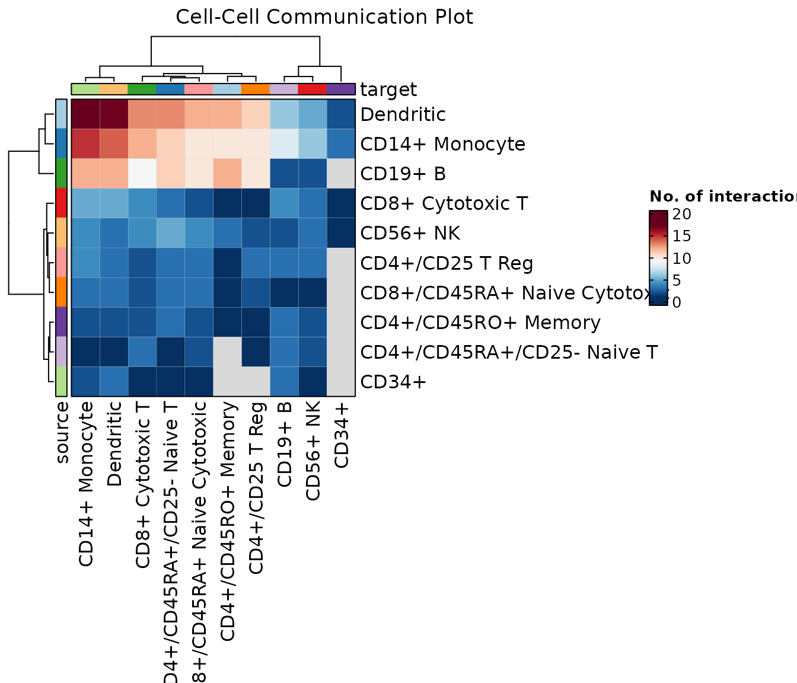
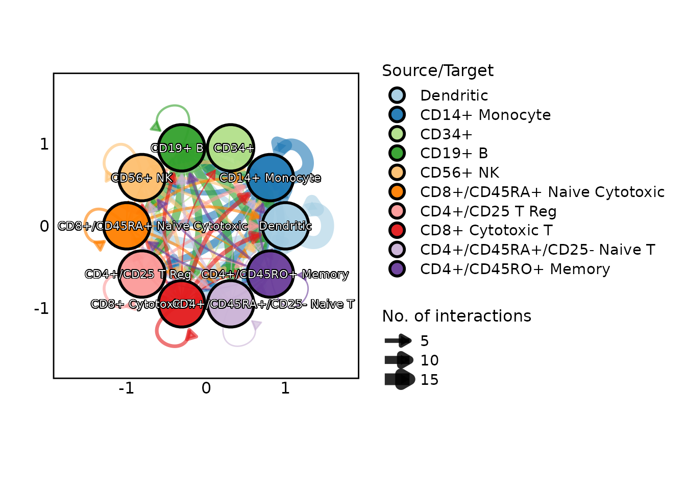

# Visualizing data with LLMs

``` r
library(scplotter)
api_key_set <- !identical(Sys.getenv("OPENAI_API_KEY"), "")
```

## Introduction

This vignette demonstrates how to use the `scplotter` package to
visualize data with AI. The package provides a variety of functions for
visualizing single-cell sequencing data, including scRNA-seq and
scTCR-seq/scBCR-seq data.

## Setup LLM provider

`scplotter` uses `tidyprompt` to provide a unified interface for
different LLM providers. You can set up your preferred LLM provider
using one of the
[wrappers](https://tjarkvandemerwe.github.io/tidyprompt/reference/index.html#llm-providers-chat-history)
provided by `tidyprompt`.

``` r
# Set up LLM provider
provider <- tidyprompt::llm_provider_openai(
    parameters = list(model = "gpt-5-nano", stream = getOption("tidyprompt.stream", TRUE)),
    verbose = getOption("tidyprompt.verbose", TRUE),
    url = "https://api.openai.com/v1/chat/completions",
    api_key = Sys.getenv("OPENAI_API_KEY")
)

chat <- SCPlotterChat$new(provider = provider)
```

## Setup the data for visualization

By default, `chat` will detects the data used for visualization from the
`.GlobalEnv` and data exported from the `Seurat`, `SeuratObject`, and
`scRepertoire` packages.

You can also ask to list the available data:

``` r
chat$ask("List the available data that can be used for visualization.")
#> 
#> Tool identified:  ListData 
#> Available data objects:
#> -  scplotter::cellphonedb_res :  A toy example of CellPhoneDB output from LIANA 
#> -  scplotter::ifnb_sub :  A subsetted version of 'ifnb' datasets 
#> -  scplotter::pancreas_sub :  A subsetted version of mouse 'pancreas' datasets 
#> -  Seurat::cc.genes :  Cell cycle genes 
#> -  Seurat::cc.genes.updated.2019 :  Cell cycle genes: 2019 update 
#> -  SeuratObject::pbmc_small :  A small example version of the PBMC dataset 
#> -  scRepertoire::contig_list :  A list of 8 single-cell T cell receptor sequences runs. 
#> -  scRepertoire::mini_contig_list :  Processed subset of 'contig_list' 
#> -  scRepertoire::scRep_example :  A Seurat object of 500 single T cells,
# or you can do it explicitly
# chat$list_data()
```

To set up the data manually, you can use the `set_data()` method.

``` r
chat$set_data(scplotter::cellphonedb_res)
# To let the LLM to detect the data from the prompt again:
chat$set_data(NULL)
```

To use your own data, you can either set the data manually or use the
`set_data()` method or you can load the data in the global environment
and mention it in your prompt.

## List the available tools

You can list the available functions by using the `list_tools()` method.

``` r
chat$list_tools()
#> Available tools:
#> -  gt :  Helper functions to select clones based on various criteria     
#>    These helper functions allow for the selection of clones based on various criteria such as size, group comparison, and existence in specific groups.
#> -  CellDimPlot :  Cell Dimension Reduction Plot     
#>    This function creates a dimension reduction plot for a Seurat object
#>    a Giotto object, a path to an .h5ad file or an opened    H5File    by    hdf5r    package.
#>    It allows for various customizations such as grouping by metadata,
#>    adding edges between cell neighbors, highlighting specific cells, and more.
#>    This function is a wrapper around    plotthis::DimPlot()   , which provides a
#>    flexible way to visualize cell clusters in reduced dimensions. This function
#>    extracts the necessary data from the Seurat or Giotto object and passes it to
#>    plotthis::DimPlot()   .
#> -  ClonalVolumePlot :  ClonalVolumePlot     
#>    ClonalVolumePlot
#> -  ClonalRarefactionPlot :  ClonalRarefactionPlot     
#>    Plot the rarefaction curves
#> -  ClonalStatPlot :  ClonalStatPlot     
#>    Visualize the statistics of the clones.
#> -  ClonalCompositionPlot :  ClonalCompositionPlot     
#>    Plot the composition of the clones in different samples/groups.
#> -  EnrichmentPlot :  Enrichment Plot     
#>    This function generates various types of plots for enrichment (over-representation) analysis.
#> -  eq :  Helper functions to select clones based on various criteria     
#>    These helper functions allow for the selection of clones based on various criteria such as size, group comparison, and existence in specific groups.
#> -  CellVelocityPlot :  Cell Velocity Plot     
#>    This function creates a cell velocity plot for a Seurat object,
#>    a Giotto object, a path to an .h5ad file or an opened    H5File    by    hdf5r    package.
#>    It allows for various customizations such as grouping by metadata,
#>    adding edges between cell neighbors, highlighting specific cells, and more.
#>    This function is a wrapper around    plotthis::VelocityPlot()   , which provides a
#>    flexible way to visualize cell velocities in reduced dimensions. This function
#>    extracts the cell embeddings and velocity embeddings from the Seurat or Giotto object
#>    and passes them to    plotthis::VelocityPlot()   .
#> -  SpatFeaturePlot :  Plot features for spatial data     
#>    The features can include  expression, dimension reduction components, metadata, etc
#> -  shared :  Helper functions to select clones based on various criteria     
#>    These helper functions allow for the selection of clones based on various criteria such as size, group comparison, and existence in specific groups.
#> -  CellStatPlot :  Cell statistics plot     
#>    This function creates a plot to visualize the statistics of cells in a Seurat object, a Giotto object,
#>    a path to an .h5ad file or an opened    H5File    by    hdf5r    package.
#>    It can create various types of plots, including bar plots, circos plots, pie charts, pies (heatmap with cell_type = 'pie'), ring/donut plots, trend plots
#>    area plots, sankey/alluvial plots, heatmaps, radar plots, spider plots, violin plots, and box plots.
#>    The function allows for grouping, splitting, and faceting the data based on metadata columns.
#>    It also supports calculating fractions of cells based on specified groupings.#'
#> -  ne :  Helper functions to select clones based on various criteria     
#>    These helper functions allow for the selection of clones based on various criteria such as size, group comparison, and existence in specific groups.
#> -  SpatDimPlot :  Plot categories for spatial data     
#>    Plot categories for spatial data
#> -  GSEASummaryPlot :  Objects exported from other packages     
#>    These objects are imported from other packages. Follow the links
#>    below to see their documentation.
#>    
#>    
#>         plotthis   GSEAPlot   ,    GSEASummaryPlot   
#> -  CCCPlot :  Cell-Cell Communication Plot     
#>    Plot the cell-cell communication.
#>    See also:
#>    
#>     The review:    https://www.sciencedirect.com/science/article/pii/S2452310021000081   
#>     The LIANA package:    https://liana-py.readthedocs.io/en/latest/notebooks/basic_usage.html#Tileplot   
#>     The CCPlotR package:    https://github.com/Sarah145/CCPlotR   
#>    
#> -  ClonalResidencyPlot :  ClonalResidencyPlot     
#>    Plot the residency of the clones in different samples.
#> -  ClustreePlot :  Clustree plot     
#>    This function generates a clustree plot from a data frame or a Seurat object.
#> -  ClonalKmerPlot :  ClonalKmerPlot     
#>    Explore the k-mer frequency of CDR3 sequences.
#> -  ClonalPositionalPlot :  ClonalPositionalPlot     
#>    Visualize the positional entropy, property or amino acid frequency of CDR3 sequences.
#> -  uniq :  Helper functions to select clones based on various criteria     
#>    These helper functions allow for the selection of clones based on various criteria such as size, group comparison, and existence in specific groups.
#> -  top :  Helper functions to select clones based on various criteria     
#>    These helper functions allow for the selection of clones based on various criteria such as size, group comparison, and existence in specific groups.
#> -  le :  Helper functions to select clones based on various criteria     
#>    These helper functions allow for the selection of clones based on various criteria such as size, group comparison, and existence in specific groups.
#> -  MarkersPlot :  Visualize Markers     
#>    Plot markers, typically identified by    Seurat::FindMarkers()    or    Seurat::FindAllMarkers()   .
#> -  ClonalOverlapPlot :  ClonalOverlapPlot     
#>    Plot the overlap of the clones in different samples/groups.
#> -  ge :  Helper functions to select clones based on various criteria     
#>    These helper functions allow for the selection of clones based on various criteria such as size, group comparison, and existence in specific groups.
#> -  ClonalDynamicsPlot :  ClonalDynamicsPlot     
#>    This function is deprecated. Please use    ClonalStatPlot()    instead.
#> -  ClonalLengthPlot :  ClonalLengthPlot     
#>    Plot the length distribution of the CDR3 sequences
#> -  and :  Helper functions to select clones based on various criteria     
#>    These helper functions allow for the selection of clones based on various criteria such as size, group comparison, and existence in specific groups.
#> -  ClonalAbundancePlot :  ClonalAbundancePlot     
#>    Plot the count or density of the clones at different abundance levels.
#> -  sel :  Helper functions to select clones based on various criteria     
#>    These helper functions allow for the selection of clones based on various criteria such as size, group comparison, and existence in specific groups.
#> -  ClonalDiversityPlot :  ClonalDiversityPlot     
#>    Plot the clonal diversities of the samples/groups.
#> -  FeatureStatPlot :  Feature statistic plot     
#>    This function creates various types of feature statistic plots for a Seurat object, a Giotto object,
#>    a path to an .h5ad file or an opened    H5File    by    hdf5r    package.
#>    It allows for plotting features such as gene expression, scores, or other metadata across different groups or conditions.
#>    The function supports multiple plot types including violin, box, bar, ridge, dimension reduction, correlation, heatmap, and dot plots.
#>    It can also handle multiple features and supports faceting, splitting, and grouping by metadata columns.
#> -  ClonalGeneUsagePlot :  ClonalGeneUsagePlot     
#>    ClonalGeneUsagePlot
#> -  lt :  Helper functions to select clones based on various criteria     
#>    These helper functions allow for the selection of clones based on various criteria such as size, group comparison, and existence in specific groups.
#> -  GSEAPlot :  Objects exported from other packages     
#>    These objects are imported from other packages. Follow the links
#>    below to see their documentation.
#>    
#>    
#>         plotthis   GSEAPlot   ,    GSEASummaryPlot   
#> -  or :  Helper functions to select clones based on various criteria     
#>    These helper functions allow for the selection of clones based on various criteria such as size, group comparison, and existence in specific groups.
#> -  ListTools :  List all available tools
#>    List all available tools that can be used to handle the chat request.
#> -  ListData :  List all available data objects
#>    List all available data objects that can be used to handle the chat request.
# or you can ask the LLM to list the available functions
# chat$ask("List the available functions for visualizing data.")
```

The tool used for the visualization is determined by the LLM
automatically from your prompt.

## Visualize the data

You can visualize the data by using the `ask()` method. The LLM will
automatically detect the data and the function to be used for
visualization.

``` r
chat$ask("Generate a cell-cell communication plot for the cellphonedb_res data.")
#> 
#> Tool identified:  CCCPlot 
#> 
#> Data object identified:  scplotter::cellphonedb_res 
#> Running tool:  CCCPlot
#> Warning in wrap$modify_fn(prompt_text, llm_provider): The 'skimr' package is
#> required to skim dataframes. Skim summary of dataframes currently not shown in
#> prompt
```


``` r
# Previous conversation is memorized
chat$ask("Do a heatmap instead")
#> 
#> Tool identified:  CellStatPlot 
#> 
#> Data object identified:  scplotter::cellphonedb_res 
#> Running tool:  CellStatPlot
#> Warning in wrap$modify_fn(prompt_text, llm_provider): The 'skimr' package is
#> required to skim dataframes. Skim summary of dataframes currently not shown in
#> prompt
#> Warning in tidyprompt::send_prompt(wrapt_prompt, private$provider, verbose =
#> verbose): Failed to reach a valid answer after 10 interactions
#> NULL
```

``` r
chat$ask("Add a title to the plot: 'Cell-Cell Communication Plot'")
#> 
#> Tool identified:  CCCPlot 
#> 
#> Data object identified:  scplotter::cellphonedb_res 
#> Running tool:  CCCPlot
#> Warning in wrap$modify_fn(prompt_text, llm_provider): The 'skimr' package is
#> required to skim dataframes. Skim summary of dataframes currently not shown in
#> prompt
```



``` r
# To fetch the previous conversation
# Note that the response from the LLM is simplified in the history
chat$get_history()
#>  [1] "User: Generate a cell-cell communication plot for the cellphonedb_res data."                                                                                                                                                                                                                                                                                                                                                                                                                                                                                                                                                                                                                                                                                                                                                                                                                                                                                                                                                                                                                                                                                                                                                                                                                                                                                                                                                                                                                                                                                                                                                          
#>  [2] "Assistant: tool - CCCPlot; data - scplotter::cellphonedb_res; code - # Generate a cell-cell communication network plot from the cellphonedb_res data\nplot_network <- CCCPlot(data = cellphonedb_res, plot_type = \"network\")\nplot_network"                                                                                                                                                                                                                                                                                                                                                                                                                                                                                                                                                                                                                                                                                                                                                                                                                                                                                                                                                                                                                                                                                                                                                                                                                                                                                                                                                                                         
#>  [3] "User: Do a heatmap instead"                                                                                                                                                                                                                                                                                                                                                                                                                                                                                                                                                                                                                                                                                                                                                                                                                                                                                                                                                                                                                                                                                                                                                                                                                                                                                                                                                                                                                                                                                                                                                                                                           
#>  [4] "Assistant: tool - CellStatPlot; data - scplotter::cellphonedb_res; code - # Generate a heatmap from cellphonedb_res using CellStatPlot\np_heatmap <- CellStatPlot(cellphonedb_res, plot_type = \"heatmap\")\np_heatmap"                                                                                                                                                                                                                                                                                                                                                                                                                                                                                                                                                                                                                                                                                                                                                                                                                                                                                                                                                                                                                                                                                                                                                                                                                                                                                                                                                                                                               
#>  [5] "User: Do a heatmap instead"                                                                                                                                                                                                                                                                                                                                                                                                                                                                                                                                                                                                                                                                                                                                                                                                                                                                                                                                                                                                                                                                                                                                                                                                                                                                                                                                                                                                                                                                                                                                                                                                           
#>  [6] "Assistant: tool - CellStatPlot; data - scplotter::cellphonedb_res; code - # Generate heatmap with an explicit ident column to avoid NULL ident error\np_heatmap <- CellStatPlot(cellphonedb_res, ident = \"cell_type\", plot_type = \"heatmap\")\np_heatmap"                                                                                                                                                                                                                                                                                                                                                                                                                                                                                                                                                                                                                                                                                                                                                                                                                                                                                                                                                                                                                                                                                                                                                                                                                                                                                                                                                                          
#>  [7] "User: Do a heatmap instead"                                                                                                                                                                                                                                                                                                                                                                                                                                                                                                                                                                                                                                                                                                                                                                                                                                                                                                                                                                                                                                                                                                                                                                                                                                                                                                                                                                                                                                                                                                                                                                                                           
#>  [8] "Assistant: tool - CellStatPlot; data - scplotter::cellphonedb_res; code - # Dynamically choose the first available column as ident to avoid hard-coded missing column\nident_col <- colnames(cellphonedb_res)[1]\np_heatmap <- CellStatPlot(cellphonedb_res, ident = ident_col, plot_type = \"heatmap\")\np_heatmap"                                                                                                                                                                                                                                                                                                                                                                                                                                                                                                                                                                                                                                                                                                                                                                                                                                                                                                                                                                                                                                                                                                                                                                                                                                                                                                                  
#>  [9] "User: Do a heatmap instead"                                                                                                                                                                                                                                                                                                                                                                                                                                                                                                                                                                                                                                                                                                                                                                                                                                                                                                                                                                                                                                                                                                                                                                                                                                                                                                                                                                                                                                                                                                                                                                                                           
#> [10] "Assistant: tool - CellStatPlot; data - scplotter::cellphonedb_res; code - # Auto-detect suitable ident and group_by columns for heatmap\ncols <- colnames(cellphonedb_res)\n\n# possible identifiers for rows\nident_candidates <- c(\"ident\",\"cluster\",\"seurat_annotations\",\"cell_type\",\"celltype\",\"cluster_id\",\"orig.ident\")\navailable_idents <- intersect(ident_candidates, cols)\nif(length(available_idents) == 0){\n  stop(\"No suitable ident column found in cellphonedb_res.\")\n}\nident_col <- available_idents[1]\n\n# possible group_by columns for heatmap columns\ngroup_by_candidates <- c(\"stim\",\"group\",\"sample\",\"orig.ident\",\"condition\",\"cell_type\",\"celltype\",\"sample_id\")\navailable_group_by <- intersect(group_by_candidates, cols)\nif(length(available_group_by) == 0){\n  stop(\"No suitable group_by column found in cellphonedb_res.\")\n}\ngroup_by_col <- available_group_by[1]\n\np_heatmap <- CellStatPlot(cellphonedb_res, ident = ident_col, group_by = group_by_col, plot_type = \"heatmap\")\np_heatmap"                                                                                                                                                                                                                                                                                                                                                                                                                                                                                                                                                           
#> [11] "User: Do a heatmap instead"                                                                                                                                                                                                                                                                                                                                                                                                                                                                                                                                                                                                                                                                                                                                                                                                                                                                                                                                                                                                                                                                                                                                                                                                                                                                                                                                                                                                                                                                                                                                                                                                           
#> [12] "Assistant: tool - CellStatPlot; data - scplotter::cellphonedb_res; code - # Robust heatmap: dynamically determine ident and group_by, with fallbacks if missing\ncols <- colnames(cellphonedb_res)\n\n# Identify ident column or create a temporary one\nident_candidates <- c(\"ident\",\"Identity\",\"cluster\",\"seurat_clusters\",\"cell_type\",\"celltype\",\"orig.ident\",\"sample_id\",\"group\",\"stim\")\navailable_idents <- intersect(ident_candidates, cols)\nif(length(available_idents) == 0){\n  cellphonedb_res$ident_temp <- \"all\"\n  ident_col <- \"ident_temp\"\n} else {\n  ident_col <- available_idents[1]\n}\n\n# Identify group_by column or create a temporary one\ngroup_by_candidates <- c(\"stim\",\"group\",\"sample\",\"orig.ident\",\"condition\",\"cell_type\",\"celltype\",\"sample_id\",\"group_by\",\"treatment\")\navailable_group_by <- intersect(group_by_candidates, cols)\nif(length(available_group_by) == 0){\n  cellphonedb_res$group_temp <- \"all\"\n  group_by_col <- \"group_temp\"\n} else {\n  group_by_col <- available_group_by[1]\n}\n\np_heatmap <- CellStatPlot(cellphonedb_res, ident = ident_col, group_by = group_by_col, plot_type = \"heatmap\")\np_heatmap"                                                                                                                                                                                                                                                                                                                                                                                                             
#> [13] "User: Do a heatmap instead"                                                                                                                                                                                                                                                                                                                                                                                                                                                                                                                                                                                                                                                                                                                                                                                                                                                                                                                                                                                                                                                                                                                                                                                                                                                                                                                                                                                                                                                                                                                                                                                                           
#> [14] "Assistant: tool - CellStatPlot; data - scplotter::cellphonedb_res; code - # Robust heatmap with dynamic columns for cellphonedb_res\n\ncols <- colnames(cellphonedb_res)\n\n# Determine ident column\nident_candidates <- c(\"ident\",\"Identity\",\"cluster\",\"seurat_clusters\",\"cell_type\",\"celltype\",\"orig.ident\",\"sample_id\",\"group\",\"stim\")\navailable_idents <- intersect(ident_candidates, cols)\nif(length(available_idents) == 0){\n  cellphonedb_res$ident_temp <- \"all\"\n  ident_col <- \"ident_temp\"\n} else {\n  ident_col <- available_idents[1]\n}\n\n# Determine group_by column\ngroup_by_candidates <- c(\"stim\",\"group\",\"sample\",\"orig.ident\",\"condition\",\"cell_type\",\"celltype\",\"sample_id\",\"group_by\",\"treatment\")\navailable_group_by <- intersect(group_by_candidates, cols)\nif(length(available_group_by) == 0){\n  cellphonedb_res$group_temp <- \"all\"\n  group_by_col <- \"group_temp\"\n} else {\n  group_by_col <- available_group_by[1]\n}\n\n# Determine values_by column\nvalues_by_candidates <- c(\"Number of cells\",\"n_cells\",\"n\",\"counts\",\"count\",\"values\",\"value\",\"score\",\"freq\",\"frequency\",\"cell_count\",\"cell_counts\")\navailable_values <- intersect(values_by_candidates, cols)\nif(length(available_values) == 0){\n  cellphonedb_res$values_by_tmp <- 1\n  values_by_col <- \"values_by_tmp\"\n} else {\n  values_by_col <- available_values[1]\n}\n\np_heatmap <- CellStatPlot(\n  cellphonedb_res,\n  ident = ident_col,\n  group_by = group_by_col,\n  plot_type = \"heatmap\",\n  values_by = values_by_col\n)\np_heatmap"
#> [15] "User: Do a heatmap instead"                                                                                                                                                                                                                                                                                                                                                                                                                                                                                                                                                                                                                                                                                                                                                                                                                                                                                                                                                                                                                                                                                                                                                                                                                                                                                                                                                                                                                                                                                                                                                                                                           
#> [16] "Assistant: tool - CellStatPlot; data - scplotter::cellphonedb_res; code - # Robust heatmap without forcing values_by to avoid argument conflicts\n\ncols <- colnames(cellphonedb_res)\n\n# Select ident column\nident_candidates <- c(\"ident\",\"Identity\",\"cluster\",\"seurat_clusters\",\"cell_type\",\"celltype\",\"orig.ident\",\"sample_id\",\"group\",\"stim\")\navailable_idents <- intersect(ident_candidates, cols)\nif(length(available_idents) == 0){\n  stop(\"No suitable ident column found in cellphonedb_res.\")\n}\nident_col <- available_idents[1]\n\n# Select group_by column\ngroup_by_candidates <- c(\"stim\",\"group\",\"sample\",\"orig.ident\",\"condition\",\"cell_type\",\"celltype\",\"sample_id\",\"group_by\",\"treatment\")\navailable_group_by <- intersect(group_by_candidates, cols)\nif(length(available_group_by) == 0){\n  stop(\"No suitable group_by column found in cellphonedb_res.\")\n}\ngroup_by_col <- available_group_by[1]\n\np_heatmap <- CellStatPlot(cellphonedb_res, ident = ident_col, group_by = group_by_col, plot_type = \"heatmap\")\np_heatmap"                                                                                                                                                                                                                                                                                                                                                                                                                                                                                                                          
#> [17] "User: Do a heatmap instead"                                                                                                                                                                                                                                                                                                                                                                                                                                                                                                                                                                                                                                                                                                                                                                                                                                                                                                                                                                                                                                                                                                                                                                                                                                                                                                                                                                                                                                                                                                                                                                                                           
#> [18] "Assistant: tool - CellStatPlot; data - scplotter::cellphonedb_res; code - # Robust heatmap: ensure ident and group_by columns exist, otherwise create temporary ones\ncols <- colnames(cellphonedb_res)\n\n# Determine ident column\nident_candidates <- c(\"ident\",\"Identity\",\"cluster\",\"seurat_clusters\",\"cell_type\",\"celltype\",\"orig.ident\",\"sample_id\",\"group\",\"stim\")\navailable_idents <- intersect(ident_candidates, cols)\nif(length(available_idents) == 0){\n  cellphonedb_res$ident_temp <- \"all\"\n  ident_col <- \"ident_temp\"\n} else {\n  ident_col <- available_idents[1]\n}\n\n# Determine group_by column\ngroup_by_candidates <- c(\"stim\",\"group\",\"sample\",\"orig.ident\",\"condition\",\"cell_type\",\"celltype\",\"sample_id\",\"group_by\",\"treatment\")\navailable_group_by <- intersect(group_by_candidates, cols)\nif(length(available_group_by) == 0){\n  cellphonedb_res$group_temp <- \"all\"\n  group_by_col <- \"group_temp\"\n} else {\n  group_by_col <- available_group_by[1]\n}\n\np_heatmap <- CellStatPlot(cellphonedb_res, ident = ident_col, group_by = group_by_col, plot_type = \"heatmap\")\np_heatmap"                                                                                                                                                                                                                                                                                                                                                                                                                                                          
#> [19] "User: Do a heatmap instead"                                                                                                                                                                                                                                                                                                                                                                                                                                                                                                                                                                                                                                                                                                                                                                                                                                                                                                                                                                                                                                                                                                                                                                                                                                                                                                                                                                                                                                                                                                                                                                                                           
#> [20] "Assistant: tool - CellStatPlot; data - scplotter::cellphonedb_res; code - # Robust heatmap: determine ident and group_by, avoid using values_by to prevent errors\n\ncols <- colnames(cellphonedb_res)\n\n# Determine ident column\nident_candidates <- c(\"ident\",\"Identity\",\"cluster\",\"seurat_clusters\",\"cell_type\",\"celltype\",\"orig.ident\",\"sample_id\",\"group\",\"stim\")\navailable_idents <- intersect(ident_candidates, cols)\nif(length(available_idents) == 0){\n  cellphonedb_res$ident_temp <- \"all\"\n  ident_col <- \"ident_temp\"\n} else {\n  ident_col <- available_idents[1]\n}\n\n# Determine group_by column\ngroup_by_candidates <- c(\"stim\",\"group\",\"sample\",\"orig.ident\",\"condition\",\"cell_type\",\"celltype\",\"sample_id\",\"group_by\",\"treatment\")\navailable_group_by <- intersect(group_by_candidates, cols)\nif(length(available_group_by) == 0){\n  cellphonedb_res$group_temp <- \"all\"\n  group_by_col <- \"group_temp\"\n} else {\n  group_by_col <- available_group_by[1]\n}\n\np_heatmap <- CellStatPlot(cellphonedb_res, ident = ident_col, group_by = group_by_col, plot_type = \"heatmap\")\np_heatmap"                                                                                                                                                                                                                                                                                                                                                                                                                                                           
#> [21] "User: Add a title to the plot: 'Cell-Cell Communication Plot'"                                                                                                                                                                                                                                                                                                                                                                                                                                                                                                                                                                                                                                                                                                                                                                                                                                                                                                                                                                                                                                                                                                                                                                                                                                                                                                                                                                                                                                                                                                                                                                        
#> [22] "Assistant: tool - CCCPlot; data - scplotter::cellphonedb_res; code - plot_cc <- CCCPlot(data = cellphonedb_res, title = \"Cell-Cell Communication Plot\")\nplot_cc"

# To clear the history
chat$clear_history()
```

## Debug and improve the prompt

You can set `verbose` to `TRUE` for all conversations when constructing
the `chat` object. This will print the prompt and the response from the
LLM.

``` r
chat <- SCPlotterChat$new(
    provider = provider,
    verbose = TRUE
)
chat$ask("Generate a cell-cell communication plot for the cellphonedb_res data.")
#> --- Sending request to LLM provider (gpt-5-nano): ---
#> Based on the following prompt and identify the tool that can be used to handle the request.
#> Please only answer with the name of the tool from the listed available ones. 
#> If no proper tool is identified from the prompt, use the last mentioned tool in the chat history.
#> If no tool is found in the chat history, just answer "None".
#> 
#> --- Prompt ---
#> Generate a cell-cell communication plot for the cellphonedb_res data.
#> 
#> --- Available Tools ---
#> - gt: Helper functions to select clones based on various criteria  
#>    These helper functions allow for the selection of clones based on various criteria such as size, group comparison, and existence in specific groups.
#> 
#> - CellDimPlot: Cell Dimension Reduction Plot  
#>    This function creates a dimension reduction plot for a Seurat object
#>    a Giotto object, a path to an .h5ad file or an opened    H5File    by    hdf5r    package.
#>    It allows for various customizations such as grouping by metadata,
#>    adding edges between cell neighbors, highlighting specific cells, and more.
#>    This function is a wrapper around    plotthis::DimPlot()   , which provides a
#>    flexible way to visualize cell clusters in reduced dimensions. This function
#>    extracts the necessary data from the Seurat or Giotto object and passes it to
#>    plotthis::DimPlot()   .
#> 
#> - ClonalVolumePlot: ClonalVolumePlot  
#>    ClonalVolumePlot
#> 
#> - ClonalRarefactionPlot: ClonalRarefactionPlot  
#>    Plot the rarefaction curves
#> 
#> - ClonalStatPlot: ClonalStatPlot  
#>    Visualize the statistics of the clones.
#> 
#> - ClonalCompositionPlot: ClonalCompositionPlot  
#>    Plot the composition of the clones in different samples/groups.
#> 
#> - EnrichmentPlot: Enrichment Plot  
#>    This function generates various types of plots for enrichment (over-representation) analysis.
#> 
#> - eq: Helper functions to select clones based on various criteria  
#>    These helper functions allow for the selection of clones based on various criteria such as size, group comparison, and existence in specific groups.
#> 
#> - CellVelocityPlot: Cell Velocity Plot  
#>    This function creates a cell velocity plot for a Seurat object,
#>    a Giotto object, a path to an .h5ad file or an opened    H5File    by    hdf5r    package.
#>    It allows for various customizations such as grouping by metadata,
#>    adding edges between cell neighbors, highlighting specific cells, and more.
#>    This function is a wrapper around    plotthis::VelocityPlot()   , which provides a
#>    flexible way to visualize cell velocities in reduced dimensions. This function
#>    extracts the cell embeddings and velocity embeddings from the Seurat or Giotto object
#>    and passes them to    plotthis::VelocityPlot()   .
#> 
#> - SpatFeaturePlot: Plot features for spatial data  
#>    The features can include  expression, dimension reduction components, metadata, etc
#> 
#> - shared: Helper functions to select clones based on various criteria  
#>    These helper functions allow for the selection of clones based on various criteria such as size, group comparison, and existence in specific groups.
#> 
#> - CellStatPlot: Cell statistics plot  
#>    This function creates a plot to visualize the statistics of cells in a Seurat object, a Giotto object,
#>    a path to an .h5ad file or an opened    H5File    by    hdf5r    package.
#>    It can create various types of plots, including bar plots, circos plots, pie charts, pies (heatmap with cell_type = 'pie'), ring/donut plots, trend plots
#>    area plots, sankey/alluvial plots, heatmaps, radar plots, spider plots, violin plots, and box plots.
#>    The function allows for grouping, splitting, and faceting the data based on metadata columns.
#>    It also supports calculating fractions of cells based on specified groupings.#'
#> 
#> - ne: Helper functions to select clones based on various criteria  
#>    These helper functions allow for the selection of clones based on various criteria such as size, group comparison, and existence in specific groups.
#> 
#> - SpatDimPlot: Plot categories for spatial data  
#>    Plot categories for spatial data
#> 
#> - GSEASummaryPlot: Objects exported from other packages  
#>    These objects are imported from other packages. Follow the links
#>    below to see their documentation.
#>    
#>    
#>         plotthis   GSEAPlot   ,    GSEASummaryPlot   
#> 
#> - CCCPlot: Cell-Cell Communication Plot  
#>    Plot the cell-cell communication.
#>    See also:
#>    
#>     The review:    https://www.sciencedirect.com/science/article/pii/S2452310021000081   
#>     The LIANA package:    https://liana-py.readthedocs.io/en/latest/notebooks/basic_usage.html#Tileplot   
#>     The CCPlotR package:    https://github.com/Sarah145/CCPlotR   
#>    
#> 
#> - ClonalResidencyPlot: ClonalResidencyPlot  
#>    Plot the residency of the clones in different samples.
#> 
#> - ClustreePlot: Clustree plot  
#>    This function generates a clustree plot from a data frame or a Seurat object.
#> 
#> - ClonalKmerPlot: ClonalKmerPlot  
#>    Explore the k-mer frequency of CDR3 sequences.
#> 
#> - ClonalPositionalPlot: ClonalPositionalPlot  
#>    Visualize the positional entropy, property or amino acid frequency of CDR3 sequences.
#> 
#> - uniq: Helper functions to select clones based on various criteria  
#>    These helper functions allow for the selection of clones based on various criteria such as size, group comparison, and existence in specific groups.
#> 
#> - top: Helper functions to select clones based on various criteria  
#>    These helper functions allow for the selection of clones based on various criteria such as size, group comparison, and existence in specific groups.
#> 
#> - le: Helper functions to select clones based on various criteria  
#>    These helper functions allow for the selection of clones based on various criteria such as size, group comparison, and existence in specific groups.
#> 
#> - MarkersPlot: Visualize Markers  
#>    Plot markers, typically identified by    Seurat::FindMarkers()    or    Seurat::FindAllMarkers()   .
#> 
#> - ClonalOverlapPlot: ClonalOverlapPlot  
#>    Plot the overlap of the clones in different samples/groups.
#> 
#> - ge: Helper functions to select clones based on various criteria  
#>    These helper functions allow for the selection of clones based on various criteria such as size, group comparison, and existence in specific groups.
#> 
#> - ClonalDynamicsPlot: ClonalDynamicsPlot  
#>    This function is deprecated. Please use    ClonalStatPlot()    instead.
#> 
#> - ClonalLengthPlot: ClonalLengthPlot  
#>    Plot the length distribution of the CDR3 sequences
#> 
#> - and: Helper functions to select clones based on various criteria  
#>    These helper functions allow for the selection of clones based on various criteria such as size, group comparison, and existence in specific groups.
#> 
#> - ClonalAbundancePlot: ClonalAbundancePlot  
#>    Plot the count or density of the clones at different abundance levels.
#> 
#> - sel: Helper functions to select clones based on various criteria  
#>    These helper functions allow for the selection of clones based on various criteria such as size, group comparison, and existence in specific groups.
#> 
#> - ClonalDiversityPlot: ClonalDiversityPlot  
#>    Plot the clonal diversities of the samples/groups.
#> 
#> - FeatureStatPlot: Feature statistic plot  
#>    This function creates various types of feature statistic plots for a Seurat object, a Giotto object,
#>    a path to an .h5ad file or an opened    H5File    by    hdf5r    package.
#>    It allows for plotting features such as gene expression, scores, or other metadata across different groups or conditions.
#>    The function supports multiple plot types including violin, box, bar, ridge, dimension reduction, correlation, heatmap, and dot plots.
#>    It can also handle multiple features and supports faceting, splitting, and grouping by metadata columns.
#> 
#> - ClonalGeneUsagePlot: ClonalGeneUsagePlot  
#>    ClonalGeneUsagePlot
#> 
#> - lt: Helper functions to select clones based on various criteria  
#>    These helper functions allow for the selection of clones based on various criteria such as size, group comparison, and existence in specific groups.
#> 
#> - GSEAPlot: Objects exported from other packages  
#>    These objects are imported from other packages. Follow the links
#>    below to see their documentation.
#>    
#>    
#>         plotthis   GSEAPlot   ,    GSEASummaryPlot   
#> 
#> - or: Helper functions to select clones based on various criteria  
#>    These helper functions allow for the selection of clones based on various criteria such as size, group comparison, and existence in specific groups.
#> 
#> - ListTools: List all available tools
#> List all available tools that can be used to handle the chat request.
#> 
#> - ListData: List all available data objects
#> List all available data objects that can be used to handle the chat request.
#> --- Receiving response from LLM provider: ---
#> CCCPlot
#> Tool identified:  CCCPlot
#> --- Sending request to LLM provider (gpt-5-nano): ---
#> Based on the following prompt, identify the name of the data object that is mentioned in the prompt.
#> The name should be one of the available ones listed.
#> If no data object is found based on the prompt, use the last mentioned data object in the chat history.
#> If no data object is found in the chat history, just answer "None".
#> 
#> --- Prompt ---
#> Generate a cell-cell communication plot for the cellphonedb_res data.
#> 
#> -- Available Data Objects ---
#> - scplotter::cellphonedb_res: A toy example of CellPhoneDB output from LIANA
#> - scplotter::ifnb_sub: A subsetted version of 'ifnb' datasets
#> - scplotter::pancreas_sub: A subsetted version of mouse 'pancreas' datasets
#> - Seurat::cc.genes: Cell cycle genes
#> - Seurat::cc.genes.updated.2019: Cell cycle genes: 2019 update
#> - SeuratObject::pbmc_small: A small example version of the PBMC dataset
#> - scRepertoire::contig_list: A list of 8 single-cell T cell receptor sequences runs.
#> - scRepertoire::mini_contig_list: Processed subset of 'contig_list'
#> - scRepertoire::scRep_example: A Seurat object of 500 single T cells,
#> --- Receiving response from LLM provider: ---
#> scplotter::cellphonedb_res
#> Data object identified:  scplotter::cellphonedb_res 
#> Running tool:  CCCPlot
#> Warning in wrap$modify_fn(prompt_text, llm_provider): The 'skimr' package is
#> required to skim dataframes. Skim summary of dataframes currently not shown in
#> prompt
#> --- Sending request to LLM provider (gpt-5-nano): ---
```

    #> Based on the following prompt and the given tool information, generate the code to run the tool.
    #> The tool or function to be used is: CCCPlot. The data object to be used is: cellphonedb_res.
    #> Don't quote the data name when using it. The code should be valid R code.
    #> Only answer with the code that is wrapped between between ```r and ``` to run the tool.
    #> If there is not enough information in the prompt to run the tool, also refer to the chat history.
    #> 
    #> --- Prompt ---
    #> Generate a cell-cell communication plot for the cellphonedb_res data.
    #> 
    #> --- Tool Information ---
    #> - title
    #>   Cell-Cell Communication Plot
    #> - description
    #>   
    #>    Plot the cell-cell communication.
    #>    See also:
    #>    
    #>     The review:  https://www.sciencedirect.com/science/article/pii/S2452310021000081 
    #>     The LIANA package:  https://liana-py.readthedocs.io/en/latest/notebooks/basic_usage.html#Tileplot 
    #>     The CCPlotR package:  https://github.com/Sarah145/CCPlotR 
    #>    
    #>   
    #> - usage
    #>   
    #>   CCCPlot(
    #>     data,
    #>     plot_type = c("dot", "network", "chord", "circos", "heatmap", "sankey", "alluvial",
    #>       "box", "violin", "ridge"),
    #>     method = c("aggregation", "interaction"),
    #>     magnitude = waiver(),
    #>     specificity = waiver(),
    #>     magnitude_agg = length,
    #>     magnitude_name = "No. of interactions",
    #>     meta_specificity = "sumlog",
    #>     split_by = NULL,
    #>     x_text_angle = 90,
    #>     link_curvature = 0.2,
    #>     link_alpha = 0.6,
    #>     facet_by = NULL,
    #>     show_row_names = TRUE,
    #>     show_column_names = TRUE,
    #>     ...
    #>   )
    #>   
    #> - arguments
    #>   - data: A data frame with the cell-cell communication data.
    #>   A typical data frame should have the following columns:
    #>   
    #>    source The source cell type.
    #>    target The target cell type.
    #>    ligand The ligand gene.
    #>    receptor The receptor gene.
    #>    ligand_means The mean expression of the ligand gene per cell type.
    #>    receptor_means The mean expression of the receptor gene per cell type.
    #>    ligand_props The proportion of cells that express the entity.
    #>    receptor_props The proportion of cells that express the entity.
    #>    <magnitude> The magnitude of the communication.
    #>    <specificity> The specificity of the communication.
    #>   Depends on the plot_type, some columns are optional. But the source, target,
    #>   ligand, receptor and <magnitude> are required.
    #>   
    #>   - plot_type: The type of plot to use. Default is "dot".
    #>   Possible values are "network", "chord", "circos", "heatmap", "sankey", "alluvial", "dot",
    #>   "box", "violin" and "ridge".
    #>   For "box", "violin" and "ridge", the method should be "interaction".
    #>   
    #>    network: A network plot with the source and target cells as the nodes and the communication as the edges.
    #>    chord: A chord plot with the source and target cells as the nodes and the communication as the chords.
    #>    circos: Alias of "chord".
    #>    heatmap: A heatmap plot with the source and target cells as the rows and columns.
    #>    sankey: A sankey plot with the source and target cells as the nodes and the communication as the flows.
    #>    alluvial: Alias of "sankey".
    #>    dot: A dot plot with the source and target cells as the nodes and the communication as the dots.
    #>    box: Box plots for source cell types. Each x is a target cell type and the values will be
    #>   the interaction strengths of the ligand-receptor pairs.
    #>    violin: Violin plots for source cell types. Each x is a target cell type and the values will be
    #>   the interaction strengths of the ligand-receptor pairs.
    #>    ridge: Ridge plots for source cell types. Each row is a target cell type and the values will be
    #>   the interaction strengths of the ligand-receptor pairs.
    #>   
    #>   - method: The method to determine the plot entities.
    #>   
    #>    aggregation: Aggregate the ligand-receptor pairs interactions for each source-target pair.
    #>   Only the source / target pairs will be plotted.
    #>    interaction: Plot the ligand-receptor pairs interactions directly.
    #>   The ligand-receptor pairs will also be plotted.
    #>   
    #>   - magnitude: The column name in the data to use as the magnitude of the communication.
    #>   By default, the second last column will be used.
    #>   See li.mt.show_methods() for the available methods in LIANA.
    #>   or https://liana-py.readthedocs.io/en/latest/notebooks/basic_usage.html#Tileplot
    #>   - specificity: The column name in the data to use as the specificity of the communication.
    #>   By default, the last column will be used.
    #>   If the method doesn't have a specificity, set it to NULL.
    #>   - magnitude_agg: A function to aggregate the magnitude of the communication.
    #>   Default is length.
    #>   - magnitude_name: The name of the magnitude in the plot.
    #>   Default is "No. of interactions".
    #>   - meta_specificity: The method to calculate the specificity when there are multiple
    #>   ligand-receptor pairs interactions. Default is "sumlog".
    #>   It should be one of the methods in the metap package.
    #>   Current available methods are:
    #>   
    #>    invchisq: Combine p values using the inverse chi squared method
    #>    invt: Combine p values using the inverse t method
    #>    logitp: Combine p values using the logit method
    #>    meanp: Combine p values by the mean p method
    #>    meanz: Combine p values using the mean z method
    #>    sumlog: Combine p-values by the sum of logs (Fisher's) method
    #>    sump: Combine p-values using the sum of p (Edgington's) method
    #>    two2one: Convert two-sided p-values to one-sided
    #>    votep: Combine p-values by the vote counting method
    #>    wilkinsonp: Combine p-values using Wilkinson's method
    #>   
    #>   - split_by: A character vector of column names to split the plots. Default is NULL.
    #>   - x_text_angle: The angle of the x-axis text. Default is 90.
    #>   Only used when plot_type is "dot".
    #>   - link_curvature: The curvature of the links. Default is 0.2.
    #>   Only used when plot_type is "network".
    #>   - link_alpha: The transparency of the links. Default is 0.6.
    #>   Only used when plot_type is "network".
    #>   - facet_by: A character vector of column names to facet the plots. Default is NULL.
    #>   It should always be NULL.
    #>   - show_row_names: Whether to show the row names in the heatmap. Default is TRUE.
    #>   Only used when plot_type is "heatmap".
    #>   - show_column_names: Whether to show the column names in the heatmap. Default is TRUE.
    #>   Only used when plot_type is "heatmap".
    #>   - ...: Other arguments passed to the specific plot function.
    #>   
    #>    For Network, see plotthis::Network().
    #>    
    #>       [...] can be:
    #>       - links: A data frame containing the links between nodes.
    #>       - nodes: A data frame containing the nodes.
    #>       This is optional. The names of the nodes are extracted from the links data frame.
    #>       If "@nodes" is provided, the nodes data frame will be extracted from the attribute nodes of the links data frame.
    #>       - split_by_sep: The separator for multiple split_by columns. See split_by
    #>       - split_nodes: A logical value specifying whether to split the nodes data.
    #>       If TRUE, the nodes data will also be split by the split_by column.
    #>       - from: A character string specifying the column name of the links data frame for the source nodes.
    #>       Default is the first column of the links data frame.
    #>       - from_sep: A character string to concatenate the columns in from, if multiple columns are provided.
    #>       - to: A character string specifying the column name of the links data frame for the target nodes.
    #>       Default is the second column of the links data frame.
    #>       - to_sep: A character string to concatenate the columns in to, if multiple columns are provided.
    #>       - node_by: A character string specifying the column name of the nodes data frame for the node names.
    #>       Default is the first column of the nodes data frame.
    #>       - node_by_sep: A character string to concatenate the columns in node_by, if multiple columns are provided.
    #>       - link_weight_by: A numeric value or a character string specifying the column name of the links data frame for the link weight.
    #>       If a numeric value is provided, all links will have the same weight.
    #>       This determines the width of the links.
    #>       - link_weight_name: A character string specifying the name of the link weight in the legend.
    #>       - link_type_by: A character string specifying the type of the links.
    #>       This can be "solid", "dashed", "dotted", or a column name from the links data frame.
    #>       It has higher priority when it is a column name.
    #>       - link_type_name: A character string specifying the name of the link type in the legend.
    #>       - node_size_by: A numeric value or a character string specifying the column name of the nodes data frame for the node size.
    #>       If a numeric value is provided, all nodes will have the same size.
    #>       - node_size_name: A character string specifying the name of the node size in the legend.
    #>       - node_color_by: A character string specifying the color of the nodes.
    #>       This can be a color name, a hex code, or a column name from the nodes data frame.
    #>       It has higher priority when it is a column name.
    #>       - node_color_name: A character string specifying the name of the node color in the legend.
    #>       - node_shape_by: A numeric value or a character string specifying the column name of the nodes data frame for the node shape.
    #>       If a numeric value is provided, all nodes will have the same shape.
    #>       - node_shape_name: A character string specifying the name of the node shape in the legend.
    #>       - node_fill_by: A character string specifying the fill color of the nodes.
    #>       This can be a color name, a hex code, or a column name from the nodes data frame.
    #>       It has higher priority when it is a column name.
    #>       - node_fill_name: A character string specifying the name of the node fill in the legend.
    #>       - node_alpha: A numeric value specifying the transparency of the nodes.
    #>       It only works when the nodes are filled.
    #>       - node_stroke: A numeric value specifying the stroke of the nodes.
    #>       - cluster_scale: A character string specifying how to scale the clusters.
    #>       It can be "fill", "color", or "shape".
    #>       - node_size_range: A numeric vector specifying the range of the node size.
    #>       - link_weight_range: A numeric vector specifying the range of the link weight.
    #>       - link_arrow_offset: A numeric value specifying the offset of the link arrows.
    #>       So that they won't overlap with the nodes.
    #>       - link_color_by: A character string specifying the colors of the link. It can be:
    #>       
    #>        "from" means the color of the link is determined by the source node.
    #>        "to" means the color of the link is determined by the target node.
    #>        Otherwise, the color of the link is determined by the column name from the links data frame.
    #>       
    #>       - link_color_name: A character string specifying the name of the link color in the legend.
    #>       Only used when link_color_by is a column name.
    #>       - palette: A character string specifying the palette to use.
    #>       A named list or vector can be used to specify the palettes for different split_by values.
    #>       - palcolor: A character string specifying the color to use in the palette.
    #>       A named list can be used to specify the colors for different split_by values.
    #>       If some values are missing, the values from the palette will be used (palcolor will be NULL for those values).
    #>       - link_palette: A character string specifying the palette of the links.
    #>       When link_color_by is "from" or "to", the palette of the links defaults to the palette of the nodes.
    #>       - link_palcolor: A character vector specifying the colors of the link palette.
    #>       When link_color_by is "from" or "to", the colors of the link palette defaults to the colors of the node palette.
    #>       - directed: A logical value specifying whether the graph is directed.
    #>       - layout: A character string specifying the layout of the graph.
    #>       It can be "circle", "tree", "grid", or a layout function from igraph.
    #>       - cluster: A character string specifying the clustering method.
    #>       It can be "none", "fast_greedy", "walktrap", "edge_betweenness", "infomap", or a clustering function from igraph.
    #>       - add_mark: A logical value specifying whether to add mark for the clusters to the plot.
    #>       - mark_expand: A unit value specifying the expansion of the mark.
    #>       - mark_type: A character string specifying the type of the mark.
    #>       It can be "hull", "ellipse", "rect", "circle", or a mark function from ggforce.
    #>       - mark_alpha: A numeric value specifying the transparency of the mark.
    #>       - mark_linetype: A numeric value specifying the line type of the mark.
    #>       - add_label: A logical value specifying whether to add label to the nodes to the plot.
    #>       - label_size: A numeric value specifying the size of the label.
    #>       - label_fg: A character string specifying the foreground color of the label.
    #>       - label_bg: A character string specifying the background color of the label.
    #>       - label_bg_r: A numeric value specifying the background ratio of the label.
    #>       - arrow: An arrow object for the links.
    #>       - title: A character string specifying the title of the plot.
    #>       A function can be used to generate the title based on the default title.
    #>       This is useful when split_by is used and the title needs to be dynamic.
    #>       - subtitle: A character string specifying the subtitle of the plot.
    #>       - xlab: A character string specifying the x-axis label.
    #>       - ylab: A character string specifying the y-axis label.
    #>       - aspect.ratio: A numeric value specifying the aspect ratio of the plot.
    #>       - theme: A character string or a theme class (i.e. ggplot2::theme_classic) specifying the theme to use.
    #>       Default is "theme_this".
    #>       - theme_args: A list of arguments to pass to the theme function.
    #>       - legend.position: A character string specifying the position of the legend.
    #>       if waiver(), for single groups, the legend will be "none", otherwise "right".
    #>       - legend.direction: A character string specifying the direction of the legend.
    #>       - seed: The random seed to use. Default is 8525.
    #>       - combine: Whether to combine the plots into one when facet is FALSE. Default is TRUE.
    #>       - nrow: A numeric value specifying the number of rows in the facet.
    #>       - ncol: A numeric value specifying the number of columns in the facet.
    #>       - byrow: A logical value indicating whether to fill the plots by row.
    #>       - axes: A string specifying how axes should be treated. Passed to patchwork::wrap_plots().
    #>       Only relevant when split_by is used and combine is TRUE.
    #>       Options are:
    #>       
    #>        'keep' will retain all axes in individual plots.
    #>        'collect' will remove duplicated axes when placed in the same run of rows or columns of the layout.
    #>        'collect_x' and 'collect_y' will remove duplicated x-axes in the columns or duplicated y-axes in the rows respectively.
    #>       
    #>       - axis_titles: A string specifying how axis titltes should be treated. Passed to patchwork::wrap_plots().
    #>       Only relevant when split_by is used and combine is TRUE.
    #>       Options are:
    #>       
    #>        'keep' will retain all axis titles in individual plots.
    #>        'collect' will remove duplicated titles in one direction and merge titles in the opposite direction.
    #>        'collect_x' and 'collect_y' control this for x-axis titles and y-axis titles respectively.
    #>       
    #>       - guides: A string specifying how guides should be treated in the layout. Passed to patchwork::wrap_plots().
    #>       Only relevant when split_by is used and combine is TRUE.
    #>       Options are:
    #>       
    #>        'collect' will collect guides below to the given nesting level, removing duplicates.
    #>        'keep' will stop collection at this level and let guides be placed alongside their plot.
    #>        'auto' will allow guides to be collected if a upper level tries, but place them alongside the plot if not.
    #>       
    #>       - design: Specification of the location of areas in the layout, passed to patchwork::wrap_plots().
    #>       Only relevant when split_by is used and combine is TRUE. When specified, nrow, ncol, and byrow are ignored.
    #>       See patchwork::wrap_plots() for more details.
    #>   For ChordPlot, see plotthis::ChordPlot().
    #>    
    #>       [...] can be:
    #>       - y: A character string specifying the column name of the data frame to plot for the y-axis.
    #>       - from: A character string of the column name to plot for the source.
    #>       A character/factor column is expected.
    #>       - from_sep: A character string to concatenate the columns in from, if multiple columns are provided.
    #>       - to: A character string of the column name to plot for the target.
    #>       A character/factor column is expected.
    #>       - to_sep: A character string to concatenate the columns in to, if multiple columns are provided.
    #>       - split_by_sep: The separator for multiple split_by columns. See split_by
    #>       - flip: A logical value to flip the source and target.
    #>       - links_color: A character string to specify the color of the links.
    #>       Either "from" or "to".
    #>       - theme: A character string or a theme class (i.e. ggplot2::theme_classic) specifying the theme to use.
    #>       Default is "theme_this".
    #>       - theme_args: A list of arguments to pass to the theme function.
    #>       - palette: A character string specifying the palette to use.
    #>       A named list or vector can be used to specify the palettes for different split_by values.
    #>       - palcolor: A character string specifying the color to use in the palette.
    #>       A named list can be used to specify the colors for different split_by values.
    #>       If some values are missing, the values from the palette will be used (palcolor will be NULL for those values).
    #>       - alpha: A numeric value specifying the transparency of the plot.
    #>       - labels_rot: A logical value to rotate the labels by 90 degrees.
    #>       - title: A character string specifying the title of the plot.
    #>       A function can be used to generate the title based on the default title.
    #>       This is useful when split_by is used and the title needs to be dynamic.
    #>       - subtitle: A character string specifying the subtitle of the plot.
    #>       - seed: The random seed to use. Default is 8525.
    #>       - combine: Whether to combine the plots into one when facet is FALSE. Default is TRUE.
    #>       - nrow: A numeric value specifying the number of rows in the facet.
    #>       - ncol: A numeric value specifying the number of columns in the facet.
    #>       - byrow: A logical value indicating whether to fill the plots by row.
    #>       - axes: A string specifying how axes should be treated. Passed to patchwork::wrap_plots().
    #>       Only relevant when split_by is used and combine is TRUE.
    #>       Options are:
    #>       
    #>        'keep' will retain all axes in individual plots.
    #>        'collect' will remove duplicated axes when placed in the same run of rows or columns of the layout.
    #>        'collect_x' and 'collect_y' will remove duplicated x-axes in the columns or duplicated y-axes in the rows respectively.
    #>       
    #>       - axis_titles: A string specifying how axis titltes should be treated. Passed to patchwork::wrap_plots().
    #>       Only relevant when split_by is used and combine is TRUE.
    #>       Options are:
    #>       
    #>        'keep' will retain all axis titles in individual plots.
    #>        'collect' will remove duplicated titles in one direction and merge titles in the opposite direction.
    #>        'collect_x' and 'collect_y' control this for x-axis titles and y-axis titles respectively.
    #>       
    #>       - guides: A string specifying how guides should be treated in the layout. Passed to patchwork::wrap_plots().
    #>       Only relevant when split_by is used and combine is TRUE.
    #>       Options are:
    #>       
    #>        'collect' will collect guides below to the given nesting level, removing duplicates.
    #>        'keep' will stop collection at this level and let guides be placed alongside their plot.
    #>        'auto' will allow guides to be collected if a upper level tries, but place them alongside the plot if not.
    #>       
    #>       - design: Specification of the location of areas in the layout, passed to patchwork::wrap_plots().
    #>       Only relevant when split_by is used and combine is TRUE. When specified, nrow, ncol, and byrow are ignored.
    #>       See patchwork::wrap_plots() for more details.
    #>   For Heatmap, see plotthis::Heatmap().
    #>    
    #>       [...] can be:
    #>       - values_by: A character of column name in data that contains the values to be plotted.
    #>       This is required when in_form is "long". For other formats, the values are pivoted into a column named by values_by.
    #>       - values_fill: A value to fill in the missing values in the heatmap.
    #>       When there is missing value in the data, the cluster_rows and cluster_columns will fail.
    #>       - name: A character string to name the heatmap (will be used to rename values_by).
    #>       - in_form: The format of the data. Can be one of "matrix", "long", "wide-rows", "wide-columns", or "auto".
    #>       Defaults to "auto".
    #>       - split_by_sep: A character string to concat multiple columns in split_by.
    #>       - rows_by: A vector of column names in data that contains the row information.
    #>       This is used to create the rows of the heatmap.
    #>       When in_form is "long" or "wide-columns", this is requied, and multiple columns can be specified,
    #>       which will be concatenated by rows_by_sep into a single column.
    #>       - rows_by_sep: A character string to concat multiple columns in rows_by.
    #>       - rows_split_by: A character of column name in data that contains the split information for rows.
    #>       - rows_split_by_sep: A character string to concat multiple columns in rows_split_by.
    #>       - columns_by: A vector of column names in data that contains the column information.
    #>       This is used to create the columns of the heatmap.
    #>       When in_form is "long" or "wide-rows", this is required, and multiple columns can be specified,
    #>       which will be concatenated by columns_by_sep into a single column.
    #>       - columns_by_sep: A character string to concat multiple columns in columns_by.
    #>       - columns_split_by: A character of column name in data that contains the split information for columns.
    #>       - columns_split_by_sep: A character string to concat multiple columns in columns_split_by.
    #>       - rows_data: A data frame containing additional data for rows, which can be used to add annotations to the heatmap.
    #>       It will be joined to the main data by rows_by and split_by if split_by exists in rows_data.
    #>       This is useful for adding additional information to the rows of the heatmap.
    #>       - columns_data: A data frame containing additional data for columns, which can be used to add annotations to the heatmap.
    #>       It will be joined to the main data by columns_by and split_by if split_by exists in columns_data.
    #>       This is useful for adding additional information to the columns of the heatmap.
    #>       - columns_name: A character string to rename the column created by columns_by, which will be reflected in the name of the annotation or legend.
    #>       - columns_split_name: A character string to rename the column created by columns_split_by, which will be reflected in the name of the annotation or legend.
    #>       - rows_name: A character string to rename the column created by rows_by, which will be reflected in the name of the annotation or legend.
    #>       - rows_split_name: A character string to rename the column created by rows_split_by, which will be reflected in the name of the annotation or legend.
    #>       - palette: A character string specifying the palette of the heatmap cells.
    #>       - palcolor: A character vector of colors to override the palette of the heatmap cells.
    #>       - rows_palette: A character string specifying the palette of the row group annotation.
    #>       The default is "Paired".
    #>       - rows_palcolor: A character vector of colors to override the palette of the row group annotation.
    #>       - rows_split_palette: A character string specifying the palette of the row split annotation.
    #>       The default is "simspec".
    #>       - rows_split_palcolor: A character vector of colors to override the palette of the row split annotation.
    #>       - columns_palette: A character string specifying the palette of the column group annotation.
    #>       The default is "Paired".
    #>       - columns_palcolor: A character vector of colors to override the palette of the column group annotation.
    #>       - columns_split_palette: A character string specifying the palette of the column split annotation.
    #>       The default is "simspec".
    #>       - columns_split_palcolor: A character vector of colors to override the palette of the column split annotation.
    #>       - pie_size_name: A character string specifying the name of the legend for the pie size.
    #>       - pie_size: A numeric value or a function specifying the size of the pie chart.
    #>       If it is a function, the function should take count as the argument and return the size.
    #>       - pie_values: A function or character that can be converted to a function by match.arg()
    #>       to calculate the values for the pie chart. Default is "length".
    #>       The function should take a vector of values as the argument and return a single value, for each
    #>       group in pie_group_by.
    #>       - pie_name: A character string to rename the column created by pie_group_by, which will be reflected in the name of the annotation or legend.
    #>       - pie_group_by: A character of column name in data that contains the group information for pie charts.
    #>       This is used to create pie charts in the heatmap when cell_type is "pie".
    #>       - pie_group_by_sep: A character string to concat multiple columns in pie_group_by.
    #>       - pie_palette: A character string specifying the palette of the pie chart.
    #>       - pie_palcolor: A character vector of colors to override the palette of the pie chart.
    #>       - bars_sample: An integer specifying the number of samples to draw the bars.
    #>       - label: A function to calculate the labels for the heatmap cells.
    #>       It can take either 1, 3, or 5 arguments. The first argument is the aggregated values.
    #>       If it takes 3 arguments, the second and third arguments are the row and column indices.
    #>       If it takes 5 arguments, the second and third arguments are the row and column indices,
    #>       the fourth and fifth arguments are the row and column names.
    #>       The function should return a character vector of the same length as the aggregated values.
    #>       If the function returns NA, no label will be shown for that cell.
    #>       For the indices, if you have the same dimension of data (same order of rows and columns) as the heatmap, you need to use ComplexHeatmap::pindex() to get the correct values.
    #>       - label_size: A numeric value specifying the size of the labels when cell_type = "label".
    #>       - violin_fill: A character vector of colors to override the fill color of the violin plot.
    #>       If NULL, the fill color will be the same as the annotion.
    #>       - boxplot_fill: A character vector of colors to override the fill color of the boxplot.
    #>       If NULL, the fill color will be the same as the annotion.
    #>       - dot_size: A numeric value specifying the size of the dot or a function to calculate the size
    #>       from the values in the cell or a function to calculate the size from the values in the cell.
    #>       - dot_size_name: A character string specifying the name of the legend for the dot size.
    #>       If NULL, the dot size legend will not be shown.
    #>       - legend_items: A numeric vector with names to specifiy the items in the main legend.
    #>       The names will be working as the labels of the legend items.
    #>       - legend_discrete: A logical value indicating whether the main legend is discrete.
    #>       - legend.position: A character string specifying the position of the legend.
    #>       if waiver(), for single groups, the legend will be "none", otherwise "right".
    #>       - legend.direction: A character string specifying the direction of the legend.
    #>       - lower_quantile, upper_quantile, lower_cutoff, upper_cutoff: Vector of minimum and maximum cutoff values or quantile values for each feature.
    #>       It's applied to aggregated values when aggregated values are used (e.g. plot_type tile, label, etc).
    #>       It's applied to raw values when raw values are used (e.g. plot_type bars, etc).
    #>       - add_bg: A logical value indicating whether to add a background to the heatmap.
    #>       Does not work with cell_type = "bars" or cell_type = "tile".
    #>       - bg_alpha: A numeric value between 0 and 1 specifying the transparency of the background.
    #>       - add_reticle: A logical value indicating whether to add a reticle to the heatmap.
    #>       - reticle_color: A character string specifying the color of the reticle.
    #>       - column_name_annotation: A logical value indicating whether to add the column annotation for the column names.
    #>       which is a simple annotaion indicating the column names.
    #>       - column_name_legend: A logical value indicating whether to show the legend of the column name annotation.
    #>       - row_name_annotation: A logical value indicating whether to add the row annotation for the row names.
    #>       which is a simple annotaion indicating the row names.
    #>       - row_name_legend: A logical value indicating whether to show the legend of the row name annotation.
    #>       - cluster_columns: A logical value indicating whether to cluster the columns.
    #>       If TRUE and columns_split_by is provided, the clustering will only be applied to the columns within the same split.
    #>       - cluster_rows: A logical value indicating whether to cluster the rows.
    #>       If TRUE and rows_split_by is provided, the clustering will only be applied to the rows within the same split.
    #>       - border: A logical value indicating whether to draw the border of the heatmap.
    #>       If TRUE, the borders of the slices will be also drawn.
    #>       - title: The global (column) title of the heatmap
    #>       - column_title: A character string/vector of the column name(s) to use as the title of the column group annotation.
    #>       - row_title: A character string/vector of the column name(s) to use as the title of the row group annotation.
    #>       - na_col: A character string specifying the color for missing values.
    #>       The default is "grey85".
    #>       - row_names_side: A character string specifying the side of the row names.
    #>       The default is "right".
    #>       - column_names_side: A character string specifying the side of the column names.
    #>       The default is "bottom".
    #>       - column_annotation: A character string/vector of the column name(s) to use as the column annotation.
    #>       Or a list with the keys as the names of the annotation and the values as the column names.
    #>       - column_annotation_side: A character string specifying the side of the column annotation.
    #>       Could be a list with the keys as the names of the annotation and the values as the sides.
    #>       - column_annotation_palette: A character string specifying the palette of the column annotation.
    #>       The default is "Paired".
    #>       Could be a list with the keys as the names of the annotation and the values as the palettes.
    #>       - column_annotation_palcolor: A character vector of colors to override the palette of the column annotation.
    #>       Could be a list with the keys as the names of the annotation and the values as the palcolors.
    #>       - column_annotation_type: A character string specifying the type of the column annotation.
    #>       The default is "auto". Other options are "simple", "pie", "ring", "bar", "violin", "boxplot", "density".
    #>       Could be a list with the keys as the names of the annotation and the values as the types.
    #>       If the type is "auto", the type will be determined by the type and number of the column data.
    #>       - column_annotation_params: A list of parameters passed to the annotation function.
    #>       Could be a list with the keys as the names of the annotation and the values as the parameters passed to the annotation function. For the parameters for names (columns_by, rows_by, columns_split_by, rows_split_by), the key should be "name.(name)", where (name) is the name of the annotation.
    #>       See anno_pie(), anno_ring(), anno_bar(), anno_violin(), anno_boxplot(), anno_density(), anno_simple(), anno_points() and anno_lines() for the parameters of each annotation function.
    #>       - column_annotation_agg: A function to aggregate the values in the column annotation.
    #>       - row_annotation: A character string/vector of the column name(s) to use as the row annotation.
    #>       Or a list with the keys as the names of the annotation and the values as the column names.
    #>       - row_annotation_side: A character string specifying the side of the row annotation.
    #>       Could be a list with the keys as the names of the annotation and the values as the sides.
    #>       - row_annotation_palette: A character string specifying the palette of the row annotation.
    #>       The default is "Paired".
    #>       Could be a list with the keys as the names of the annotation and the values as the palettes.
    #>       - row_annotation_palcolor: A character vector of colors to override the palette of the row annotation.
    #>       Could be a list with the keys as the names of the annotation and the values as the palcolors.
    #>       - row_annotation_type: A character string specifying the type of the row annotation.
    #>       The default is "auto". Other options are "simple", "pie", "ring", "bar", "violin", "boxplot", "density".
    #>       Could be a list with the keys as the names of the annotation and the values as the types.
    #>       If the type is "auto", the type will be determined by the type and number of the row data.
    #>       - row_annotation_params: A list of parameters passed to the annotation function.
    #>       Could be a list with the keys as the names of the annotation and the values as the parameters.
    #>       Same as column_annotation_params.
    #>       - row_annotation_agg: A function to aggregate the values in the row annotation.
    #>       - flip: A logical value indicating whether to flip the heatmap.
    #>       The idea is that, you can simply set flip = TRUE to flip the heatmap.
    #>       You don't need to swap the arguments related to rows and columns, except those you specify via ...
    #>       that are passed to ComplexHeatmap::Heatmap() directly.
    #>       - alpha: A numeric value between 0 and 1 specifying the transparency of the heatmap cells.
    #>       - seed: The random seed to use. Default is 8525.
    #>       - layer_fun_callback: A function to add additional layers to the heatmap.
    #>       The function should have the following arguments: j, i, x, y, w, h, fill, sr and sc.
    #>       Please also refer to the layer_fun argument in ComplexHeatmap::Heatmap.
    #>       - cell_type: A character string specifying the type of the heatmap cells.
    #>       The default is values. Other options are "bars", "label", "dot", "violin", "boxplot".
    #>       Note that for pie chart, the values under columns specified by rows will not be used directly. Instead, the values
    #>       will just be counted in different pie_group_by groups. NA values will not be counted.
    #>       - cell_agg: A function to aggregate the values in the cell, for the cell type "tile" and "label".
    #>       The default is mean.
    #>       - combine: Whether to combine the plots into one when facet is FALSE. Default is TRUE.
    #>       - nrow: A numeric value specifying the number of rows in the facet.
    #>       - ncol: A numeric value specifying the number of columns in the facet.
    #>       - byrow: A logical value indicating whether to fill the plots by row.
    #>       - axes: A string specifying how axes should be treated. Passed to patchwork::wrap_plots().
    #>       Only relevant when split_by is used and combine is TRUE.
    #>       Options are:
    #>       
    #>        'keep' will retain all axes in individual plots.
    #>        'collect' will remove duplicated axes when placed in the same run of rows or columns of the layout.
    #>        'collect_x' and 'collect_y' will remove duplicated x-axes in the columns or duplicated y-axes in the rows respectively.
    #>       
    #>       - axis_titles: A string specifying how axis titltes should be treated. Passed to patchwork::wrap_plots().
    #>       Only relevant when split_by is used and combine is TRUE.
    #>       Options are:
    #>       
    #>        'keep' will retain all axis titles in individual plots.
    #>        'collect' will remove duplicated titles in one direction and merge titles in the opposite direction.
    #>        'collect_x' and 'collect_y' control this for x-axis titles and y-axis titles respectively.
    #>       
    #>       - guides: A string specifying how guides should be treated in the layout. Passed to patchwork::wrap_plots().
    #>       Only relevant when split_by is used and combine is TRUE.
    #>       Options are:
    #>       
    #>        'collect' will collect guides below to the given nesting level, removing duplicates.
    #>        'keep' will stop collection at this level and let guides be placed alongside their plot.
    #>        'auto' will allow guides to be collected if a upper level tries, but place them alongside the plot if not.
    #>       
    #>       - design: Specification of the location of areas in the layout, passed to patchwork::wrap_plots().
    #>       Only relevant when split_by is used and combine is TRUE. When specified, nrow, ncol, and byrow are ignored.
    #>       See patchwork::wrap_plots() for more details.
    #>   For SankeyPlot, see plotthis::SankeyPlot().
    #>    
    #>       [...] can be:
    #>       - in_form: A character string to specify the format of the data.
    #>       Possible values are "auto", "long", "lodes", "wide", "alluvia", and "counts".
    #>       - x: A character string specifying the column name of the data frame to plot for the x-axis.
    #>       - x_sep: A character string to concatenate the columns in x, if multiple columns are provided.
    #>       - y: A character string specifying the column name of the data frame to plot for the y-axis.
    #>       - stratum: A character string of the column name to group the nodes for each x.
    #>       See data for more details.
    #>       - stratum_sep: A character string to concatenate the columns in stratum, if multiple columns are provided.
    #>       - alluvium: A character string of the column name to define the links.
    #>       See data for more details.
    #>       - alluvium_sep: A character string to concatenate the columns in alluvium, if multiple columns are provided.
    #>       - split_by_sep: The separator for multiple split_by columns. See split_by
    #>       - keep_empty: A logical value indicating whether to keep empty groups.
    #>       If FALSE, empty groups will be removed.
    #>       - flow: A logical value to use ggalluvial::geom_flow instead of ggalluvial::geom_alluvium.
    #>       - expand: The values to expand the x and y axes. It is like CSS padding.
    #>       When a single value is provided, it is used for both axes on both sides.
    #>       When two values are provided, the first value is used for the top/bottom side and the second value is used for the left/right side.
    #>       When three values are provided, the first value is used for the top side, the second value is used for the left/right side, and the third value is used for the bottom side.
    #>       When four values are provided, the values are used for the top, right, bottom, and left sides, respectively.
    #>       You can also use a named vector to specify the values for each side.
    #>       When the axis is discrete, the values will be applied as 'add' to the 'expansion' function.
    #>       When the axis is continuous, the values will be applied as 'mult' to the 'expansion' function.
    #>       See also https://ggplot2.tidyverse.org/reference/expansion.html
    #>       - nodes_legend: Controls how the legend of nodes will be shown. Possible values are:
    #>       
    #>        "merge": Merge the legends of nodes. That is only one legend will be shown for all nodes.
    #>        "separate": Show the legends of nodes separately. That is, nodes on each x will have their own legend.
    #>        "none": Do not show the legend of nodes.
    #>        "auto": Automatically determine how to show the legend.
    #>       When nodes_label is TRUE, "none" will apply.
    #>       When nodes_label is FALSE, and if stratum is the same as links_fill_by, "none" will apply.
    #>       If there is any overlapping values between the nodes on different x,
    #>       "merge" will apply. Otherwise, "separate" will apply.
    #>       
    #>       - nodes_color: A character string to color the nodes.
    #>       Use a special value ".fill" to use the same color as the fill.
    #>       - links_fill_by: A character string of the column name to fill the links.
    #>       - links_fill_by_sep: A character string to concatenate the columns in links_fill_by, if multiple columns are provided.
    #>       - links_name: A character string to name the legend of links.
    #>       - links_color: A character string to color the borders of links.
    #>       Use a special value ".fill" to use the same color as the fill.
    #>       - nodes_palette: A character string to specify the palette of nodes fill.
    #>       - nodes_palcolor: A character vector to specify the colors of nodes fill.
    #>       - nodes_alpha: A numeric value to specify the transparency of nodes fill.
    #>       - nodes_label: A logical value to show the labels on the nodes.
    #>       - nodes_label_miny: A numeric value to specify the minimum y (frequency) to show the labels.
    #>       - nodes_width: A numeric value to specify the width of nodes.
    #>       - links_palette: A character string to specify the palette of links fill.
    #>       - links_palcolor: A character vector to specify the colors of links fill.
    #>       - links_alpha: A numeric value to specify the transparency of links fill.
    #>       - legend.box: A character string to specify the box of the legend, either "vertical" or "horizontal".
    #>       - aspect.ratio: A numeric value specifying the aspect ratio of the plot.
    #>       - legend.position: A character string specifying the position of the legend.
    #>       if waiver(), for single groups, the legend will be "none", otherwise "right".
    #>       - legend.direction: A character string specifying the direction of the legend.
    #>       - flip: A logical value to flip the plot.
    #>       - theme: A character string or a theme class (i.e. ggplot2::theme_classic) specifying the theme to use.
    #>       Default is "theme_this".
    #>       - theme_args: A list of arguments to pass to the theme function.
    #>       - title: A character string specifying the title of the plot.
    #>       A function can be used to generate the title based on the default title.
    #>       This is useful when split_by is used and the title needs to be dynamic.
    #>       - subtitle: A character string specifying the subtitle of the plot.
    #>       - xlab: A character string specifying the x-axis label.
    #>       - ylab: A character string specifying the y-axis label.
    #>       - facet_scales: Whether to scale the axes of facets. Default is "fixed"
    #>       Other options are "free", "free_x", "free_y". See ggplot2::facet_wrap
    #>       - facet_ncol: A numeric value specifying the number of columns in the facet.
    #>       When facet_by is a single column and facet_wrap is used.
    #>       - facet_nrow: A numeric value specifying the number of rows in the facet.
    #>       When facet_by is a single column and facet_wrap is used.
    #>       - facet_byrow: A logical value indicating whether to fill the plots by row. Default is TRUE.
    #>       - seed: The random seed to use. Default is 8525.
    #>       - combine: Whether to combine the plots into one when facet is FALSE. Default is TRUE.
    #>       - nrow: A numeric value specifying the number of rows in the facet.
    #>       - ncol: A numeric value specifying the number of columns in the facet.
    #>       - byrow: A logical value indicating whether to fill the plots by row.
    #>       - axes: A string specifying how axes should be treated. Passed to patchwork::wrap_plots().
    #>       Only relevant when split_by is used and combine is TRUE.
    #>       Options are:
    #>       
    #>        'keep' will retain all axes in individual plots.
    #>        'collect' will remove duplicated axes when placed in the same run of rows or columns of the layout.
    #>        'collect_x' and 'collect_y' will remove duplicated x-axes in the columns or duplicated y-axes in the rows respectively.
    #>       
    #>       - axis_titles: A string specifying how axis titltes should be treated. Passed to patchwork::wrap_plots().
    #>       Only relevant when split_by is used and combine is TRUE.
    #>       Options are:
    #>       
    #>        'keep' will retain all axis titles in individual plots.
    #>        'collect' will remove duplicated titles in one direction and merge titles in the opposite direction.
    #>        'collect_x' and 'collect_y' control this for x-axis titles and y-axis titles respectively.
    #>       
    #>       - guides: A string specifying how guides should be treated in the layout. Passed to patchwork::wrap_plots().
    #>       Only relevant when split_by is used and combine is TRUE.
    #>       Options are:
    #>       
    #>        'collect' will collect guides below to the given nesting level, removing duplicates.
    #>        'keep' will stop collection at this level and let guides be placed alongside their plot.
    #>        'auto' will allow guides to be collected if a upper level tries, but place them alongside the plot if not.
    #>       
    #>       - design: Specification of the location of areas in the layout, passed to patchwork::wrap_plots().
    #>       Only relevant when split_by is used and combine is TRUE. When specified, nrow, ncol, and byrow are ignored.
    #>       See patchwork::wrap_plots() for more details.
    #>   For DotPlot, see plotthis::DotPlot().
    #>   
    #>       [...] can be:
    #>       - x: A character vector specifying the column to use for the x-axis.
    #>       A numeric column is expected.
    #>       - y: A character vector specifying the column to use for the y-axis.
    #>       A factor/character column is expected.
    #>       - x_sep: A character vector to concatenate multiple columns in x. Default is "_".
    #>       - y_sep: A character vector to concatenate multiple columns in y. Default is "_".
    #>       - flip: A logical value indicating whether to flip the x and y axes. Default is FALSE.
    #>       - split_by_sep: The separator for multiple split_by columns. See split_by
    #>       - size_name: A character vector specifying the name for the size legend.
    #>       - fill_name: A character vector specifying the name for the fill legend.
    #>       - fill_cutoff_name: A character vector specifying the name for the fill cutoff legend.
    #>       - add_bg: A logical value indicating whether to add a background color to the plot. Default is FALSE.
    #>       - bg_palette: A character vector specifying the palette for the background color. Default is "stripe".
    #>       - bg_palcolor: A character vector specifying the color for the background color.
    #>       - bg_alpha: A numeric value specifying the alpha for the background color. Default is 0.2.
    #>       - bg_direction: A character vector specifying the direction for the background color. Default is "vertical".
    #>       Other options are "horizontal". "h" and "v" are also accepted.
    #>       - size_by: Which column to use as the size of the dots. It must be a numeric column.
    #>       If not provided, the size will be the count of the instances for each 'y' in 'x'.
    #>       For 'ScatterPlot', it can be a single numeric value to specify the size of the dots.
    #>       - fill_by: Which column to use as the fill the dots. It must be a numeric column.
    #>       If not provided, all dots will be filled with the same color at the middle of the palette.
    #>       - fill_cutoff: A numeric value specifying the cutoff for the fill column.
    #>       - fill_reverse: A logical value indicating whether to reverse the fill direction. Default is FALSE.
    #>       By default, the fill direction is "up". If TRUE, the fill direction is "down".
    #>       When the direction is "up", the values less than the cutoff will be filled with grey.
    #>       When the direction is "down", the values greater than the cutoff will be filled with grey.
    #>       - theme: A character string or a theme class (i.e. ggplot2::theme_classic) specifying the theme to use.
    #>       Default is "theme_this".
    #>       - theme_args: A list of arguments to pass to the theme function.
    #>       - palette: A character string specifying the palette to use.
    #>       A named list or vector can be used to specify the palettes for different split_by values.
    #>       - palcolor: A character string specifying the color to use in the palette.
    #>       A named list can be used to specify the colors for different split_by values.
    #>       If some values are missing, the values from the palette will be used (palcolor will be NULL for those values).
    #>       - alpha: A numeric value specifying the transparency of the plot.
    #>       - facet_scales: Whether to scale the axes of facets. Default is "fixed"
    #>       Other options are "free", "free_x", "free_y". See ggplot2::facet_wrap
    #>       - facet_ncol: A numeric value specifying the number of columns in the facet.
    #>       When facet_by is a single column and facet_wrap is used.
    #>       - facet_nrow: A numeric value specifying the number of rows in the facet.
    #>       When facet_by is a single column and facet_wrap is used.
    #>       - facet_byrow: A logical value indicating whether to fill the plots by row. Default is TRUE.
    #>       - seed: The random seed to use. Default is 8525.
    #>       - aspect.ratio: A numeric value specifying the aspect ratio of the plot.
    #>       - legend.position: A character string specifying the position of the legend.
    #>       if waiver(), for single groups, the legend will be "none", otherwise "right".
    #>       - legend.direction: A character string specifying the direction of the legend.
    #>       - title: A character string specifying the title of the plot.
    #>       A function can be used to generate the title based on the default title.
    #>       This is useful when split_by is used and the title needs to be dynamic.
    #>       - subtitle: A character string specifying the subtitle of the plot.
    #>       - xlab: A character string specifying the x-axis label.
    #>       - ylab: A character string specifying the y-axis label.
    #>       - keep_empty: A logical value indicating whether to keep empty groups.
    #>       If FALSE, empty groups will be removed.
    #>       - combine: Whether to combine the plots into one when facet is FALSE. Default is TRUE.
    #>       - nrow: A numeric value specifying the number of rows in the facet.
    #>       - ncol: A numeric value specifying the number of columns in the facet.
    #>       - byrow: A logical value indicating whether to fill the plots by row.
    #>       - axes: A string specifying how axes should be treated. Passed to patchwork::wrap_plots().
    #>       Only relevant when split_by is used and combine is TRUE.
    #>       Options are:
    #>       
    #>        'keep' will retain all axes in individual plots.
    #>        'collect' will remove duplicated axes when placed in the same run of rows or columns of the layout.
    #>        'collect_x' and 'collect_y' will remove duplicated x-axes in the columns or duplicated y-axes in the rows respectively.
    #>       
    #>       - axis_titles: A string specifying how axis titltes should be treated. Passed to patchwork::wrap_plots().
    #>       Only relevant when split_by is used and combine is TRUE.
    #>       Options are:
    #>       
    #>        'keep' will retain all axis titles in individual plots.
    #>        'collect' will remove duplicated titles in one direction and merge titles in the opposite direction.
    #>        'collect_x' and 'collect_y' control this for x-axis titles and y-axis titles respectively.
    #>       
    #>       - guides: A string specifying how guides should be treated in the layout. Passed to patchwork::wrap_plots().
    #>       Only relevant when split_by is used and combine is TRUE.
    #>       Options are:
    #>       
    #>        'collect' will collect guides below to the given nesting level, removing duplicates.
    #>        'keep' will stop collection at this level and let guides be placed alongside their plot.
    #>        'auto' will allow guides to be collected if a upper level tries, but place them alongside the plot if not.
    #>       
    #>       - design: Specification of the location of areas in the layout, passed to patchwork::wrap_plots().
    #>       Only relevant when split_by is used and combine is TRUE. When specified, nrow, ncol, and byrow are ignored.
    #>       See patchwork::wrap_plots() for more details.
    #>   
    #> - value
    #>   
    #>   A ggplot object or a list if combine is FALSE
    #>   
    #> - examples
    #>   
    #>   
    #>   set.seed(8525)
    #>   data(cellphonedb_res)
    #>   CCCPlot(data = cellphonedb_res, plot_type = "network", legend.position = "none",
    #>     theme = "theme_blank", theme_args = list(add_coord = FALSE))
    #>   CCCPlot(cellphonedb_res, plot_type = "chord")
    #>   CCCPlot(cellphonedb_res, plot_type = "heatmap")
    #>   CCCPlot(cellphonedb_res, plot_type = "dot",
    #>     magnitude_agg = mean, magnitude_name = "Average Interaction Strength")
    #>   CCCPlot(cellphonedb_res, plot_type = "sankey")
    #>   
    #>   cellphonedb_res_sub <- cellphonedb_res[
    #>     cellphonedb_res$source %in% c("Dendritic", "CD14+ Monocyte"),]
    #>   CCCPlot(cellphonedb_res_sub, plot_type = "dot", method = "interaction")
    #>   CCCPlot(cellphonedb_res_sub, plot_type = "network", method = "interaction",
    #>     node_size_by = 1)
    #>   CCCPlot(cellphonedb_res_sub, plot_type = "heatmap", method = "interaction",
    #>     palette = "Reds")
    #>   CCCPlot(cellphonedb_res_sub, plot_type = "box", method = "interaction")
    #>   CCCPlot(cellphonedb_res_sub, plot_type = "violin", method = "interaction",
    #>     add_box = TRUE)
    #>   CCCPlot(cellphonedb_res_sub, plot_type = "ridge", method = "interaction")
    #>   
    #>   
    #> 
    #> 
    #> You must code in the programming language 'R' to answer this prompt.
    #> You can use functions from these packages: scplotter.
    #> You may not install or load any additional packages.
    #> These objects already exist in the R session:
    #> 
    #> Object_name, Type
    #> cellphonedb_res, data.frame.
    #> 
    #> Do not define these objects in your R code.
    #> The R code should produce an object that answers the prompt.

    #> --- Receiving response from LLM provider: ---

    #> ```r
    #> CCCPlot(cellphonedb_res, plot_type = "network", method = "aggregation")
    #> ```



To only debug a single conversation, you can set `verbose` to `TRUE` in
the `ask()` method.

``` r
chat <- SCPlotterChat$new(
    provider = provider,
    verbose = FALSE
)
chat$ask("Generate a cell-cell communication plot for the cellphonedb_res data.", verbose = TRUE)
#> --- Sending request to LLM provider (gpt-5-nano): ---
#> Based on the following prompt and identify the tool that can be used to handle the request.
#> Please only answer with the name of the tool from the listed available ones. 
#> If no proper tool is identified from the prompt, use the last mentioned tool in the chat history.
#> If no tool is found in the chat history, just answer "None".
#> 
#> --- Prompt ---
#> Generate a cell-cell communication plot for the cellphonedb_res data.
#> 
#> --- Available Tools ---
#> - gt: Helper functions to select clones based on various criteria  
#>    These helper functions allow for the selection of clones based on various criteria such as size, group comparison, and existence in specific groups.
#> 
#> - CellDimPlot: Cell Dimension Reduction Plot  
#>    This function creates a dimension reduction plot for a Seurat object
#>    a Giotto object, a path to an .h5ad file or an opened    H5File    by    hdf5r    package.
#>    It allows for various customizations such as grouping by metadata,
#>    adding edges between cell neighbors, highlighting specific cells, and more.
#>    This function is a wrapper around    plotthis::DimPlot()   , which provides a
#>    flexible way to visualize cell clusters in reduced dimensions. This function
#>    extracts the necessary data from the Seurat or Giotto object and passes it to
#>    plotthis::DimPlot()   .
#> 
#> - ClonalVolumePlot: ClonalVolumePlot  
#>    ClonalVolumePlot
#> 
#> - ClonalRarefactionPlot: ClonalRarefactionPlot  
#>    Plot the rarefaction curves
#> 
#> - ClonalStatPlot: ClonalStatPlot  
#>    Visualize the statistics of the clones.
#> 
#> - ClonalCompositionPlot: ClonalCompositionPlot  
#>    Plot the composition of the clones in different samples/groups.
#> 
#> - EnrichmentPlot: Enrichment Plot  
#>    This function generates various types of plots for enrichment (over-representation) analysis.
#> 
#> - eq: Helper functions to select clones based on various criteria  
#>    These helper functions allow for the selection of clones based on various criteria such as size, group comparison, and existence in specific groups.
#> 
#> - CellVelocityPlot: Cell Velocity Plot  
#>    This function creates a cell velocity plot for a Seurat object,
#>    a Giotto object, a path to an .h5ad file or an opened    H5File    by    hdf5r    package.
#>    It allows for various customizations such as grouping by metadata,
#>    adding edges between cell neighbors, highlighting specific cells, and more.
#>    This function is a wrapper around    plotthis::VelocityPlot()   , which provides a
#>    flexible way to visualize cell velocities in reduced dimensions. This function
#>    extracts the cell embeddings and velocity embeddings from the Seurat or Giotto object
#>    and passes them to    plotthis::VelocityPlot()   .
#> 
#> - SpatFeaturePlot: Plot features for spatial data  
#>    The features can include  expression, dimension reduction components, metadata, etc
#> 
#> - shared: Helper functions to select clones based on various criteria  
#>    These helper functions allow for the selection of clones based on various criteria such as size, group comparison, and existence in specific groups.
#> 
#> - CellStatPlot: Cell statistics plot  
#>    This function creates a plot to visualize the statistics of cells in a Seurat object, a Giotto object,
#>    a path to an .h5ad file or an opened    H5File    by    hdf5r    package.
#>    It can create various types of plots, including bar plots, circos plots, pie charts, pies (heatmap with cell_type = 'pie'), ring/donut plots, trend plots
#>    area plots, sankey/alluvial plots, heatmaps, radar plots, spider plots, violin plots, and box plots.
#>    The function allows for grouping, splitting, and faceting the data based on metadata columns.
#>    It also supports calculating fractions of cells based on specified groupings.#'
#> 
#> - ne: Helper functions to select clones based on various criteria  
#>    These helper functions allow for the selection of clones based on various criteria such as size, group comparison, and existence in specific groups.
#> 
#> - SpatDimPlot: Plot categories for spatial data  
#>    Plot categories for spatial data
#> 
#> - GSEASummaryPlot: Objects exported from other packages  
#>    These objects are imported from other packages. Follow the links
#>    below to see their documentation.
#>    
#>    
#>         plotthis   GSEAPlot   ,    GSEASummaryPlot   
#> 
#> - CCCPlot: Cell-Cell Communication Plot  
#>    Plot the cell-cell communication.
#>    See also:
#>    
#>     The review:    https://www.sciencedirect.com/science/article/pii/S2452310021000081   
#>     The LIANA package:    https://liana-py.readthedocs.io/en/latest/notebooks/basic_usage.html#Tileplot   
#>     The CCPlotR package:    https://github.com/Sarah145/CCPlotR   
#>    
#> 
#> - ClonalResidencyPlot: ClonalResidencyPlot  
#>    Plot the residency of the clones in different samples.
#> 
#> - ClustreePlot: Clustree plot  
#>    This function generates a clustree plot from a data frame or a Seurat object.
#> 
#> - ClonalKmerPlot: ClonalKmerPlot  
#>    Explore the k-mer frequency of CDR3 sequences.
#> 
#> - ClonalPositionalPlot: ClonalPositionalPlot  
#>    Visualize the positional entropy, property or amino acid frequency of CDR3 sequences.
#> 
#> - uniq: Helper functions to select clones based on various criteria  
#>    These helper functions allow for the selection of clones based on various criteria such as size, group comparison, and existence in specific groups.
#> 
#> - top: Helper functions to select clones based on various criteria  
#>    These helper functions allow for the selection of clones based on various criteria such as size, group comparison, and existence in specific groups.
#> 
#> - le: Helper functions to select clones based on various criteria  
#>    These helper functions allow for the selection of clones based on various criteria such as size, group comparison, and existence in specific groups.
#> 
#> - MarkersPlot: Visualize Markers  
#>    Plot markers, typically identified by    Seurat::FindMarkers()    or    Seurat::FindAllMarkers()   .
#> 
#> - ClonalOverlapPlot: ClonalOverlapPlot  
#>    Plot the overlap of the clones in different samples/groups.
#> 
#> - ge: Helper functions to select clones based on various criteria  
#>    These helper functions allow for the selection of clones based on various criteria such as size, group comparison, and existence in specific groups.
#> 
#> - ClonalDynamicsPlot: ClonalDynamicsPlot  
#>    This function is deprecated. Please use    ClonalStatPlot()    instead.
#> 
#> - ClonalLengthPlot: ClonalLengthPlot  
#>    Plot the length distribution of the CDR3 sequences
#> 
#> - and: Helper functions to select clones based on various criteria  
#>    These helper functions allow for the selection of clones based on various criteria such as size, group comparison, and existence in specific groups.
#> 
#> - ClonalAbundancePlot: ClonalAbundancePlot  
#>    Plot the count or density of the clones at different abundance levels.
#> 
#> - sel: Helper functions to select clones based on various criteria  
#>    These helper functions allow for the selection of clones based on various criteria such as size, group comparison, and existence in specific groups.
#> 
#> - ClonalDiversityPlot: ClonalDiversityPlot  
#>    Plot the clonal diversities of the samples/groups.
#> 
#> - FeatureStatPlot: Feature statistic plot  
#>    This function creates various types of feature statistic plots for a Seurat object, a Giotto object,
#>    a path to an .h5ad file or an opened    H5File    by    hdf5r    package.
#>    It allows for plotting features such as gene expression, scores, or other metadata across different groups or conditions.
#>    The function supports multiple plot types including violin, box, bar, ridge, dimension reduction, correlation, heatmap, and dot plots.
#>    It can also handle multiple features and supports faceting, splitting, and grouping by metadata columns.
#> 
#> - ClonalGeneUsagePlot: ClonalGeneUsagePlot  
#>    ClonalGeneUsagePlot
#> 
#> - lt: Helper functions to select clones based on various criteria  
#>    These helper functions allow for the selection of clones based on various criteria such as size, group comparison, and existence in specific groups.
#> 
#> - GSEAPlot: Objects exported from other packages  
#>    These objects are imported from other packages. Follow the links
#>    below to see their documentation.
#>    
#>    
#>         plotthis   GSEAPlot   ,    GSEASummaryPlot   
#> 
#> - or: Helper functions to select clones based on various criteria  
#>    These helper functions allow for the selection of clones based on various criteria such as size, group comparison, and existence in specific groups.
#> 
#> - ListTools: List all available tools
#> List all available tools that can be used to handle the chat request.
#> 
#> - ListData: List all available data objects
#> List all available data objects that can be used to handle the chat request.
#> --- Receiving response from LLM provider: ---
#> CCCPlot
#> Tool identified:  CCCPlot
#> --- Sending request to LLM provider (gpt-5-nano): ---
#> Based on the following prompt, identify the name of the data object that is mentioned in the prompt.
#> The name should be one of the available ones listed.
#> If no data object is found based on the prompt, use the last mentioned data object in the chat history.
#> If no data object is found in the chat history, just answer "None".
#> 
#> --- Prompt ---
#> Generate a cell-cell communication plot for the cellphonedb_res data.
#> 
#> -- Available Data Objects ---
#> - scplotter::cellphonedb_res: A toy example of CellPhoneDB output from LIANA
#> - scplotter::ifnb_sub: A subsetted version of 'ifnb' datasets
#> - scplotter::pancreas_sub: A subsetted version of mouse 'pancreas' datasets
#> - Seurat::cc.genes: Cell cycle genes
#> - Seurat::cc.genes.updated.2019: Cell cycle genes: 2019 update
#> - SeuratObject::pbmc_small: A small example version of the PBMC dataset
#> - scRepertoire::contig_list: A list of 8 single-cell T cell receptor sequences runs.
#> - scRepertoire::mini_contig_list: Processed subset of 'contig_list'
#> - scRepertoire::scRep_example: A Seurat object of 500 single T cells,
#> --- Receiving response from LLM provider: ---
#> scplotter::cellphonedb_res
#> Data object identified:  scplotter::cellphonedb_res 
#> Running tool:  CCCPlot
#> Warning in wrap$modify_fn(prompt_text, llm_provider): The 'skimr' package is
#> required to skim dataframes. Skim summary of dataframes currently not shown in
#> prompt
#> --- Sending request to LLM provider (gpt-5-nano): ---
```

    #> Based on the following prompt and the given tool information, generate the code to run the tool.
    #> The tool or function to be used is: CCCPlot. The data object to be used is: cellphonedb_res.
    #> Don't quote the data name when using it. The code should be valid R code.
    #> Only answer with the code that is wrapped between between ```r and ``` to run the tool.
    #> If there is not enough information in the prompt to run the tool, also refer to the chat history.
    #> 
    #> --- Prompt ---
    #> Generate a cell-cell communication plot for the cellphonedb_res data.
    #> 
    #> --- Tool Information ---
    #> - title
    #>   Cell-Cell Communication Plot
    #> - description
    #>   
    #>    Plot the cell-cell communication.
    #>    See also:
    #>    
    #>     The review:  https://www.sciencedirect.com/science/article/pii/S2452310021000081 
    #>     The LIANA package:  https://liana-py.readthedocs.io/en/latest/notebooks/basic_usage.html#Tileplot 
    #>     The CCPlotR package:  https://github.com/Sarah145/CCPlotR 
    #>    
    #>   
    #> - usage
    #>   
    #>   CCCPlot(
    #>     data,
    #>     plot_type = c("dot", "network", "chord", "circos", "heatmap", "sankey", "alluvial",
    #>       "box", "violin", "ridge"),
    #>     method = c("aggregation", "interaction"),
    #>     magnitude = waiver(),
    #>     specificity = waiver(),
    #>     magnitude_agg = length,
    #>     magnitude_name = "No. of interactions",
    #>     meta_specificity = "sumlog",
    #>     split_by = NULL,
    #>     x_text_angle = 90,
    #>     link_curvature = 0.2,
    #>     link_alpha = 0.6,
    #>     facet_by = NULL,
    #>     show_row_names = TRUE,
    #>     show_column_names = TRUE,
    #>     ...
    #>   )
    #>   
    #> - arguments
    #>   - data: A data frame with the cell-cell communication data.
    #>   A typical data frame should have the following columns:
    #>   
    #>    source The source cell type.
    #>    target The target cell type.
    #>    ligand The ligand gene.
    #>    receptor The receptor gene.
    #>    ligand_means The mean expression of the ligand gene per cell type.
    #>    receptor_means The mean expression of the receptor gene per cell type.
    #>    ligand_props The proportion of cells that express the entity.
    #>    receptor_props The proportion of cells that express the entity.
    #>    <magnitude> The magnitude of the communication.
    #>    <specificity> The specificity of the communication.
    #>   Depends on the plot_type, some columns are optional. But the source, target,
    #>   ligand, receptor and <magnitude> are required.
    #>   
    #>   - plot_type: The type of plot to use. Default is "dot".
    #>   Possible values are "network", "chord", "circos", "heatmap", "sankey", "alluvial", "dot",
    #>   "box", "violin" and "ridge".
    #>   For "box", "violin" and "ridge", the method should be "interaction".
    #>   
    #>    network: A network plot with the source and target cells as the nodes and the communication as the edges.
    #>    chord: A chord plot with the source and target cells as the nodes and the communication as the chords.
    #>    circos: Alias of "chord".
    #>    heatmap: A heatmap plot with the source and target cells as the rows and columns.
    #>    sankey: A sankey plot with the source and target cells as the nodes and the communication as the flows.
    #>    alluvial: Alias of "sankey".
    #>    dot: A dot plot with the source and target cells as the nodes and the communication as the dots.
    #>    box: Box plots for source cell types. Each x is a target cell type and the values will be
    #>   the interaction strengths of the ligand-receptor pairs.
    #>    violin: Violin plots for source cell types. Each x is a target cell type and the values will be
    #>   the interaction strengths of the ligand-receptor pairs.
    #>    ridge: Ridge plots for source cell types. Each row is a target cell type and the values will be
    #>   the interaction strengths of the ligand-receptor pairs.
    #>   
    #>   - method: The method to determine the plot entities.
    #>   
    #>    aggregation: Aggregate the ligand-receptor pairs interactions for each source-target pair.
    #>   Only the source / target pairs will be plotted.
    #>    interaction: Plot the ligand-receptor pairs interactions directly.
    #>   The ligand-receptor pairs will also be plotted.
    #>   
    #>   - magnitude: The column name in the data to use as the magnitude of the communication.
    #>   By default, the second last column will be used.
    #>   See li.mt.show_methods() for the available methods in LIANA.
    #>   or https://liana-py.readthedocs.io/en/latest/notebooks/basic_usage.html#Tileplot
    #>   - specificity: The column name in the data to use as the specificity of the communication.
    #>   By default, the last column will be used.
    #>   If the method doesn't have a specificity, set it to NULL.
    #>   - magnitude_agg: A function to aggregate the magnitude of the communication.
    #>   Default is length.
    #>   - magnitude_name: The name of the magnitude in the plot.
    #>   Default is "No. of interactions".
    #>   - meta_specificity: The method to calculate the specificity when there are multiple
    #>   ligand-receptor pairs interactions. Default is "sumlog".
    #>   It should be one of the methods in the metap package.
    #>   Current available methods are:
    #>   
    #>    invchisq: Combine p values using the inverse chi squared method
    #>    invt: Combine p values using the inverse t method
    #>    logitp: Combine p values using the logit method
    #>    meanp: Combine p values by the mean p method
    #>    meanz: Combine p values using the mean z method
    #>    sumlog: Combine p-values by the sum of logs (Fisher's) method
    #>    sump: Combine p-values using the sum of p (Edgington's) method
    #>    two2one: Convert two-sided p-values to one-sided
    #>    votep: Combine p-values by the vote counting method
    #>    wilkinsonp: Combine p-values using Wilkinson's method
    #>   
    #>   - split_by: A character vector of column names to split the plots. Default is NULL.
    #>   - x_text_angle: The angle of the x-axis text. Default is 90.
    #>   Only used when plot_type is "dot".
    #>   - link_curvature: The curvature of the links. Default is 0.2.
    #>   Only used when plot_type is "network".
    #>   - link_alpha: The transparency of the links. Default is 0.6.
    #>   Only used when plot_type is "network".
    #>   - facet_by: A character vector of column names to facet the plots. Default is NULL.
    #>   It should always be NULL.
    #>   - show_row_names: Whether to show the row names in the heatmap. Default is TRUE.
    #>   Only used when plot_type is "heatmap".
    #>   - show_column_names: Whether to show the column names in the heatmap. Default is TRUE.
    #>   Only used when plot_type is "heatmap".
    #>   - ...: Other arguments passed to the specific plot function.
    #>   
    #>    For Network, see plotthis::Network().
    #>    
    #>       [...] can be:
    #>       - links: A data frame containing the links between nodes.
    #>       - nodes: A data frame containing the nodes.
    #>       This is optional. The names of the nodes are extracted from the links data frame.
    #>       If "@nodes" is provided, the nodes data frame will be extracted from the attribute nodes of the links data frame.
    #>       - split_by_sep: The separator for multiple split_by columns. See split_by
    #>       - split_nodes: A logical value specifying whether to split the nodes data.
    #>       If TRUE, the nodes data will also be split by the split_by column.
    #>       - from: A character string specifying the column name of the links data frame for the source nodes.
    #>       Default is the first column of the links data frame.
    #>       - from_sep: A character string to concatenate the columns in from, if multiple columns are provided.
    #>       - to: A character string specifying the column name of the links data frame for the target nodes.
    #>       Default is the second column of the links data frame.
    #>       - to_sep: A character string to concatenate the columns in to, if multiple columns are provided.
    #>       - node_by: A character string specifying the column name of the nodes data frame for the node names.
    #>       Default is the first column of the nodes data frame.
    #>       - node_by_sep: A character string to concatenate the columns in node_by, if multiple columns are provided.
    #>       - link_weight_by: A numeric value or a character string specifying the column name of the links data frame for the link weight.
    #>       If a numeric value is provided, all links will have the same weight.
    #>       This determines the width of the links.
    #>       - link_weight_name: A character string specifying the name of the link weight in the legend.
    #>       - link_type_by: A character string specifying the type of the links.
    #>       This can be "solid", "dashed", "dotted", or a column name from the links data frame.
    #>       It has higher priority when it is a column name.
    #>       - link_type_name: A character string specifying the name of the link type in the legend.
    #>       - node_size_by: A numeric value or a character string specifying the column name of the nodes data frame for the node size.
    #>       If a numeric value is provided, all nodes will have the same size.
    #>       - node_size_name: A character string specifying the name of the node size in the legend.
    #>       - node_color_by: A character string specifying the color of the nodes.
    #>       This can be a color name, a hex code, or a column name from the nodes data frame.
    #>       It has higher priority when it is a column name.
    #>       - node_color_name: A character string specifying the name of the node color in the legend.
    #>       - node_shape_by: A numeric value or a character string specifying the column name of the nodes data frame for the node shape.
    #>       If a numeric value is provided, all nodes will have the same shape.
    #>       - node_shape_name: A character string specifying the name of the node shape in the legend.
    #>       - node_fill_by: A character string specifying the fill color of the nodes.
    #>       This can be a color name, a hex code, or a column name from the nodes data frame.
    #>       It has higher priority when it is a column name.
    #>       - node_fill_name: A character string specifying the name of the node fill in the legend.
    #>       - node_alpha: A numeric value specifying the transparency of the nodes.
    #>       It only works when the nodes are filled.
    #>       - node_stroke: A numeric value specifying the stroke of the nodes.
    #>       - cluster_scale: A character string specifying how to scale the clusters.
    #>       It can be "fill", "color", or "shape".
    #>       - node_size_range: A numeric vector specifying the range of the node size.
    #>       - link_weight_range: A numeric vector specifying the range of the link weight.
    #>       - link_arrow_offset: A numeric value specifying the offset of the link arrows.
    #>       So that they won't overlap with the nodes.
    #>       - link_color_by: A character string specifying the colors of the link. It can be:
    #>       
    #>        "from" means the color of the link is determined by the source node.
    #>        "to" means the color of the link is determined by the target node.
    #>        Otherwise, the color of the link is determined by the column name from the links data frame.
    #>       
    #>       - link_color_name: A character string specifying the name of the link color in the legend.
    #>       Only used when link_color_by is a column name.
    #>       - palette: A character string specifying the palette to use.
    #>       A named list or vector can be used to specify the palettes for different split_by values.
    #>       - palcolor: A character string specifying the color to use in the palette.
    #>       A named list can be used to specify the colors for different split_by values.
    #>       If some values are missing, the values from the palette will be used (palcolor will be NULL for those values).
    #>       - link_palette: A character string specifying the palette of the links.
    #>       When link_color_by is "from" or "to", the palette of the links defaults to the palette of the nodes.
    #>       - link_palcolor: A character vector specifying the colors of the link palette.
    #>       When link_color_by is "from" or "to", the colors of the link palette defaults to the colors of the node palette.
    #>       - directed: A logical value specifying whether the graph is directed.
    #>       - layout: A character string specifying the layout of the graph.
    #>       It can be "circle", "tree", "grid", or a layout function from igraph.
    #>       - cluster: A character string specifying the clustering method.
    #>       It can be "none", "fast_greedy", "walktrap", "edge_betweenness", "infomap", or a clustering function from igraph.
    #>       - add_mark: A logical value specifying whether to add mark for the clusters to the plot.
    #>       - mark_expand: A unit value specifying the expansion of the mark.
    #>       - mark_type: A character string specifying the type of the mark.
    #>       It can be "hull", "ellipse", "rect", "circle", or a mark function from ggforce.
    #>       - mark_alpha: A numeric value specifying the transparency of the mark.
    #>       - mark_linetype: A numeric value specifying the line type of the mark.
    #>       - add_label: A logical value specifying whether to add label to the nodes to the plot.
    #>       - label_size: A numeric value specifying the size of the label.
    #>       - label_fg: A character string specifying the foreground color of the label.
    #>       - label_bg: A character string specifying the background color of the label.
    #>       - label_bg_r: A numeric value specifying the background ratio of the label.
    #>       - arrow: An arrow object for the links.
    #>       - title: A character string specifying the title of the plot.
    #>       A function can be used to generate the title based on the default title.
    #>       This is useful when split_by is used and the title needs to be dynamic.
    #>       - subtitle: A character string specifying the subtitle of the plot.
    #>       - xlab: A character string specifying the x-axis label.
    #>       - ylab: A character string specifying the y-axis label.
    #>       - aspect.ratio: A numeric value specifying the aspect ratio of the plot.
    #>       - theme: A character string or a theme class (i.e. ggplot2::theme_classic) specifying the theme to use.
    #>       Default is "theme_this".
    #>       - theme_args: A list of arguments to pass to the theme function.
    #>       - legend.position: A character string specifying the position of the legend.
    #>       if waiver(), for single groups, the legend will be "none", otherwise "right".
    #>       - legend.direction: A character string specifying the direction of the legend.
    #>       - seed: The random seed to use. Default is 8525.
    #>       - combine: Whether to combine the plots into one when facet is FALSE. Default is TRUE.
    #>       - nrow: A numeric value specifying the number of rows in the facet.
    #>       - ncol: A numeric value specifying the number of columns in the facet.
    #>       - byrow: A logical value indicating whether to fill the plots by row.
    #>       - axes: A string specifying how axes should be treated. Passed to patchwork::wrap_plots().
    #>       Only relevant when split_by is used and combine is TRUE.
    #>       Options are:
    #>       
    #>        'keep' will retain all axes in individual plots.
    #>        'collect' will remove duplicated axes when placed in the same run of rows or columns of the layout.
    #>        'collect_x' and 'collect_y' will remove duplicated x-axes in the columns or duplicated y-axes in the rows respectively.
    #>       
    #>       - axis_titles: A string specifying how axis titltes should be treated. Passed to patchwork::wrap_plots().
    #>       Only relevant when split_by is used and combine is TRUE.
    #>       Options are:
    #>       
    #>        'keep' will retain all axis titles in individual plots.
    #>        'collect' will remove duplicated titles in one direction and merge titles in the opposite direction.
    #>        'collect_x' and 'collect_y' control this for x-axis titles and y-axis titles respectively.
    #>       
    #>       - guides: A string specifying how guides should be treated in the layout. Passed to patchwork::wrap_plots().
    #>       Only relevant when split_by is used and combine is TRUE.
    #>       Options are:
    #>       
    #>        'collect' will collect guides below to the given nesting level, removing duplicates.
    #>        'keep' will stop collection at this level and let guides be placed alongside their plot.
    #>        'auto' will allow guides to be collected if a upper level tries, but place them alongside the plot if not.
    #>       
    #>       - design: Specification of the location of areas in the layout, passed to patchwork::wrap_plots().
    #>       Only relevant when split_by is used and combine is TRUE. When specified, nrow, ncol, and byrow are ignored.
    #>       See patchwork::wrap_plots() for more details.
    #>   For ChordPlot, see plotthis::ChordPlot().
    #>    
    #>       [...] can be:
    #>       - y: A character string specifying the column name of the data frame to plot for the y-axis.
    #>       - from: A character string of the column name to plot for the source.
    #>       A character/factor column is expected.
    #>       - from_sep: A character string to concatenate the columns in from, if multiple columns are provided.
    #>       - to: A character string of the column name to plot for the target.
    #>       A character/factor column is expected.
    #>       - to_sep: A character string to concatenate the columns in to, if multiple columns are provided.
    #>       - split_by_sep: The separator for multiple split_by columns. See split_by
    #>       - flip: A logical value to flip the source and target.
    #>       - links_color: A character string to specify the color of the links.
    #>       Either "from" or "to".
    #>       - theme: A character string or a theme class (i.e. ggplot2::theme_classic) specifying the theme to use.
    #>       Default is "theme_this".
    #>       - theme_args: A list of arguments to pass to the theme function.
    #>       - palette: A character string specifying the palette to use.
    #>       A named list or vector can be used to specify the palettes for different split_by values.
    #>       - palcolor: A character string specifying the color to use in the palette.
    #>       A named list can be used to specify the colors for different split_by values.
    #>       If some values are missing, the values from the palette will be used (palcolor will be NULL for those values).
    #>       - alpha: A numeric value specifying the transparency of the plot.
    #>       - labels_rot: A logical value to rotate the labels by 90 degrees.
    #>       - title: A character string specifying the title of the plot.
    #>       A function can be used to generate the title based on the default title.
    #>       This is useful when split_by is used and the title needs to be dynamic.
    #>       - subtitle: A character string specifying the subtitle of the plot.
    #>       - seed: The random seed to use. Default is 8525.
    #>       - combine: Whether to combine the plots into one when facet is FALSE. Default is TRUE.
    #>       - nrow: A numeric value specifying the number of rows in the facet.
    #>       - ncol: A numeric value specifying the number of columns in the facet.
    #>       - byrow: A logical value indicating whether to fill the plots by row.
    #>       - axes: A string specifying how axes should be treated. Passed to patchwork::wrap_plots().
    #>       Only relevant when split_by is used and combine is TRUE.
    #>       Options are:
    #>       
    #>        'keep' will retain all axes in individual plots.
    #>        'collect' will remove duplicated axes when placed in the same run of rows or columns of the layout.
    #>        'collect_x' and 'collect_y' will remove duplicated x-axes in the columns or duplicated y-axes in the rows respectively.
    #>       
    #>       - axis_titles: A string specifying how axis titltes should be treated. Passed to patchwork::wrap_plots().
    #>       Only relevant when split_by is used and combine is TRUE.
    #>       Options are:
    #>       
    #>        'keep' will retain all axis titles in individual plots.
    #>        'collect' will remove duplicated titles in one direction and merge titles in the opposite direction.
    #>        'collect_x' and 'collect_y' control this for x-axis titles and y-axis titles respectively.
    #>       
    #>       - guides: A string specifying how guides should be treated in the layout. Passed to patchwork::wrap_plots().
    #>       Only relevant when split_by is used and combine is TRUE.
    #>       Options are:
    #>       
    #>        'collect' will collect guides below to the given nesting level, removing duplicates.
    #>        'keep' will stop collection at this level and let guides be placed alongside their plot.
    #>        'auto' will allow guides to be collected if a upper level tries, but place them alongside the plot if not.
    #>       
    #>       - design: Specification of the location of areas in the layout, passed to patchwork::wrap_plots().
    #>       Only relevant when split_by is used and combine is TRUE. When specified, nrow, ncol, and byrow are ignored.
    #>       See patchwork::wrap_plots() for more details.
    #>   For Heatmap, see plotthis::Heatmap().
    #>    
    #>       [...] can be:
    #>       - values_by: A character of column name in data that contains the values to be plotted.
    #>       This is required when in_form is "long". For other formats, the values are pivoted into a column named by values_by.
    #>       - values_fill: A value to fill in the missing values in the heatmap.
    #>       When there is missing value in the data, the cluster_rows and cluster_columns will fail.
    #>       - name: A character string to name the heatmap (will be used to rename values_by).
    #>       - in_form: The format of the data. Can be one of "matrix", "long", "wide-rows", "wide-columns", or "auto".
    #>       Defaults to "auto".
    #>       - split_by_sep: A character string to concat multiple columns in split_by.
    #>       - rows_by: A vector of column names in data that contains the row information.
    #>       This is used to create the rows of the heatmap.
    #>       When in_form is "long" or "wide-columns", this is requied, and multiple columns can be specified,
    #>       which will be concatenated by rows_by_sep into a single column.
    #>       - rows_by_sep: A character string to concat multiple columns in rows_by.
    #>       - rows_split_by: A character of column name in data that contains the split information for rows.
    #>       - rows_split_by_sep: A character string to concat multiple columns in rows_split_by.
    #>       - columns_by: A vector of column names in data that contains the column information.
    #>       This is used to create the columns of the heatmap.
    #>       When in_form is "long" or "wide-rows", this is required, and multiple columns can be specified,
    #>       which will be concatenated by columns_by_sep into a single column.
    #>       - columns_by_sep: A character string to concat multiple columns in columns_by.
    #>       - columns_split_by: A character of column name in data that contains the split information for columns.
    #>       - columns_split_by_sep: A character string to concat multiple columns in columns_split_by.
    #>       - rows_data: A data frame containing additional data for rows, which can be used to add annotations to the heatmap.
    #>       It will be joined to the main data by rows_by and split_by if split_by exists in rows_data.
    #>       This is useful for adding additional information to the rows of the heatmap.
    #>       - columns_data: A data frame containing additional data for columns, which can be used to add annotations to the heatmap.
    #>       It will be joined to the main data by columns_by and split_by if split_by exists in columns_data.
    #>       This is useful for adding additional information to the columns of the heatmap.
    #>       - columns_name: A character string to rename the column created by columns_by, which will be reflected in the name of the annotation or legend.
    #>       - columns_split_name: A character string to rename the column created by columns_split_by, which will be reflected in the name of the annotation or legend.
    #>       - rows_name: A character string to rename the column created by rows_by, which will be reflected in the name of the annotation or legend.
    #>       - rows_split_name: A character string to rename the column created by rows_split_by, which will be reflected in the name of the annotation or legend.
    #>       - palette: A character string specifying the palette of the heatmap cells.
    #>       - palcolor: A character vector of colors to override the palette of the heatmap cells.
    #>       - rows_palette: A character string specifying the palette of the row group annotation.
    #>       The default is "Paired".
    #>       - rows_palcolor: A character vector of colors to override the palette of the row group annotation.
    #>       - rows_split_palette: A character string specifying the palette of the row split annotation.
    #>       The default is "simspec".
    #>       - rows_split_palcolor: A character vector of colors to override the palette of the row split annotation.
    #>       - columns_palette: A character string specifying the palette of the column group annotation.
    #>       The default is "Paired".
    #>       - columns_palcolor: A character vector of colors to override the palette of the column group annotation.
    #>       - columns_split_palette: A character string specifying the palette of the column split annotation.
    #>       The default is "simspec".
    #>       - columns_split_palcolor: A character vector of colors to override the palette of the column split annotation.
    #>       - pie_size_name: A character string specifying the name of the legend for the pie size.
    #>       - pie_size: A numeric value or a function specifying the size of the pie chart.
    #>       If it is a function, the function should take count as the argument and return the size.
    #>       - pie_values: A function or character that can be converted to a function by match.arg()
    #>       to calculate the values for the pie chart. Default is "length".
    #>       The function should take a vector of values as the argument and return a single value, for each
    #>       group in pie_group_by.
    #>       - pie_name: A character string to rename the column created by pie_group_by, which will be reflected in the name of the annotation or legend.
    #>       - pie_group_by: A character of column name in data that contains the group information for pie charts.
    #>       This is used to create pie charts in the heatmap when cell_type is "pie".
    #>       - pie_group_by_sep: A character string to concat multiple columns in pie_group_by.
    #>       - pie_palette: A character string specifying the palette of the pie chart.
    #>       - pie_palcolor: A character vector of colors to override the palette of the pie chart.
    #>       - bars_sample: An integer specifying the number of samples to draw the bars.
    #>       - label: A function to calculate the labels for the heatmap cells.
    #>       It can take either 1, 3, or 5 arguments. The first argument is the aggregated values.
    #>       If it takes 3 arguments, the second and third arguments are the row and column indices.
    #>       If it takes 5 arguments, the second and third arguments are the row and column indices,
    #>       the fourth and fifth arguments are the row and column names.
    #>       The function should return a character vector of the same length as the aggregated values.
    #>       If the function returns NA, no label will be shown for that cell.
    #>       For the indices, if you have the same dimension of data (same order of rows and columns) as the heatmap, you need to use ComplexHeatmap::pindex() to get the correct values.
    #>       - label_size: A numeric value specifying the size of the labels when cell_type = "label".
    #>       - violin_fill: A character vector of colors to override the fill color of the violin plot.
    #>       If NULL, the fill color will be the same as the annotion.
    #>       - boxplot_fill: A character vector of colors to override the fill color of the boxplot.
    #>       If NULL, the fill color will be the same as the annotion.
    #>       - dot_size: A numeric value specifying the size of the dot or a function to calculate the size
    #>       from the values in the cell or a function to calculate the size from the values in the cell.
    #>       - dot_size_name: A character string specifying the name of the legend for the dot size.
    #>       If NULL, the dot size legend will not be shown.
    #>       - legend_items: A numeric vector with names to specifiy the items in the main legend.
    #>       The names will be working as the labels of the legend items.
    #>       - legend_discrete: A logical value indicating whether the main legend is discrete.
    #>       - legend.position: A character string specifying the position of the legend.
    #>       if waiver(), for single groups, the legend will be "none", otherwise "right".
    #>       - legend.direction: A character string specifying the direction of the legend.
    #>       - lower_quantile, upper_quantile, lower_cutoff, upper_cutoff: Vector of minimum and maximum cutoff values or quantile values for each feature.
    #>       It's applied to aggregated values when aggregated values are used (e.g. plot_type tile, label, etc).
    #>       It's applied to raw values when raw values are used (e.g. plot_type bars, etc).
    #>       - add_bg: A logical value indicating whether to add a background to the heatmap.
    #>       Does not work with cell_type = "bars" or cell_type = "tile".
    #>       - bg_alpha: A numeric value between 0 and 1 specifying the transparency of the background.
    #>       - add_reticle: A logical value indicating whether to add a reticle to the heatmap.
    #>       - reticle_color: A character string specifying the color of the reticle.
    #>       - column_name_annotation: A logical value indicating whether to add the column annotation for the column names.
    #>       which is a simple annotaion indicating the column names.
    #>       - column_name_legend: A logical value indicating whether to show the legend of the column name annotation.
    #>       - row_name_annotation: A logical value indicating whether to add the row annotation for the row names.
    #>       which is a simple annotaion indicating the row names.
    #>       - row_name_legend: A logical value indicating whether to show the legend of the row name annotation.
    #>       - cluster_columns: A logical value indicating whether to cluster the columns.
    #>       If TRUE and columns_split_by is provided, the clustering will only be applied to the columns within the same split.
    #>       - cluster_rows: A logical value indicating whether to cluster the rows.
    #>       If TRUE and rows_split_by is provided, the clustering will only be applied to the rows within the same split.
    #>       - border: A logical value indicating whether to draw the border of the heatmap.
    #>       If TRUE, the borders of the slices will be also drawn.
    #>       - title: The global (column) title of the heatmap
    #>       - column_title: A character string/vector of the column name(s) to use as the title of the column group annotation.
    #>       - row_title: A character string/vector of the column name(s) to use as the title of the row group annotation.
    #>       - na_col: A character string specifying the color for missing values.
    #>       The default is "grey85".
    #>       - row_names_side: A character string specifying the side of the row names.
    #>       The default is "right".
    #>       - column_names_side: A character string specifying the side of the column names.
    #>       The default is "bottom".
    #>       - column_annotation: A character string/vector of the column name(s) to use as the column annotation.
    #>       Or a list with the keys as the names of the annotation and the values as the column names.
    #>       - column_annotation_side: A character string specifying the side of the column annotation.
    #>       Could be a list with the keys as the names of the annotation and the values as the sides.
    #>       - column_annotation_palette: A character string specifying the palette of the column annotation.
    #>       The default is "Paired".
    #>       Could be a list with the keys as the names of the annotation and the values as the palettes.
    #>       - column_annotation_palcolor: A character vector of colors to override the palette of the column annotation.
    #>       Could be a list with the keys as the names of the annotation and the values as the palcolors.
    #>       - column_annotation_type: A character string specifying the type of the column annotation.
    #>       The default is "auto". Other options are "simple", "pie", "ring", "bar", "violin", "boxplot", "density".
    #>       Could be a list with the keys as the names of the annotation and the values as the types.
    #>       If the type is "auto", the type will be determined by the type and number of the column data.
    #>       - column_annotation_params: A list of parameters passed to the annotation function.
    #>       Could be a list with the keys as the names of the annotation and the values as the parameters passed to the annotation function. For the parameters for names (columns_by, rows_by, columns_split_by, rows_split_by), the key should be "name.(name)", where (name) is the name of the annotation.
    #>       See anno_pie(), anno_ring(), anno_bar(), anno_violin(), anno_boxplot(), anno_density(), anno_simple(), anno_points() and anno_lines() for the parameters of each annotation function.
    #>       - column_annotation_agg: A function to aggregate the values in the column annotation.
    #>       - row_annotation: A character string/vector of the column name(s) to use as the row annotation.
    #>       Or a list with the keys as the names of the annotation and the values as the column names.
    #>       - row_annotation_side: A character string specifying the side of the row annotation.
    #>       Could be a list with the keys as the names of the annotation and the values as the sides.
    #>       - row_annotation_palette: A character string specifying the palette of the row annotation.
    #>       The default is "Paired".
    #>       Could be a list with the keys as the names of the annotation and the values as the palettes.
    #>       - row_annotation_palcolor: A character vector of colors to override the palette of the row annotation.
    #>       Could be a list with the keys as the names of the annotation and the values as the palcolors.
    #>       - row_annotation_type: A character string specifying the type of the row annotation.
    #>       The default is "auto". Other options are "simple", "pie", "ring", "bar", "violin", "boxplot", "density".
    #>       Could be a list with the keys as the names of the annotation and the values as the types.
    #>       If the type is "auto", the type will be determined by the type and number of the row data.
    #>       - row_annotation_params: A list of parameters passed to the annotation function.
    #>       Could be a list with the keys as the names of the annotation and the values as the parameters.
    #>       Same as column_annotation_params.
    #>       - row_annotation_agg: A function to aggregate the values in the row annotation.
    #>       - flip: A logical value indicating whether to flip the heatmap.
    #>       The idea is that, you can simply set flip = TRUE to flip the heatmap.
    #>       You don't need to swap the arguments related to rows and columns, except those you specify via ...
    #>       that are passed to ComplexHeatmap::Heatmap() directly.
    #>       - alpha: A numeric value between 0 and 1 specifying the transparency of the heatmap cells.
    #>       - seed: The random seed to use. Default is 8525.
    #>       - layer_fun_callback: A function to add additional layers to the heatmap.
    #>       The function should have the following arguments: j, i, x, y, w, h, fill, sr and sc.
    #>       Please also refer to the layer_fun argument in ComplexHeatmap::Heatmap.
    #>       - cell_type: A character string specifying the type of the heatmap cells.
    #>       The default is values. Other options are "bars", "label", "dot", "violin", "boxplot".
    #>       Note that for pie chart, the values under columns specified by rows will not be used directly. Instead, the values
    #>       will just be counted in different pie_group_by groups. NA values will not be counted.
    #>       - cell_agg: A function to aggregate the values in the cell, for the cell type "tile" and "label".
    #>       The default is mean.
    #>       - combine: Whether to combine the plots into one when facet is FALSE. Default is TRUE.
    #>       - nrow: A numeric value specifying the number of rows in the facet.
    #>       - ncol: A numeric value specifying the number of columns in the facet.
    #>       - byrow: A logical value indicating whether to fill the plots by row.
    #>       - axes: A string specifying how axes should be treated. Passed to patchwork::wrap_plots().
    #>       Only relevant when split_by is used and combine is TRUE.
    #>       Options are:
    #>       
    #>        'keep' will retain all axes in individual plots.
    #>        'collect' will remove duplicated axes when placed in the same run of rows or columns of the layout.
    #>        'collect_x' and 'collect_y' will remove duplicated x-axes in the columns or duplicated y-axes in the rows respectively.
    #>       
    #>       - axis_titles: A string specifying how axis titltes should be treated. Passed to patchwork::wrap_plots().
    #>       Only relevant when split_by is used and combine is TRUE.
    #>       Options are:
    #>       
    #>        'keep' will retain all axis titles in individual plots.
    #>        'collect' will remove duplicated titles in one direction and merge titles in the opposite direction.
    #>        'collect_x' and 'collect_y' control this for x-axis titles and y-axis titles respectively.
    #>       
    #>       - guides: A string specifying how guides should be treated in the layout. Passed to patchwork::wrap_plots().
    #>       Only relevant when split_by is used and combine is TRUE.
    #>       Options are:
    #>       
    #>        'collect' will collect guides below to the given nesting level, removing duplicates.
    #>        'keep' will stop collection at this level and let guides be placed alongside their plot.
    #>        'auto' will allow guides to be collected if a upper level tries, but place them alongside the plot if not.
    #>       
    #>       - design: Specification of the location of areas in the layout, passed to patchwork::wrap_plots().
    #>       Only relevant when split_by is used and combine is TRUE. When specified, nrow, ncol, and byrow are ignored.
    #>       See patchwork::wrap_plots() for more details.
    #>   For SankeyPlot, see plotthis::SankeyPlot().
    #>    
    #>       [...] can be:
    #>       - in_form: A character string to specify the format of the data.
    #>       Possible values are "auto", "long", "lodes", "wide", "alluvia", and "counts".
    #>       - x: A character string specifying the column name of the data frame to plot for the x-axis.
    #>       - x_sep: A character string to concatenate the columns in x, if multiple columns are provided.
    #>       - y: A character string specifying the column name of the data frame to plot for the y-axis.
    #>       - stratum: A character string of the column name to group the nodes for each x.
    #>       See data for more details.
    #>       - stratum_sep: A character string to concatenate the columns in stratum, if multiple columns are provided.
    #>       - alluvium: A character string of the column name to define the links.
    #>       See data for more details.
    #>       - alluvium_sep: A character string to concatenate the columns in alluvium, if multiple columns are provided.
    #>       - split_by_sep: The separator for multiple split_by columns. See split_by
    #>       - keep_empty: A logical value indicating whether to keep empty groups.
    #>       If FALSE, empty groups will be removed.
    #>       - flow: A logical value to use ggalluvial::geom_flow instead of ggalluvial::geom_alluvium.
    #>       - expand: The values to expand the x and y axes. It is like CSS padding.
    #>       When a single value is provided, it is used for both axes on both sides.
    #>       When two values are provided, the first value is used for the top/bottom side and the second value is used for the left/right side.
    #>       When three values are provided, the first value is used for the top side, the second value is used for the left/right side, and the third value is used for the bottom side.
    #>       When four values are provided, the values are used for the top, right, bottom, and left sides, respectively.
    #>       You can also use a named vector to specify the values for each side.
    #>       When the axis is discrete, the values will be applied as 'add' to the 'expansion' function.
    #>       When the axis is continuous, the values will be applied as 'mult' to the 'expansion' function.
    #>       See also https://ggplot2.tidyverse.org/reference/expansion.html
    #>       - nodes_legend: Controls how the legend of nodes will be shown. Possible values are:
    #>       
    #>        "merge": Merge the legends of nodes. That is only one legend will be shown for all nodes.
    #>        "separate": Show the legends of nodes separately. That is, nodes on each x will have their own legend.
    #>        "none": Do not show the legend of nodes.
    #>        "auto": Automatically determine how to show the legend.
    #>       When nodes_label is TRUE, "none" will apply.
    #>       When nodes_label is FALSE, and if stratum is the same as links_fill_by, "none" will apply.
    #>       If there is any overlapping values between the nodes on different x,
    #>       "merge" will apply. Otherwise, "separate" will apply.
    #>       
    #>       - nodes_color: A character string to color the nodes.
    #>       Use a special value ".fill" to use the same color as the fill.
    #>       - links_fill_by: A character string of the column name to fill the links.
    #>       - links_fill_by_sep: A character string to concatenate the columns in links_fill_by, if multiple columns are provided.
    #>       - links_name: A character string to name the legend of links.
    #>       - links_color: A character string to color the borders of links.
    #>       Use a special value ".fill" to use the same color as the fill.
    #>       - nodes_palette: A character string to specify the palette of nodes fill.
    #>       - nodes_palcolor: A character vector to specify the colors of nodes fill.
    #>       - nodes_alpha: A numeric value to specify the transparency of nodes fill.
    #>       - nodes_label: A logical value to show the labels on the nodes.
    #>       - nodes_label_miny: A numeric value to specify the minimum y (frequency) to show the labels.
    #>       - nodes_width: A numeric value to specify the width of nodes.
    #>       - links_palette: A character string to specify the palette of links fill.
    #>       - links_palcolor: A character vector to specify the colors of links fill.
    #>       - links_alpha: A numeric value to specify the transparency of links fill.
    #>       - legend.box: A character string to specify the box of the legend, either "vertical" or "horizontal".
    #>       - aspect.ratio: A numeric value specifying the aspect ratio of the plot.
    #>       - legend.position: A character string specifying the position of the legend.
    #>       if waiver(), for single groups, the legend will be "none", otherwise "right".
    #>       - legend.direction: A character string specifying the direction of the legend.
    #>       - flip: A logical value to flip the plot.
    #>       - theme: A character string or a theme class (i.e. ggplot2::theme_classic) specifying the theme to use.
    #>       Default is "theme_this".
    #>       - theme_args: A list of arguments to pass to the theme function.
    #>       - title: A character string specifying the title of the plot.
    #>       A function can be used to generate the title based on the default title.
    #>       This is useful when split_by is used and the title needs to be dynamic.
    #>       - subtitle: A character string specifying the subtitle of the plot.
    #>       - xlab: A character string specifying the x-axis label.
    #>       - ylab: A character string specifying the y-axis label.
    #>       - facet_scales: Whether to scale the axes of facets. Default is "fixed"
    #>       Other options are "free", "free_x", "free_y". See ggplot2::facet_wrap
    #>       - facet_ncol: A numeric value specifying the number of columns in the facet.
    #>       When facet_by is a single column and facet_wrap is used.
    #>       - facet_nrow: A numeric value specifying the number of rows in the facet.
    #>       When facet_by is a single column and facet_wrap is used.
    #>       - facet_byrow: A logical value indicating whether to fill the plots by row. Default is TRUE.
    #>       - seed: The random seed to use. Default is 8525.
    #>       - combine: Whether to combine the plots into one when facet is FALSE. Default is TRUE.
    #>       - nrow: A numeric value specifying the number of rows in the facet.
    #>       - ncol: A numeric value specifying the number of columns in the facet.
    #>       - byrow: A logical value indicating whether to fill the plots by row.
    #>       - axes: A string specifying how axes should be treated. Passed to patchwork::wrap_plots().
    #>       Only relevant when split_by is used and combine is TRUE.
    #>       Options are:
    #>       
    #>        'keep' will retain all axes in individual plots.
    #>        'collect' will remove duplicated axes when placed in the same run of rows or columns of the layout.
    #>        'collect_x' and 'collect_y' will remove duplicated x-axes in the columns or duplicated y-axes in the rows respectively.
    #>       
    #>       - axis_titles: A string specifying how axis titltes should be treated. Passed to patchwork::wrap_plots().
    #>       Only relevant when split_by is used and combine is TRUE.
    #>       Options are:
    #>       
    #>        'keep' will retain all axis titles in individual plots.
    #>        'collect' will remove duplicated titles in one direction and merge titles in the opposite direction.
    #>        'collect_x' and 'collect_y' control this for x-axis titles and y-axis titles respectively.
    #>       
    #>       - guides: A string specifying how guides should be treated in the layout. Passed to patchwork::wrap_plots().
    #>       Only relevant when split_by is used and combine is TRUE.
    #>       Options are:
    #>       
    #>        'collect' will collect guides below to the given nesting level, removing duplicates.
    #>        'keep' will stop collection at this level and let guides be placed alongside their plot.
    #>        'auto' will allow guides to be collected if a upper level tries, but place them alongside the plot if not.
    #>       
    #>       - design: Specification of the location of areas in the layout, passed to patchwork::wrap_plots().
    #>       Only relevant when split_by is used and combine is TRUE. When specified, nrow, ncol, and byrow are ignored.
    #>       See patchwork::wrap_plots() for more details.
    #>   For DotPlot, see plotthis::DotPlot().
    #>   
    #>       [...] can be:
    #>       - x: A character vector specifying the column to use for the x-axis.
    #>       A numeric column is expected.
    #>       - y: A character vector specifying the column to use for the y-axis.
    #>       A factor/character column is expected.
    #>       - x_sep: A character vector to concatenate multiple columns in x. Default is "_".
    #>       - y_sep: A character vector to concatenate multiple columns in y. Default is "_".
    #>       - flip: A logical value indicating whether to flip the x and y axes. Default is FALSE.
    #>       - split_by_sep: The separator for multiple split_by columns. See split_by
    #>       - size_name: A character vector specifying the name for the size legend.
    #>       - fill_name: A character vector specifying the name for the fill legend.
    #>       - fill_cutoff_name: A character vector specifying the name for the fill cutoff legend.
    #>       - add_bg: A logical value indicating whether to add a background color to the plot. Default is FALSE.
    #>       - bg_palette: A character vector specifying the palette for the background color. Default is "stripe".
    #>       - bg_palcolor: A character vector specifying the color for the background color.
    #>       - bg_alpha: A numeric value specifying the alpha for the background color. Default is 0.2.
    #>       - bg_direction: A character vector specifying the direction for the background color. Default is "vertical".
    #>       Other options are "horizontal". "h" and "v" are also accepted.
    #>       - size_by: Which column to use as the size of the dots. It must be a numeric column.
    #>       If not provided, the size will be the count of the instances for each 'y' in 'x'.
    #>       For 'ScatterPlot', it can be a single numeric value to specify the size of the dots.
    #>       - fill_by: Which column to use as the fill the dots. It must be a numeric column.
    #>       If not provided, all dots will be filled with the same color at the middle of the palette.
    #>       - fill_cutoff: A numeric value specifying the cutoff for the fill column.
    #>       - fill_reverse: A logical value indicating whether to reverse the fill direction. Default is FALSE.
    #>       By default, the fill direction is "up". If TRUE, the fill direction is "down".
    #>       When the direction is "up", the values less than the cutoff will be filled with grey.
    #>       When the direction is "down", the values greater than the cutoff will be filled with grey.
    #>       - theme: A character string or a theme class (i.e. ggplot2::theme_classic) specifying the theme to use.
    #>       Default is "theme_this".
    #>       - theme_args: A list of arguments to pass to the theme function.
    #>       - palette: A character string specifying the palette to use.
    #>       A named list or vector can be used to specify the palettes for different split_by values.
    #>       - palcolor: A character string specifying the color to use in the palette.
    #>       A named list can be used to specify the colors for different split_by values.
    #>       If some values are missing, the values from the palette will be used (palcolor will be NULL for those values).
    #>       - alpha: A numeric value specifying the transparency of the plot.
    #>       - facet_scales: Whether to scale the axes of facets. Default is "fixed"
    #>       Other options are "free", "free_x", "free_y". See ggplot2::facet_wrap
    #>       - facet_ncol: A numeric value specifying the number of columns in the facet.
    #>       When facet_by is a single column and facet_wrap is used.
    #>       - facet_nrow: A numeric value specifying the number of rows in the facet.
    #>       When facet_by is a single column and facet_wrap is used.
    #>       - facet_byrow: A logical value indicating whether to fill the plots by row. Default is TRUE.
    #>       - seed: The random seed to use. Default is 8525.
    #>       - aspect.ratio: A numeric value specifying the aspect ratio of the plot.
    #>       - legend.position: A character string specifying the position of the legend.
    #>       if waiver(), for single groups, the legend will be "none", otherwise "right".
    #>       - legend.direction: A character string specifying the direction of the legend.
    #>       - title: A character string specifying the title of the plot.
    #>       A function can be used to generate the title based on the default title.
    #>       This is useful when split_by is used and the title needs to be dynamic.
    #>       - subtitle: A character string specifying the subtitle of the plot.
    #>       - xlab: A character string specifying the x-axis label.
    #>       - ylab: A character string specifying the y-axis label.
    #>       - keep_empty: A logical value indicating whether to keep empty groups.
    #>       If FALSE, empty groups will be removed.
    #>       - combine: Whether to combine the plots into one when facet is FALSE. Default is TRUE.
    #>       - nrow: A numeric value specifying the number of rows in the facet.
    #>       - ncol: A numeric value specifying the number of columns in the facet.
    #>       - byrow: A logical value indicating whether to fill the plots by row.
    #>       - axes: A string specifying how axes should be treated. Passed to patchwork::wrap_plots().
    #>       Only relevant when split_by is used and combine is TRUE.
    #>       Options are:
    #>       
    #>        'keep' will retain all axes in individual plots.
    #>        'collect' will remove duplicated axes when placed in the same run of rows or columns of the layout.
    #>        'collect_x' and 'collect_y' will remove duplicated x-axes in the columns or duplicated y-axes in the rows respectively.
    #>       
    #>       - axis_titles: A string specifying how axis titltes should be treated. Passed to patchwork::wrap_plots().
    #>       Only relevant when split_by is used and combine is TRUE.
    #>       Options are:
    #>       
    #>        'keep' will retain all axis titles in individual plots.
    #>        'collect' will remove duplicated titles in one direction and merge titles in the opposite direction.
    #>        'collect_x' and 'collect_y' control this for x-axis titles and y-axis titles respectively.
    #>       
    #>       - guides: A string specifying how guides should be treated in the layout. Passed to patchwork::wrap_plots().
    #>       Only relevant when split_by is used and combine is TRUE.
    #>       Options are:
    #>       
    #>        'collect' will collect guides below to the given nesting level, removing duplicates.
    #>        'keep' will stop collection at this level and let guides be placed alongside their plot.
    #>        'auto' will allow guides to be collected if a upper level tries, but place them alongside the plot if not.
    #>       
    #>       - design: Specification of the location of areas in the layout, passed to patchwork::wrap_plots().
    #>       Only relevant when split_by is used and combine is TRUE. When specified, nrow, ncol, and byrow are ignored.
    #>       See patchwork::wrap_plots() for more details.
    #>   
    #> - value
    #>   
    #>   A ggplot object or a list if combine is FALSE
    #>   
    #> - examples
    #>   
    #>   
    #>   set.seed(8525)
    #>   data(cellphonedb_res)
    #>   CCCPlot(data = cellphonedb_res, plot_type = "network", legend.position = "none",
    #>     theme = "theme_blank", theme_args = list(add_coord = FALSE))
    #>   CCCPlot(cellphonedb_res, plot_type = "chord")
    #>   CCCPlot(cellphonedb_res, plot_type = "heatmap")
    #>   CCCPlot(cellphonedb_res, plot_type = "dot",
    #>     magnitude_agg = mean, magnitude_name = "Average Interaction Strength")
    #>   CCCPlot(cellphonedb_res, plot_type = "sankey")
    #>   
    #>   cellphonedb_res_sub <- cellphonedb_res[
    #>     cellphonedb_res$source %in% c("Dendritic", "CD14+ Monocyte"),]
    #>   CCCPlot(cellphonedb_res_sub, plot_type = "dot", method = "interaction")
    #>   CCCPlot(cellphonedb_res_sub, plot_type = "network", method = "interaction",
    #>     node_size_by = 1)
    #>   CCCPlot(cellphonedb_res_sub, plot_type = "heatmap", method = "interaction",
    #>     palette = "Reds")
    #>   CCCPlot(cellphonedb_res_sub, plot_type = "box", method = "interaction")
    #>   CCCPlot(cellphonedb_res_sub, plot_type = "violin", method = "interaction",
    #>     add_box = TRUE)
    #>   CCCPlot(cellphonedb_res_sub, plot_type = "ridge", method = "interaction")
    #>   
    #>   
    #> 
    #> 
    #> You must code in the programming language 'R' to answer this prompt.
    #> You can use functions from these packages: scplotter.
    #> You may not install or load any additional packages.
    #> These objects already exist in the R session:
    #> 
    #> Object_name, Type
    #> cellphonedb_res, data.frame.
    #> 
    #> Do not define these objects in your R code.
    #> The R code should produce an object that answers the prompt.

    #> --- Receiving response from LLM provider: ---

    #> ```r
    #> # Create a cell-cell communication plot for the provided data
    #> CCCPlot(cellphonedb_res, plot_type = "network")
    #> ```


