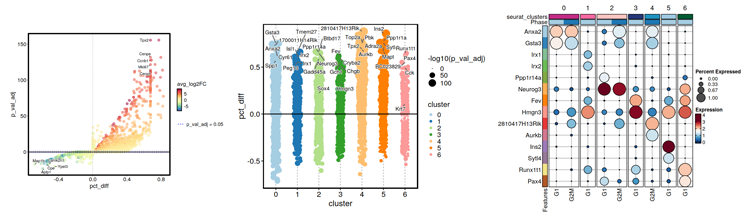
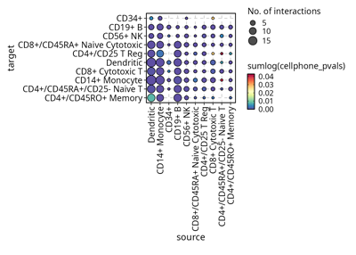
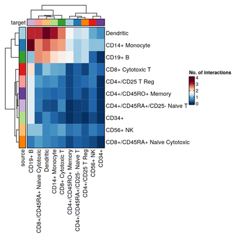

# scplotter

`scplotter` is an R package that is built upon
[`plotthis`](https://github.com/pwwang/plotthis). It provides a set of
functions to visualize single-cell sequencing data in an easy and
efficient way.

## Installation

``` r
remotes::install_github("pwwang/scplotter")
# or
devtools::install_github("pwwang/scplotter")
# or using conda
$ conda install pwwang::r-scplotter
```

## Gallery

### scRNA-seq

[`CellDimPlot`](https://pwwang.github.io/scplotter/reference/CellDimPlot.html)


[`CellStatPlot`](https://pwwang.github.io/scplotter/reference/CellStatPlot.html)


[`ClustreePlot`](https://pwwang.github.io/scplotter/reference/ClustreePlot.html)
\|
[`CellVelocityPlot`](https://pwwang.github.io/scplotter/reference/CellVelocityPlot.html)


[`FeatureStatPlot`](https://pwwang.github.io/scplotter/reference/FeatureStatPlot.html)


[`EnrichmentPlot`](https://pwwang.github.io/scplotter/reference/EnrichmentPlot.html)


[`GSEASummaryPlot`](https://pwwang.github.io/plotthis/reference/gsea.html)
\| [`GSEAPlot`](https://pwwang.github.io/plotthis/reference/gsea.html)


[`MarkersPlot`](https://pwwang.github.io/scplotter/reference/MarkersPlot.html)



[`CCCPlot`](https://pwwang.github.io/scplotter/reference/CCCPlot.html)
(Cell-Cell Communication Plot)


### scTCR-seq/scBCR-seq

[`ClonalVolumePlot`](https://pwwang.github.io/scplotter/reference/ClonalVolumePlot.html)
\|
[`ClonalAbundancePlot`](https://pwwang.github.io/scplotter/reference/ClonalAbundancePlot.html)
\|
[`ClonalResidencyPlot`](https://pwwang.github.io/scplotter/reference/ClonalResidencyPlot.html)
\|
[`ClonalDynamicsPlot`](https://pwwang.github.io/scplotter/reference/ClonalDynamicsPlot.html)
\|
[`ClonalCompositionPlot`](https://pwwang.github.io/scplotter/reference/ClonalCompositionPlot.html)
\|
[`ClonalOverlapPlot`](https://pwwang.github.io/scplotter/reference/ClonalOverlapPlot.html)
\|
[`ClonalGeneUsagePlot`](https://pwwang.github.io/scplotter/reference/ClonalGeneUsagePlot.html)


[`ClonalRarefactionPlot`](https://pwwang.github.io/scplotter/reference/ClonalRarefactionPlot.html)
\|
[`ClonalKmerPlot`](https://pwwang.github.io/scplotter/reference/ClonalKmerPlot.html)
\|
[`ClonalDiversityPlot`](https://pwwang.github.io/scplotter/reference/ClonalDiversityPlot.html)
\|
[`ClonalPositionalPlot`](https://pwwang.github.io/scplotter/reference/ClonalPositionalPlot.html)
\|
[`ClonalLengthPlot`](https://pwwang.github.io/scplotter/reference/ClonalLengthPlot.html)
\|
[`ClonalStatPlot`](https://pwwang.github.io/scplotter/reference/ClonalStatPlot.html)


## Spatial data

[`SpatDimPlot`](https://pwwang.github.io/scplotter/reference/SpatDimPlot.html)
\|
[`SpatFeaturePlot`](https://pwwang.github.io/scplotter/reference/SpatFeaturePlot.html)


## Visualization with LLMs

``` r
provider <- tidyprompt::llm_provider_openai(api_key = Sys.getenv("OPENAI_API_KEY"))
chat <- SCPlotterChat$new(provider = provider)
chat$ask("Generate a cell-cell communication plot for the cellphonedb_res data.")
# Tool identified:  CCCPlot
# Data object identified:  scplotter::cellphonedb_res
# Code ran:
# CCCPlot(cellphonedb_res, plot_type = "dot")
```



``` r
chat$ask("Do a heatmap instead")
# Tool identified:  CCCPlot
# Data object identified:  scplotter::cellphonedb_res
# Code ran:
# CCCPlot(cellphonedb_res, plot_type = "heatmap")
```



## Credits

`scplotter` is built upon the following fantastic packages:

- [`plotthis`](https://github.com/pwwang/plotthis) for the core plotting
  functions.
- [`tidyprompt`](https://github.com/tjarkvandemerwe/tidyprompt) for the
  LLM interface.
- [`Seurat`](https://satijalab.org/seurat/) for the Seurat object
  support.
- [`LIANA`](https://github.com/saezlab/liana-py) for the cell-cell
  communication analysis.
- [`scRepertoire`](https://github.com/BorchLab/scRepertoire) for the
  TCR/BCR repertoire analysis.
- [`Giotto`](https://drieslab.github.io/Giotto_website/) for the spatial
  data analysis.
